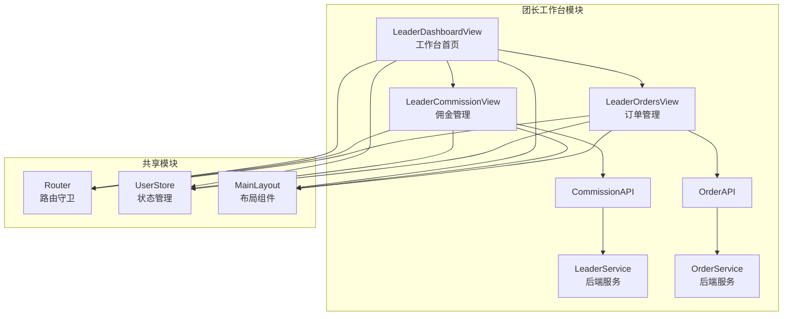
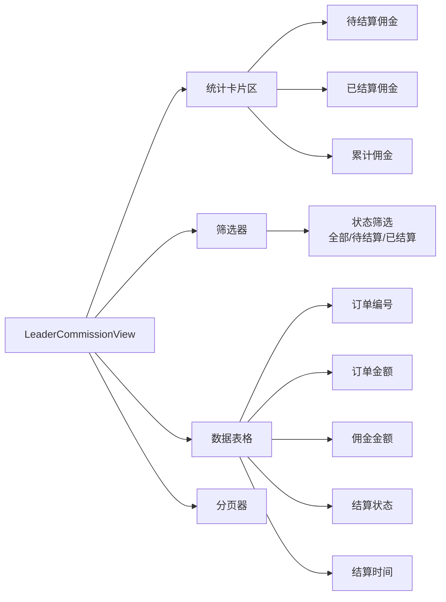
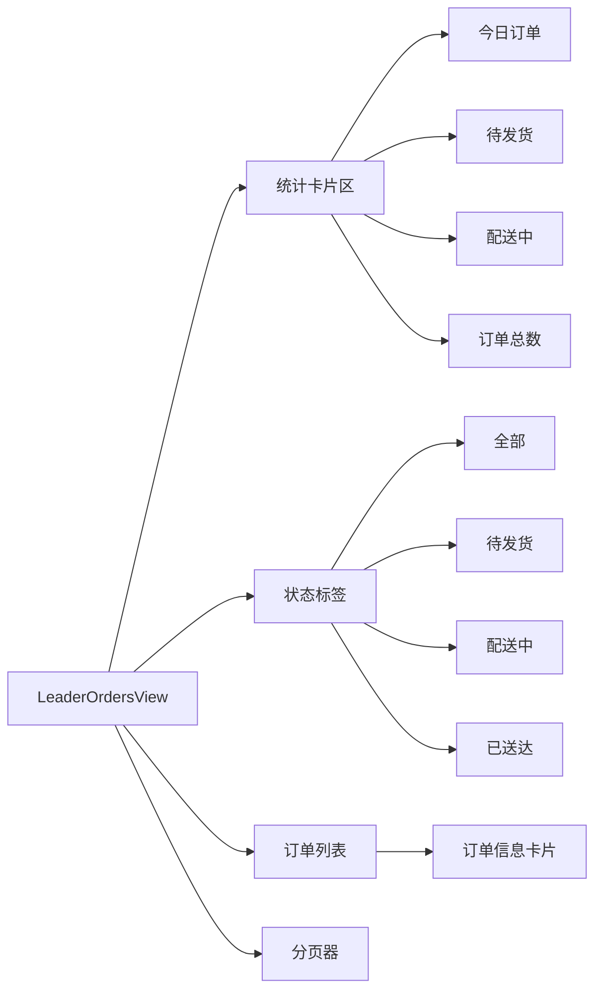
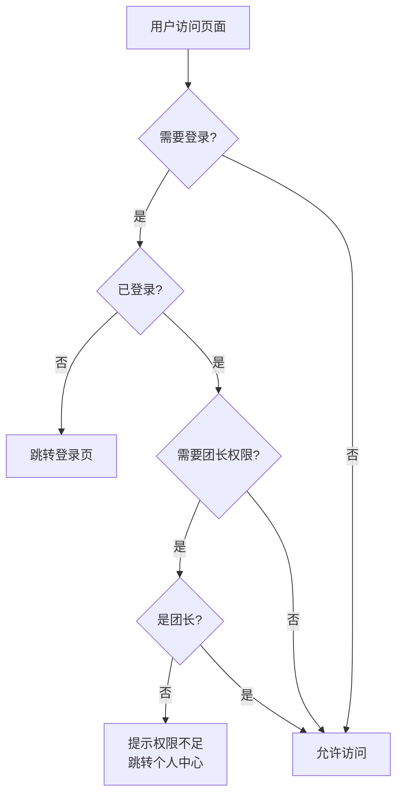

# DESIGN - 团长工作台前端架构设计

**任务名称**: 团长工作台前端开发  
**工作流阶段**: Architect（架构阶段）  
**创建日期**: 2025-11-13  
**文档版本**: v1.0

---

## 📐 整体架构



---

## 🎯 核心组件设计

### 1. LeaderCommissionView（佣金管理）



**数据流**:
```
用户进入页面
  ↓
获取leaderId (from UserStore)
  ↓
并行请求:
  ├─ getMyCommissionSummary(leaderId) → 统计数据
  └─ getMyCommissionRecords({leaderId, page, status}) → 列表数据
  ↓
渲染页面
  ↓
用户筛选/翻页
  ↓
重新请求列表数据
```

---

### 2. LeaderOrdersView（订单管理）



**数据流**:
```
用户进入页面
  ↓
获取leaderId (from UserStore)
  ↓
并行请求:
  ├─ getLeaderOrdersSummary(leaderId) → 统计数据
  └─ getLeaderOrders({leaderId, page, size}) → 订单列表
  ↓
渲染页面
  ↓
用户切换状态/翻页
  ↓
重新请求订单列表
```

---

## 📡 API接口设计

### API层新增方法

#### `order.js`

```javascript
/**
 * 查询团长订单列表
 * @param {Object} params
 * @param {Number} params.leaderId - 团长ID
 * @param {Number} params.page - 页码（从0开始）
 * @param {Number} params.size - 每页数量
 * @param {Number} params.orderStatus - 订单状态（可选）
 * @returns {Promise<Object>} { total, items }
 */
export const getLeaderOrders = (params) => {
  return request({
    url: '/api/order/leader/my',
    method: 'GET',
    params
  })
}

/**
 * 查询团长订单统计
 * @param {Number} leaderId - 团长ID
 * @returns {Promise<Object>} { totalCount, todayCount, pendingCount, deliveringCount }
 */
export const getLeaderOrdersSummary = (leaderId) => {
  return request({
    url: '/api/order/leader/summary',
    method: 'GET',
    params: { leaderId }
  })
}
```

---

## 🛣️ 路由设计

### 新增路由

```javascript
// router/index.js
{
  path: '/leader/commission',
  name: 'leaderCommission',
  component: () => import('../views/leader/LeaderCommissionView.vue'),
  meta: { 
    title: '佣金管理', 
    requireAuth: true, 
    requiresLeader: true 
  }
},
{
  path: '/leader/orders',
  name: 'leaderOrders',
  component: () => import('../views/leader/LeaderOrdersView.vue'),
  meta: { 
    title: '我的订单', 
    requireAuth: true, 
    requiresLeader: true 
  }
}
```

### 权限守卫流程



---

## 🎨 UI组件规划

### 1. 统计卡片组件（复用）

```vue
<el-card class="stat-card" shadow="hover">
  <div class="stat-content">
    <div class="stat-icon">
      <el-icon><Icon /></el-icon>
    </div>
    <div class="stat-info">
      <div class="stat-label">标题</div>
      <div class="stat-value">数值</div>
      <div class="stat-tip">提示</div>
    </div>
  </div>
</el-card>
```

### 2. 数据表格（Element Plus Table）

- 使用 `el-table` 组件
- 配置 `v-loading` 加载状态
- 使用 `el-empty` 空数据提示
- 使用 `el-tag` 状态标签

### 3. 分页器（Element Plus Pagination）

```vue
<el-pagination
  v-model:current-page="currentPage"
  v-model:page-size="pageSize"
  :total="total"
  layout="total, prev, pager, next, jumper"
  @current-change="handlePageChange"
/>
```

---

## 💾 数据模型

### 佣金统计数据

```typescript
interface CommissionSummary {
  pendingCommission: number;   // 待结算佣金
  settledCommission: number;   // 已结算佣金
  totalCommission: number;     // 累计佣金
}
```

### 佣金记录

```typescript
interface CommissionRecord {
  commissionId: number;        // 佣金ID
  orderId: number;             // 订单ID
  orderSn: string;             // 订单编号
  orderAmount: number;         // 订单金额
  commissionRate: number;      // 佣金比例
  commissionAmount: number;    // 佣金金额
  status: number;              // 结算状态 (0-待结算, 1-已结算)
  settlementTime: string;      // 结算时间
  settlementBatch: string;     // 结算批次
  createTime: string;          // 创建时间
}
```

### 订单统计数据

```typescript
interface OrderSummary {
  totalCount: number;          // 订单总数
  todayCount: number;          // 今日订单
  pendingCount: number;        // 待发货订单
  deliveringCount: number;     // 配送中订单
}
```

### 订单信息

```typescript
interface Order {
  orderId: number;
  orderSn: string;
  userId: number;
  userName: string;
  productName: string;
  productImg: string;
  quantity: number;
  totalAmount: number;
  orderStatus: number;         // 订单状态
  payStatus: number;           // 支付状态
  createTime: string;
  // ...
}
```

---

## 🔐 安全设计

### 1. 权限验证

- 路由级别：`requireAuth: true, requiresLeader: true`
- 页面级别：进入页面时验证 `userStore.isLeader`
- API级别：后端JWT Token验证

### 2. 数据隔离

- 团长只能查看自己的佣金记录
- 团长只能查看自己负责的订单
- leaderId 从 UserStore 获取，不允许前端传参修改

---

## ⚡ 性能优化

### 1. 懒加载

```javascript
component: () => import('../views/leader/LeaderCommissionView.vue')
```

### 2. 请求优化

- 统计数据和列表数据并行请求
- 使用防抖/节流优化搜索和筛选

### 3. 分页

- 默认每页10条
- 支持前端控制每页数量

---

## 🎯 异常处理

### 1. 网络错误

```javascript
try {
  const res = await getMyCommissionSummary(leaderId)
  // ...
} catch (error) {
  ElMessage.error('加载失败，请稍后重试')
  console.error(error)
}
```

### 2. 空数据

```vue
<el-empty v-if="!loading && list.length === 0" description="暂无数据" />
```

### 3. 权限不足

- 路由守卫自动拦截
- 显示友好提示信息

---

## 📱 响应式设计

### 断点设计

- `xs`: < 768px (移动端)
- `sm`: ≥ 768px (平板)
- `md`: ≥ 992px (桌面)
- `lg`: ≥ 1200px (大屏)

### 布局适配

```vue
<el-row :gutter="20">
  <el-col :xs="24" :sm="12" :md="8">
    <!-- 统计卡片 -->
  </el-col>
</el-row>
```

---

**设计完成**，进入任务拆分阶段 →
