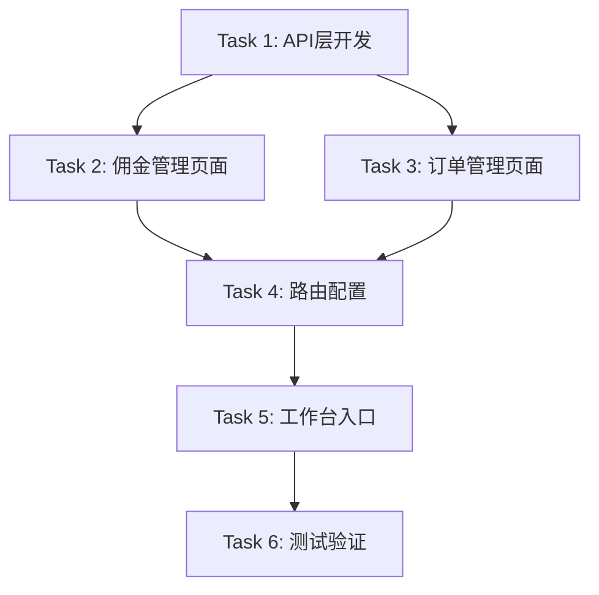

# TASK - 团长工作台前端任务清单

**任务名称**: 团长工作台前端开发  
**工作流阶段**: Atomize（任务拆分）  
**创建日期**: 2025-11-13  
**文档版本**: v1.0

---

## 📋 任务依赖图



---

## 📝 任务清单

### ✅ Task 1: API层开发

**优先级**: ⭐⭐⭐⭐⭐ (最高)

**目标**: 在 `order.js` 中添加团长订单相关API

**输入契约**:
- 现有的 `src/api/order.js` 文件
- 现有的 `request` 工具函数
- API文档：`GET /api/order/leader/my` 和 `/api/order/leader/summary`

**输出契约**:
- 新增函数：`getLeaderOrders(params)`
- 新增函数：`getLeaderOrdersSummary(leaderId)`
- 代码符合现有风格

**实现要点**:
```javascript
// 1. 导入request工具
import request from '@/utils/request'

// 2. 添加API方法
export const getLeaderOrders = (params) => {
  return request({
    url: '/api/order/leader/my',
    method: 'GET',
    params  // { leaderId, page, size, orderStatus }
  })
}

export const getLeaderOrdersSummary = (leaderId) => {
  return request({
    url: '/api/order/leader/summary',
    method: 'GET',
    params: { leaderId }
  })
}
```

**验收标准**:
- [ ] 代码编译通过
- [ ] API方法正确导出
- [ ] 参数类型正确
- [ ] JSDoc注释完整

**预估时间**: 15分钟

---

### ✅ Task 2: 佣金管理页面

**优先级**: ⭐⭐⭐⭐⭐ (最高)

**目标**: 创建 `LeaderCommissionView.vue`

**输入契约**:
- API: `getMyCommissionSummary`, `getMyCommissionRecords`
- UserStore: 获取 `leaderId`
- MainLayout 组件

**输出契约**:
- 新文件：`src/views/leader/LeaderCommissionView.vue`
- 功能完整可用

**页面结构**:
```vue
<template>
  <MainLayout>
    <!-- 页面头部 -->
    <div class="page-header">
      <el-button :icon="ArrowLeft" @click="$router.back()">返回</el-button>
      <h2 class="page-title">佣金管理</h2>
    </div>

    <!-- 统计卡片 -->
    <el-row :gutter="20" class="statistics-row">
      <el-col :xs="24" :sm="8">
        <el-card class="stat-card">
          <!-- 待结算佣金 -->
        </el-card>
      </el-col>
      <el-col :xs="24" :sm="8">
        <el-card class="stat-card">
          <!-- 已结算佣金 -->
        </el-card>
      </el-col>
      <el-col :xs="24" :sm="8">
        <el-card class="stat-card">
          <!-- 累计佣金 -->
        </el-card>
      </el-col>
    </el-row>

    <!-- 筛选器 -->
    <el-card>
      <el-radio-group v-model="filterStatus">
        <el-radio-button :label="null">全部</el-radio-button>
        <el-radio-button :label="0">待结算</el-radio-button>
        <el-radio-button :label="1">已结算</el-radio-button>
      </el-radio-group>
    </el-card>

    <!-- 数据表格 -->
    <el-card>
      <el-table :data="commissionList" v-loading="loading">
        <el-table-column prop="orderSn" label="订单编号" />
        <el-table-column prop="orderAmount" label="订单金额" />
        <el-table-column prop="commissionRate" label="佣金比例" />
        <el-table-column prop="commissionAmount" label="佣金金额" />
        <el-table-column prop="status" label="状态">
          <template #default="{ row }">
            <el-tag :type="row.status === 1 ? 'success' : 'warning'">
              {{ row.status === 1 ? '已结算' : '待结算' }}
            </el-tag>
          </template>
        </el-table-column>
        <el-table-column prop="settlementTime" label="结算时间" />
      </el-table>
      
      <!-- 空数据 -->
      <el-empty v-if="!loading && commissionList.length === 0" />
      
      <!-- 分页 -->
      <el-pagination
        v-model:current-page="currentPage"
        :total="total"
        :page-size="pageSize"
        layout="total, prev, pager, next"
        @current-change="loadCommissionList"
      />
    </el-card>
  </MainLayout>
</template>

<script setup>
import { ref, onMounted, watch } from 'vue'
import { useUserStore } from '@/stores/user'
import { getMyCommissionSummary, getMyCommissionRecords } from '@/api/leader'
import { ElMessage } from 'element-plus'
import { ArrowLeft } from '@element-plus/icons-vue'
import MainLayout from '@/components/MainLayout.vue'

// 用户信息
const userStore = useUserStore()
const leaderId = userStore.userInfo?.userId

// 统计数据
const commissionSummary = ref({
  pendingCommission: 0,
  settledCommission: 0,
  totalCommission: 0
})

// 列表数据
const commissionList = ref([])
const loading = ref(false)
const currentPage = ref(1)
const pageSize = ref(10)
const total = ref(0)
const filterStatus = ref(null)

// 加载统计数据
const loadSummary = async () => {
  try {
    const res = await getMyCommissionSummary(leaderId)
    if (res.code === 200) {
      commissionSummary.value = res.data
    }
  } catch (error) {
    console.error('加载统计失败', error)
  }
}

// 加载佣金列表
const loadCommissionList = async () => {
  loading.value = true
  try {
    const res = await getMyCommissionRecords({
      leaderId,
      status: filterStatus.value,
      page: currentPage.value - 1,  // 后端从0开始
      limit: pageSize.value
    })
    if (res.code === 200) {
      commissionList.value = res.data.list
      total.value = res.data.total
    }
  } catch (error) {
    ElMessage.error('加载失败，请稍后重试')
    console.error(error)
  } finally {
    loading.value = false
  }
}

// 监听筛选条件
watch(filterStatus, () => {
  currentPage.value = 1
  loadCommissionList()
})

// 页面加载
onMounted(() => {
  if (!leaderId) {
    ElMessage.error('请先登录')
    return
  }
  loadSummary()
  loadCommissionList()
})

// 金额格式化
const formatMoney = (value) => {
  return value ? value.toFixed(2) : '0.00'
}
</script>

<style scoped>
.page-header {
  display: flex;
  align-items: center;
  gap: 16px;
  margin-bottom: 24px;
}

.page-title {
  font-size: 24px;
  font-weight: 600;
  margin: 0;
}

.statistics-row {
  margin-bottom: 24px;
}

.stat-card {
  margin-bottom: 16px;
}

.stat-content {
  display: flex;
  align-items: center;
  gap: 16px;
}

.stat-icon {
  width: 48px;
  height: 48px;
  border-radius: 12px;
  display: flex;
  align-items: center;
  justify-content: center;
  font-size: 24px;
}

.stat-icon.pending {
  background: #fef0e6;
  color: #f56c6c;
}

.stat-icon.settled {
  background: #e6f7f0;
  color: #67c23a;
}

.stat-icon.total {
  background: #e6f0ff;
  color: #409eff;
}

.stat-info {
  flex: 1;
}

.stat-label {
  font-size: 14px;
  color: #909399;
  margin-bottom: 8px;
}

.stat-value {
  font-size: 28px;
  font-weight: 600;
  color: #303133;
  margin-bottom: 4px;
}

.stat-tip {
  font-size: 12px;
  color: #c0c4cc;
}
</style>
```

**验收标准**:
- [ ] 页面加载正确显示
- [ ] 统计数据正确展示
- [ ] 列表数据正确展示
- [ ] 筛选功能正常
- [ ] 分页功能正常
- [ ] Loading状态正常
- [ ] 空数据提示正常
- [ ] 错误处理完善

**预估时间**: 2小时

---

### ✅ Task 3: 订单管理页面

**优先级**: ⭐⭐⭐⭐⭐ (最高)

**目标**: 创建 `LeaderOrdersView.vue`

**输入契约**:
- API: `getLeaderOrders`, `getLeaderOrdersSummary`
- UserStore: 获取 `leaderId`
- 订单状态枚举: `ORDER_STATUS`, `ORDER_STATUS_TEXT`

**输出契约**:
- 新文件：`src/views/leader/LeaderOrdersView.vue`
- 功能完整可用

**页面结构**:
```vue
<template>
  <MainLayout>
    <!-- 页面头部 -->
    <div class="page-header">
      <el-button :icon="ArrowLeft" @click="$router.back()">返回</el-button>
      <h2 class="page-title">我的订单</h2>
    </div>

    <!-- 统计卡片 -->
    <el-row :gutter="20" class="statistics-row">
      <el-col :xs="12" :sm="6">
        <el-card class="stat-card">
          <div class="stat-content">
            <div class="stat-icon today">
              <el-icon><Calendar /></el-icon>
            </div>
            <div class="stat-info">
              <div class="stat-label">今日订单</div>
              <div class="stat-value">{{ orderSummary.todayCount }}</div>
            </div>
          </div>
        </el-card>
      </el-col>
      <el-col :xs="12" :sm="6">
        <el-card class="stat-card">
          <div class="stat-content">
            <div class="stat-icon pending">
              <el-icon><Box /></el-icon>
            </div>
            <div class="stat-info">
              <div class="stat-label">待发货</div>
              <div class="stat-value">{{ orderSummary.pendingCount }}</div>
            </div>
          </div>
        </el-card>
      </el-col>
      <el-col :xs="12" :sm="6">
        <el-card class="stat-card">
          <div class="stat-content">
            <div class="stat-icon delivering">
              <el-icon><Van /></el-icon>
            </div>
            <div class="stat-info">
              <div class="stat-label">配送中</div>
              <div class="stat-value">{{ orderSummary.deliveringCount }}</div>
            </div>
          </div>
        </el-card>
      </el-col>
      <el-col :xs="12" :sm="6">
        <el-card class="stat-card">
          <div class="stat-content">
            <div class="stat-icon total">
              <el-icon><DocumentCopy /></el-icon>
            </div>
            <div class="stat-info">
              <div class="stat-label">订单总数</div>
              <div class="stat-value">{{ orderSummary.totalCount }}</div>
            </div>
          </div>
        </el-card>
      </el-col>
    </el-row>

    <!-- 状态筛选 -->
    <el-card>
      <el-radio-group v-model="filterStatus" size="large">
        <el-radio-button :label="null">全部</el-radio-button>
        <el-radio-button :label="1">待发货</el-radio-button>
        <el-radio-button :label="2">配送中</el-radio-button>
        <el-radio-button :label="3">已送达</el-radio-button>
      </el-radio-group>
    </el-card>

    <!-- 订单列表 -->
    <el-card v-loading="loading">
      <div class="order-list">
        <div v-for="order in orderList" :key="order.orderId" class="order-item">
          <div class="order-header">
            <span class="order-sn">订单号：{{ order.orderSn }}</span>
            <el-tag :type="getStatusTagType(order.orderStatus)">
              {{ getStatusText(order.orderStatus) }}
            </el-tag>
          </div>
          <div class="order-content">
            
            <div class="order-info">
              <div class="product-name">{{ order.productName }}</div>
              <div class="order-meta">
                <span>数量：{{ order.quantity }}</span>
                <span>用户：{{ order.userName || '未知' }}</span>
              </div>
              <div class="order-amount">¥{{ formatMoney(order.totalAmount) }}</div>
            </div>
          </div>
          <div class="order-footer">
            <span class="order-time">{{ formatTime(order.createTime) }}</span>
            <el-button type="primary" size="small" @click="viewOrderDetail(order.orderId)">
              查看详情
            </el-button>
          </div>
        </div>
      </div>
      
      <!-- 空数据 -->
      <el-empty v-if="!loading && orderList.length === 0" description="暂无订单" />
      
      <!-- 分页 -->
      <el-pagination
        v-if="orderList.length > 0"
        v-model:current-page="currentPage"
        :total="total"
        :page-size="pageSize"
        layout="total, prev, pager, next"
        @current-change="loadOrderList"
      />
    </el-card>
  </MainLayout>
</template>

<script setup>
import { ref, onMounted, watch } from 'vue'
import { useRouter } from 'vue-router'
import { useUserStore } from '@/stores/user'
import { getLeaderOrders, getLeaderOrdersSummary } from '@/api/order'
import { ORDER_STATUS_TEXT, ORDER_STATUS_TAG_TYPE } from '@/api/order'
import { ElMessage } from 'element-plus'
import { ArrowLeft, Calendar, Box, Van, DocumentCopy } from '@element-plus/icons-vue'
import MainLayout from '@/components/MainLayout.vue'

const router = useRouter()
const userStore = useUserStore()
const leaderId = userStore.userInfo?.userId

// 统计数据
const orderSummary = ref({
  totalCount: 0,
  todayCount: 0,
  pendingCount: 0,
  deliveringCount: 0
})

// 列表数据
const orderList = ref([])
const loading = ref(false)
const currentPage = ref(1)
const pageSize = ref(10)
const total = ref(0)
const filterStatus = ref(null)

// 加载统计数据
const loadSummary = async () => {
  try {
    const res = await getLeaderOrdersSummary(leaderId)
    if (res.code === 200) {
      orderSummary.value = res.data
    }
  } catch (error) {
    console.error('加载统计失败', error)
  }
}

// 加载订单列表
const loadOrderList = async () => {
  loading.value = true
  try {
    const res = await getLeaderOrders({
      leaderId,
      orderStatus: filterStatus.value,
      page: currentPage.value - 1,  // 后端从0开始
      size: pageSize.value
    })
    if (res.code === 200) {
      orderList.value = res.data.items
      total.value = res.data.total
    }
  } catch (error) {
    ElMessage.error('加载失败，请稍后重试')
    console.error(error)
  } finally {
    loading.value = false
  }
}

// 查看订单详情
const viewOrderDetail = (orderId) => {
  router.push(`/user/orders?id=${orderId}`)
}

// 状态文本
const getStatusText = (status) => {
  return ORDER_STATUS_TEXT[status] || '未知'
}

// 状态标签类型
const getStatusTagType = (status) => {
  return ORDER_STATUS_TAG_TYPE[status] || 'info'
}

// 格式化金额
const formatMoney = (value) => {
  return value ? value.toFixed(2) : '0.00'
}

// 格式化时间
const formatTime = (time) => {
  if (!time) return ''
  return new Date(time).toLocaleString('zh-CN')
}

// 监听筛选条件
watch(filterStatus, () => {
  currentPage.value = 1
  loadOrderList()
})

// 页面加载
onMounted(() => {
  if (!leaderId) {
    ElMessage.error('请先登录')
    return
  }
  loadSummary()
  loadOrderList()
})
</script>

<style scoped>
/* 样式同 Task 2 */
.order-list {
  display: flex;
  flex-direction: column;
  gap: 16px;
}

.order-item {
  border: 1px solid #ebeef5;
  border-radius: 8px;
  padding: 16px;
}

.order-header {
  display: flex;
  justify-content: space-between;
  align-items: center;
  margin-bottom: 12px;
  padding-bottom: 12px;
  border-bottom: 1px solid #ebeef5;
}

.order-sn {
  font-size: 14px;
  color: #606266;
}

.order-content {
  display: flex;
  gap: 16px;
  margin-bottom: 12px;
}

.product-img {
  width: 80px;
  height: 80px;
  border-radius: 8px;
  object-fit: cover;
}

.order-info {
  flex: 1;
}

.product-name {
  font-size: 16px;
  font-weight: 500;
  margin-bottom: 8px;
}

.order-meta {
  display: flex;
  gap: 16px;
  font-size: 14px;
  color: #909399;
  margin-bottom: 8px;
}

.order-amount {
  font-size: 20px;
  font-weight: 600;
  color: #f56c6c;
}

.order-footer {
  display: flex;
  justify-content: space-between;
  align-items: center;
  padding-top: 12px;
  border-top: 1px solid #ebeef5;
}

.order-time {
  font-size: 12px;
  color: #c0c4cc;
}
</style>
```

**验收标准**:
- [ ] 页面加载正确显示
- [ ] 统计数据正确展示
- [ ] 订单列表正确展示
- [ ] 状态筛选功能正常
- [ ] 分页功能正常
- [ ] 查看详情跳转正常
- [ ] Loading状态正常
- [ ] 空数据提示正常
- [ ] 错误处理完善

**预估时间**: 2小时

---

### ✅ Task 4: 路由配置

**优先级**: ⭐⭐⭐⭐

**目标**: 在 `router/index.js` 中添加路由配置

**输入契约**:
- 现有的 `router/index.js`
- 已创建的页面组件

**输出契约**:
- 新增2个路由配置
- 权限守卫正确配置

**实现要点**:
```javascript
// 在团长相关路由区域添加
{
  path: '/leader/commission',
  name: 'leaderCommission',
  component: () => import('../views/leader/LeaderCommissionView.vue'),
  meta: { 
    title: '佣金管理', 
    requireAuth: true, 
    requiresLeader: true 
  }
},
{
  path: '/leader/orders',
  name: 'leaderOrders',
  component: () => import('../views/leader/LeaderOrdersView.vue'),
  meta: { 
    title: '我的订单', 
    requireAuth: true, 
    requiresLeader: true 
  }
}
```

**验收标准**:
- [ ] 路由配置正确
- [ ] 页面标题正确
- [ ] 权限守卫生效
- [ ] 懒加载配置正确

**预估时间**: 10分钟

---

### ✅ Task 5: 工作台入口

**优先级**: ⭐⭐⭐

**目标**: 在 `LeaderDashboardView.vue` 中添加快捷入口

**输入契约**:
- 现有的 `LeaderDashboardView.vue`

**输出契约**:
- 添加快捷入口按钮

**实现要点**:
```vue
<!-- 在工作台页面添加快捷入口 -->
<el-card class="quick-links-card">
  <template #header>
    <div class="card-header">
      <el-icon><Link /></el-icon>
      <span>快捷入口</span>
    </div>
  </template>
  <el-row :gutter="16">
    <el-col :span="12">
      <el-button 
        type="primary" 
        size="large" 
        style="width: 100%"
        @click="$router.push('/leader/commission')"
      >
        <el-icon><Coin /></el-icon>
        <span>佣金管理</span>
      </el-button>
    </el-col>
    <el-col :span="12">
      <el-button 
        type="success" 
        size="large" 
        style="width: 100%"
        @click="$router.push('/leader/orders')"
      >
        <el-icon><DocumentCopy /></el-icon>
        <span>我的订单</span>
      </el-button>
    </el-col>
  </el-row>
</el-card>
```

**验收标准**:
- [ ] 按钮显示正确
- [ ] 点击跳转正常
- [ ] 样式美观

**预估时间**: 10分钟

---

### ✅ Task 6: 测试验证

**优先级**: ⭐⭐⭐⭐

**目标**: 全面测试功能

**测试清单**:
- [ ] 登录后访问佣金管理页面
- [ ] 验证佣金统计数据显示
- [ ] 验证佣金列表数据显示
- [ ] 测试状态筛选功能
- [ ] 测试分页功能
- [ ] 登录后访问订单管理页面
- [ ] 验证订单统计数据显示
- [ ] 验证订单列表数据显示
- [ ] 测试状态筛选功能
- [ ] 测试分页功能
- [ ] 测试查看详情功能
- [ ] 测试权限守卫（非团长访问）
- [ ] 测试响应式布局（移动端）
- [ ] 测试错误处理（网络错误）

**预估时间**: 1小时

---

## ⏱️ 总时间预估

| 任务 | 预估时间 |
|------|---------|
| Task 1: API层开发 | 15分钟 |
| Task 2: 佣金管理页面 | 2小时 |
| Task 3: 订单管理页面 | 2小时 |
| Task 4: 路由配置 | 10分钟 |
| Task 5: 工作台入口 | 10分钟 |
| Task 6: 测试验证 | 1小时 |
| **总计** | **约5.5小时** |

---

**任务拆分完成**，等待审批后开始执行 →
