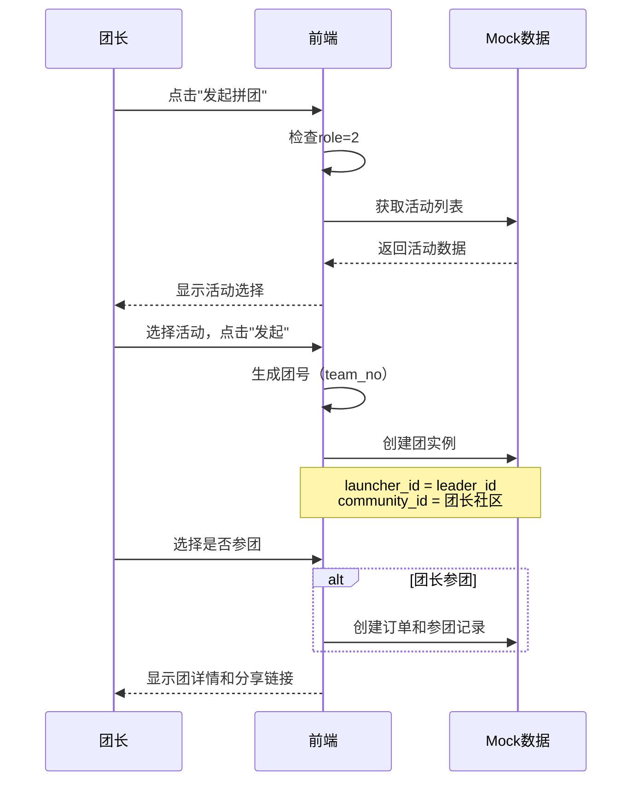
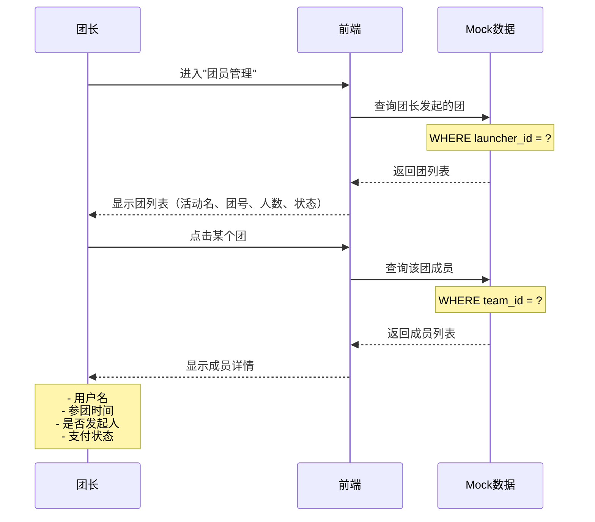
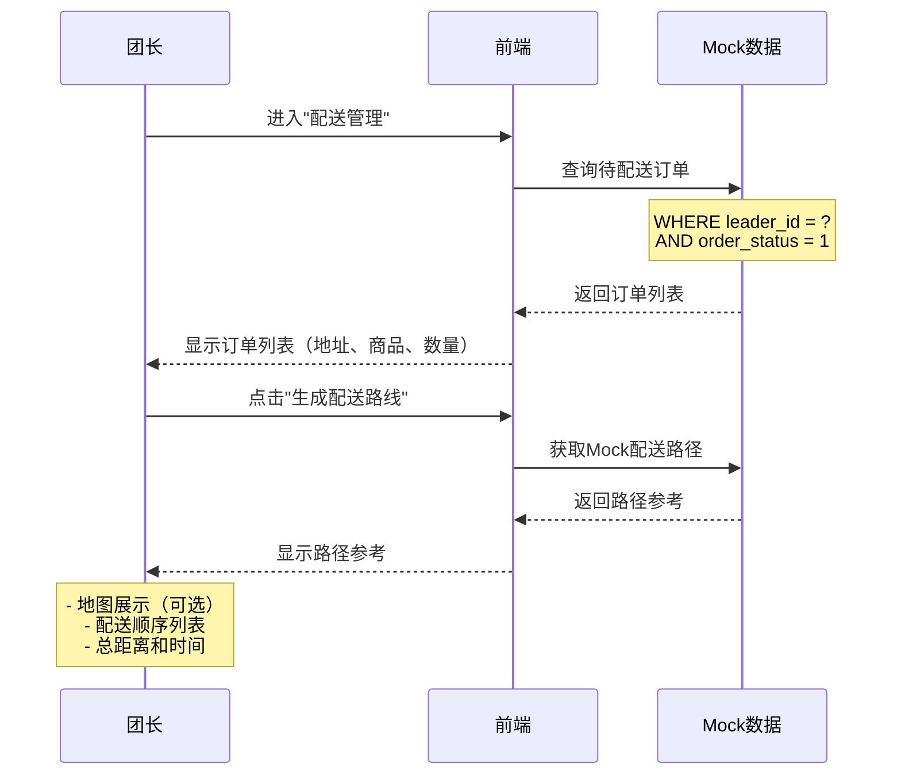

# CONSENSUS - 团长端界面开发

**任务名称**: 团长端界面原型开发（合并到用户端）  
**创建日期**: 2025-10-28  
**文档版本**: v1.0  
**状态**: ✅ 共识达成

---

## 1. 明确的需求描述

### 1.1 核心目标

在现有用户端前端（`community-group-buy-frontend`）基础上，扩展开发**团长专属功能模块**，实现团长角色的完整业务流程。

### 1.2 功能范围

**✅ 必须实现**：

1. **团长工作台** - 数据概览和快捷入口
2. **发起拼团** - 仅团长可发起，符合v3.0逻辑
3. **团员管理** - 管理团的参与成员（动态参团记录）
4. **配送管理** - 展示Mock配送路径参考
5. **佣金中心** - 显示佣金余额和明细
6. **社区申请** - 团长可申请新社区（额外页面）⭐用户确认
7. **订单管理** - 查看所有归属订单

**❌ 不实现**：

1. 后端API接口（仅Mock数据）
2. Dijkstra路径规划算法（原型阶段）
3. 线上佣金提现流程（线下处理）
4. 独立的团长端应用（采用合并方案）

---

## 2. 技术实现方案

### 2.1 架构决策

**方案选择**: **合并到用户端** ✅

**理由**：
- 代码复用率60-70%
- 团长是"高级用户"（role=2）
- 用户体验更好（一个账号）
- 维护成本低

**实现方式**：
- 基于现有用户端扩展
- 创建 `/leader` 路由模块
- 路由守卫检查 `role === 2`
- 个人中心显示团长入口

### 2.2 技术栈确认

| 技术 | 版本 | 说明 |
|------|------|------|
| Vue | 3.5.22 | Composition API |
| Vite | 6.0.7 | 构建工具 |
| Element Plus | 最新 | UI组件库 |
| Pinia | 3.0.3 | 状态管理 |
| Vue Router | 4.5.1 | 路由管理 |
| Axios | 最新 | HTTP请求 |

### 2.3 开发模式

**原型开发模式**：
- ✅ 使用Mock数据
- ✅ 完整的UI交互
- ✅ 符合真实业务逻辑
- ❌ 不对接后端API
- ❌ 不实现复杂算法

---

## 3. 关键决策确认

### 3.1 配送管理路径规划

**决策**: 原型阶段仅展示Mock路径参考 ✅

**实现方式**：
```javascript
// Mock配送路径数据
export const mockDeliveryRoute = {
  deliveryId: 1001,
  teamNo: 'T20251027001',
  orders: [
    { orderId: 8001, address: '幸福小区1号楼', distance: 0.5 },
    { orderId: 8002, address: '幸福小区3号楼', distance: 0.8 },
    { orderId: 8003, address: '幸福小区5号楼', distance: 1.2 }
  ],
  totalDistance: 2.5,
  estimatedTime: 30,
  routePath: '团点 → 1号楼 → 3号楼 → 5号楼'
}
```

**界面展示**：
- 地图组件（静态图片或第三方地图组件）
- 配送顺序列表
- 总距离和预计时间
- 提示："路径参考，实际配送可调整"

### 3.2 佣金提现功能

**决策**: 仅显示余额和明细，线下处理 ✅

**实现方式**：
```javascript
// Mock佣金数据
export const mockCommission = {
  balance: 1258.50,           // 可提现余额
  frozen: 125.00,             // 冻结金额（未结算）
  totalEarned: 5280.00,       // 累计佣金
  records: [
    {
      commissionId: 1,
      orderId: 8001,
      amount: 12.50,
      status: 1,              // 0-未结算；1-已结算
      settleTime: '2025-10-27 10:30:00'
    }
  ]
}
```

**界面展示**：
- 余额卡片
- 佣金明细列表
- 提示框："如需提现，请联系客服（电话：XXX）"
- 无"申请提现"按钮

### 3.3 社区申请功能

**决策**: 包含申请入口，团长可申请新社区 ✅

**新增页面**: `CommunityApplyView.vue`

**实现方式**：
```javascript
// Mock社区申请数据
export const mockCommunityApplication = {
  applicationId: 1,
  applicantId: 1001,
  communityName: '阳光花园社区',
  province: '北京市',
  city: '北京市',
  district: '朝阳区',
  address: '阳光花园小区',
  description: '该社区住户较多，团购需求大',
  status: 0,                  // 0-待审核；1-已通过；2-已拒绝
  createTime: '2025-10-27 14:30:00'
}
```

**界面流程**：
1. 团长工作台或团点设置中有"申请新社区"入口
2. 填写社区信息表单
3. 提交申请
4. 查看申请状态（待审核/已通过/已拒绝）

### 3.4 订单管理范围

**决策**: 查看所有归属订单（包括拼团和普通购买） ✅

**查询条件**: `order_main.leader_id = ?`

**订单类型**：
- 拼团订单（有 `activity_id`）
- 普通订单（无 `activity_id`）
- 全部显示，可筛选

---

## 4. 页面列表确认

### 4.1 团长专属页面（6个）⭐新增1个

| 序号 | 页面名称 | 路由 | 组件文件 | 优先级 |
|------|---------|------|---------|--------|
| 1 | 团长工作台 | `/leader/dashboard` | `LeaderDashboard.vue` | 🔴 高 |
| 2 | 发起拼团 | `/leader/launch` | `LaunchGroupBuy.vue` | 🔴 高 |
| 3 | 团员管理 | `/leader/members` | `MemberManage.vue` | 🔴 高 |
| 4 | 配送管理 | `/leader/delivery` | `DeliveryManage.vue` | 🟡 中 |
| 5 | 佣金中心 | `/leader/commission` | `CommissionView.vue` | 🟡 中 |
| 6 | 社区申请 | `/leader/community/apply` | `CommunityApplyView.vue` | 🟡 中 |

### 4.2 共用页面（扩展）

| 页面 | 扩展内容 |
|------|---------|
| `ProfileView.vue` | 增加团长管理菜单（`role=2`时显示） |
| `OrderListView.vue` | 团长查看所有归属订单（可复用现有页面） |

---

## 5. 数据模型确认

### 5.1 用户状态扩展

```javascript
// stores/user.js
export const useUserStore = defineStore('user', () => {
  const userInfo = ref({
    userId: 1001,
    username: 'leaderUser',
    realName: '张团长',
    role: 2,                      // 团长角色 ⭐
    communityId: 1,               // 归属社区（v3.0）⭐
    communityName: '幸福社区',     // 社区名称（v3.0）⭐
    phone: '13800138000',
    avatar: '/avatar/leader.jpg'
  })
  
  // 计算属性
  const isLeader = computed(() => userInfo.value?.role === 2)
  
  return {
    userInfo,
    isLeader,
    // ...
  }
})
```

### 5.2 团长Store（新增）

```javascript
// stores/leader.js
export const useLeaderStore = defineStore('leader', () => {
  const leaderInfo = ref({
    storeId: 1,
    storeName: '幸福社区团点',
    communityId: 1,
    communityName: '幸福社区',
    address: '北京市朝阳区幸福路123号',
    maxDeliveryRange: 3000,
    commissionRate: 5.00,
    auditStatus: 1               // 1-审核通过
  })
  
  const dashboard = ref(null)    // 工作台数据
  const teams = ref([])          // 发起的团
  const commission = ref(null)   // 佣金数据
  
  return {
    leaderInfo,
    dashboard,
    teams,
    commission
  }
})
```

### 5.3 Mock数据文件

```
src/mock/leader.js
├── mockLeaderDashboard       # 工作台数据
├── mockLeaderTeams           # 发起的团列表
├── mockTeamMembers           # 团成员列表
├── mockDeliveryOrders        # 配送订单列表
├── mockDeliveryRoute         # 配送路径参考
├── mockCommission            # 佣金数据
├── mockCommissionRecords     # 佣金明细
└── mockCommunityApplication  # 社区申请记录
```

---

## 6. 业务流程确认

### 6.1 团长发起拼团流程（v3.0）



### 6.2 团员管理流程



### 6.3 配送管理流程



---

## 7. 验收标准

### 7.1 功能完整性

- [ ] 6个团长专属页面全部完成
- [ ] 路由守卫正确拦截（`role !== 2`）
- [ ] 个人中心显示团长入口（`role=2`时）
- [ ] 发起拼团符合v3.0逻辑（launcher_id=leader_id，自动关联社区）
- [ ] 团员管理显示动态参团记录（非固定绑定）
- [ ] 配送管理展示Mock路径参考
- [ ] 佣金中心显示余额和明细，无提现按钮
- [ ] 社区申请功能完整（表单、提交、状态查询）

### 7.2 数据准确性

- [ ] Mock数据符合数据库v3.0设计
- [ ] 团实例包含 `launcher_id`、`leader_id`、`community_id`
- [ ] 参团记录关联订单（1:1）
- [ ] 订单归属正确（`leader_id`）
- [ ] 佣金计算逻辑正确（`amount = pay_amount × commission_rate`）

### 7.3 用户体验

- [ ] 界面美观，符合Element Plus设计规范
- [ ] 交互流畅，无明显卡顿
- [ ] 错误提示清晰（权限不足、数据为空等）
- [ ] 响应式设计（适配不同屏幕）

### 7.4 代码质量

- [ ] 遵循Composition API规范
- [ ] 代码注释完整（函数、关键逻辑）
- [ ] 无ESLint错误
- [ ] 组件复用（TopNav、ProductCard等）

---

## 8. 技术约束

### 8.1 必须遵循

✅ **技术栈**：Vue 3 + Vite + Element Plus + Pinia  
✅ **API风格**：Composition API (`<script setup>`)  
✅ **组件库**：仅使用Element Plus  
✅ **状态管理**：Pinia  
✅ **路由管理**：Vue Router  
✅ **数据来源**：Mock数据（`src/mock/leader.js`）

### 8.2 禁止使用

❌ Options API  
❌ 其他UI框架（Ant Design、Naive UI等）  
❌ 直接操作DOM  
❌ jQuery或其他传统库

---

## 9. 集成方案

### 9.1 路由集成

```javascript
// router/index.js（扩展）
const routes = [
  // ... 现有路由
  
  // 团长专属路由（新增）
  {
    path: '/leader',
    meta: { requiresLeader: true },
    children: [
      {
        path: 'dashboard',
        name: 'leader-dashboard',
        component: () => import('@/views/leader/LeaderDashboard.vue'),
        meta: { title: '团长工作台' }
      },
      {
        path: 'launch',
        name: 'leader-launch',
        component: () => import('@/views/leader/LaunchGroupBuy.vue'),
        meta: { title: '发起拼团' }
      },
      {
        path: 'members',
        name: 'leader-members',
        component: () => import('@/views/leader/MemberManage.vue'),
        meta: { title: '团员管理' }
      },
      {
        path: 'delivery',
        name: 'leader-delivery',
        component: () => import('@/views/leader/DeliveryManage.vue'),
        meta: { title: '配送管理' }
      },
      {
        path: 'commission',
        name: 'leader-commission',
        component: () => import('@/views/leader/CommissionView.vue'),
        meta: { title: '佣金中心' }
      },
      {
        path: 'community/apply',
        name: 'community-apply',
        component: () => import('@/views/leader/CommunityApplyView.vue'),
        meta: { title: '申请社区' }
      }
    ]
  }
]

// 路由守卫（扩展）
router.beforeEach((to, from, next) => {
  const userStore = useUserStore()
  
  // 检查团长权限
  if (to.meta.requiresLeader && userStore.userInfo?.role !== 2) {
    ElMessage.warning('仅团长可访问')
    next('/profile')
    return
  }
  
  // 原有逻辑
  if (to.meta.requireAuth && !userStore.isLogin) {
    ElMessage.warning('请先登录')
    next('/login')
    return
  }
  
  next()
})
```

### 9.2 个人中心集成

```vue
<!-- views/user/ProfileView.vue（扩展） -->
<template>
  <div class="profile-container">
    <!-- 原有菜单 -->
    <router-link to="/user/info">个人信息</router-link>
    <router-link to="/user/address">收货地址</router-link>
    <router-link to="/user/orders">我的订单</router-link>
    
    <!-- 团长专属菜单（新增）⭐ -->
    <div v-if="userStore.isLeader" class="leader-section">
      <el-divider>团长管理</el-divider>
      <router-link to="/leader/dashboard">
        <el-icon><DataAnalysis /></el-icon>
        团长工作台
      </router-link>
      <router-link to="/leader/launch">
        <el-icon><Plus /></el-icon>
        发起拼团
      </router-link>
      <router-link to="/leader/members">
        <el-icon><User /></el-icon>
        团员管理
      </router-link>
      <router-link to="/leader/delivery">
        <el-icon><Van /></el-icon>
        配送管理
      </router-link>
      <router-link to="/leader/commission">
        <el-icon><Money /></el-icon>
        我的佣金
      </router-link>
      <router-link to="/leader/community/apply">
        <el-icon><OfficeBuilding /></el-icon>
        申请社区
      </router-link>
    </div>
  </div>
</template>

<script setup>
import { useUserStore } from '@/stores/user'

const userStore = useUserStore()
</script>
```

---

## 10. 风险与应对

### 10.1 技术风险

| 风险 | 概率 | 影响 | 应对策略 |
|------|------|------|---------|
| Mock数据结构与后端不一致 | 中 | 中 | 严格参考数据库v3.0设计，后续对接时仅需替换API |
| Element Plus组件兼容性 | 低 | 低 | 使用稳定版本，参考官方文档 |
| 路由守卫逻辑冲突 | 低 | 中 | 充分测试所有路由场景 |

### 10.2 业务风险

| 风险 | 概率 | 影响 | 应对策略 |
|------|------|------|---------|
| 社区申请流程理解偏差 | 低 | 中 | 参考《团长申请与审核流程》文档，及时与用户确认 |
| 配送路径展示不清晰 | 低 | 低 | 使用清晰的列表和说明文字 |

---

## 11. 预计工作量

### 11.1 开发时间

| 任务 | 预计时间 | 说明 |
|------|---------|------|
| Mock数据准备 | 0.5天 | 8个Mock数据文件 |
| 团长Store创建 | 0.5天 | Pinia状态管理 |
| 路由配置 | 0.5天 | 路由和守卫 |
| 团长工作台 | 0.5天 | 数据概览 |
| 发起拼团 | 0.5天 | 活动选择、发起 |
| 团员管理 | 0.5天 | 团列表、成员列表 |
| 配送管理 | 0.5天 | 订单列表、路径展示 |
| 佣金中心 | 0.5天 | 余额、明细 |
| 社区申请 | 0.5天 | 表单、状态查询 |
| 个人中心集成 | 0.5天 | 菜单扩展 |
| 测试和调试 | 0.5天 | 全流程测试 |
| **总计** | **5.5天** | - |

### 11.2 代码量估算

| 类型 | 预计行数 |
|------|---------|
| Vue组件 | ~3500行 |
| Mock数据 | ~800行 |
| Store | ~300行 |
| 路由配置 | ~100行 |
| API封装 | ~200行 |
| **总计** | **~4900行** |

---

## 12. 交付物清单

### 12.1 代码文件

- [ ] `src/views/leader/LeaderDashboard.vue`
- [ ] `src/views/leader/LaunchGroupBuy.vue`
- [ ] `src/views/leader/MemberManage.vue`
- [ ] `src/views/leader/DeliveryManage.vue`
- [ ] `src/views/leader/CommissionView.vue`
- [ ] `src/views/leader/CommunityApplyView.vue`
- [ ] `src/stores/leader.js`
- [ ] `src/api/leader.js`
- [ ] `src/mock/leader.js`
- [ ] `src/router/index.js`（扩展）
- [ ] `src/views/user/ProfileView.vue`（扩展）

### 12.2 文档文件

- [ ] `ALIGNMENT_团长端界面开发.md`（已完成）
- [ ] `CONSENSUS_团长端界面开发.md`（本文档）
- [ ] `DESIGN_团长端界面开发.md`（待创建）
- [ ] `TASK_团长端界面开发.md`（待创建）
- [ ] `ACCEPTANCE_团长端界面开发.md`（待创建）
- [ ] `FINAL_团长端界面开发.md`（待创建）

---

## 13. 确认清单

### 13.1 需求确认

- [x] 合并到用户端，不独立开发
- [x] 开发6个团长专属页面（包含社区申请）
- [x] 配送管理仅展示Mock路径
- [x] 佣金中心无线上提现功能
- [x] 社区申请包含申请入口
- [x] 订单管理查看所有归属订单

### 13.2 技术确认

- [x] Vue 3 Composition API
- [x] Element Plus UI组件库
- [x] Pinia状态管理
- [x] Mock数据驱动
- [x] 符合数据库v3.0设计
- [x] 符合拼团v3.0逻辑

### 13.3 质量确认

- [x] 代码规范统一
- [x] 注释完整清晰
- [x] 验收标准明确
- [x] 风险识别充分

---

**文档状态**: ✅ 共识达成  
**创建日期**: 2025-10-28  
**更新日期**: 2025-10-28  
**版本**: v1.0  
**下一步**: 创建DESIGN文档

