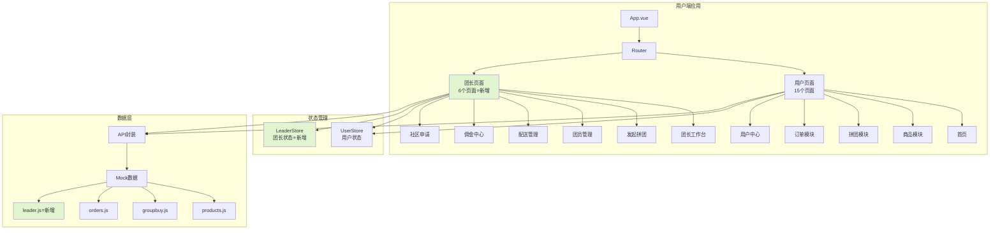
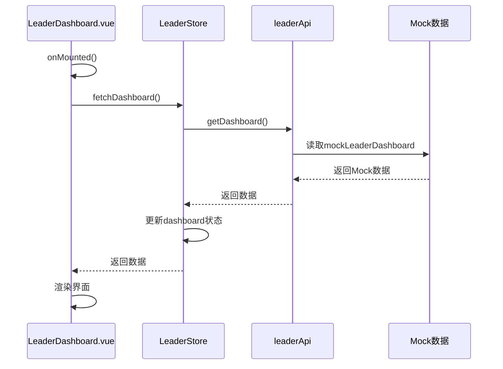
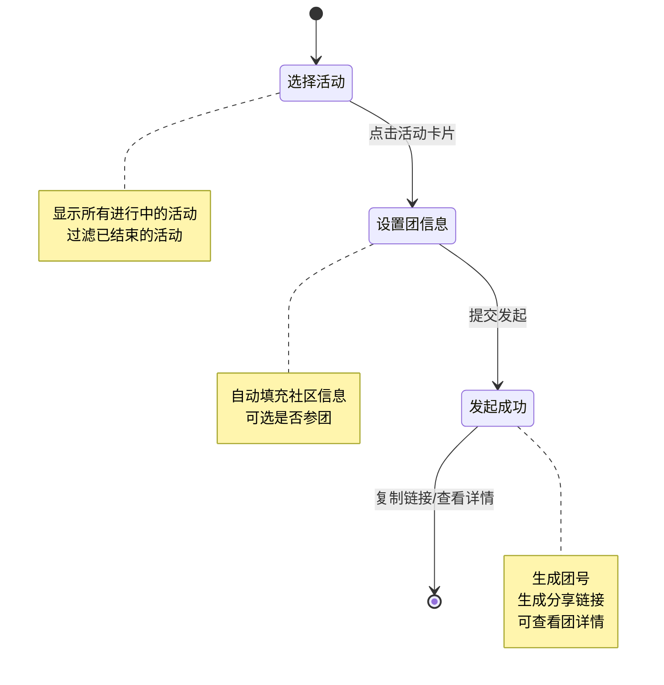
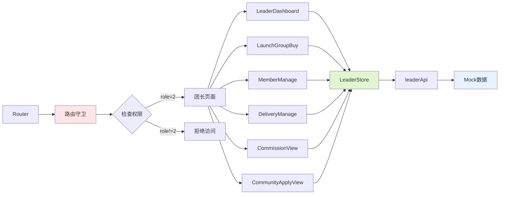
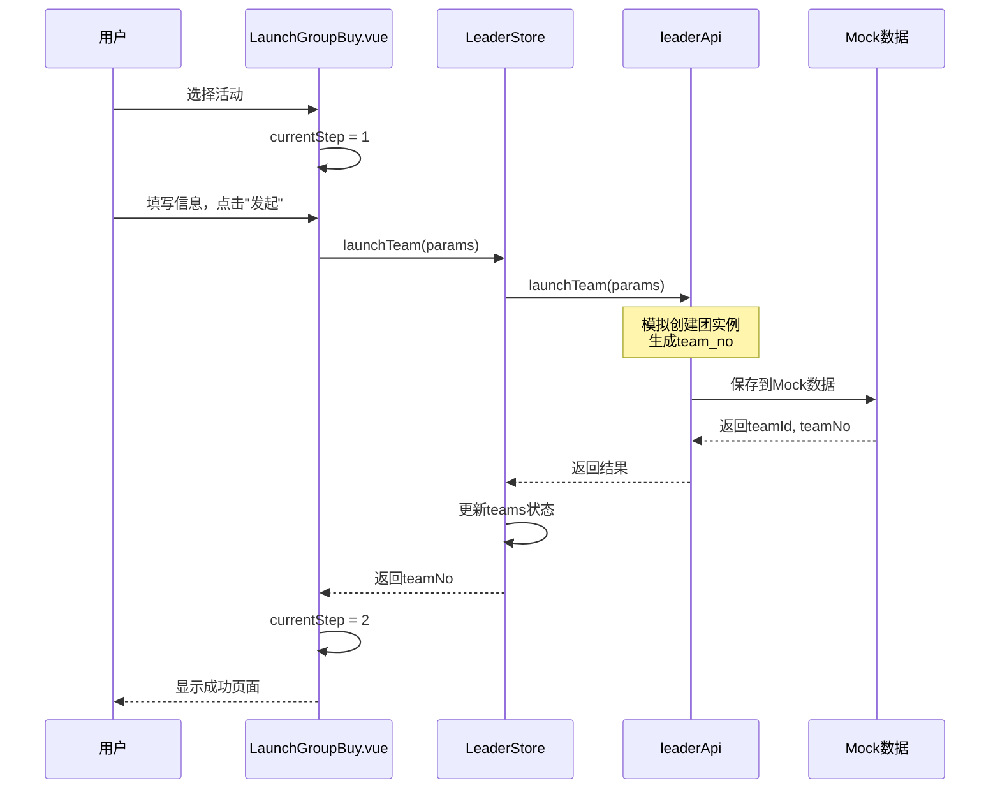
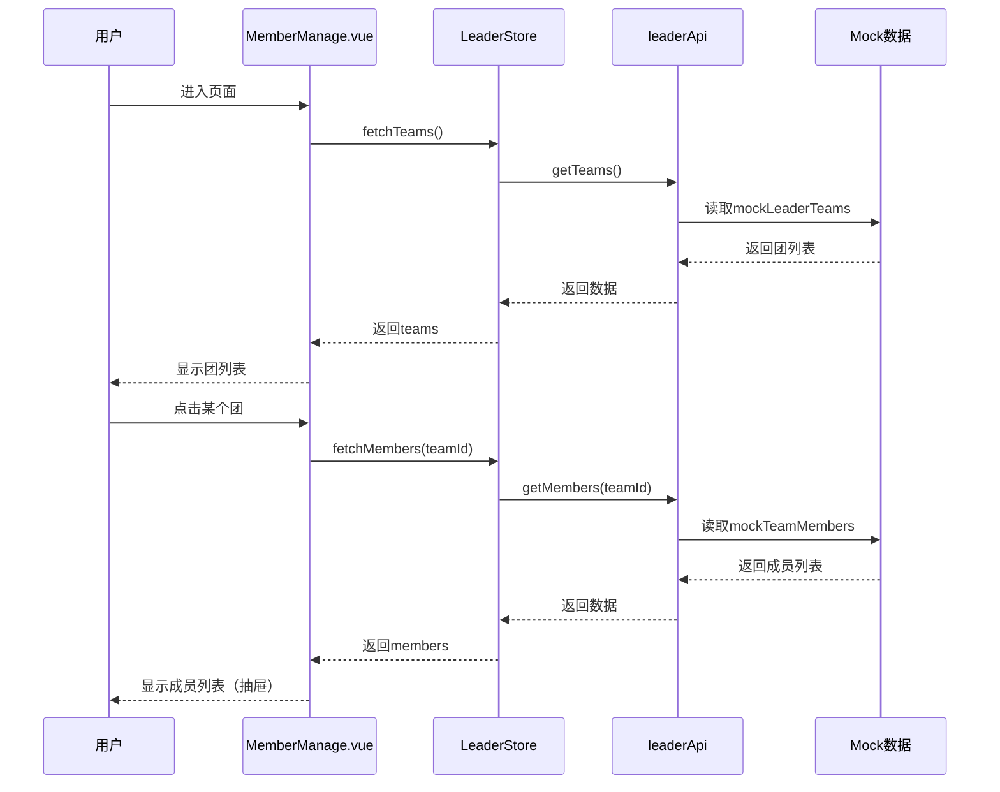

# DESIGN - 团长端界面开发

**任务名称**: 团长端界面原型开发（合并到用户端）  
**创建日期**: 2025-10-28  
**文档版本**: v1.0  
**状态**: ✅ 架构设计完成

---

## 1. 整体架构图



---

## 2. 分层设计

### 2.1 展示层（Presentation Layer）

**职责**：用户界面展示和交互

#### 团长专属页面（6个）

```
src/views/leader/
├── LeaderDashboard.vue     # 团长工作台
├── LaunchGroupBuy.vue      # 发起拼团
├── MemberManage.vue        # 团员管理
├── DeliveryManage.vue      # 配送管理
├── CommissionView.vue      # 佣金中心
└── CommunityApplyView.vue  # 社区申请
```

#### 共用组件（复用）

```
src/components/common/
├── TopNav.vue              # 导航栏（复用）
├── ProductCard.vue         # 商品卡片（复用）
└── OrderCard.vue           # 订单卡片（新增，可选）
```

### 2.2 状态层（State Layer）

**职责**：状态管理和业务逻辑

```javascript
// stores/leader.js
export const useLeaderStore = defineStore('leader', () => {
  // 状态
  const leaderInfo = ref(null)      // 团长信息
  const dashboard = ref(null)       // 工作台数据
  const teams = ref([])             // 发起的团
  const deliveryOrders = ref([])    // 配送订单
  const commission = ref(null)      // 佣金数据
  
  // Actions
  const fetchDashboard = async () => {...}
  const launchTeam = async (params) => {...}
  const fetchTeams = async () => {...}
  const fetchCommission = async () => {...}
  
  return {
    leaderInfo,
    dashboard,
    teams,
    deliveryOrders,
    commission,
    fetchDashboard,
    launchTeam,
    fetchTeams,
    fetchCommission
  }
})
```

### 2.3 API层（API Layer）

**职责**：API请求封装和Mock数据对接

```javascript
// api/leader.js
import request from '@/utils/request'
import { 
  mockLeaderDashboard,
  mockLeaderTeams,
  mockDeliveryOrders,
  mockCommission 
} from '@/mock/leader'

export default {
  // 获取工作台数据
  getDashboard() {
    // return request.get('/api/leader/dashboard')
    return Promise.resolve(mockLeaderDashboard)
  },
  
  // 发起拼团
  launchTeam(data) {
    // return request.post('/api/leader/team/launch', data)
    return Promise.resolve({ teamId: 5001, teamNo: 'T20251027001' })
  },
  
  // 获取发起的团
  getTeams(params) {
    // return request.get('/api/leader/teams', { params })
    return Promise.resolve(mockLeaderTeams)
  },
  
  // 获取佣金数据
  getCommission() {
    // return request.get('/api/leader/commission')
    return Promise.resolve(mockCommission)
  }
}
```

### 2.4 数据层（Data Layer）

**职责**：Mock数据定义

```javascript
// mock/leader.js
export const mockLeaderDashboard = {
  todayOrders: {
    newOrders: 15,
    toDeliver: 23,
    delivering: 8,
    todayCommission: 125.50
  },
  activeTeams: [...],
  pendingTasks: [...]
}

export const mockLeaderTeams = [...]
export const mockDeliveryOrders = [...]
export const mockCommission = {...}
```

---

## 3. 核心组件设计

### 3.1 团长工作台 (LeaderDashboard.vue)

#### 组件结构

```vue
<template>
  <div class="leader-dashboard">
    <!-- 顶部导航 -->
    <TopNav />
    
    <!-- 数据卡片区 -->
    <el-row :gutter="20" class="stats-cards">
      <el-col :span="6">
        <el-card class="stat-card">
          <el-statistic title="新订单" :value="dashboard.todayOrders.newOrders" />
        </el-card>
      </el-col>
      <!-- 其他卡片... -->
    </el-row>
    
    <!-- 活跃拼团 -->
    <el-card class="active-teams">
      <template #header>活跃拼团</template>
      <el-table :data="dashboard.activeTeams">
        <el-table-column prop="activityName" label="活动名称" />
        <el-table-column label="进度">
          <template #default="{ row }">
            {{ row.currentNum }}/{{ row.requiredNum }}
          </template>
        </el-table-column>
        <!-- 其他列... -->
      </el-table>
    </el-card>
    
    <!-- 待处理事项 -->
    <el-card class="pending-tasks">
      <template #header>待处理事项</template>
      <el-timeline>
        <el-timeline-item v-for="task in dashboard.pendingTasks" :key="task">
          {{ task }}
        </el-timeline-item>
      </el-timeline>
    </el-card>
  </div>
</template>

<script setup>
import { ref, onMounted } from 'vue'
import { useLeaderStore } from '@/stores/leader'
import TopNav from '@/components/common/TopNav.vue'

const leaderStore = useLeaderStore()
const dashboard = ref(null)

onMounted(async () => {
  dashboard.value = await leaderStore.fetchDashboard()
})
</script>
```

#### 数据流



---

### 3.2 发起拼团 (LaunchGroupBuy.vue)

#### 组件结构

```vue
<template>
  <div class="launch-groupbuy">
    <TopNav />
    
    <!-- 步骤条 -->
    <el-steps :active="currentStep" align-center>
      <el-step title="选择活动" />
      <el-step title="设置团信息" />
      <el-step title="完成发起" />
    </el-steps>
    
    <!-- 步骤1：选择活动 -->
    <div v-if="currentStep === 0">
      <el-row :gutter="20">
        <el-col v-for="activity in activities" :key="activity.activityId" :span="8">
          <el-card class="activity-card" @click="selectActivity(activity)">
            
            <h3>{{ activity.activityName }}</h3>
            <div class="price">
              拼团价：¥{{ activity.groupPrice }}
              <span class="original">原价：¥{{ activity.price }}</span>
            </div>
            <div class="rule">{{ activity.requiredNum }}人成团</div>
          </el-card>
        </el-col>
      </el-row>
    </div>
    
    <!-- 步骤2：设置团信息 -->
    <div v-if="currentStep === 1">
      <el-form :model="teamForm" label-width="120px">
        <el-form-item label="活动">
          <el-text>{{ selectedActivity.activityName }}</el-text>
        </el-form-item>
        <el-form-item label="我的社区">
          <el-text>{{ userStore.userInfo.communityName }}</el-text>
        </el-form-item>
        <el-form-item label="是否参团">
          <el-switch v-model="teamForm.joinTeam" />
        </el-form-item>
        <el-form-item>
          <el-button type="primary" @click="submitLaunch">发起拼团</el-button>
        </el-form-item>
      </el-form>
    </div>
    
    <!-- 步骤3：完成 -->
    <div v-if="currentStep === 2">
      <el-result icon="success" title="拼团发起成功">
        <template #sub-title>
          <div>团号：{{ teamNo }}</div>
          <div>分享链接给好友参团</div>
        </template>
        <template #extra>
          <el-button type="primary" @click="copyLink">复制分享链接</el-button>
          <el-button @click="viewTeam">查看团详情</el-button>
        </template>
      </el-result>
    </div>
  </div>
</template>

<script setup>
import { ref, onMounted } from 'vue'
import { useRouter } from 'vue-router'
import { useUserStore } from '@/stores/user'
import { useLeaderStore } from '@/stores/leader'
import { ElMessage } from 'element-plus'

const router = useRouter()
const userStore = useUserStore()
const leaderStore = useLeaderStore()

const currentStep = ref(0)
const activities = ref([])
const selectedActivity = ref(null)
const teamForm = ref({
  joinTeam: true
})
const teamNo = ref('')

// 选择活动
const selectActivity = (activity) => {
  selectedActivity.value = activity
  currentStep.value = 1
}

// 提交发起
const submitLaunch = async () => {
  try {
    const result = await leaderStore.launchTeam({
      activityId: selectedActivity.value.activityId,
      joinTeam: teamForm.value.joinTeam
    })
    teamNo.value = result.teamNo
    currentStep.value = 2
    ElMessage.success('发起成功')
  } catch (error) {
    ElMessage.error('发起失败')
  }
}
</script>
```

#### 业务流程



---

### 3.3 团员管理 (MemberManage.vue)

#### 组件结构

```vue
<template>
  <div class="member-manage">
    <TopNav />
    
    <!-- 团列表 -->
    <el-card>
      <template #header>
        <div class="header-row">
          <span>我发起的团</span>
          <el-radio-group v-model="teamFilter">
            <el-radio-button label="all">全部</el-radio-button>
            <el-radio-button label="joining">拼团中</el-radio-button>
            <el-radio-button label="success">已成团</el-radio-button>
          </el-radio-group>
        </div>
      </template>
      
      <el-table :data="filteredTeams" @row-click="viewMembers">
        <el-table-column prop="teamNo" label="团号" width="150" />
        <el-table-column prop="activityName" label="活动名称" />
        <el-table-column label="进度" width="120">
          <template #default="{ row }">
            {{ row.currentNum }}/{{ row.requiredNum }}
          </template>
        </el-table-column>
        <el-table-column label="状态" width="100">
          <template #default="{ row }">
            <el-tag :type="getStatusType(row.teamStatus)">
              {{ getStatusText(row.teamStatus) }}
            </el-tag>
          </template>
        </el-table-column>
        <el-table-column prop="createTime" label="发起时间" width="180" />
      </el-table>
    </el-card>
    
    <!-- 成员列表（抽屉） -->
    <el-drawer v-model="memberDrawerVisible" title="团员列表" size="50%">
      <el-table :data="members">
        <el-table-column prop="username" label="用户名" />
        <el-table-column label="角色" width="100">
          <template #default="{ row }">
            <el-tag v-if="row.isLauncher" type="warning">发起人</el-tag>
            <el-tag v-else>参团者</el-tag>
          </template>
        </el-table-column>
        <el-table-column label="支付状态" width="100">
          <template #default="{ row }">
            <el-tag :type="row.status >= 1 ? 'success' : 'info'">
              {{ row.status >= 1 ? '已支付' : '待支付' }}
            </el-tag>
          </template>
        </el-table-column>
        <el-table-column prop="joinTime" label="参团时间" width="180" />
      </el-table>
    </el-drawer>
  </div>
</template>

<script setup>
import { ref, computed, onMounted } from 'vue'
import { useLeaderStore } from '@/stores/leader'

const leaderStore = useLeaderStore()
const teams = ref([])
const teamFilter = ref('all')
const memberDrawerVisible = ref(false)
const members = ref([])

// 过滤团
const filteredTeams = computed(() => {
  if (teamFilter.value === 'all') return teams.value
  if (teamFilter.value === 'joining') return teams.value.filter(t => t.teamStatus === 0)
  if (teamFilter.value === 'success') return teams.value.filter(t => t.teamStatus === 1)
  return teams.value
})

// 查看成员
const viewMembers = async (row) => {
  members.value = await leaderStore.fetchMembers(row.teamId)
  memberDrawerVisible.value = true
}

onMounted(async () => {
  teams.value = await leaderStore.fetchTeams()
})
</script>
```

---

### 3.4 配送管理 (DeliveryManage.vue)

#### 组件结构

```vue
<template>
  <div class="delivery-manage">
    <TopNav />
    
    <!-- 待配送订单 -->
    <el-card>
      <template #header>待配送订单</template>
      <el-table :data="deliveryOrders">
        <el-table-column type="selection" width="55" />
        <el-table-column prop="orderSn" label="订单编号" />
        <el-table-column prop="userName" label="用户" />
        <el-table-column prop="address" label="配送地址" />
        <el-table-column prop="products" label="商品" />
        <el-table-column prop="orderTime" label="下单时间" />
      </el-table>
      
      <div class="action-bar">
        <el-button type="primary" @click="generateRoute">
          生成配送路线
        </el-button>
      </div>
    </el-card>
    
    <!-- 配送路线（对话框） -->
    <el-dialog v-model="routeDialogVisible" title="配送路线参考" width="70%">
      <div class="route-container">
        <!-- 路径说明 -->
        <el-alert type="info" :closable="false">
          以下为系统推荐的配送路径，实际配送可根据情况调整
        </el-alert>
        
        <!-- 路径列表 -->
        <el-timeline class="route-timeline">
          <el-timeline-item 
            v-for="(point, index) in routePoints" 
            :key="index"
            :type="index === 0 ? 'primary' : 'success'"
          >
            <div class="route-point">
              <div class="point-info">
                <h4>{{ point.location }}</h4>
                <p>订单：{{ point.orders.join(', ') }}</p>
              </div>
              <div class="point-distance">
                距离：{{ point.distance }}km
              </div>
            </div>
          </el-timeline-item>
        </el-timeline>
        
        <!-- 统计信息 -->
        <el-descriptions border :column="3">
          <el-descriptions-item label="总距离">
            {{ totalDistance }}km
          </el-descriptions-item>
          <el-descriptions-item label="预计时间">
            {{ estimatedTime }}分钟
          </el-descriptions-item>
          <el-descriptions-item label="订单数">
            {{ deliveryOrders.length }}个
          </el-descriptions-item>
        </el-descriptions>
      </div>
    </el-dialog>
  </div>
</template>

<script setup>
import { ref, onMounted } from 'vue'
import { useLeaderStore } from '@/stores/leader'

const leaderStore = useLeaderStore()
const deliveryOrders = ref([])
const routeDialogVisible = ref(false)
const routePoints = ref([])
const totalDistance = ref(0)
const estimatedTime = ref(0)

// 生成配送路线
const generateRoute = async () => {
  const route = await leaderStore.generateRoute(deliveryOrders.value)
  routePoints.value = route.points
  totalDistance.value = route.totalDistance
  estimatedTime.value = route.estimatedTime
  routeDialogVisible.value = true
}

onMounted(async () => {
  deliveryOrders.value = await leaderStore.fetchDeliveryOrders()
})
</script>
```

---

### 3.5 佣金中心 (CommissionView.vue)

#### 组件结构

```vue
<template>
  <div class="commission-view">
    <TopNav />
    
    <!-- 余额卡片 -->
    <el-row :gutter="20">
      <el-col :span="8">
        <el-card class="balance-card">
          <el-statistic title="可提现余额" :value="commission.balance" prefix="¥" />
        </el-card>
      </el-col>
      <el-col :span="8">
        <el-card class="balance-card">
          <el-statistic title="冻结金额" :value="commission.frozen" prefix="¥" />
        </el-card>
      </el-col>
      <el-col :span="8">
        <el-card class="balance-card">
          <el-statistic title="累计佣金" :value="commission.totalEarned" prefix="¥" />
        </el-card>
      </el-col>
    </el-row>
    
    <!-- 提现说明 -->
    <el-alert type="warning" :closable="false">
      <template #title>
        如需提现，请联系客服（电话：400-XXX-XXXX）
      </template>
    </el-alert>
    
    <!-- 佣金明细 -->
    <el-card>
      <template #header>佣金明细</template>
      <el-table :data="commission.records">
        <el-table-column prop="orderId" label="订单ID" />
        <el-table-column prop="amount" label="佣金金额">
          <template #default="{ row }">
            ¥{{ row.amount }}
          </template>
        </el-table-column>
        <el-table-column label="状态">
          <template #default="{ row }">
            <el-tag :type="row.status === 1 ? 'success' : 'info'">
              {{ row.status === 1 ? '已结算' : '未结算' }}
            </el-tag>
          </template>
        </el-table-column>
        <el-table-column prop="settleTime" label="结算时间" />
      </el-table>
    </el-card>
  </div>
</template>
```

---

### 3.6 社区申请 (CommunityApplyView.vue)

#### 组件结构

```vue
<template>
  <div class="community-apply">
    <TopNav />
    
    <!-- 申请表单 -->
    <el-card v-if="!submitted">
      <template #header>申请新社区</template>
      <el-form :model="applyForm" :rules="rules" ref="formRef" label-width="120px">
        <el-form-item label="社区名称" prop="communityName">
          <el-input v-model="applyForm.communityName" />
        </el-form-item>
        <el-form-item label="省份" prop="province">
          <el-select v-model="applyForm.province" placeholder="请选择">
            <el-option label="北京市" value="北京市" />
            <!-- 其他省份 -->
          </el-select>
        </el-form-item>
        <el-form-item label="城市" prop="city">
          <el-select v-model="applyForm.city">
            <!-- 城市选项 -->
          </el-select>
        </el-form-item>
        <el-form-item label="区/县" prop="district">
          <el-select v-model="applyForm.district">
            <!-- 区县选项 -->
          </el-select>
        </el-form-item>
        <el-form-item label="详细地址" prop="address">
          <el-input v-model="applyForm.address" type="textarea" />
        </el-form-item>
        <el-form-item label="申请说明" prop="description">
          <el-input v-model="applyForm.description" type="textarea" />
        </el-form-item>
        <el-form-item>
          <el-button type="primary" @click="submitApply">提交申请</el-button>
          <el-button @click="resetForm">重置</el-button>
        </el-form-item>
      </el-form>
    </el-card>
    
    <!-- 申请成功 -->
    <el-result v-else icon="success" title="申请已提交" sub-title="等待管理员审核">
      <template #extra>
        <el-button @click="viewStatus">查看申请状态</el-button>
      </template>
    </el-result>
    
    <!-- 申请记录 -->
    <el-card>
      <template #header>我的申请记录</template>
      <el-table :data="applications">
        <el-table-column prop="communityName" label="社区名称" />
        <el-table-column prop="address" label="地址" />
        <el-table-column label="状态">
          <template #default="{ row }">
            <el-tag :type="getStatusType(row.status)">
              {{ getStatusText(row.status) }}
            </el-tag>
          </template>
        </el-table-column>
        <el-table-column prop="createTime" label="申请时间" />
      </el-table>
    </el-card>
  </div>
</template>
```

---

## 4. 模块依赖关系图



---

## 5. 接口契约定义

### 5.1 团长Store接口

```typescript
interface LeaderStore {
  // 状态
  leaderInfo: Ref<LeaderInfo | null>
  dashboard: Ref<Dashboard | null>
  teams: Ref<Team[]>
  deliveryOrders: Ref<Order[]>
  commission: Ref<Commission | null>
  
  // Actions
  fetchDashboard(): Promise<Dashboard>
  launchTeam(params: LaunchTeamParams): Promise<LaunchTeamResult>
  fetchTeams(params?: TeamQueryParams): Promise<Team[]>
  fetchMembers(teamId: number): Promise<Member[]>
  fetchDeliveryOrders(): Promise<Order[]>
  generateRoute(orders: Order[]): Promise<DeliveryRoute>
  fetchCommission(): Promise<Commission>
  applyCommunity(params: CommunityApplyParams): Promise<void>
}
```

### 5.2 API接口定义

```typescript
// api/leader.js
interface LeaderApi {
  getDashboard(): Promise<Dashboard>
  launchTeam(data: LaunchTeamParams): Promise<LaunchTeamResult>
  getTeams(params?: TeamQueryParams): Promise<Team[]>
  getMembers(teamId: number): Promise<Member[]>
  getDeliveryOrders(params?: DeliveryQueryParams): Promise<Order[]>
  generateRoute(orderIds: number[]): Promise<DeliveryRoute>
  getCommission(): Promise<Commission>
  applyCommunity(data: CommunityApplyParams): Promise<void>
  getApplications(): Promise<CommunityApplication[]>
}
```

---

## 6. 数据流向图

### 6.1 发起拼团数据流



### 6.2 团员管理数据流



---

## 7. 异常处理策略

### 7.1 权限异常

```javascript
// router/index.js
router.beforeEach((to, from, next) => {
  const userStore = useUserStore()
  
  if (to.meta.requiresLeader && userStore.userInfo?.role !== 2) {
    ElMessage.warning('仅团长可访问此页面')
    next('/profile')
    return
  }
  
  next()
})
```

### 7.2 数据异常

```javascript
// stores/leader.js
const fetchDashboard = async () => {
  try {
    const data = await leaderApi.getDashboard()
    dashboard.value = data
    return data
  } catch (error) {
    console.error('获取工作台数据失败', error)
    ElMessage.error('加载数据失败，请稍后重试')
    // 返回默认数据
    return {
      todayOrders: { newOrders: 0, toDeliver: 0, delivering: 0, todayCommission: 0 },
      activeTeams: [],
      pendingTasks: []
    }
  }
}
```

### 7.3 表单验证

```javascript
// CommunityApplyView.vue
const rules = {
  communityName: [
    { required: true, message: '请输入社区名称', trigger: 'blur' },
    { min: 2, max: 50, message: '长度在2-50个字符', trigger: 'blur' }
  ],
  province: [
    { required: true, message: '请选择省份', trigger: 'change' }
  ],
  // ... 其他规则
}

const submitApply = async () => {
  try {
    await formRef.value.validate()
    await leaderStore.applyCommunity(applyForm.value)
    ElMessage.success('提交成功')
    submitted.value = true
  } catch (error) {
    if (error.errors) {
      // 表单验证失败
      ElMessage.warning('请完善表单信息')
    } else {
      // API调用失败
      ElMessage.error('提交失败，请稍后重试')
    }
  }
}
```

---

## 8. 性能优化策略

### 8.1 组件懒加载

```javascript
// router/index.js
{
  path: '/leader/dashboard',
  component: () => import('@/views/leader/LeaderDashboard.vue')
}
```

### 8.2 数据缓存

```javascript
// stores/leader.js
const fetchTeams = async (forceRefresh = false) => {
  // 如果已有数据且不强制刷新，直接返回
  if (teams.value.length > 0 && !forceRefresh) {
    return teams.value
  }
  
  const data = await leaderApi.getTeams()
  teams.value = data
  return data
}
```

### 8.3 列表虚拟滚动（大数据量时）

```vue
<!-- 使用Element Plus的虚拟列表 -->
<el-table-v2
  :columns="columns"
  :data="largeDataset"
  :width="700"
  :height="400"
  fixed
/>
```

---

## 9. 安全设计

### 9.1 权限控制

```javascript
// 路由级别
meta: { requiresLeader: true }

// 组件级别
<div v-if="userStore.isLeader">
  <!-- 团长专属内容 -->
</div>

// Store级别
const launchTeam = async (params) => {
  if (userInfo.value?.role !== 2) {
    throw new Error('仅团长可发起拼团')
  }
  // ... 发起逻辑
}
```

### 9.2 数据脱敏

```javascript
// Mock数据中的敏感信息脱敏
export const mockTeamMembers = [
  {
    userId: 1001,
    username: '张三',
    phone: '138****8000',  // 手机号脱敏
    // ...
  }
]
```

---

## 10. 测试策略

### 10.1 单元测试（待实现）

```javascript
// tests/unit/stores/leader.spec.js
describe('LeaderStore', () => {
  it('should fetch dashboard data', async () => {
    const store = useLeaderStore()
    const data = await store.fetchDashboard()
    expect(data).toHaveProperty('todayOrders')
    expect(data.todayOrders).toHaveProperty('newOrders')
  })
  
  it('should launch team with correct params', async () => {
    const store = useLeaderStore()
    const result = await store.launchTeam({
      activityId: 1,
      joinTeam: true
    })
    expect(result).toHaveProperty('teamNo')
  })
})
```

### 10.2 集成测试（手动测试）

**测试用例**：

1. **权限测试**
   - [ ] 普通用户访问团长页面，被拦截
   - [ ] 团长用户正常访问所有团长页面

2. **发起拼团测试**
   - [ ] 选择活动，填写信息，成功发起
   - [ ] 生成正确的团号
   - [ ] 显示分享链接

3. **团员管理测试**
   - [ ] 正确显示团列表
   - [ ] 筛选功能正常
   - [ ] 查看成员详情正常

4. **配送管理测试**
   - [ ] 正确显示待配送订单
   - [ ] 生成配送路线正常
   - [ ] 路径信息准确

5. **佣金中心测试**
   - [ ] 余额显示正确
   - [ ] 明细列表正常
   - [ ] 提现说明清晰

6. **社区申请测试**
   - [ ] 表单验证正常
   - [ ] 提交申请成功
   - [ ] 查看申请记录正常

---

**文档状态**: ✅ 架构设计完成  
**创建日期**: 2025-10-28  
**更新日期**: 2025-10-28  
**版本**: v1.0  
**下一步**: 创建TASK文档

