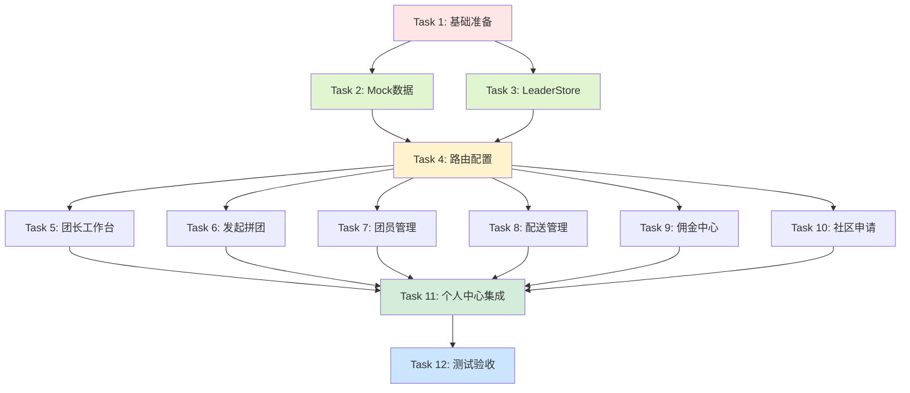

# TASK - 团长端界面开发任务拆分

**任务名称**: 团长端界面原型开发（合并到用户端）  
**创建日期**: 2025-10-28  
**文档版本**: v1.0  
**状态**: ✅ 任务拆分完成

---

## 1. 任务概览

### 1.1 任务依赖图



### 1.2 任务汇总

| Task ID | 任务名称 | 预计时间 | 优先级 | 依赖 |
|---------|---------|---------|--------|------|
| Task 1 | 基础准备（创建目录结构） | 0.5天 | 🔴 高 | - |
| Task 2 | 创建Mock数据 | 0.5天 | 🔴 高 | Task 1 |
| Task 3 | 创建LeaderStore | 0.5天 | 🔴 高 | Task 1 |
| Task 4 | 路由配置和权限守卫 | 0.5天 | 🔴 高 | Task 2, Task 3 |
| Task 5 | 开发团长工作台页面 | 0.5天 | 🔴 高 | Task 4 |
| Task 6 | 开发发起拼团页面 | 0.5天 | 🔴 高 | Task 4 |
| Task 7 | 开发团员管理页面 | 0.5天 | 🟡 中 | Task 4 |
| Task 8 | 开发配送管理页面 | 0.5天 | 🟡 中 | Task 4 |
| Task 9 | 开发佣金中心页面 | 0.5天 | 🟡 中 | Task 4 |
| Task 10 | 开发社区申请页面 | 0.5天 | 🟡 中 | Task 4 |
| Task 11 | 个人中心集成团长入口 | 0.5天 | 🔴 高 | Task 5-10 |
| Task 12 | 测试验收和文档更新 | 0.5天 | 🔴 高 | Task 11 |
| **总计** | **12个任务** | **6天** | - | - |

---

## 2. 任务详细拆分

### Task 1: 基础准备（创建目录结构）

#### 输入契约

**前置依赖**:
- ✅ 现有项目结构（`community-group-buy-frontend`）
- ✅ DESIGN文档

**环境依赖**:
- Node.js 18+
- npm或pnpm

#### 实现内容

1. 创建目录结构
```bash
src/
├── views/leader/          # 新建团长页面目录
├── stores/leader.js       # 新建团长Store
├── api/leader.js          # 新建团长API
└── mock/leader.js         # 新建团长Mock数据
```

2. 创建占位文件
```javascript
// src/views/leader/LeaderDashboard.vue
<template>
  <div>团长工作台 - 占位</div>
</template>

// ... 其他5个页面占位文件
```

#### 输出契约

**交付物**:
- [ ] `src/views/leader/` 目录及6个占位文件
- [ ] `src/stores/leader.js` 空文件
- [ ] `src/api/leader.js` 空文件
- [ ] `src/mock/leader.js` 空文件

**验收标准**:
- [ ] 目录结构符合DESIGN文档
- [ ] 所有文件可正常import
- [ ] 无Git冲突

---

### Task 2: 创建Mock数据

#### 输入契约

**前置依赖**:
- ✅ Task 1完成
- ✅ 数据库设计文档v3.0

**输入数据**:
- 用户信息（role=2的团长）
- 拼团活动数据（已有）
- 订单数据（已有）

#### 实现内容

创建 `src/mock/leader.js`，包含8个Mock数据集：

```javascript
// 1. 团长工作台数据
export const mockLeaderDashboard = {
  todayOrders: {
    newOrders: 15,
    toDeliver: 23,
    delivering: 8,
    todayCommission: 125.50
  },
  activeTeams: [
    {
      teamId: 5001,
      teamNo: 'T20251027001',
      activityId: 1,
      activityName: '苹果3人团',
      currentNum: 2,
      requiredNum: 3,
      teamStatus: 0,
      remainingTime: '23小时',
      createTime: '2025-10-27 10:30:00'
    },
    // ... 更多团
  ],
  pendingTasks: [
    '5个订单待发货',
    '2个拼团即将过期'
  ]
}

// 2. 发起的团列表
export const mockLeaderTeams = [...]

// 3. 团成员列表
export const mockTeamMembers = [...]

// 4. 配送订单列表
export const mockDeliveryOrders = [...]

// 5. 配送路径参考
export const mockDeliveryRoute = {
  points: [
    { location: '幸福社区团点（起点）', orders: [], distance: 0 },
    { location: '幸福小区1号楼', orders: ['8001'], distance: 0.5 },
    { location: '幸福小区3号楼', orders: ['8002', '8003'], distance: 0.8 },
    { location: '幸福小区5号楼', orders: ['8004'], distance: 1.2 }
  ],
  totalDistance: 2.5,
  estimatedTime: 30
}

// 6. 佣金数据
export const mockCommission = {
  balance: 1258.50,
  frozen: 125.00,
  totalEarned: 5280.00,
  records: [...]
}

// 7. 社区申请记录
export const mockCommunityApplications = [...]

// 8. 团长信息
export const mockLeaderInfo = {
  storeId: 1,
  leaderId: 1001,
  storeName: '幸福社区团点',
  communityId: 1,
  communityName: '幸福社区',
  province: '北京市',
  city: '北京市',
  district: '朝阳区',
  detailAddress: '幸福路123号',
  longitude: 116.404269,
  latitude: 39.915119,
  maxDeliveryRange: 3000,
  commissionRate: 5.00,
  auditStatus: 1,
  auditTime: '2025-10-20 15:30:00'
}
```

#### 输出契约

**交付物**:
- [ ] `src/mock/leader.js` 完整文件（~800行）

**验收标准**:
- [ ] 符合数据库v3.0设计
- [ ] 包含完整的字段
- [ ] 数据真实合理
- [ ] 至少3条测试数据
- [ ] 包含各种状态（拼团中/已成团/已失败等）

**数据质量**:
- [ ] launcher_id = leader_id（v3.0逻辑）
- [ ] 包含community_id（v3.0新增）
- [ ] 团状态完整（0/1/2）
- [ ] 时间格式统一（YYYY-MM-DD HH:mm:ss）

---

### Task 3: 创建LeaderStore

#### 输入契约

**前置依赖**:
- ✅ Task 1完成
- ✅ Pinia已安装

**输入数据**:
- Mock数据（Task 2）

#### 实现内容

创建 `src/stores/leader.js`:

```javascript
import { defineStore } from 'pinia'
import { ref } from 'vue'
import leaderApi from '@/api/leader'

export const useLeaderStore = defineStore('leader', () => {
  // ===== 状态 =====
  const leaderInfo = ref(null)
  const dashboard = ref(null)
  const teams = ref([])
  const deliveryOrders = ref([])
  const commission = ref(null)
  const applications = ref([])
  
  // ===== Actions =====
  
  /**
   * 获取工作台数据
   */
  const fetchDashboard = async () => {
    try {
      const data = await leaderApi.getDashboard()
      dashboard.value = data
      return data
    } catch (error) {
      console.error('获取工作台数据失败', error)
      throw error
    }
  }
  
  /**
   * 发起拼团
   */
  const launchTeam = async (params) => {
    try {
      const result = await leaderApi.launchTeam(params)
      // 刷新团列表
      await fetchTeams()
      return result
    } catch (error) {
      console.error('发起拼团失败', error)
      throw error
    }
  }
  
  /**
   * 获取发起的团列表
   */
  const fetchTeams = async (forceRefresh = false) => {
    if (teams.value.length > 0 && !forceRefresh) {
      return teams.value
    }
    try {
      const data = await leaderApi.getTeams()
      teams.value = data
      return data
    } catch (error) {
      console.error('获取团列表失败', error)
      throw error
    }
  }
  
  /**
   * 获取团成员
   */
  const fetchMembers = async (teamId) => {
    try {
      const data = await leaderApi.getMembers(teamId)
      return data
    } catch (error) {
      console.error('获取团成员失败', error)
      throw error
    }
  }
  
  /**
   * 获取配送订单
   */
  const fetchDeliveryOrders = async () => {
    try {
      const data = await leaderApi.getDeliveryOrders()
      deliveryOrders.value = data
      return data
    } catch (error) {
      console.error('获取配送订单失败', error)
      throw error
    }
  }
  
  /**
   * 生成配送路径
   */
  const generateRoute = async (orders) => {
    try {
      const orderIds = orders.map(o => o.orderId)
      const data = await leaderApi.generateRoute(orderIds)
      return data
    } catch (error) {
      console.error('生成配送路径失败', error)
      throw error
    }
  }
  
  /**
   * 获取佣金数据
   */
  const fetchCommission = async () => {
    try {
      const data = await leaderApi.getCommission()
      commission.value = data
      return data
    } catch (error) {
      console.error('获取佣金数据失败', error)
      throw error
    }
  }
  
  /**
   * 申请社区
   */
  const applyCommunity = async (params) => {
    try {
      await leaderApi.applyCommunity(params)
      // 刷新申请记录
      await fetchApplications()
    } catch (error) {
      console.error('申请社区失败', error)
      throw error
    }
  }
  
  /**
   * 获取社区申请记录
   */
  const fetchApplications = async () => {
    try {
      const data = await leaderApi.getApplications()
      applications.value = data
      return data
    } catch (error) {
      console.error('获取申请记录失败', error)
      throw error
    }
  }
  
  return {
    // 状态
    leaderInfo,
    dashboard,
    teams,
    deliveryOrders,
    commission,
    applications,
    // Actions
    fetchDashboard,
    launchTeam,
    fetchTeams,
    fetchMembers,
    fetchDeliveryOrders,
    generateRoute,
    fetchCommission,
    applyCommunity,
    fetchApplications
  }
})
```

同时创建 `src/api/leader.js`:

```javascript
import { 
  mockLeaderDashboard,
  mockLeaderTeams,
  mockTeamMembers,
  mockDeliveryOrders,
  mockDeliveryRoute,
  mockCommission,
  mockCommunityApplications,
  mockLeaderInfo
} from '@/mock/leader'

export default {
  getDashboard() {
    return Promise.resolve(mockLeaderDashboard)
  },
  
  launchTeam(data) {
    // 模拟生成团号
    const teamNo = `T${Date.now()}`
    return Promise.resolve({ 
      teamId: Date.now(),
      teamNo 
    })
  },
  
  getTeams() {
    return Promise.resolve(mockLeaderTeams)
  },
  
  getMembers(teamId) {
    return Promise.resolve(mockTeamMembers[teamId] || [])
  },
  
  getDeliveryOrders() {
    return Promise.resolve(mockDeliveryOrders)
  },
  
  generateRoute(orderIds) {
    return Promise.resolve(mockDeliveryRoute)
  },
  
  getCommission() {
    return Promise.resolve(mockCommission)
  },
  
  applyCommunity(data) {
    return Promise.resolve()
  },
  
  getApplications() {
    return Promise.resolve(mockCommunityApplications)
  }
}
```

#### 输出契约

**交付物**:
- [ ] `src/stores/leader.js`（~300行）
- [ ] `src/api/leader.js`（~200行）

**验收标准**:
- [ ] 所有方法正常工作
- [ ] 异常处理完整
- [ ] 注释清晰
- [ ] 可在Vue组件中正常使用

---

### Task 4: 路由配置和权限守卫

#### 输入契约

**前置依赖**:
- ✅ Task 1-3完成
- ✅ 现有路由配置

**输入数据**:
- 6个团长页面组件（占位）
- UserStore（已有）

#### 实现内容

扩展 `src/router/index.js`:

```javascript
// 新增团长路由
{
  path: '/leader',
  meta: { requiresLeader: true },
  children: [
    {
      path: 'dashboard',
      name: 'leader-dashboard',
      component: () => import('@/views/leader/LeaderDashboard.vue'),
      meta: { title: '团长工作台', requiresLeader: true }
    },
    {
      path: 'launch',
      name: 'leader-launch',
      component: () => import('@/views/leader/LaunchGroupBuy.vue'),
      meta: { title: '发起拼团', requiresLeader: true }
    },
    {
      path: 'members',
      name: 'leader-members',
      component: () => import('@/views/leader/MemberManage.vue'),
      meta: { title: '团员管理', requiresLeader: true }
    },
    {
      path: 'delivery',
      name: 'leader-delivery',
      component: () => import('@/views/leader/DeliveryManage.vue'),
      meta: { title: '配送管理', requiresLeader: true }
    },
    {
      path: 'commission',
      name: 'leader-commission',
      component: () => import('@/views/leader/CommissionView.vue'),
      meta: { title: '佣金中心', requiresLeader: true }
    },
    {
      path: 'community/apply',
      name: 'community-apply',
      component: () => import('@/views/leader/CommunityApplyView.vue'),
      meta: { title: '申请社区', requiresLeader: true }
    }
  ]
}

// 扩展路由守卫
router.beforeEach((to, from, next) => {
  const userStore = useUserStore()
  
  // 设置页面标题
  document.title = to.meta.title || '社区团购'
  
  // 检查团长权限
  if (to.meta.requiresLeader) {
    if (!userStore.isLogin) {
      ElMessage.warning('请先登录')
      next('/login')
      return
    }
    if (userStore.userInfo?.role !== 2) {
      ElMessage.warning('仅团长可访问此页面')
      next('/profile')
      return
    }
  }
  
  // 检查登录权限
  if (to.meta.requireAuth && !userStore.isLogin) {
    ElMessage.warning('请先登录')
    next('/login')
    return
  }
  
  next()
})
```

扩展 `src/stores/user.js`:

```javascript
// 添加计算属性
const isLeader = computed(() => userInfo.value?.role === 2)

return {
  // ... 现有返回
  isLeader  // 新增
}
```

#### 输出契约

**交付物**:
- [ ] 扩展后的 `src/router/index.js`
- [ ] 扩展后的 `src/stores/user.js`

**验收标准**:
- [ ] 6个团长路由配置正确
- [ ] 路由守卫拦截普通用户
- [ ] 路由守卫允许团长访问
- [ ] 页面标题正确显示
- [ ] 无控制台错误

---

### Task 5-10: 开发6个团长页面

由于页面结构类似，这里以Task 5为示例详细说明，Task 6-10按照相同模式执行。

### Task 5: 开发团长工作台页面

#### 输入契约

**前置依赖**:
- ✅ Task 4完成
- ✅ LeaderStore可用
- ✅ Mock数据可用

**环境依赖**:
- Element Plus组件库

#### 实现内容

完善 `src/views/leader/LeaderDashboard.vue`:

```vue
<template>
  <div class="leader-dashboard">
    <!-- 顶部导航 -->
    <TopNav />
    
    <div class="dashboard-container">
      <!-- 欢迎信息 -->
      <el-card class="welcome-card">
        <h2>欢迎，{{ userStore.userInfo?.realName }}</h2>
        <p>{{ leaderStore.leaderInfo?.storeName }} · {{ leaderStore.leaderInfo?.communityName }}</p>
      </el-card>
      
      <!-- 数据卡片 -->
      <el-row :gutter="20" class="stats-row">
        <el-col :span="6">
          <el-card shadow="hover">
            <el-statistic 
              title="新订单" 
              :value="dashboard?.todayOrders?.newOrders || 0" 
            >
              <template #prefix>
                <el-icon color="#409EFF"><ShoppingCart /></el-icon>
              </template>
            </el-statistic>
          </el-card>
        </el-col>
        <el-col :span="6">
          <el-card shadow="hover">
            <el-statistic 
              title="待发货" 
              :value="dashboard?.todayOrders?.toDeliver || 0"
            >
              <template #prefix>
                <el-icon color="#E6A23C"><Box /></el-icon>
              </template>
            </el-statistic>
          </el-card>
        </el-col>
        <el-col :span="6">
          <el-card shadow="hover">
            <el-statistic 
              title="配送中" 
              :value="dashboard?.todayOrders?.delivering || 0"
            >
              <template #prefix>
                <el-icon color="#67C23A"><Van /></el-icon>
              </template>
            </el-statistic>
          </el-card>
        </el-col>
        <el-col :span="6">
          <el-card shadow="hover">
            <el-statistic 
              title="今日佣金" 
              :value="dashboard?.todayOrders?.todayCommission || 0"
              :precision="2"
              prefix="¥"
            >
              <template #prefix>
                <el-icon color="#F56C6C"><Money /></el-icon>
              </template>
            </el-statistic>
          </el-card>
        </el-col>
      </el-row>
      
      <!-- 活跃拼团 -->
      <el-card class="active-teams-card">
        <template #header>
          <div class="card-header">
            <span>活跃拼团</span>
            <el-button type="primary" size="small" @click="goToLaunch">
              发起新团
            </el-button>
          </div>
        </template>
        <el-table :data="dashboard?.activeTeams || []" stripe>
          <el-table-column prop="activityName" label="活动名称" />
          <el-table-column prop="teamNo" label="团号" width="150" />
          <el-table-column label="进度" width="120">
            <template #default="{ row }">
              <el-tag type="info">
                {{ row.currentNum }}/{{ row.requiredNum }}
              </el-tag>
            </template>
          </el-table-column>
          <el-table-column prop="remainingTime" label="剩余时间" width="120" />
          <el-table-column label="操作" width="150">
            <template #default="{ row }">
              <el-button size="small" @click="viewTeam(row.teamId)">
                查看详情
              </el-button>
            </template>
          </el-table-column>
        </el-table>
        <el-empty v-if="!dashboard?.activeTeams?.length" description="暂无活跃拼团" />
      </el-card>
      
      <!-- 待处理事项 -->
      <el-card class="pending-tasks-card">
        <template #header>待处理事项</template>
        <el-timeline>
          <el-timeline-item 
            v-for="(task, index) in dashboard?.pendingTasks || []" 
            :key="index"
            :timestamp="'待处理'"
            placement="top"
          >
            {{ task }}
          </el-timeline-item>
        </el-timeline>
        <el-empty v-if="!dashboard?.pendingTasks?.length" description="暂无待处理事项" />
      </el-card>
    </div>
  </div>
</template>

<script setup>
import { ref, onMounted } from 'vue'
import { useRouter } from 'vue-router'
import { useUserStore } from '@/stores/user'
import { useLeaderStore } from '@/stores/leader'
import TopNav from '@/components/common/TopNav.vue'
import { 
  ShoppingCart, 
  Box, 
  Van, 
  Money 
} from '@element-plus/icons-vue'

const router = useRouter()
const userStore = useUserStore()
const leaderStore = useLeaderStore()

const dashboard = ref(null)

// 加载数据
onMounted(async () => {
  try {
    dashboard.value = await leaderStore.fetchDashboard()
  } catch (error) {
    console.error('加载工作台数据失败', error)
  }
})

// 去发起拼团
const goToLaunch = () => {
  router.push('/leader/launch')
}

// 查看团详情
const viewTeam = (teamId) => {
  router.push(`/groupbuy/team/${teamId}`)
}
</script>

<style scoped>
.dashboard-container {
  max-width: 1200px;
  margin: 80px auto 20px;
  padding: 20px;
}

.welcome-card {
  margin-bottom: 20px;
}

.stats-row {
  margin-bottom: 20px;
}

.card-header {
  display: flex;
  justify-content: space-between;
  align-items: center;
}

.active-teams-card,
.pending-tasks-card {
  margin-bottom: 20px;
}
</style>
```

#### 输出契约

**交付物**:
- [ ] 完整的 `LeaderDashboard.vue`（~250行）

**验收标准**:
- [ ] 数据正确显示
- [ ] 卡片布局美观
- [ ] 图标显示正确
- [ ] 点击操作正常
- [ ] 响应式设计
- [ ] 无控制台错误

---

### Task 6-10: 其他5个页面

按照Task 5的模式，依次完成：

- **Task 6**: `LaunchGroupBuy.vue`（发起拼团）
- **Task 7**: `MemberManage.vue`（团员管理）
- **Task 8**: `DeliveryManage.vue`（配送管理）
- **Task 9**: `CommissionView.vue`（佣金中心）
- **Task 10**: `CommunityApplyView.vue`（社区申请）

每个页面的验收标准相同：
- [ ] 符合DESIGN文档设计
- [ ] 数据正确显示
- [ ] 交互流畅
- [ ] 无控制台错误

---

### Task 11: 个人中心集成团长入口

#### 输入契约

**前置依赖**:
- ✅ Task 5-10完成
- ✅ 所有团长页面可访问

**输入数据**:
- 现有个人中心页面

#### 实现内容

扩展 `src/views/user/ProfileView.vue`:

```vue
<template>
  <div class="profile-view">
    <TopNav />
    
    <div class="profile-container">
      <!-- 用户信息 -->
      <el-card class="user-card">
        <div class="user-info">
          <el-avatar :size="80" :src="userStore.userInfo?.avatar" />
          <div class="info">
            <h2>{{ userStore.userInfo?.realName || userStore.userInfo?.username }}</h2>
            <p>{{ getRoleText(userStore.userInfo?.role) }}</p>
            <el-tag v-if="userStore.isLeader" type="warning" size="large">
              <el-icon><Star /></el-icon>
              团长身份
            </el-tag>
          </div>
        </div>
      </el-card>
      
      <!-- 菜单列表 -->
      <el-card class="menu-card">
        <!-- 通用菜单 -->
        <div class="menu-section">
          <h3>个人中心</h3>
          <el-menu>
            <el-menu-item index="1" @click="navigate('/user/info')">
              <el-icon><User /></el-icon>
              <span>个人信息</span>
            </el-menu-item>
            <el-menu-item index="2" @click="navigate('/user/address')">
              <el-icon><Location /></el-icon>
              <span>收货地址</span>
            </el-menu-item>
            <el-menu-item index="3" @click="navigate('/user/orders')">
              <el-icon><DocumentCopy /></el-icon>
              <span>我的订单</span>
            </el-menu-item>
            <el-menu-item index="4" @click="navigate('/user/balance')">
              <el-icon><Wallet /></el-icon>
              <span>我的余额</span>
            </el-menu-item>
            <el-menu-item index="5" @click="navigate('/groupbuy/my')">
              <el-icon><UserFilled /></el-icon>
              <span>我的拼团</span>
            </el-menu-item>
            <el-menu-item index="6" @click="navigate('/user/feedback')">
              <el-icon><ChatDotRound /></el-icon>
              <span>意见反馈</span>
            </el-menu-item>
          </el-menu>
        </div>
        
        <!-- 团长专属菜单 ⭐新增 -->
        <div v-if="userStore.isLeader" class="menu-section leader-section">
          <el-divider />
          <h3>
            <el-icon><Star /></el-icon>
            团长管理
          </h3>
          <el-menu>
            <el-menu-item index="7" @click="navigate('/leader/dashboard')">
              <el-icon><DataAnalysis /></el-icon>
              <span>团长工作台</span>
            </el-menu-item>
            <el-menu-item index="8" @click="navigate('/leader/launch')">
              <el-icon><Plus /></el-icon>
              <span>发起拼团</span>
            </el-menu-item>
            <el-menu-item index="9" @click="navigate('/leader/members')">
              <el-icon><User /></el-icon>
              <span>团员管理</span>
            </el-menu-item>
            <el-menu-item index="10" @click="navigate('/leader/delivery')">
              <el-icon><Van /></el-icon>
              <span>配送管理</span>
            </el-menu-item>
            <el-menu-item index="11" @click="navigate('/leader/commission')">
              <el-icon><Money /></el-icon>
              <span>我的佣金</span>
            </el-menu-item>
            <el-menu-item index="12" @click="navigate('/leader/community/apply')">
              <el-icon><OfficeBuilding /></el-icon>
              <span>申请社区</span>
            </el-menu-item>
          </el-menu>
        </div>
      </el-card>
    </div>
  </div>
</template>

<script setup>
import { useRouter } from 'vue-router'
import { useUserStore } from '@/stores/user'
import TopNav from '@/components/common/TopNav.vue'
import {
  User,
  Location,
  DocumentCopy,
  Wallet,
  UserFilled,
  ChatDotRound,
  Star,
  DataAnalysis,
  Plus,
  Van,
  Money,
  OfficeBuilding
} from '@element-plus/icons-vue'

const router = useRouter()
const userStore = useUserStore()

const navigate = (path) => {
  router.push(path)
}

const getRoleText = (role) => {
  const roleMap = {
    1: '普通用户',
    2: '团长',
    3: '管理员'
  }
  return roleMap[role] || '未知'
}
</script>

<style scoped>
.profile-container {
  max-width: 800px;
  margin: 80px auto 20px;
  padding: 20px;
}

.user-card {
  margin-bottom: 20px;
}

.user-info {
  display: flex;
  align-items: center;
  gap: 20px;
}

.menu-section {
  margin-bottom: 20px;
}

.leader-section {
  background: linear-gradient(135deg, #FFF3E0 0%, #FFE0B2 100%);
  padding: 20px;
  border-radius: 8px;
}

.leader-section h3 {
  color: #F57C00;
  display: flex;
  align-items: center;
  gap: 8px;
}
</style>
```

#### 输出契约

**交付物**:
- [ ] 扩展后的 `ProfileView.vue`

**验收标准**:
- [ ] 团长用户显示团长菜单
- [ ] 普通用户不显示团长菜单
- [ ] 菜单样式美观
- [ ] 点击跳转正确

---

### Task 12: 测试验收和文档更新

#### 输入契约

**前置依赖**:
- ✅ Task 1-11全部完成

#### 实现内容

**1. 功能测试清单**

测试用例：

| 测试项 | 测试步骤 | 预期结果 | 实际结果 | 状态 |
|-------|---------|---------|---------|------|
| 权限拦截 | 普通用户访问 `/leader/dashboard` | 拦截并跳转 | - | [ ] |
| 权限通过 | 团长用户访问 `/leader/dashboard` | 正常显示 | - | [ ] |
| 工作台数据 | 进入工作台页面 | 数据正确显示 | - | [ ] |
| 发起拼团 | 选择活动，发起拼团 | 成功生成团号 | - | [ ] |
| 团员管理 | 查看团列表和成员 | 数据正确显示 | - | [ ] |
| 配送管理 | 生成配送路线 | 路径正确显示 | - | [ ] |
| 佣金中心 | 查看佣金余额 | 数据正确显示 | - | [ ] |
| 社区申请 | 填写表单提交 | 提交成功 | - | [ ] |
| 个人中心 | 团长用户进入 | 显示团长菜单 | - | [ ] |

**2. 代码质量检查**

- [ ] 无ESLint错误
- [ ] 无Console警告
- [ ] 注释完整
- [ ] 代码格式统一

**3. 文档更新**

创建以下文档：

- [ ] `ACCEPTANCE_团长端界面开发.md`（验收报告）
- [ ] `FINAL_团长端界面开发.md`（总结报告）
- [ ] `TODO_团长端界面开发.md`（待办事项）

#### 输出契约

**交付物**:
- [ ] 测试报告
- [ ] 验收文档
- [ ] 总结文档
- [ ] TODO文档

**验收标准**:
- [ ] 所有测试用例通过
- [ ] 无严重Bug
- [ ] 文档完整

---

## 3. 并行任务建议

可以并行执行的任务：

**第一批（Day 1）**:
- Task 1: 基础准备（0.5天）
- Task 2: Mock数据（0.5天）- 可与Task 1并行
- Task 3: LeaderStore（0.5天）- 可与Task 2并行

**第二批（Day 2）**:
- Task 4: 路由配置（0.5天）

**第三批（Day 3-4）**:
- Task 5-10: 6个页面开发 - 可部分并行
  - 优先：Task 5, Task 6（核心功能）
  - 其次：Task 7, Task 8, Task 9, Task 10

**第四批（Day 5）**:
- Task 11: 个人中心集成（0.5天）

**第五批（Day 6）**:
- Task 12: 测试验收（0.5天）

---

## 4. 风险与应对

| 风险 | 概率 | 影响 | 应对措施 |
|------|------|------|---------|
| Mock数据结构理解偏差 | 中 | 中 | 严格参考数据库v3.0设计，及时确认 |
| Element Plus组件使用问题 | 低 | 低 | 参考官方文档 |
| 路由守卫逻辑错误 | 低 | 高 | 充分测试各种场景 |
| 页面开发进度延迟 | 中 | 中 | 优先完成核心页面，可调整时间分配 |

---

**文档状态**: ✅ 任务拆分完成  
**创建日期**: 2025-10-28  
**更新日期**: 2025-10-28  
**版本**: v1.0  
**下一步**: 等待用户审批，进入执行阶段

