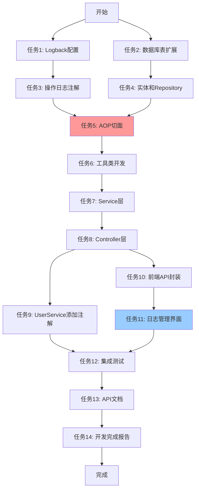

# 社区团购系统 - 日志系统任务拆分文档 (TASK)

**任务名称**: 双轨制日志系统  
**创建时间**: 2025-10-14  
**版本**: v1.0  
**基于文档**: ALIGNMENT_日志系统.md, DESIGN_日志系统.md

---

## 任务依赖关系图



---

## 任务1: Logback集中配置

### 输入契约
- 无前置依赖
- 需要了解：Spring Boot Logback配置规范
- 环境要求：Common模块已存在

### 任务描述
在Common模块创建统一的Logback配置文件，支持控制台输出、文件输出、按日期和大小滚动。

### 实现步骤
1. 在`common/src/main/resources/`创建`logback-spring.xml`
2. 配置日志路径变量：`./logs/${spring.application.name}/`
3. 配置控制台Appender（彩色输出）
4. 配置文件Appender（INFO级别）
5. 配置错误日志Appender（ERROR级别）
6. 配置异步Appender（提升性能）
7. 配置滚动策略：按日期+大小（100MB）
8. 配置日志级别：com.bcu.edu=DEBUG, root=INFO
9. 配置日志格式：`[时间] [级别] [服务] [线程] [类:行] - 消息`
10. 验证UserService自动继承配置

### 输出交付物
- ✅ `common/src/main/resources/logback-spring.xml`
- ✅ 日志输出格式统一
- ✅ 日志文件自动创建：`./logs/UserService/UserService.log`

### 验收标准
- [ ] UserService启动后自动创建日志目录和文件
- [ ] 控制台输出格式正确（带颜色）
- [ ] 文件输出格式正确（带服务名、线程、类名）
- [ ] 执行一条SQL，日志文件中能看到SQL语句
- [ ] 日志文件超过100MB自动拆分（模拟测试）

### 技术约束
- 使用Spring Boot默认的Logback
- 日志路径支持动态变量`${spring.application.name}`
- 保留30天日志

### 预计工作量
**0.5天**

---

## 任务2: 数据库表扩展

### 输入契约
- 前置依赖：无
- 数据库：MySQL 8.0.36
- 已有表：`sys_operation_log`（基础字段）

### 任务描述
为`sys_operation_log`表添加扩展字段，支持记录参数、返回结果、执行时长等信息。

### 实现步骤
1. 编写SQL脚本扩展表结构
2. 在`community_group_buy.sql`中更新表定义
3. 执行ALTER TABLE语句添加新字段

### SQL脚本
```sql
ALTER TABLE `sys_operation_log` 
ADD COLUMN `username` varchar(50) NULL COMMENT '操作人用户名' AFTER `user_id`,
ADD COLUMN `method` varchar(100) NULL COMMENT '方法名' AFTER `module`,
ADD COLUMN `params` text NULL COMMENT '请求参数（JSON）' AFTER `method`,
ADD COLUMN `result` varchar(20) NULL COMMENT '操作结果（SUCCESS/FAIL）' AFTER `params`,
ADD COLUMN `error_msg` text NULL COMMENT '错误信息' AFTER `result`,
ADD COLUMN `duration` int NULL COMMENT '执行时长（毫秒）' AFTER `error_msg`;
```

### 输出交付物
- ✅ 更新后的`community_group_buy.sql`
- ✅ 表结构扩展完成

### 验收标准
- [ ] 新字段成功添加到表中
- [ ] 字段类型、长度、注释正确
- [ ] 不影响现有数据

### 预计工作量
**0.5天**

---

## 任务3: 创建操作日志注解

### 输入契约
- 前置依赖：无
- 环境：Common模块

### 任务描述
创建`@OperationLog`注解，用于标记需要记录日志的方法。

### 实现步骤
1. 创建`com.bcu.edu.common.annotation`包
2. 创建`@OperationLog`注解接口
3. 定义注解属性：value（操作内容）、module（操作模块）、recordParams、recordResult、sensitiveFields

### 代码文件
**文件**: `common/src/main/java/com/bcu/edu/common/annotation/OperationLog.java`

```java
package com.bcu.edu.common.annotation;

import java.lang.annotation.*;

@Target(ElementType.METHOD)
@Retention(RetentionPolicy.RUNTIME)
@Documented
public @interface OperationLog {
    /** 操作内容描述 */
    String value();
    
    /** 操作模块 */
    String module() default "";
    
    /** 是否记录请求参数 */
    boolean recordParams() default true;
    
    /** 是否记录返回结果 */
    boolean recordResult() default false;
    
    /** 敏感参数字段 */
    String[] sensitiveFields() default {"password", "token", "secret"};
}
```

### 输出交付物
- ✅ `OperationLog.java`注解类

### 验收标准
- [ ] 注解可以标注在方法上
- [ ] 支持自定义敏感字段
- [ ] 代码编译通过

### 预计工作量
**0.5天**

---

## 任务4: 创建操作日志实体和Repository

### 输入契约
- 前置依赖：任务2（表结构扩展）
- 环境：Common模块

### 任务描述
创建`SysOperationLog`实体类和JPA Repository接口。

### 实现步骤
1. 创建`com.bcu.edu.common.entity`包
2. 创建`SysOperationLog`实体类（映射扩展后的表）
3. 创建`com.bcu.edu.common.repository`包
4. 创建`SysOperationLogRepository`接口（继承JpaRepository和JpaSpecificationExecutor）
5. 添加自定义查询方法（按模块查询、按用户查询）

### 代码文件
**文件1**: `common/src/main/java/com/bcu/edu/common/entity/SysOperationLog.java`

```java
@Entity
@Table(name = "sys_operation_log")
@Data
@NoArgsConstructor
public class SysOperationLog {
    @Id
    @GeneratedValue(strategy = GenerationType.IDENTITY)
    private Long logId;
    
    private Long userId;
    private String username;
    
    @Column(length = 255)
    private String operation;
    
    @Column(length = 50)
    private String module;
    
    @Column(length = 100)
    private String method;
    
    @Column(columnDefinition = "TEXT")
    private String params;
    
    @Column(length = 20)
    private String result;  // SUCCESS / FAIL
    
    @Column(columnDefinition = "TEXT")
    private String errorMsg;
    
    private Integer duration;  // 毫秒
    
    @Column(length = 50)
    private String ip;
    
    @Column(name = "create_time", updatable = false)
    private LocalDateTime createTime;
    
    @PrePersist
    protected void onCreate() {
        createTime = LocalDateTime.now();
    }
}
```

**文件2**: `common/src/main/java/com/bcu/edu/common/repository/SysOperationLogRepository.java`

```java
public interface SysOperationLogRepository extends JpaRepository<SysOperationLog, Long>, 
                                                    JpaSpecificationExecutor<SysOperationLog> {
    // 按模块查询
    List<SysOperationLog> findByModule(String module);
    
    // 按用户查询
    List<SysOperationLog> findByUserId(Long userId);
    
    // 查询所有模块（去重）
    @Query("SELECT DISTINCT s.module FROM SysOperationLog s")
    List<String> findAllModules();
}
```

### 输出交付物
- ✅ `SysOperationLog.java`实体类
- ✅ `SysOperationLogRepository.java`接口

### 验收标准
- [ ] 实体类映射字段完整
- [ ] Repository编译通过
- [ ] JPA能自动创建/更新表（测试）

### 预计工作量
**0.5天**

---

## 任务5: 实现AOP切面

### 输入契约
- 前置依赖：任务3（注解）、任务4（实体和Repository）
- 环境：Common模块已添加spring-boot-starter-aop依赖

### 任务描述
实现`OperationLogAspect`切面，自动拦截带`@OperationLog`注解的方法，记录操作日志到数据库。

### 实现步骤
1. 在Common模块pom.xml添加AOP依赖
2. 创建`com.bcu.edu.common.aspect`包
3. 创建`OperationLogAspect`类（@Aspect + @Component）
4. 实现@Around切面方法
5. 提取当前用户信息（从JWT Token）
6. 获取客户端IP地址
7. 序列化方法参数为JSON
8. 脱敏敏感字段（password -> ***）
9. 记录执行时长
10. 异步保存日志到数据库
11. 异常处理（日志记录失败不影响业务）

### 代码文件
**文件**: `common/src/main/java/com/bcu/edu/common/aspect/OperationLogAspect.java`

```java
@Aspect
@Component
@Slf4j
public class OperationLogAspect {
    
    @Autowired
    private SysOperationLogRepository logRepository;
    
    @Autowired
    private ObjectMapper objectMapper;
    
    @Autowired
    @Qualifier("logExecutor")
    private Executor logExecutor;
    
    @Around("@annotation(operationLog)")
    public Object around(ProceedingJoinPoint joinPoint, OperationLog operationLog) throws Throwable {
        long startTime = System.currentTimeMillis();
        Object result = null;
        String errorMsg = null;
        String resultStatus = "SUCCESS";
        
        try {
            result = joinPoint.proceed();
            return result;
        } catch (Throwable e) {
            resultStatus = "FAIL";
            errorMsg = e.getMessage();
            throw e;
        } finally {
            try {
                saveLogAsync(joinPoint, operationLog, startTime, resultStatus, errorMsg, result);
            } catch (Exception e) {
                log.error("保存操作日志失败", e);
            }
        }
    }
    
    @Async("logExecutor")
    private void saveLogAsync(...) {
        // 构建日志对象
        SysOperationLog log = new SysOperationLog();
        log.setUserId(getCurrentUserId());
        log.setUsername(getCurrentUsername());
        log.setOperation(operationLog.value());
        log.setModule(operationLog.module());
        log.setMethod(joinPoint.getSignature().toLongString());
        log.setParams(serializeParams(joinPoint.getArgs(), operationLog.sensitiveFields()));
        log.setResult(resultStatus);
        log.setErrorMsg(errorMsg);
        log.setDuration((int)(System.currentTimeMillis() - startTime));
        log.setIp(getClientIp());
        
        logRepository.save(log);
    }
}
```

### 输出交付物
- ✅ `OperationLogAspect.java`切面类
- ✅ 异步线程池配置

### 验收标准
- [ ] 能拦截带@OperationLog注解的方法
- [ ] 正确记录用户信息、参数、结果
- [ ] 敏感字段正确脱敏
- [ ] 异步执行，不阻塞业务
- [ ] 日志记录失败不影响业务

### 技术约束
- 使用Jackson序列化参数
- 使用@Async异步保存
- 需要配置线程池

### 预计工作量
**1天**

---

## 任务6: 创建工具类

### 输入契约
- 前置依赖：无
- 环境：Common模块

### 任务描述
创建IP地址获取工具类和Excel导出工具类。

### 实现步骤
1. 创建`IpUtil.java`工具类
   - 从HttpServletRequest获取客户端真实IP
   - 处理代理情况（X-Forwarded-For、X-Real-IP）
   
2. 创建`ExcelUtil.java`工具类
   - 使用Apache POI导出Excel
   - 支持操作日志导出

### 代码文件
**文件1**: `common/src/main/java/com/bcu/edu/common/utils/IpUtil.java`

```java
public class IpUtil {
    public static String getClientIp(HttpServletRequest request) {
        String ip = request.getHeader("X-Forwarded-For");
        if (ip == null || ip.isEmpty() || "unknown".equalsIgnoreCase(ip)) {
            ip = request.getHeader("X-Real-IP");
        }
        if (ip == null || ip.isEmpty() || "unknown".equalsIgnoreCase(ip)) {
            ip = request.getRemoteAddr();
        }
        return ip;
    }
}
```

**文件2**: `common/src/main/java/com/bcu/edu/common/utils/ExcelUtil.java`

```java
public class ExcelUtil {
    public static byte[] exportOperationLogs(List<OperationLogDTO> logs) {
        // 使用Apache POI创建Excel
        // 设置表头、填充数据、设置样式
        // 返回byte[]
    }
}
```

### 输出交付物
- ✅ `IpUtil.java`工具类
- ✅ `ExcelUtil.java`工具类

### 验收标准
- [ ] 能正确获取客户端IP（支持代理）
- [ ] 能导出Excel文件（格式正确）

### 预计工作量
**0.5天**

---

## 任务7: 创建Service层

### 输入契约
- 前置依赖：任务4（Repository）、任务6（工具类）
- 环境：Common模块

### 任务描述
创建`OperationLogService`服务类，实现日志查询、导出业务逻辑。

### 实现步骤
1. 创建`com.bcu.edu.common.dto`包
2. 创建`OperationLogDTO`（返回DTO）
3. 创建`OperationLogQuery`（查询条件DTO）
4. 创建`com.bcu.edu.common.service`包
5. 创建`OperationLogService`类
6. 实现分页查询方法（使用JPA Specification）
7. 实现导出方法（限制10000条）
8. 实现查询模块列表方法

### 代码文件
**文件1**: `common/src/main/java/com/bcu/edu/common/dto/OperationLogDTO.java`

```java
@Data
public class OperationLogDTO {
    private Long logId;
    private String username;
    private String operation;
    private String module;
    private String result;
    private String ip;
    private Integer duration;
    private LocalDateTime createTime;
    private String params;  // 详情时返回
    private String errorMsg;
    
    public static OperationLogDTO fromEntity(SysOperationLog entity) {
        // 转换逻辑
    }
}
```

**文件2**: `common/src/main/java/com/bcu/edu/common/dto/OperationLogQuery.java`

```java
@Data
public class OperationLogQuery {
    private Long userId;
    private String username;
    private String module;
    private LocalDateTime startDate;
    private LocalDateTime endDate;
    private String keyword;
    private Integer page = 1;
    private Integer size = 10;
}
```

**文件3**: `common/src/main/java/com/bcu/edu/common/service/OperationLogService.java`

```java
@Service
public class OperationLogService {
    @Autowired
    private SysOperationLogRepository repository;
    
    public PageResult<OperationLogDTO> queryLogs(OperationLogQuery query) {
        // 使用Specification构建查询条件
        // 分页查询
        // 转换为DTO
    }
    
    public byte[] exportLogs(OperationLogQuery query) {
        // 查询数据（限制10000条）
        // 调用ExcelUtil导出
    }
    
    public List<String> getModules() {
        return repository.findAllModules();
    }
}
```

### 输出交付物
- ✅ `OperationLogDTO.java`
- ✅ `OperationLogQuery.java`
- ✅ `OperationLogService.java`

### 验收标准
- [ ] 分页查询正确（支持多条件）
- [ ] 导出功能正确（Excel格式）
- [ ] 模块列表查询正确

### 预计工作量
**1天**

---

## 任务8: 创建Controller层

### 输入契约
- 前置依赖：任务7（Service层）
- 环境：Common模块

### 任务描述
创建`LogController`控制器，提供日志查询、导出API接口。

### 实现步骤
1. 创建`com.bcu.edu.common.controller`包
2. 创建`LogController`类（@RestController）
3. 实现分页查询接口（GET /api/admin/logs/operations）
4. 实现Excel导出接口（GET /api/admin/logs/export）
5. 实现模块列表接口（GET /api/admin/logs/modules）
6. 添加权限控制（@PreAuthorize("hasRole('ADMIN')")）
7. 添加Swagger文档注解

### 代码文件
**文件**: `common/src/main/java/com/bcu/edu/common/controller/LogController.java`

```java
@RestController
@RequestMapping("/api/admin/logs")
@Tag(name = "系统日志管理")
public class LogController {
    
    @Autowired
    private OperationLogService operationLogService;
    
    @GetMapping("/operations")
    @Operation(summary = "分页查询操作日志")
    @PreAuthorize("hasRole('ADMIN')")
    public Result<PageResult<OperationLogDTO>> queryLogs(
        @RequestParam(required = false) Long userId,
        @RequestParam(required = false) String username,
        @RequestParam(required = false) String module,
        @RequestParam(required = false) @DateTimeFormat(iso = DateTimeFormat.ISO.DATE_TIME) LocalDateTime startDate,
        @RequestParam(required = false) @DateTimeFormat(iso = DateTimeFormat.ISO.DATE_TIME) LocalDateTime endDate,
        @RequestParam(required = false) String keyword,
        @RequestParam(defaultValue = "1") Integer page,
        @RequestParam(defaultValue = "10") Integer size
    ) {
        OperationLogQuery query = new OperationLogQuery();
        // 设置查询条件
        PageResult<OperationLogDTO> result = operationLogService.queryLogs(query);
        return Result.success(result);
    }
    
    @GetMapping("/export")
    @Operation(summary = "导出操作日志")
    @PreAuthorize("hasRole('ADMIN')")
    public void exportLogs(..., HttpServletResponse response) throws IOException {
        byte[] data = operationLogService.exportLogs(query);
        response.setContentType("application/vnd.ms-excel");
        response.setHeader("Content-Disposition", "attachment;filename=operation_logs.xlsx");
        response.getOutputStream().write(data);
    }
    
    @GetMapping("/modules")
    @Operation(summary = "获取操作模块列表")
    @PreAuthorize("hasRole('ADMIN')")
    public Result<List<String>> getModules() {
        return Result.success(operationLogService.getModules());
    }
}
```

### 输出交付物
- ✅ `LogController.java`控制器类

### 验收标准
- [ ] 接口能正常访问（需要管理员权限）
- [ ] 分页查询返回正确格式
- [ ] Excel导出返回文件流
- [ ] Swagger文档生成正确

### 技术约束
- 需要JWT认证
- 仅管理员可访问

### 预计工作量
**1天**

---

## 任务9: UserService添加日志注解

### 输入契约
- 前置依赖：任务3（注解）、任务5（切面）
- 环境：UserService模块

### 任务描述
在UserService的Controller方法上添加`@OperationLog`注解，记录关键操作。

### 实现步骤
1. 在UserService模块pom.xml添加对Common模块的依赖（已有）
2. 在UserController的关键方法添加注解
   - 用户登录：`@OperationLog(value = "用户登录", module = "认证管理", recordParams = false)`
   - 创建用户：`@OperationLog(value = "创建用户", module = "用户管理")`
   - 编辑用户：`@OperationLog(value = "编辑用户", module = "用户管理")`
   - 删除用户：`@OperationLog(value = "删除用户", module = "用户管理")`
   - 修改用户状态：`@OperationLog(value = "修改用户状态", module = "用户管理")`
3. 在FeedbackController添加注解
   - 处理反馈：`@OperationLog(value = "处理用户反馈", module = "反馈管理")`
   - 回复反馈：`@OperationLog(value = "回复用户反馈", module = "反馈管理")`

### 代码示例
```java
@PostMapping("/login")
@OperationLog(value = "用户登录", module = "认证管理", recordParams = false)
public Result<LoginResponse> login(@RequestBody LoginRequest request) {
    // 业务逻辑
}

@PostMapping
@OperationLog(value = "创建用户", module = "用户管理")
public Result<UserResponse> createUser(@RequestBody UserCreateRequest request) {
    // 业务逻辑
}
```

### 输出交付物
- ✅ UserController添加7个日志注解
- ✅ FeedbackController添加2个日志注解

### 验收标准
- [ ] 用户登录操作自动记录日志（不记录密码参数）
- [ ] 创建用户操作记录完整参数
- [ ] 删除用户操作记录用户ID
- [ ] 处理反馈操作记录反馈ID和处理意见

### 预计工作量
**0.5天**

---

## 任务10: 前端API封装

### 输入契约
- 前置依赖：任务8（Controller接口）
- 环境：管理后台前端项目

### 任务描述
在管理后台前端封装日志查询和导出API。

### 实现步骤
1. 创建`community-group-buy-admin/src/api/log.js`
2. 封装查询操作日志接口
3. 封装导出操作日志接口
4. 封装获取模块列表接口

### 代码文件
**文件**: `community-group-buy-admin/src/api/log.js`

```javascript
import request from '@/utils/request'

/**
 * 分页查询操作日志
 */
export function getOperationLogs(params) {
  return request({
    url: '/api/admin/logs/operations',
    method: 'get',
    params
  })
}

/**
 * 导出操作日志为Excel
 */
export function exportOperationLogs(params) {
  return request({
    url: '/api/admin/logs/export',
    method: 'get',
    params,
    responseType: 'blob'
  })
}

/**
 * 获取操作模块列表
 */
export function getLogModules() {
  return request({
    url: '/api/admin/logs/modules',
    method: 'get'
  })
}
```

### 输出交付物
- ✅ `log.js` API封装文件

### 验收标准
- [ ] API函数导出正确
- [ ] 导出接口使用blob响应类型

### 预计工作量
**0.5天**

---

## 任务11: 创建日志管理界面

### 输入契约
- 前置依赖：任务10（API封装）
- 环境：管理后台前端项目

### 任务描述
创建日志管理页面，包含查询、筛选、分页、详情、导出功能。

### 实现步骤
1. 创建`community-group-buy-admin/src/views/LogManageView.vue`
2. 实现筛选条件表单
   - 操作人输入框
   - 操作模块下拉框
   - 时间范围选择器
   - 关键词输入框
3. 实现查询按钮和重置按钮
4. 实现数据表格
   - 操作时间、操作人、操作内容、操作模块、操作结果、IP、耗时
5. 实现详情对话框
   - 显示完整信息（包括参数、错误信息）
   - JSON参数格式化显示
6. 实现分页器
7. 实现Excel导出功能
   - 调用API下载文件
   - 使用FileSaver.js保存文件
8. 在路由中添加菜单项

### 代码文件
**文件1**: `community-group-buy-admin/src/views/LogManageView.vue`（约300行代码）

**文件2**: `community-group-buy-admin/src/router/index.js`（添加路由）

```javascript
{
  path: '/log',
  name: 'log',
  component: () => import('../views/LogManageView.vue'),
  meta: { title: '系统日志', requiresAuth: true, role: 'ADMIN' }
}
```

### 输出交付物
- ✅ `LogManageView.vue`页面组件
- ✅ 路由配置更新

### 验收标准
- [ ] 筛选条件正确提交
- [ ] 表格数据正确显示
- [ ] 分页功能正常
- [ ] 详情对话框显示完整信息
- [ ] Excel导出成功（下载文件）
- [ ] 只有管理员能访问

### 技术约束
- 使用Element Plus组件库
- 使用Composition API
- JSON参数使用`<pre>`标签格式化

### 预计工作量
**1.5天**

---

## 任务12: 集成测试

### 输入契约
- 前置依赖：任务9（UserService注解）、任务11（前端界面）
- 环境：完整的前后端环境

### 任务描述
测试日志系统的完整功能，验证所有场景。

### 测试步骤

#### 1. Logback日志测试
- [ ] 启动UserService，检查日志目录是否创建
- [ ] 执行一次用户查询，检查日志文件内容
- [ ] 执行一次错误操作，检查error日志文件
- [ ] 等待日志文件超过100MB（模拟），检查是否自动拆分

#### 2. 操作日志记录测试
- [ ] 管理员登录（检查日志表，operation="用户登录"）
- [ ] 创建用户（检查params字段包含用户名）
- [ ] 创建用户失败（用户名重复，检查result="FAIL", errorMsg不为空）
- [ ] 编辑用户（检查operation="编辑用户"）
- [ ] 删除用户（检查operation="删除用户"）
- [ ] 处理反馈（检查module="反馈管理"）

#### 3. 参数脱敏测试
- [ ] 用户登录（检查params字段，password应为"***"）
- [ ] 创建用户（检查params字段，password应为"***"）

#### 4. 日志查询测试
- [ ] 打开日志管理页面
- [ ] 查看日志列表（应显示最近30天数据）
- [ ] 筛选操作人（输入用户名，点击查询）
- [ ] 筛选模块（选择"用户管理"，点击查询）
- [ ] 筛选时间范围（选择今天，点击查询）
- [ ] 关键词搜索（输入"创建"，点击查询）
- [ ] 分页测试（切换页码）
- [ ] 点击详情（查看完整参数和错误信息）

#### 5. Excel导出测试
- [ ] 不加筛选条件，点击导出（应提示数据量过大）
- [ ] 选择时间范围（今天），点击导出
- [ ] 检查下载的Excel文件
- [ ] 打开Excel，检查表头、数据、格式

#### 6. 性能测试
- [ ] 创建100条用户（批量操作）
- [ ] 检查操作日志表有100条记录
- [ ] 检查接口响应时间（应<50ms）
- [ ] 查询1000条日志，响应时间<1秒

#### 7. 权限测试
- [ ] 使用普通用户登录
- [ ] 访问日志管理页面（应跳转到登录页或提示无权限）
- [ ] 直接访问API（应返回403 Forbidden）

### 输出交付物
- ✅ 测试报告文档

### 验收标准
- [ ] 所有测试用例通过
- [ ] 无阻塞性Bug

### 预计工作量
**0.5天**

---

## 任务13: 创建API文档

### 输入契约
- 前置依赖：任务8（Controller完成）
- 环境：已配置Swagger

### 任务描述
编写完整的操作日志API文档。

### 实现步骤
1. 创建`docs/社区团购系统/API_日志系统.md`
2. 记录所有API接口
   - 接口路径、请求方法、参数、响应
3. 添加请求示例和响应示例
4. 补充Swagger注解

### 输出交付物
- ✅ `API_日志系统.md`文档

### 验收标准
- [ ] 所有接口都有文档
- [ ] 参数说明完整
- [ ] 响应示例正确
- [ ] Swagger UI能正常访问

### 预计工作量
**0.5天**

---

## 任务14: 创建开发完成报告

### 输入契约
- 前置依赖：任务12（测试完成）
- 环境：所有功能已完成

### 任务描述
编写日志系统开发完成报告，总结开发过程、技术亮点、使用说明。

### 实现步骤
1. 创建`docs/社区团购系统/日志系统开发完成报告.md`
2. 记录开发背景和需求
3. 记录技术方案（双轨制架构）
4. 记录核心功能（Logback + AOP + 查询 + 导出）
5. 记录技术亮点（异步记录、参数脱敏、Excel导出）
6. 编写使用说明（如何添加日志注解、如何查询日志）
7. 附上测试结果和截图
8. 记录已知问题和后续优化建议

### 输出交付物
- ✅ `日志系统开发完成报告.md`文档

### 验收标准
- [ ] 文档结构完整
- [ ] 技术方案清晰
- [ ] 使用说明详细
- [ ] 包含测试结果

### 预计工作量
**0.5天**

---

## 总体时间计划

| 阶段 | 任务 | 工作量 | 累计 |
|------|------|--------|------|
| **阶段1: 基础设施** | 任务1-2 | 1天 | 1天 |
| **阶段2: 注解和实体** | 任务3-4 | 1天 | 2天 |
| **阶段3: AOP切面** | 任务5-6 | 1.5天 | 3.5天 |
| **阶段4: Service和Controller** | 任务7-8 | 2天 | 5.5天 |
| **阶段5: UserService集成** | 任务9 | 0.5天 | 6天 |
| **阶段6: 前端开发** | 任务10-11 | 2天 | 8天 |
| **阶段7: 测试和文档** | 任务12-14 | 1.5天 | 9.5天 |

**总计**: 约**10个工作日**（考虑调试和优化）

---

## 风险与应对

| 风险 | 影响 | 应对措施 |
|------|------|---------|
| AOP切面失效 | 日志无法记录 | 编写单元测试，验证切面拦截 |
| 参数序列化失败 | 参数记录为空 | 添加try-catch，记录"[序列化失败]" |
| Excel导出内存溢出 | 大数据量导出失败 | 限制导出条数（最大10000条） |
| 前端文件下载失败 | 用户无法导出 | 检查Content-Type和responseType |
| 权限验证不生效 | 普通用户能访问 | 配置Spring Security，添加测试 |

---

## 验收检查清单

### 功能验收
- [ ] Logback配置生效，所有服务输出统一格式日志
- [ ] 日志文件按日期+大小正确滚动
- [ ] 用户登录操作自动记录到数据库
- [ ] 创建/编辑/删除用户操作正确记录
- [ ] 记录的参数为有效的JSON格式
- [ ] 敏感字段（password）已脱敏
- [ ] 管理员可以在后台查询操作日志
- [ ] 支持按操作人、模块、时间筛选
- [ ] 支持分页查询
- [ ] 可以导出Excel文件
- [ ] Excel包含所有必要字段

### 性能验收
- [ ] 日志记录不影响接口响应时间（<50ms）
- [ ] 查询1000条日志响应时间<1秒
- [ ] 导出5000条日志响应时间<5秒

### 安全验收
- [ ] 非管理员无法访问日志查询接口（401/403错误）
- [ ] 密码参数已脱敏
- [ ] 日志导出有权限验证

---

**文档状态**: ✅ 任务拆分完成  
**下一步**: 进入Approve阶段，等待用户审批

