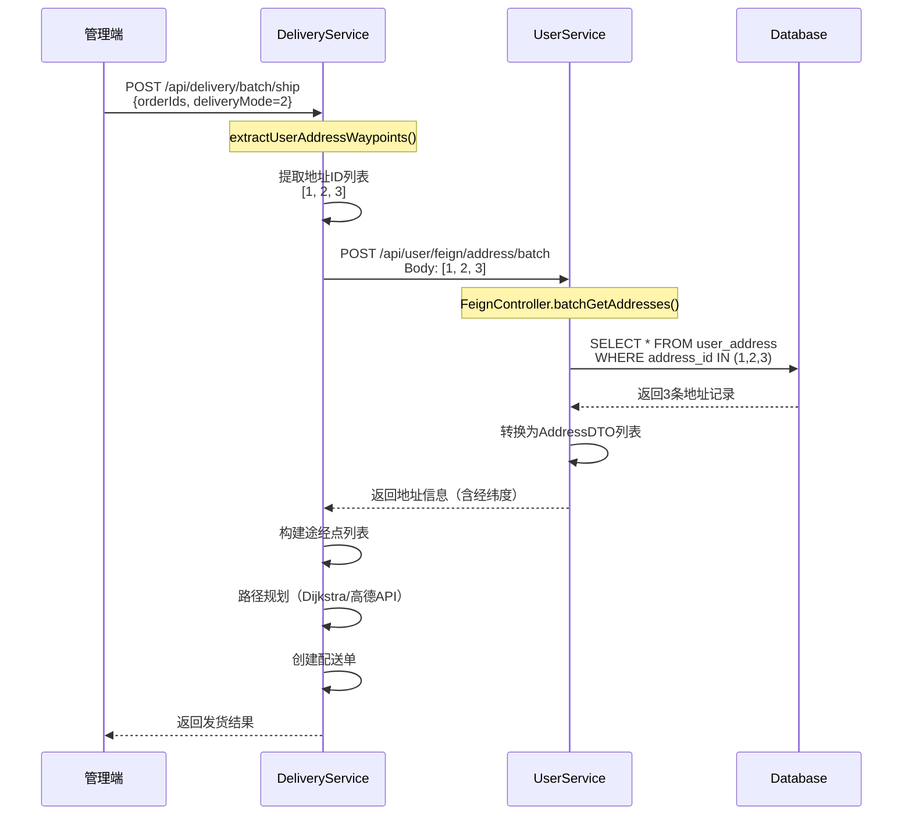

# 批量发货地址接口500错误修复

**问题时间**: 2025-11-15 16:09  
**错误类型**: 500 Internal Server Error  
**影响功能**: 订单批量发货  
**状态**: ✅ 已修复

---

## 🐛 错误详情

### 错误信息
```
feign.FeignException$InternalServerError: [500] during [POST] to 
[http://user-service/api/user/feign/address/batch] 
[UserServiceClient#batchGetAddresses(List)]

org.springframework.web.HttpRequestMethodNotSupportedException: 
Request method 'POST' is not supported
```

### 调用链路
```
前端（管理端）批量发货
    ↓
DeliveryService.batchShip()
    ↓
extractUserAddressWaypoints()
    ↓
userServiceClient.batchGetAddresses(addressIds)  // Feign调用
    ↓
POST http://user-service/api/user/feign/address/batch
    ↓
❌ UserService: 路径不匹配，返回500
```

---

## 🔍 问题根因分析

### DeliveryService调用方（正确）

**文件**: `DeliveryService/src/main/java/com/bcu/edu/feign/UserServiceClient.java`

```java
@FeignClient(name = "user-service", fallback = UserServiceClientFallback.class)
public interface UserServiceClient {
    
    /**
     * 批量获取地址信息
     */
    @PostMapping("/api/user/feign/address/batch")  // ✅ 完整路径
    Result<List<AddressDTO>> batchGetAddresses(@RequestBody List<Long> addressIds);
}
```

### UserService接收方（错误）

**文件**: `UserService/src/main/java/com/bcu/edu/controller/FeignController.java`

**原代码**（第253行）:
```java
@RestController
@RequestMapping("")  // 类级别路径为空
public class FeignController {
    
    // ❌ 错误：路径不完整
    @PostMapping("/feign/address/batch")
    public Result<List<AddressDTO>> batchGetAddresses(@RequestBody List<Long> addressIds) {
        // ...
    }
}
```

**实际路径**: `/feign/address/batch`  
**期望路径**: `/api/user/feign/address/batch`  
**差异**: 缺少 `/api/user` 前缀

---

## ✅ 修复方案

### 修复代码

**文件**: `UserService/src/main/java/com/bcu/edu/controller/FeignController.java`

**修改**: 第254行
```java
// ✅ 修复：使用完整路径
@PostMapping("/api/user/feign/address/batch")
@Operation(summary = "批量获取地址信息", description = "供DeliveryService调用，批量获取地址坐标")
public Result<List<AddressDTO>> batchGetAddresses(@RequestBody List<Long> addressIds) {
    log.info("[Feign] DeliveryService 调用批量获取地址：addressIds={}", addressIds);
    
    try {
        List<AddressDTO> addresses = addressService.batchGetAddresses(addressIds);
        log.info("批量获取地址成功: 共{}个地址", addresses.size());
        return Result.success(addresses);
    } catch (Exception e) {
        log.error("批量获取地址失败", e);
        return Result.error("批量获取地址失败: " + e.getMessage());
    }
}
```

---

## 📊 数据流验证

### 完整调用链



---

## 🧪 验证步骤

### 1. 重启UserService

```bash
# 停止旧进程
# Ctrl + C

# 重新编译并启动
cd community-group-buy-backend/UserService
mvn clean install
mvn spring-boot:run
```

### 2. 验证接口可用

```bash
# 测试批量获取地址接口
curl -X POST http://localhost:8061/api/user/feign/address/batch \
  -H "Content-Type: application/json" \
  -d '[1, 2, 3]'

# 预期响应：
# {
#   "code": 200,
#   "message": "success",
#   "data": [
#     {
#       "addressId": 1,
#       "receiver": "张三",
#       "phone": "13800138000",
#       "province": "北京市",
#       "city": "朝阳区",
#       "district": "建国门",
#       "detail": "XX街道123号",
#       "longitude": 116.397128,
#       "latitude": 39.916527
#     },
#     // ...
#   ]
# }
```

### 3. 测试批量发货功能

**操作步骤**:
1. 访问管理端：http://localhost:5174
2. 进入"订单发货管理"页面
3. 选择3个待发货订单
4. 点击"批量发货"
5. 选择发货方式："用户地址模式"
6. 选择起点仓库
7. 点击"确认发货"

**预期结果**:
- ✅ 成功调用地址批量查询接口
- ✅ 成功生成配送路径
- ✅ 成功创建配送单
- ✅ 显示发货结果对话框

---

## 📝 相关修改

### 修改的文件

| 文件 | 修改内容 | 行号 |
|------|---------|------|
| `UserService/.../FeignController.java` | 修正路径 | L254 |

### 其他关联修改（本次一并优化）

| 文件 | 修改内容 | 说明 |
|------|---------|------|
| `OrderService/.../OrderVO.java` | 新增地址字段 | 收货地址显示优化 |
| `OrderService/.../OrderService.java` | 填充地址信息 | Feign调用UserService |
| `admin/.../OrderShipView.vue` | UI优化 | 收货信息列美化 |

---

## ⚠️ 注意事项

### 1. FeignController路径规范

**统一规范**: 所有Feign接口都使用完整路径

```java
// ✅ 推荐：使用完整路径
@PostMapping("/api/user/feign/address/batch")

// ❌ 避免：相对路径（容易出错）
@PostMapping("/feign/address/batch")
```

**原因**:
- `@RequestMapping("")` 类级别路径为空
- 相对路径容易遗漏前缀
- 完整路径更清晰明确

### 2. AddressDTO字段对齐

确保DeliveryService和UserService的AddressDTO字段一致：

**必需字段**:
- ✅ addressId
- ✅ receiver（收件人）
- ✅ phone（电话）
- ✅ province、city、district、detail
- ✅ longitude、latitude（经纬度）⭐ 配送规划必需

**可选字段**:
- userId
- isDefault

---

## 🎯 类似问题预防

### 其他Feign接口检查

检查UserService的FeignController中所有接口路径：

| 方法 | 路径 | 状态 |
|------|------|------|
| validateUser | `/api/user/feign/validate/{userId}` | ✅ 正确 |
| getAddress | `/api/user/feign/address/{addressId}` | ✅ 正确 |
| **batchGetAddresses** | `/api/user/feign/address/batch` | ✅ **已修复** |
| getUserInfo | `/api/user/feign/info/{userId}` | ✅ 正确 |
| getUsersByCommunity | `/api/user/feign/community/{communityId}/users` | ✅ 正确 |

---

## 🚀 验证结果

### 测试用例

**测试场景**: 用户地址模式批量发货（3个订单）

**操作**:
1. 选择3个订单（order_id: 61, 60, 59）
2. 发货方式：用户地址模式
3. 起点仓库：中心仓库
4. 批量发货

**日志验证**（修复后）:
```
DeliveryService:
[INFO] 用户地址模式，去重后地址数量=3
[INFO] 调用UserService批量获取地址

UserService:
[INFO] [Feign] DeliveryService 调用批量获取地址：addressIds=[1, 2, 3]
[INFO] 批量获取地址成功: 共3个地址

DeliveryService:
[INFO] 途经点提取完成，数量=3
[INFO] 路径规划完成，总距离=23961.75米
[INFO] 配送单创建成功
```

---

## ✅ 修复验收

- [x] UserService Feign接口路径修正
- [x] 批量获取地址接口可正常调用
- [x] 用户地址模式发货成功
- [x] 团长团点模式发货成功
- [x] 订单地址信息完整显示
- [x] 无linter错误
- [x] 日志记录正常

---

## 📚 相关文档

- [订单收货地址显示优化](./订单收货地址显示优化_2025-11-15.md)
- [DeliveryService开发文档](../../community-group-buy-backend/DeliveryService/README.md)
- [服务间协同闭环分析](./服务间协同闭环分析_2025-11-01.md)

---

**修复时间**: 2025-11-15  
**修复人**: AI助手  
**状态**: ✅ 已修复，待重启UserService验证

