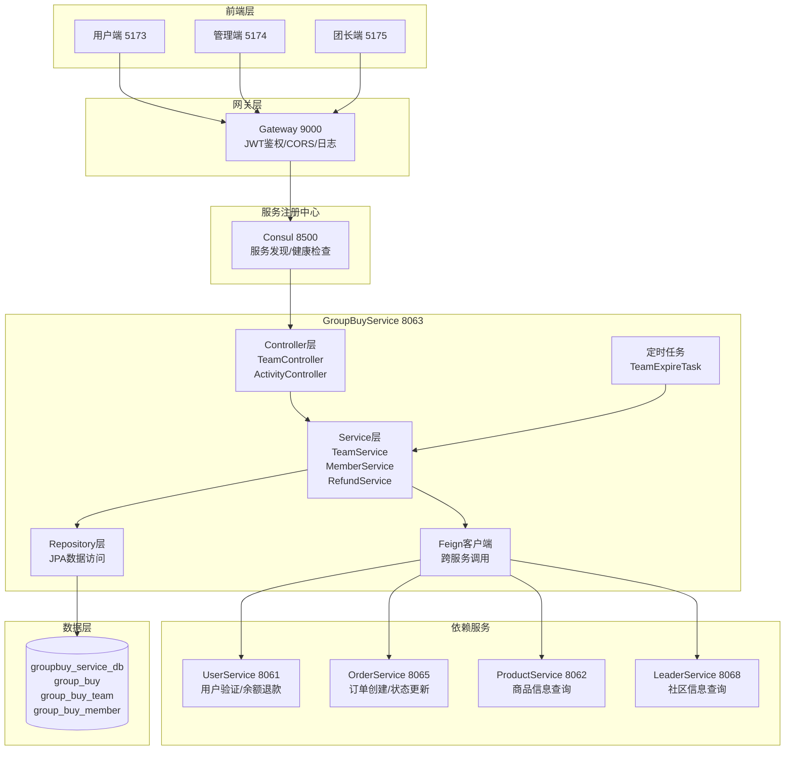
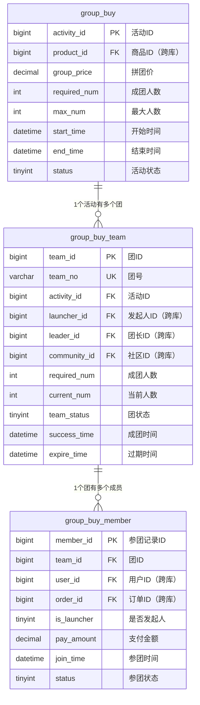
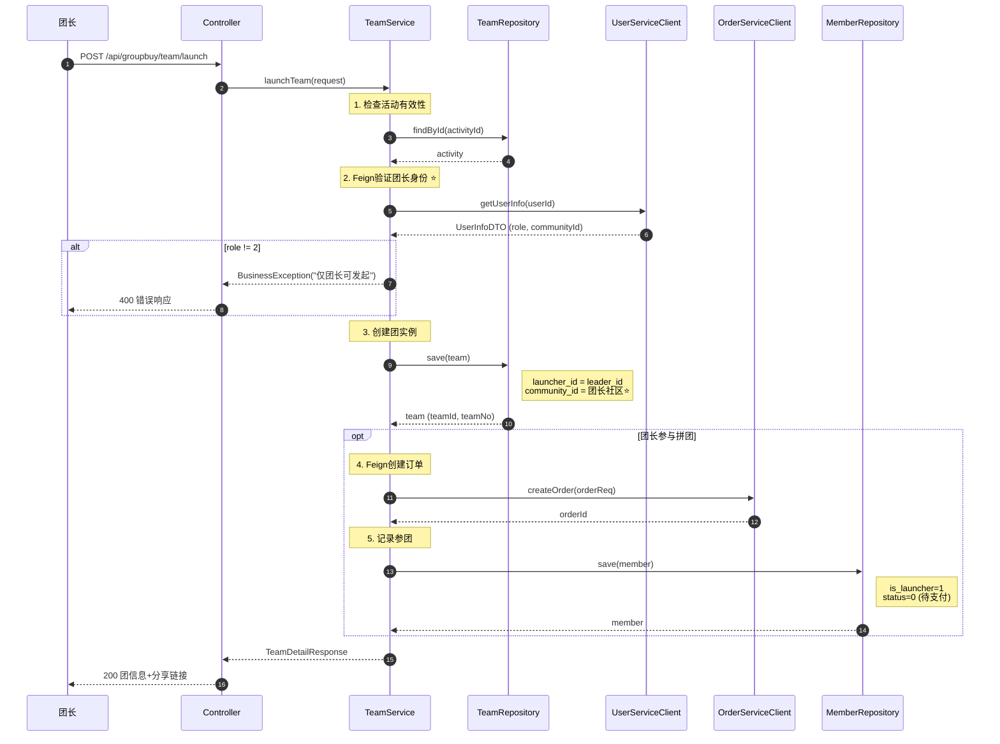
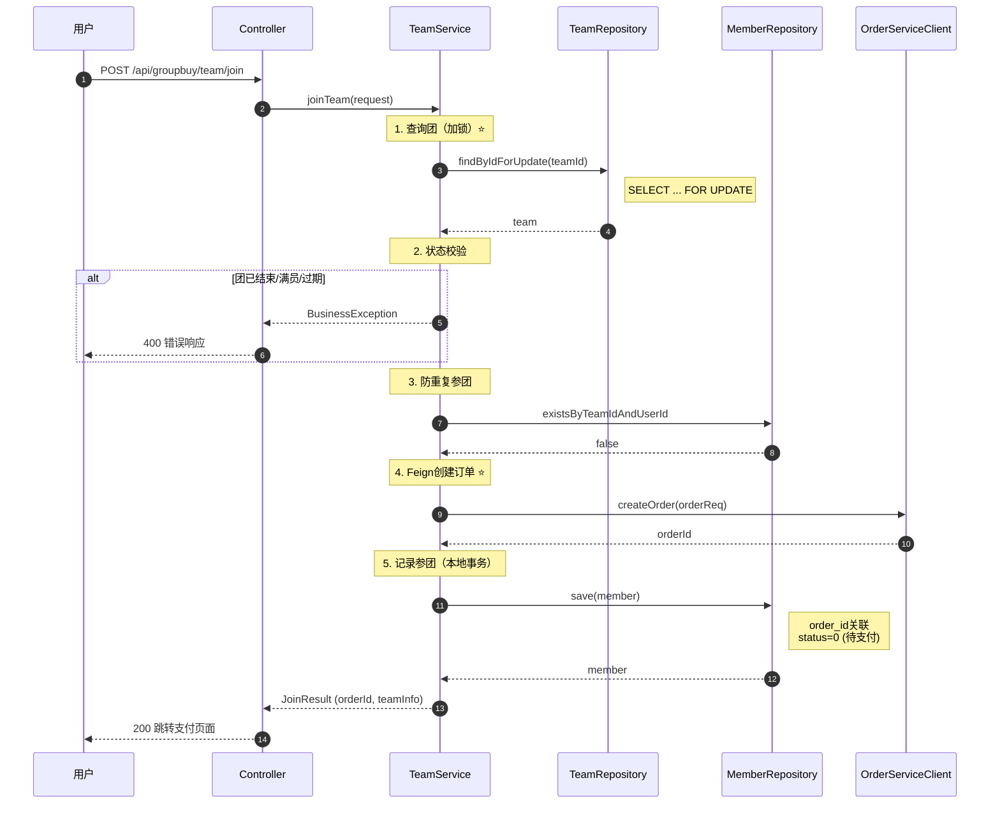
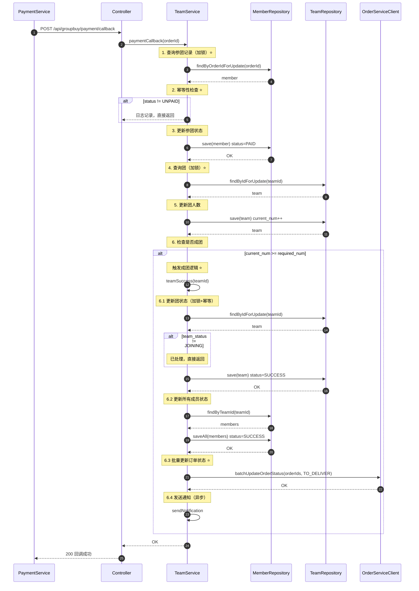
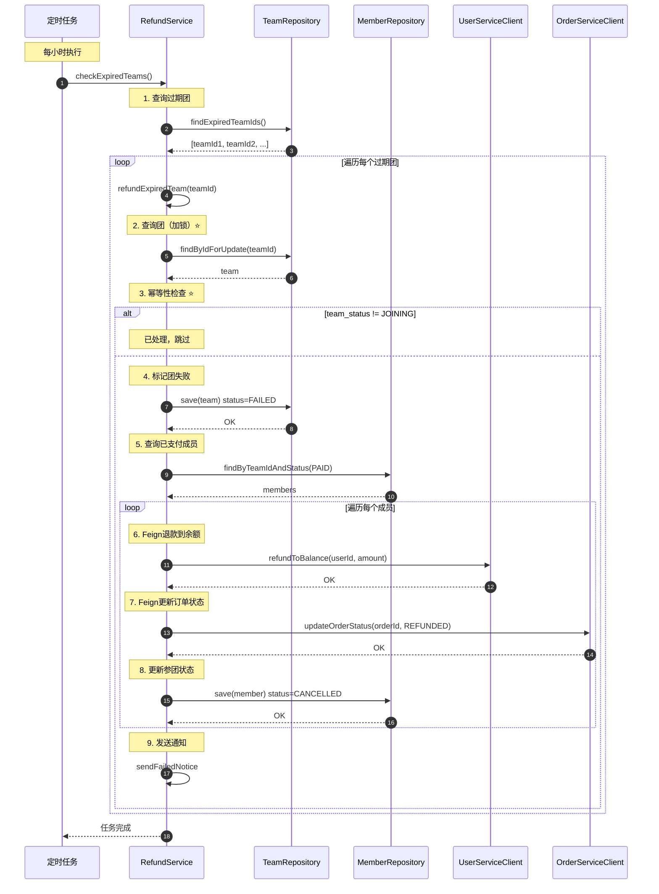
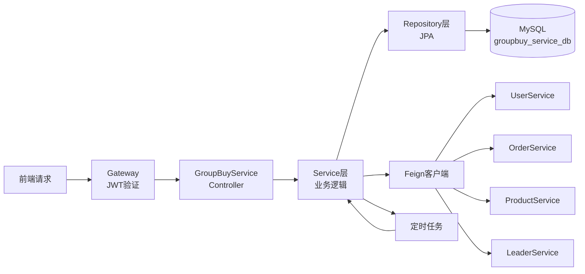
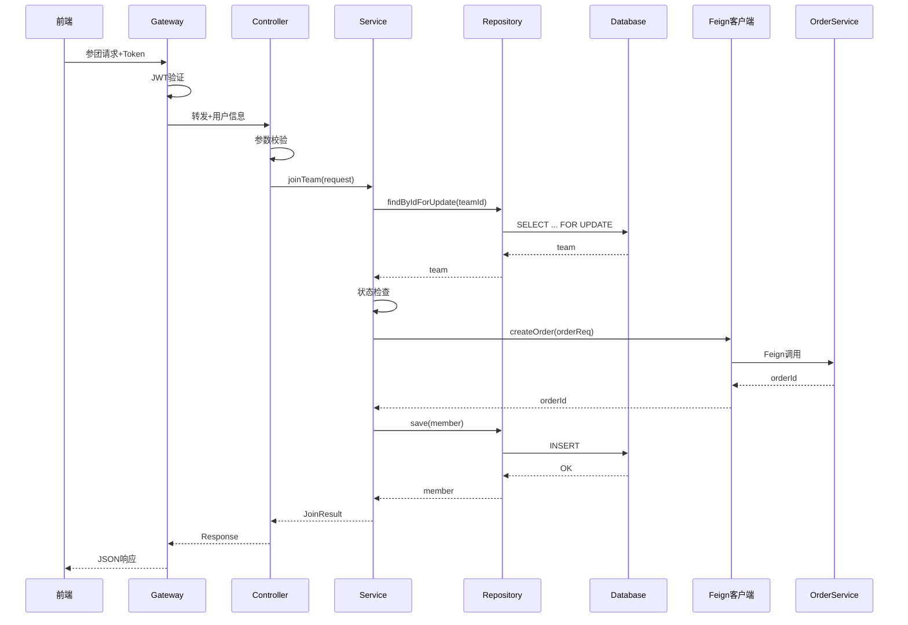

# GroupBuyService - 系统架构设计文档

**项目**: 社区团购系统 - 拼团服务  
**服务名称**: GroupBuyService  
**端口**: 8063  
**数据库**: groupbuy_service_db  
**文档版本**: v1.0  
**创建日期**: 2025-10-31  
**前置文档**: ALIGNMENT_GroupBuyService.md

---

## 📋 目录

1. [整体架构设计](#1-整体架构设计)
2. [数据库设计](#2-数据库设计)
3. [模块分层设计](#3-模块分层设计)
4. [核心流程设计](#4-核心流程设计)
5. [接口契约定义](#5-接口契约定义)
6. [数据流向图](#6-数据流向图)
7. [异常处理策略](#7-异常处理策略)

---

## 1. 整体架构设计

### 1.1 系统架构图



### 1.2 核心组件说明

| 组件 | 职责 | 关键技术 |
|------|------|---------|
| **Controller层** | 接收HTTP请求，参数校验，调用Service | @RestController, @Valid |
| **Service层** | 业务逻辑处理，事务控制，状态机管理 | @Service, @Transactional |
| **Repository层** | 数据持久化，数据库查询 | Spring Data JPA |
| **Feign客户端** | 跨服务调用，降级处理 | OpenFeign, Fallback |
| **定时任务** | 过期团检查，自动退款 | @Scheduled |
| **DTO层** | 数据传输对象，请求响应封装 | Lombok |
| **Entity层** | 数据库实体映射 | JPA, @Entity |

---

## 2. 数据库设计

### 2.1 ER图



### 2.2 索引策略

**主键索引** (3个)：
- `PRIMARY KEY (activity_id)` on group_buy
- `PRIMARY KEY (team_id)` on group_buy_team
- `PRIMARY KEY (member_id)` on group_buy_member

**唯一索引** (2个)：
- `uk_team_no (team_no)` on group_buy_team - 团号唯一
- `uk_team_user (team_id, user_id)` on group_buy_member - 防重复参团⭐

**普通索引** (11个)：
- group_buy: `idx_product_id`, `idx_status`, `idx_time`
- group_buy_team: `idx_activity_id`, `idx_launcher_id`, `idx_leader_id`, `idx_community_id`, `idx_team_status`, `idx_expire_time`
- group_buy_member: `idx_team_id`, `idx_user_id`, `idx_order_id`, `idx_status`

---

## 3. 模块分层设计

### 3.1 项目结构

```
GroupBuyService/
├── src/main/java/com/bcu/edu/
│   ├── GroupBuyServiceApplication.java          # 启动类 ⭐
│   ├── config/                                  # 配置类
│   │   ├── OpenApiConfig.java                   # Swagger配置
│   │   └── FeignConfig.java                     # Feign配置
│   ├── entity/                                  # 实体类（3个）⭐
│   │   ├── GroupBuy.java                        # 拼团活动实体
│   │   ├── GroupBuyTeam.java                    # 团实例实体
│   │   └── GroupBuyMember.java                  # 参团记录实体
│   ├── repository/                              # 数据访问层（3个）⭐
│   │   ├── GroupBuyRepository.java
│   │   ├── TeamRepository.java
│   │   └── MemberRepository.java
│   ├── dto/                                     # 数据传输对象
│   │   ├── request/                             # 请求DTO（6个）
│   │   │   ├── CreateActivityRequest.java      # 创建活动请求
│   │   │   ├── LaunchTeamRequest.java          # 发起拼团请求
│   │   │   ├── JoinTeamRequest.java            # 参团请求
│   │   │   ├── QuitTeamRequest.java            # 退出请求
│   │   │   ├── PaymentCallbackRequest.java     # 支付回调请求
│   │   │   └── TeamQueryRequest.java           # 团查询请求
│   │   └── response/                            # 响应DTO（5个）
│   │       ├── ActivityDetailResponse.java     # 活动详情
│   │       ├── TeamDetailResponse.java         # 团详情
│   │       ├── TeamListResponse.java           # 团列表项
│   │       ├── MemberInfoResponse.java         # 成员信息
│   │       └── MyTeamResponse.java             # 我的拼团
│   ├── service/                                # 业务逻辑层（4个）⭐
│   │   ├── GroupBuyService.java                # 活动管理服务
│   │   ├── TeamService.java                    # 团管理服务（核心）
│   │   ├── MemberService.java                  # 参团管理服务
│   │   └── RefundService.java                  # 退款服务
│   ├── controller/                             # 控制器层（2个）⭐
│   │   ├── ActivityController.java             # 活动管理API
│   │   └── TeamController.java                 # 团管理API（核心）
│   ├── client/                                 # Feign客户端（4个）⭐
│   │   ├── UserServiceClient.java
│   │   ├── OrderServiceClient.java
│   │   ├── ProductServiceClient.java
│   │   └── LeaderServiceClient.java
│   ├── client/fallback/                        # Feign降级
│   │   ├── UserServiceClientFallback.java
│   │   ├── OrderServiceClientFallback.java
│   │   ├── ProductServiceClientFallback.java
│   │   └── LeaderServiceClientFallback.java
│   ├── task/                                   # 定时任务（1个）⭐
│   │   └── TeamExpireTask.java                 # 过期团检查
│   ├── enums/                                  # 枚举类（3个）
│   │   ├── ActivityStatus.java                 # 活动状态枚举
│   │   ├── TeamStatus.java                     # 团状态枚举
│   │   └── MemberStatus.java                   # 参团状态枚举
│   └── exception/                              # 自定义异常
│       └── GroupBuyException.java              # 拼团业务异常
├── src/main/resources/
│   ├── application.yml                         # 配置文件 ⭐
│   └── logback-spring.xml                      # 日志配置
└── pom.xml                                     # Maven配置 ⭐
```

**统计**：
- 核心类：25个
- 实体类：3个
- Repository：3个
- Service：4个
- Controller：2个
- Feign客户端：4个
- DTO：11个
- 枚举：3个

### 3.2 核心类设计

#### 3.2.1 Entity层

```java
// 1. GroupBuy.java - 拼团活动实体
@Entity
@Table(name = "group_buy")
@Data
public class GroupBuy {
    @Id
    @GeneratedValue(strategy = GenerationType.IDENTITY)
    private Long activityId;
    
    private Long productId;         // 跨库关联
    private BigDecimal groupPrice;  // 拼团价
    private Integer requiredNum;    // 成团人数
    private Integer maxNum;         // 最大人数限制
    private LocalDateTime startTime;
    private LocalDateTime endTime;
    private Integer status;         // 0未开始/1进行中/2已结束/3异常
    private String qrcodeUrl;
    private String link;
    private LocalDateTime createTime;
}

// 2. GroupBuyTeam.java - 团实例实体 ⭐核心
@Entity
@Table(name = "group_buy_team")
@Data
public class GroupBuyTeam {
    @Id
    @GeneratedValue(strategy = GenerationType.IDENTITY)
    private Long teamId;
    
    private String teamNo;          // 团号（唯一）
    private Long activityId;        // 关联活动
    private Long launcherId;        // 发起人ID（跨库）
    private Long leaderId;          // 团长ID（跨库）
    private Long communityId;       // 社区ID（跨库）⭐v3.0
    private Integer requiredNum;    // 成团人数
    private Integer currentNum;     // 当前人数
    private Integer teamStatus;     // 0拼团中/1已成团/2已失败
    private LocalDateTime successTime;
    private LocalDateTime expireTime;  // 24小时过期
    private LocalDateTime createTime;
}

// 3. GroupBuyMember.java - 参团记录实体 ⭐核心
@Entity
@Table(name = "group_buy_member")
@Data
public class GroupBuyMember {
    @Id
    @GeneratedValue(strategy = GenerationType.IDENTITY)
    private Long memberId;
    
    private Long teamId;
    private Long userId;            // 跨库关联
    private Long orderId;           // 跨库关联
    private Integer isLauncher;     // 0否/1是
    private BigDecimal payAmount;   // 支付金额
    private LocalDateTime joinTime;
    private Integer status;         // 0待支付/1已支付/2已成团/3已取消
}
```

#### 3.2.2 Repository层

```java
// 1. TeamRepository.java - 团Repository ⭐核心
@Repository
public interface TeamRepository extends JpaRepository<GroupBuyTeam, Long> {
    
    // 行锁查询（保证并发安全）⭐
    @Query("SELECT t FROM GroupBuyTeam t WHERE t.teamId = :teamId")
    @Lock(LockModeType.PESSIMISTIC_WRITE)
    Optional<GroupBuyTeam> findByIdForUpdate(@Param("teamId") Long teamId);
    
    // 查询过期的团（定时任务用）
    @Query("SELECT t.teamId FROM GroupBuyTeam t WHERE t.teamStatus = 0 AND t.expireTime < :now")
    List<Long> findExpiredTeamIds(@Param("now") LocalDateTime now);
    
    // 查询活动的团列表（社区优先排序）⭐v3.0
    @Query(value = """
        SELECT * FROM group_buy_team t
        WHERE t.activity_id = :activityId
          AND t.team_status = 0
          AND t.expire_time > NOW()
        ORDER BY 
          CASE WHEN t.community_id = :communityId THEN 0 ELSE 1 END ASC,
          t.create_time DESC
        """, nativeQuery = true)
    List<GroupBuyTeam> findByActivityIdWithCommunityPriority(
        @Param("activityId") Long activityId,
        @Param("communityId") Long communityId
    );
    
    // 查询用户发起的团
    List<GroupBuyTeam> findByLauncherId(Long launcherId);
}

// 2. MemberRepository.java - 参团Repository
@Repository
public interface MemberRepository extends JpaRepository<GroupBuyMember, Long> {
    
    // 检查是否已参团（防重复）
    boolean existsByTeamIdAndUserId(Long teamId, Long userId);
    
    // 查询团的所有成员
    List<GroupBuyMember> findByTeamId(Long teamId);
    
    // 查询用户参与的所有团
    List<GroupBuyMember> findByUserId(Long userId);
    
    // 通过订单ID查询（加锁）⭐
    @Query("SELECT m FROM GroupBuyMember m WHERE m.orderId = :orderId")
    @Lock(LockModeType.PESSIMISTIC_WRITE)
    Optional<GroupBuyMember> findByOrderIdForUpdate(@Param("orderId") Long orderId);
    
    // 查询已支付的成员
    List<GroupBuyMember> findByTeamIdAndStatus(Long teamId, Integer status);
}
```

#### 3.2.3 Service层

```java
// TeamService.java - 团管理服务 ⭐核心
@Service
@Slf4j
public class TeamService {
    
    // 依赖注入
    @Autowired private TeamRepository teamRepository;
    @Autowired private MemberRepository memberRepository;
    @Autowired private GroupBuyRepository activityRepository;
    @Autowired private UserServiceClient userServiceClient;
    @Autowired private OrderServiceClient orderServiceClient;
    
    /**
     * 团长发起拼团（v3.0）⭐
     * 
     * @param request 发起请求
     * @return 团详情
     */
    @Transactional(rollbackFor = Exception.class)
    @OperationLog(value = "发起拼团", module = "拼团管理")
    public TeamDetailResponse launchTeam(LaunchTeamRequest request);
    
    /**
     * 用户参与拼团 ⭐
     * 
     * @param request 参团请求
     * @return 参团结果（包含orderId）
     */
    @Transactional(rollbackFor = Exception.class)
    @OperationLog(value = "参与拼团", module = "拼团管理")
    public JoinResult joinTeam(JoinTeamRequest request);
    
    /**
     * 支付回调处理 ⭐
     * 
     * @param orderId 订单ID
     */
    @Transactional(rollbackFor = Exception.class)
    public void paymentCallback(Long orderId);
    
    /**
     * 成团逻辑 ⭐
     * 
     * @param teamId 团ID
     */
    @Transactional(rollbackFor = Exception.class)
    public void teamSuccess(Long teamId);
    
    /**
     * 获取团详情
     * 
     * @param teamId 团ID
     * @return 团详情
     */
    public TeamDetailResponse getTeamDetail(Long teamId);
    
    /**
     * 获取活动的团列表（社区优先）⭐v3.0
     * 
     * @param activityId 活动ID
     * @param communityId 用户的社区ID（可选）
     * @return 团列表
     */
    public List<TeamListResponse> getActivityTeams(Long activityId, Long communityId);
    
    /**
     * 生成团号
     * 
     * @return 团号（T20251031001）
     */
    private String generateTeamNo();
}
```

---

## 4. 核心流程设计

### 4.1 团长发起拼团流程



**关键点**：
- ✅ Feign验证团长身份（role=2）
- ✅ 自动关联团长的社区（v3.0）
- ✅ launcher_id = leader_id（v3.0规则）
- ✅ 团长可选择是否参与

### 4.2 用户参团流程



**关键点**：
- ✅ `SELECT ... FOR UPDATE` 行锁防并发
- ✅ 唯一索引防重复参团
- ✅ 先Feign创建订单，再记录参团（补偿：订单30分钟自动过期）

### 4.3 支付回调+成团流程



**关键点**：
- ✅ 两次行锁：参团记录锁 + 团锁
- ✅ 两次幂等检查：支付状态 + 团状态
- ✅ `current_num >= required_num` 触发成团
- ✅ 成团逻辑内部再次加锁+幂等检查

### 4.4 定时任务退款流程



**关键点**：
- ✅ 行锁 + 状态检查保证幂等性
- ✅ 单独事务处理每个团（互不影响）
- ✅ 异常捕获，不影响其他团

---

## 5. 接口契约定义

### 5.1 Controller接口清单

#### 5.1.1 TeamController（团管理）⭐核心

| 接口 | 方法 | 路径 | 说明 | 鉴权 |
|-----|------|------|------|------|
| 团长发起拼团 | POST | `/api/groupbuy/team/launch` | v3.0核心⭐ | ✅ |
| 用户参与拼团 | POST | `/api/groupbuy/team/join` | 核心⭐ | ✅ |
| 获取团详情 | GET | `/api/groupbuy/team/{teamId}/detail` | 查询 | ❌ |
| 获取活动团列表 | GET | `/api/groupbuy/activity/{activityId}/teams` | 社区优先⭐ | ❌ |
| 我的拼团列表 | GET | `/api/groupbuy/my-teams` | 查询 | ✅ |
| 退出拼团 | POST | `/api/groupbuy/team/quit` | 成团前 | ✅ |
| 支付回调 | POST | `/api/groupbuy/payment/callback` | 内部调用 | ❌ |

#### 5.1.2 ActivityController（活动管理）

| 接口 | 方法 | 路径 | 说明 | 鉴权 |
|-----|------|------|------|------|
| 创建活动 | POST | `/api/groupbuy/activity` | 管理员 | ✅ |
| 更新活动 | PUT | `/api/groupbuy/activity/{id}` | 管理员 | ✅ |
| 删除活动 | DELETE | `/api/groupbuy/activity/{id}` | 管理员 | ✅ |
| 获取活动列表 | GET | `/api/groupbuy/activities` | 查询 | ❌ |
| 获取活动详情 | GET | `/api/groupbuy/activity/{id}` | 查询 | ❌ |

### 5.2 详细接口定义

#### 5.2.1 团长发起拼团接口

**请求**：
```json
POST /api/groupbuy/team/launch
Headers: Authorization: Bearer {token}

{
  "userId": 1,                  // 团长ID（从Token解析）
  "activityId": 1,              // 活动ID
  "joinImmediately": true,      // 是否立即参与⭐
  "addressId": 1                // 收货地址ID（如果参与）
}
```

**响应**：
```json
{
  "code": 200,
  "message": "发起成功",
  "data": {
    "teamId": 5001,
    "teamNo": "T20251031001",
    "activityId": 1,
    "launcherId": 1,
    "leaderId": 1,
    "communityId": 10,           // 自动关联团长社区⭐
    "requiredNum": 3,
    "currentNum": 1,             // 团长参与则为1
    "teamStatus": 0,
    "expireTime": "2025-11-01T19:00:00",
    "shareLink": "http://xxx.com/team/5001",
    "orderId": 8001              // 团长参与时返回
  },
  "timestamp": "2025-10-31T19:00:00"
}
```

#### 5.2.2 用户参团接口

**请求**：
```json
POST /api/groupbuy/team/join
Headers: Authorization: Bearer {token}

{
  "userId": 2,                  // 用户ID（从Token解析）
  "teamId": 5001,               // 团ID
  "addressId": 2,               // 收货地址ID
  "quantity": 1                 // 购买数量
}
```

**响应**：
```json
{
  "code": 200,
  "message": "参团成功",
  "data": {
    "orderId": 8002,
    "teamInfo": {
      "teamId": 5001,
      "teamNo": "T20251031001",
      "currentNum": 2,
      "requiredNum": 3,
      "remainNum": 1,            // 还差1人
      "expireTime": "2025-11-01T19:00:00"
    },
    "payAmount": 19.90
  },
  "timestamp": "2025-10-31T19:05:00"
}
```

#### 5.2.3 支付回调接口

**请求**：
```json
POST /api/groupbuy/payment/callback
Headers: X-Internal-Call: true

{
  "orderId": 8002,
  "payStatus": 1,               // 1-支付成功
  "payTime": "2025-10-31T19:10:00"
}
```

**响应**：
```json
{
  "code": 200,
  "message": "处理成功",
  "data": {
    "teamStatus": 0,             // 0-拼团中/1-已成团
    "isSuccess": false,          // 是否已成团
    "currentNum": 2,
    "requiredNum": 3
  },
  "timestamp": "2025-10-31T19:10:00"
}
```

### 5.3 Feign接口清单

#### 5.3.1 UserServiceClient

```java
@FeignClient(name = "user-service", fallback = UserServiceClientFallback.class)
public interface UserServiceClient {
    
    /**
     * 获取用户信息（验证团长身份）⭐
     */
    @GetMapping("/api/user/feign/info/{userId}")
    Result<UserInfoDTO> getUserInfo(@PathVariable("userId") Long userId);
    
    /**
     * 退款到用户余额
     */
    @PostMapping("/api/account/feign/refund")
    Result<Void> refundToBalance(@RequestParam("userId") Long userId, 
                                  @RequestParam("amount") BigDecimal amount);
}
```

#### 5.3.2 OrderServiceClient

```java
@FeignClient(name = "order-service", fallback = OrderServiceClientFallback.class)
public interface OrderServiceClient {
    
    /**
     * 创建订单
     */
    @PostMapping("/api/order/feign/create")
    Result<Long> createOrder(@RequestBody CreateOrderRequest request);
    
    /**
     * 批量更新订单状态（成团时）⭐
     */
    @PostMapping("/api/order/feign/batchUpdateStatus")
    Result<Void> batchUpdateOrderStatus(@RequestBody List<Long> orderIds, 
                                         @RequestParam("status") Integer status);
    
    /**
     * 更新订单状态
     */
    @PostMapping("/api/order/feign/updateStatus")
    Result<Void> updateOrderStatus(@RequestParam("orderId") Long orderId, 
                                    @RequestParam("status") Integer status);
    
    /**
     * 取消订单（参团失败时补偿）
     */
    @PostMapping("/api/order/feign/cancel/{orderId}")
    Result<Void> cancelOrder(@PathVariable("orderId") Long orderId);
}
```

---

## 6. 数据流向图

### 6.1 核心数据流



### 6.2 参团数据流详细



---

## 7. 异常处理策略

### 7.1 异常分类

| 异常类型 | 处理策略 | 示例 |
|---------|---------|------|
| **业务异常** | 抛出BusinessException，返回错误码 | 团已满、已参团、非团长 |
| **数据异常** | 抛出BusinessException | 团不存在、活动无效 |
| **Feign异常** | Fallback降级，记录日志 | UserService不可用 |
| **事务异常** | 回滚事务，记录日志 | 数据库死锁 |
| **系统异常** | GlobalExceptionHandler统一处理 | NullPointer、SQL异常 |

### 7.2 关键异常处理

#### 7.2.1 Feign调用失败

```java
@Component
@Slf4j
public class OrderServiceClientFallback implements OrderServiceClient {
    
    @Override
    public Result<Long> createOrder(CreateOrderRequest request) {
        log.error("OrderService调用失败，订单创建失败");
        throw new BusinessException(ResultCode.SERVICE_UNAVAILABLE, 
            "订单服务暂时不可用，请稍后重试");
    }
    
    @Override
    public Result<Void> batchUpdateOrderStatus(List<Long> orderIds, Integer status) {
        log.error("OrderService调用失败，订单状态更新失败，orderIds={}", orderIds);
        // 成团逻辑已完成，订单状态更新失败记录日志
        // 后续可通过补偿任务修复
        return Result.error(ResultCode.SERVICE_UNAVAILABLE);
    }
}
```

#### 7.2.2 并发冲突处理

```java
@Transactional(rollbackFor = Exception.class)
public void joinTeam(JoinTeamRequest request) {
    try {
        // 行锁查询
        GroupBuyTeam team = teamRepository.findByIdForUpdate(teamId)
            .orElseThrow(() -> new BusinessException("团不存在"));
        
        // 状态检查
        if (team.getCurrentNum() >= team.getRequiredNum()) {
            throw new BusinessException("团已满员");
        }
        
        // 业务逻辑...
        
    } catch (PessimisticLockException e) {
        log.error("获取行锁失败，teamId={}", teamId, e);
        throw new BusinessException("系统繁忙，请稍后重试");
    } catch (DataIntegrityViolationException e) {
        // 唯一索引冲突（重复参团）
        log.error("重复参团，teamId={}, userId={}", teamId, userId, e);
        throw new BusinessException("您已参加此团");
    }
}
```

#### 7.2.3 定时任务异常隔离

```java
@Scheduled(cron = "0 0 * * * ?")
public void checkExpiredTeams() {
    List<Long> expiredTeamIds = teamRepository.findExpiredTeamIds(LocalDateTime.now());
    log.info("发现{}个过期团需要处理", expiredTeamIds.size());
    
    for (Long teamId : expiredTeamIds) {
        try {
            // 单独事务处理每个团
            refundService.refundExpiredTeam(teamId);
            log.info("团{}退款成功", teamId);
        } catch (Exception e) {
            // 记录日志，不影响其他团
            log.error("团{}退款失败", teamId, e);
        }
    }
}
```

### 7.3 事务边界

**单库事务**：
- ✅ 创建团 + 记录参团（同一事务）
- ✅ 更新参团状态 + 更新团人数（同一事务）
- ✅ 成团逻辑（团状态 + 成员状态 同一事务）

**跨服务调用**：
- ⚠️ Feign调用不在事务内（Saga模式）
- ⚠️ OrderService创建订单在独立事务
- ⚠️ 补偿机制：订单30分钟未支付自动取消

---

## 📊 8. 性能优化设计

### 8.1 数据库优化

**索引优化**：
- ✅ 高频查询字段已建索引
- ✅ 唯一索引防重复
- ✅ 联合索引优化查询

**查询优化**：
- ✅ 社区优先排序使用SQL实现（ORDER BY CASE）
- ✅ 分页查询避免深分页
- ✅ 行锁范围最小化

**连接池配置**：
```yaml
spring:
  datasource:
    hikari:
      maximum-pool-size: 20
      minimum-idle: 5
      connection-timeout: 30000
```

### 8.2 Feign优化

**超时配置**：
```yaml
feign:
  client:
    config:
      default:
        connectTimeout: 5000
        readTimeout: 5000
```

**并发控制**：
- 限流：网关层限制（后续可引入Sentinel）
- 熔断：Hystrix降级（可选）

---

## ✅ 9. 设计原则遵循

### 9.1 SOLID原则

- ✅ **单一职责**：Service层职责明确（TeamService、MemberService、RefundService）
- ✅ **开闭原则**：Feign Fallback可扩展
- ✅ **依赖倒置**：依赖接口而非实现

### 9.2 微服务原则

- ✅ **数据库隔离**：groupbuy_service_db独立
- ✅ **服务自治**：不依赖其他服务启动
- ✅ **接口稳定**：RESTful API规范

### 9.3 安全原则

- ✅ **最小权限**：JWT鉴权按需配置
- ✅ **操作审计**：@OperationLog记录
- ✅ **数据校验**：@Valid参数校验

---

**文档状态**: ✅ Architect阶段完成  
**下一阶段**: Atomize（任务拆分）  
**创建日期**: 2025-10-31  
**开发者**: 耿康瑞

