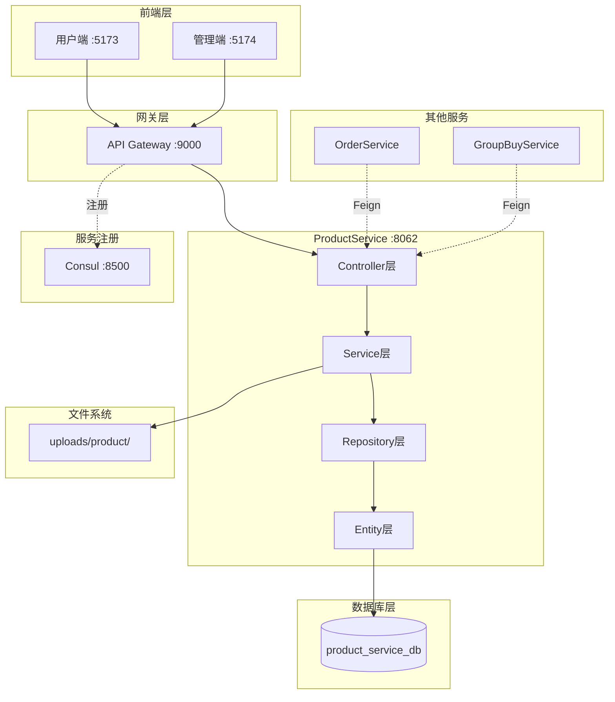
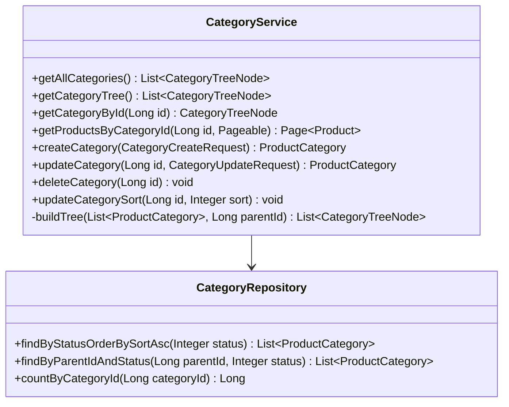
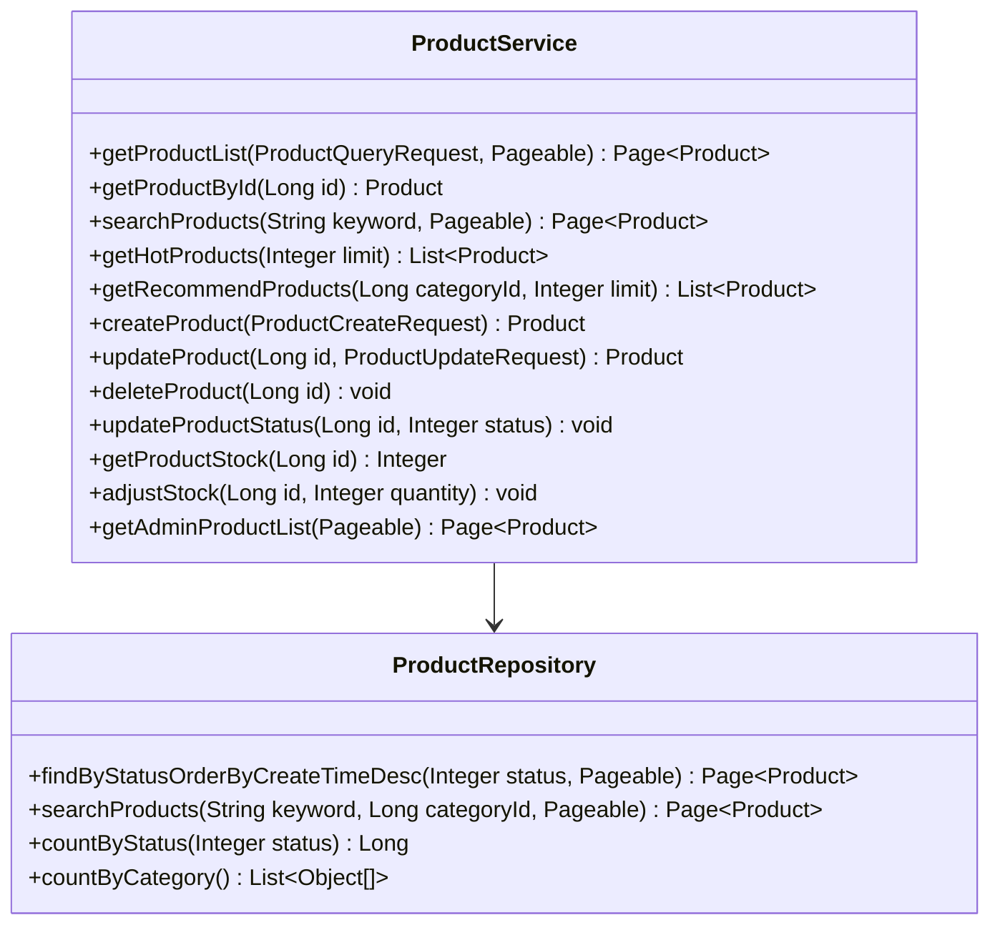
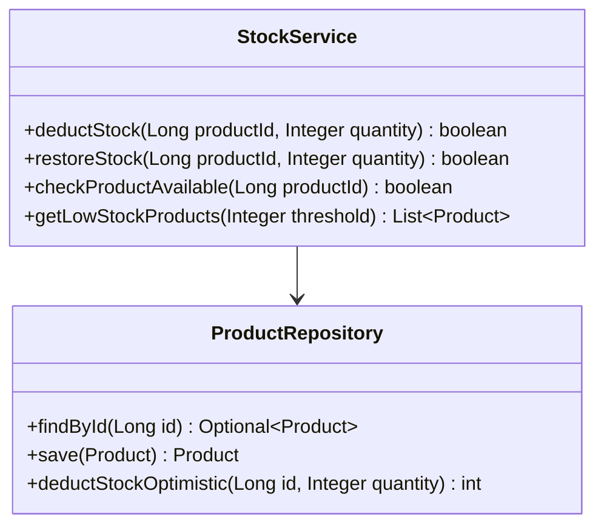
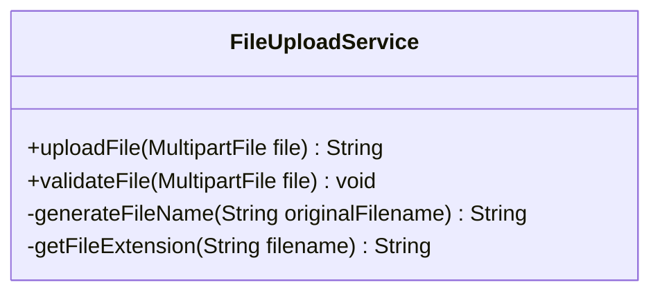
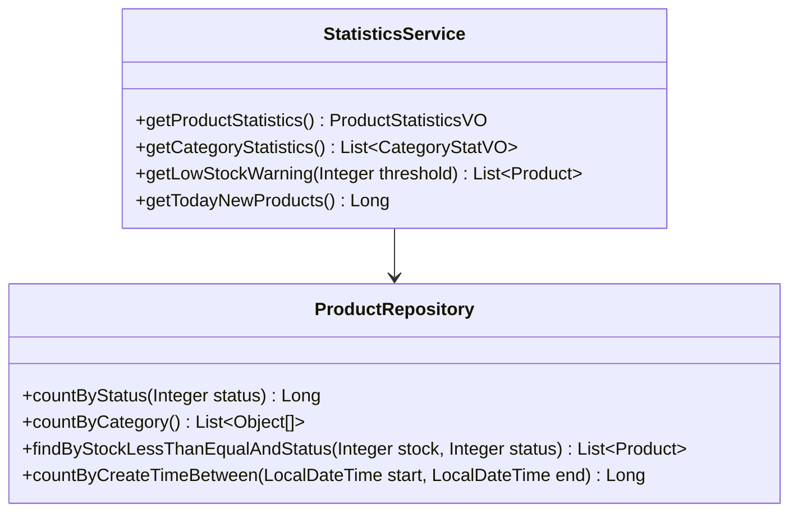
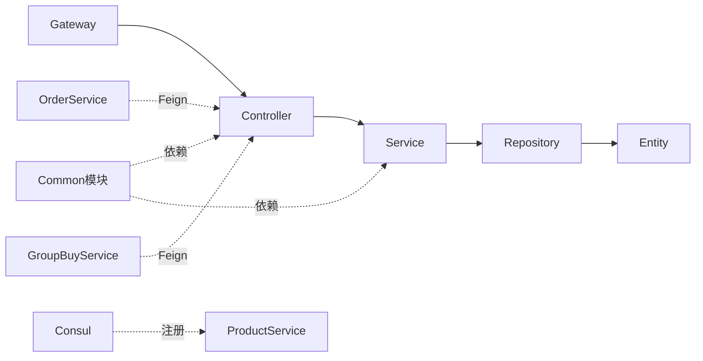
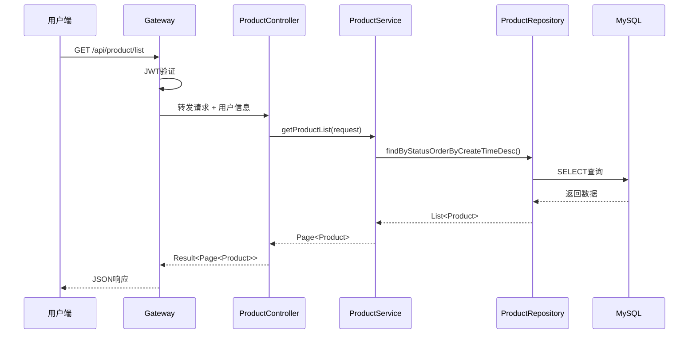
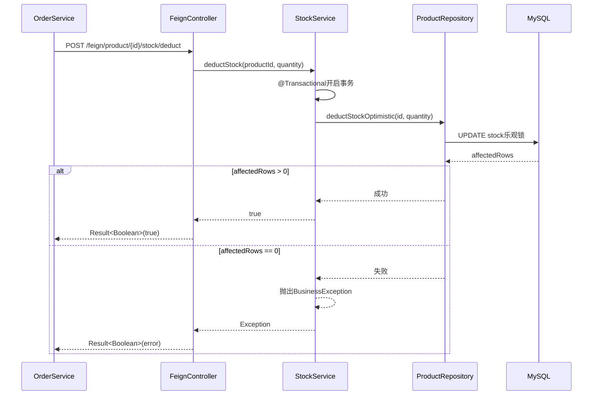
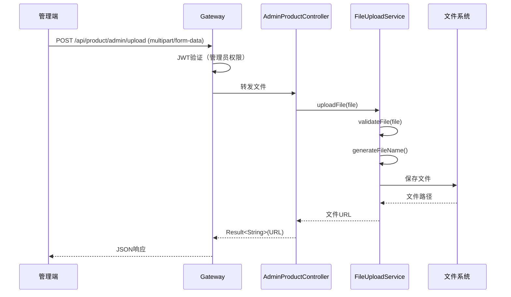

# ProductService 系统架构设计文档

**服务名称**: ProductService（商品服务）  
**设计版本**: v1.0.0  
**设计日期**: 2025-10-31  
**设计者**: 耿康瑞  
**基于文档**: ALIGNMENT_ProductService.md + 数据库设计v6.0

---

## 📑 目录

1. [整体架构](#整体架构)
2. [分层设计](#分层设计)
3. [核心组件](#核心组件)
4. [模块依赖关系](#模块依赖关系)
5. [接口契约定义](#接口契约定义)
6. [数据流向](#数据流向)
7. [异常处理策略](#异常处理策略)

---

## 整体架构

### 系统架构图



---

## 分层设计

### 1. Controller层（接口层）

**职责**：
- 接收HTTP请求
- 参数校验
- 调用Service层
- 返回统一响应格式

**组件清单**：
| Controller | 接口数 | 说明 |
|-----------|--------|------|
| CategoryController | 4个 | C端分类查询 |
| AdminCategoryController | 4个 | 管理端分类管理 |
| ProductController | 7个 | C端商品查询 |
| AdminProductController | 8个 | 管理端商品管理 |
| FeignController | 6个 | Feign内部接口 |

---

### 2. Service层（业务逻辑层）

**职责**：
- 业务逻辑处理
- 事务管理
- 数据校验
- 调用Repository层

**组件清单**：
| Service | 方法数 | 说明 |
|---------|--------|------|
| CategoryService | 8个 | 分类业务逻辑 |
| ProductService | 15个 | 商品业务逻辑 |
| StockService | 4个 | 库存管理 |
| FileUploadService | 2个 | 文件上传 |
| StatisticsService | 4个 | 商品统计 |

---

### 3. Repository层（数据访问层）

**职责**：
- 数据库CRUD操作
- 自定义查询
- JPA标准接口

**组件清单**：
| Repository | 继承 | 自定义查询 |
|-----------|------|----------|
| ProductCategoryRepository | JpaRepository | 5个 |
| ProductRepository | JpaRepository | 8个 |

---

### 4. Entity层（实体层）

**职责**：
- 映射数据库表
- 定义字段类型
- 配置索引和外键

**组件清单**：
| Entity | 对应表 | 字段数 |
|--------|--------|--------|
| ProductCategory | product_category | 5个 |
| Product | product | 11个 |

---

## 核心组件

### 1. CategoryService（分类服务）



**核心算法**：树形结构构建

```java
/**
 * 递归构建分类树
 * @param categories 所有分类列表
 * @param parentId 父分类ID
 * @return 树形结构列表
 */
private List<CategoryTreeNode> buildTree(
    List<ProductCategory> categories, 
    Long parentId
) {
    return categories.stream()
        .filter(c -> c.getParentId().equals(parentId))
        .map(c -> {
            CategoryTreeNode node = new CategoryTreeNode();
            node.setCategoryId(c.getCategoryId());
            node.setCategoryName(c.getCategoryName());
            node.setSort(c.getSort());
            node.setStatus(c.getStatus());
            // 递归获取子分类
            node.setChildren(buildTree(categories, c.getCategoryId()));
            return node;
        })
        .sorted(Comparator.comparing(CategoryTreeNode::getSort))
        .collect(Collectors.toList());
}
```

---

### 2. ProductService（商品服务）



---

### 3. StockService（库存服务）



**核心算法**：库存乐观锁扣减

```java
/**
 * 扣减库存（乐观锁）
 * @param productId 商品ID
 * @param quantity 扣减数量
 * @return 是否成功
 */
@Transactional
public boolean deductStock(Long productId, Integer quantity) {
    // 使用原生SQL实现乐观锁
    int affectedRows = productRepository.deductStockOptimistic(productId, quantity);
    
    if (affectedRows == 0) {
        // 库存不足或商品已下架
        throw new BusinessException("库存不足或商品已下架");
    }
    
    return true;
}
```

**Repository层SQL**：
```java
@Modifying
@Query(value = "UPDATE product SET stock = stock - :quantity " +
               "WHERE product_id = :productId " +
               "AND stock >= :quantity " +
               "AND status = 1", 
       nativeQuery = true)
int deductStockOptimistic(@Param("productId") Long productId, 
                          @Param("quantity") Integer quantity);
```

---

### 4. FileUploadService（文件上传服务）



**核心逻辑**：

```java
/**
 * 上传文件
 * @param file 上传的文件
 * @return 文件访问URL
 */
public String uploadFile(MultipartFile file) {
    // 1. 文件校验
    validateFile(file);
    
    // 2. 生成文件名
    String fileName = generateFileName(file.getOriginalFilename());
    
    // 3. 保存文件
    String uploadDir = "uploads/product/";
    File dir = new File(uploadDir);
    if (!dir.exists()) {
        dir.mkdirs();
    }
    
    File destFile = new File(uploadDir + fileName);
    file.transferTo(destFile);
    
    // 4. 返回访问URL
    return "http://localhost:8062/uploads/product/" + fileName;
}

/**
 * 生成文件名：yyyyMMddHHmmss_随机6位数字.扩展名
 */
private String generateFileName(String originalFilename) {
    String timestamp = LocalDateTime.now()
        .format(DateTimeFormatter.ofPattern("yyyyMMddHHmmss"));
    String random = String.format("%06d", new Random().nextInt(1000000));
    String extension = getFileExtension(originalFilename);
    return timestamp + "_" + random + extension;
}
```

---

### 5. StatisticsService（统计服务）



**统计数据结构**：

```java
public class ProductStatisticsVO {
    private Long totalProducts;        // 商品总数
    private Long onSaleProducts;       // 上架商品数
    private Long offSaleProducts;      // 下架商品数
    private Long lowStockProducts;     // 库存预警商品数
    private Long todayNewProducts;     // 今日新增商品数
    private List<CategoryStatVO> categoryStats;  // 分类统计
}

public class CategoryStatVO {
    private Long categoryId;
    private String categoryName;
    private Long productCount;
}
```

---

## 模块依赖关系



### 依赖说明

1. **Common模块依赖**：
   - `Result<T>` - 统一响应格式
   - `BusinessException` - 业务异常
   - `@OperationLog` - 操作日志注解
   - JWT工具类
   - 安全工具类

2. **Spring Boot依赖**：
   - spring-boot-starter-web
   - spring-boot-starter-data-jpa
   - mysql-connector-j

3. **Spring Cloud依赖**：
   - spring-cloud-starter-consul-discovery
   - spring-cloud-starter-openfeign

4. **文档依赖**：
   - springdoc-openapi-starter-webmvc-ui

---

## 接口契约定义

### 1. C端分类接口

#### 1.1 获取分类列表（树形）

**接口**: `GET /api/product/category/list`

**请求参数**: 无

**响应**:
```json
{
  "code": 200,
  "msg": "success",
  "data": [
    {
      "categoryId": 1,
      "categoryName": "生鲜水果",
      "sort": 1,
      "status": 1,
      "children": [
        {
          "categoryId": 11,
          "categoryName": "新鲜水果",
          "sort": 1,
          "status": 1,
          "children": []
        }
      ]
    }
  ]
}
```

---

### 2. C端商品接口

#### 2.1 商品列表（分页）

**接口**: `GET /api/product/list`

**请求参数**:
| 参数 | 类型 | 必填 | 说明 |
|------|------|------|------|
| categoryId | Long | 否 | 分类ID |
| keyword | String | 否 | 搜索关键词 |
| page | Integer | 否 | 页码（默认0） |
| size | Integer | 否 | 每页数量（默认10） |
| sort | String | 否 | 排序（price_asc/price_desc/create_time） |

**响应**:
```json
{
  "code": 200,
  "msg": "success",
  "data": {
    "content": [
      {
        "productId": 1,
        "categoryId": 11,
        "productName": "新鲜苹果",
        "coverImg": "http://localhost:8062/uploads/product/xxx.jpg",
        "price": 12.50,
        "groupPrice": 9.90,
        "stock": 100,
        "status": 1
      }
    ],
    "totalElements": 50,
    "totalPages": 5,
    "number": 0,
    "size": 10
  }
}
```

---

### 3. 管理端商品接口

#### 3.1 创建商品

**接口**: `POST /api/product/admin/product`

**请求头**: `Authorization: Bearer {token}`

**请求体**:
```json
{
  "categoryId": 11,
  "productName": "新鲜苹果",
  "coverImg": "http://localhost:8062/uploads/product/xxx.jpg",
  "detail": "<p>商品详情富文本</p>",
  "price": 12.50,
  "groupPrice": 9.90,
  "stock": 100
}
```

**响应**:
```json
{
  "code": 200,
  "msg": "success",
  "data": {
    "productId": 1,
    "categoryId": 11,
    "productName": "新鲜苹果",
    "coverImg": "http://localhost:8062/uploads/product/xxx.jpg",
    "detail": "<p>商品详情富文本</p>",
    "price": 12.50,
    "groupPrice": 9.90,
    "stock": 100,
    "status": 1,
    "createTime": "2025-10-31T10:00:00",
    "updateTime": null
  }
}
```

---

### 4. Feign内部接口

#### 4.1 扣减库存

**接口**: `POST /feign/product/{productId}/stock/deduct`

**请求参数**:
| 参数 | 类型 | 必填 | 说明 |
|------|------|------|------|
| productId | Long | 是 | 商品ID（路径参数） |
| quantity | Integer | 是 | 扣减数量（请求体） |

**请求体**:
```json
{
  "quantity": 5
}
```

**响应**:
```json
{
  "code": 200,
  "msg": "success",
  "data": true
}
```

**错误响应**:
```json
{
  "code": 400,
  "msg": "库存不足",
  "data": false
}
```

---

## 数据流向

### 1. 商品查询流程



---

### 2. 库存扣减流程（Feign调用）



---

### 3. 图片上传流程



---

## 异常处理策略

### 1. 异常分类

| 异常类型 | HTTP状态码 | 说明 | 处理方式 |
|---------|-----------|------|---------|
| 参数校验异常 | 400 | 请求参数错误 | 返回具体错误信息 |
| 业务异常 | 400 | 业务规则不满足 | 返回业务错误信息 |
| 资源不存在 | 404 | 商品/分类不存在 | 返回资源不存在 |
| 权限异常 | 403 | 无操作权限 | 返回权限不足 |
| 系统异常 | 500 | 未知错误 | 记录日志，返回统一错误 |

---

### 2. 具体异常处理

#### 2.1 商品不存在

```java
public Product getProductById(Long id) {
    return productRepository.findById(id)
        .orElseThrow(() -> new BusinessException("商品不存在: " + id));
}
```

#### 2.2 库存不足

```java
@Transactional
public boolean deductStock(Long productId, Integer quantity) {
    int affectedRows = productRepository.deductStockOptimistic(productId, quantity);
    if (affectedRows == 0) {
        throw new BusinessException("库存不足或商品已下架");
    }
    return true;
}
```

#### 2.3 分类删除校验

```java
public void deleteCategory(Long id) {
    // 检查是否有商品关联
    Long productCount = productRepository.countByCategoryId(id);
    if (productCount > 0) {
        throw new BusinessException("该分类下还有" + productCount + "个商品，无法删除");
    }
    categoryRepository.deleteById(id);
}
```

#### 2.4 文件上传校验

```java
private void validateFile(MultipartFile file) {
    // 文件为空
    if (file.isEmpty()) {
        throw new BusinessException("文件不能为空");
    }
    
    // 文件大小校验（5MB）
    if (file.getSize() > 5 * 1024 * 1024) {
        throw new BusinessException("文件大小不能超过5MB");
    }
    
    // 文件格式校验
    String extension = getFileExtension(file.getOriginalFilename());
    List<String> allowedExtensions = Arrays.asList(".jpg", ".jpeg", ".png", ".gif");
    if (!allowedExtensions.contains(extension.toLowerCase())) {
        throw new BusinessException("仅支持jpg、jpeg、png、gif格式的图片");
    }
}
```

---

### 3. 全局异常处理（继承Common模块）

```java
@RestControllerAdvice
public class GlobalExceptionHandler {
    
    @ExceptionHandler(BusinessException.class)
    public Result<Void> handleBusinessException(BusinessException e) {
        log.error("业务异常：{}", e.getMessage());
        return Result.error(e.getMessage());
    }
    
    @ExceptionHandler(MethodArgumentNotValidException.class)
    public Result<Void> handleValidationException(MethodArgumentNotValidException e) {
        String message = e.getBindingResult().getFieldError().getDefaultMessage();
        return Result.error("参数校验失败：" + message);
    }
    
    @ExceptionHandler(Exception.class)
    public Result<Void> handleException(Exception e) {
        log.error("系统异常：", e);
        return Result.error("系统繁忙，请稍后再试");
    }
}
```

---

## 性能优化策略

### 1. 数据库优化
- ✅ 合理使用索引（category_id, status, create_time）
- ✅ 分页查询避免全表扫描
- ✅ 使用JPA原生查询优化复杂查询

### 2. 查询优化
- ✅ 分类树构建在内存中进行（数据量小）
- ✅ 热门商品缓存（后期可引入Redis）
- ✅ 商品列表分页查询

### 3. 库存优化
- ✅ 数据库乐观锁避免超卖
- ✅ 库存扣减事务控制
- ✅ 后期可引入Redis预扣库存

---

## 实施后修正记录

### 配置层修正 (2025-10-31)

#### ProductWebConfig（原WebConfig）
**修正原因**: Bean命名冲突
- 原`WebConfig`类名与Common模块冲突
- 重命名为`ProductWebConfig`
- 删除CORS配置（遵循微服务最佳实践）

**当前配置**:
```java
@Configuration
public class ProductWebConfig implements WebMvcConfigurer {
    
    /**
     * 静态资源映射（图片上传）
     */
    @Override
    public void addResourceHandlers(ResourceHandlerRegistry registry) {
        registry.addResourceHandler("/uploads/**")
                .addResourceLocations("file:uploads/");
    }
    
    /**
     * ⚠️ CORS配置已删除
     * 使用API Gateway后，CORS统一在Gateway层配置
     * 业务服务不需要配置CORS，避免响应头重复导致跨域失败
     */
}
```

**微服务CORS架构**:
```
前端 (localhost:5173/5174)
    ↓
API Gateway (9000端口)
    ├─ ✅ CORS在这里配置
    ├─ 添加Access-Control-*响应头
    └─ 转发请求
        ↓
ProductService (8062端口)
    └─ ❌ 不配置CORS
```

**设计原则**:
1. **单一职责**: 只在网关层处理跨域
2. **避免冲突**: 多层CORS配置会导致响应头重复
3. **统一管理**: 所有微服务遵循相同规范

---

### 编译错误修正记录

#### 1. ProductRepository重复方法 ✅
- 删除第67行和第77行的重复方法声明
- 保留原有自定义查询功能

#### 2. @OperationLog注解 ✅
- 修正属性名：`operation` → `value`
- 影响9个注解（AdminCategoryController 4个 + AdminProductController 5个）

#### 3. Bean命名冲突 ✅
- 重命名：`WebConfig` → `ProductWebConfig`
- 删除CORS配置，符合微服务架构规范

---

**文档版本**: v1.1  
**设计完成日期**: 2025-10-31  
**最后修正**: 2025-10-31 17:30  
**状态**: ✅ 系统架构设计完成 + 实施修正完成

