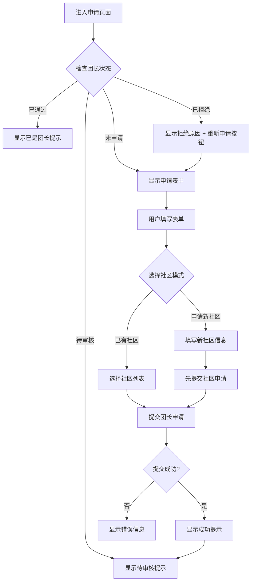

# 团长申请功能开发总结

**文档版本**: v1.0  
**创建日期**: 2025-10-31  
**开发人员**: AI Assistant  
**关联文档**: 
- 团长端业务逻辑文档.md
- LeaderService_API文档.md

---

## 📋 功能概述

实现了完整的团长申请功能，允许普通用户申请成为团长，包括选择已有社区或申请新社区两种模式。

### 核心特性

1. ✅ **双模式申请**：支持选择已有社区或申请新社区
2. ✅ **状态检测**：自动检测用户是否已是团长或已提交申请
3. ✅ **表单验证**：完整的前端表单验证，确保数据质量
4. ✅ **友好提示**：申请须知、状态提示、操作引导
5. ✅ **响应式设计**：适配移动端和PC端

---

## 📂 文件清单

### 新增文件

| 文件路径 | 说明 | 行数 |
|---------|------|------|
| `src/views/leader/LeaderApplyView.vue` | 团长申请页面主组件 | ~450 行 |
| `docs/社区团购系统/三级文档（归档）/团长申请功能开发总结.md` | 本开发总结文档 | - |

### 修改文件

| 文件路径 | 修改内容 | 变更行数 |
|---------|---------|---------|
| `src/router/index.js` | 新增 `/leader/apply` 路由 | +5 |
| `src/views/user/ProfileView.vue` | 添加"申请成为团长"入口卡片 | +55 |

### 依赖文件（已存在）

| 文件路径 | 说明 |
|---------|------|
| `src/api/leader.js` | LeaderService API 客户端（已完整） |
| `src/stores/user.js` | 用户状态管理（含 isLeader 判断） |

---

## 🎨 功能详解

### 1. 页面结构

```
LeaderApplyView.vue
├── 页面标题
├── 状态提示区（动态显示）
│   ├── 待审核提示
│   ├── 审核通过提示
│   └── 审核拒绝提示（含重新申请按钮）
├── 申请表单（状态允许时显示）
│   ├── 团点信息
│   │   ├── 团点名称
│   │   ├── 详细地址
│   │   └── 团点简介
│   ├── 社区选择
│   │   ├── 选择模式切换（已有社区 / 申请新社区）
│   │   ├── 已有社区下拉列表
│   │   └── 新社区申请表单
│   │       ├── 社区名称
│   │       ├── 社区地址
│   │       ├── 经纬度坐标（可选）
│   │       ├── 服务半径
│   │       └── 申请说明
│   └── 提交按钮
└── 申请须知卡片
```

### 2. 申请流程



### 3. 表单字段

#### 团点信息

| 字段 | 类型 | 必填 | 验证规则 | 说明 |
|-----|------|------|---------|------|
| storeName | String | ✅ | 2-50字符 | 团点名称 |
| address | String | ✅ | 5-200字符 | 详细地址 |
| description | String | ❌ | 最多500字符 | 团点简介 |

#### 社区选择（模式1：选择已有社区）

| 字段 | 类型 | 必填 | 说明 |
|-----|------|------|------|
| communityId | Number | ✅ | 从社区列表选择 |

#### 社区选择（模式2：申请新社区）

| 字段 | 类型 | 必填 | 验证规则 | 说明 |
|-----|------|------|---------|------|
| communityName | String | ✅ | 2-50字符 | 社区名称 |
| address | String | ✅ | 5-200字符 | 社区地址 |
| latitude | Number | ❌ | - | 纬度，可由管理员补充 |
| longitude | Number | ❌ | - | 经度，可由管理员补充 |
| serviceRadius | Number | ✅ | 500-10000 | 服务半径（米） |
| applicationReason | String | ✅ | - | 申请说明 |

### 4. API 调用

#### 页面加载时

```javascript
// 1. 获取我的团长信息（检查状态）
GET /api/leader/my?userId={userId}

// 2. 获取社区列表（用于下拉选择）
GET /api/community/list
```

#### 提交申请时

**场景1：选择已有社区**

```javascript
POST /api/leader/apply
Body: {
  leaderId: 1,
  leaderName: "张三",
  leaderPhone: "13800138000",
  communityId: 1,
  storeName: "张三团购点",
  address: "阳光小区1号楼101",
  description: "提供优质团购服务"
}
```

**场景2：申请新社区**

```javascript
// 第一步：提交社区申请
POST /api/community-application
Body: {
  applicantId: 1,
  applicantName: "张三",
  applicantPhone: "13800138000",
  communityName: "新社区名称",
  address: "北京市朝阳区...",
  latitude: 39.9042,
  longitude: 116.4074,
  serviceRadius: 3000,
  description: "社区简介",
  applicationReason: "申请理由"
}

// 第二步：提交团长申请（communityId为null）
POST /api/leader/apply
Body: {
  leaderId: 1,
  leaderName: "张三",
  leaderPhone: "13800138000",
  communityId: null,  // 新社区申请时为null
  storeName: "张三团购点",
  address: "阳光小区1号楼101",
  description: "提供优质团购服务"
}
```

---

## 🚀 入口位置

### 1. 个人中心页面（ProfileView.vue）

**普通用户**看到的"申请成为团长"卡片：

```
┌──────────────────────────────────────────────────────┐
│  ⭐  成为团长，开启收益之旅                             │
│      发起拼团活动，赚取订单佣金，服务社区居民           │
│                                          [立即申请 >]  │
└──────────────────────────────────────────────────────┘
```

- **位置**：个人中心页面，常规功能区块下方
- **显示条件**：`!userStore.isLeader`（非团长用户）
- **点击跳转**：`/leader/apply`

### 2. 路由配置

```javascript
{
  path: '/leader/apply',
  name: 'leaderApply',
  component: () => import('../views/leader/LeaderApplyView.vue'),
  meta: { 
    title: '申请成为团长', 
    requireAuth: true  // 仅需登录，无需团长权限
  }
}
```

---

## 🎯 业务逻辑

### 1. 状态检测逻辑

```javascript
// 页面加载时调用
const fetchMyLeaderInfo = async () => {
  try {
    const data = await getMyLeaderInfo(userStore.userInfo.userId)
    leaderInfo.value = data  // 设置团长信息
    
    // data.status:
    // 0 - 待审核：显示"申请已提交"提示
    // 1 - 正常运营：显示"已是团长"提示
    // 2 - 已停用：显示"审核拒绝"提示 + 重新申请按钮
  } catch (error) {
    if (error.response?.status === 404) {
      leaderInfo.value = null  // 用户还不是团长，显示申请表单
    }
  }
}
```

### 2. 提交验证逻辑

```javascript
const handleSubmit = async () => {
  // 1. 前端表单验证
  await formRef.value.validate()
  
  // 2. 二次确认
  await ElMessageBox.confirm('确定要提交团长申请吗？', '确认提交')
  
  // 3. 如果申请新社区，先提交社区申请
  if (communityMode.value === 'new') {
    await submitCommunityApplication(communityAppData)
  }
  
  // 4. 提交团长申请
  await submitLeaderApplication(leaderAppData)
  
  // 5. 刷新状态
  await fetchMyLeaderInfo()
}
```

### 3. 重新申请逻辑

当用户申请被拒绝后，可点击"重新申请"按钮：

```javascript
const resetAndReapply = () => {
  leaderInfo.value = null  // 清空状态
  formRef.value?.resetFields()  // 重置表单
}
```

---

## 🎨 UI/UX 设计

### 1. 状态提示卡片

| 状态 | 类型 | 标题 | 描述 |
|-----|------|------|------|
| 待审核 | info | 您已提交团长申请 | 您的申请正在审核中，请耐心等待... |
| 已通过 | success | 您已经是团长了 | 您的团长申请已通过审核，现在可以发起拼团... |
| 已拒绝 | error | 您的团长申请已被拒绝 | 拒绝原因：{reason}，含重新申请按钮 |

### 2. 申请须知

```
📋 请如实填写团点信息，管理员会进行核实
🏘️ 一个团长只能服务一个社区
⚡ 审核通过后，您将获得发起拼团的权限
💰 每笔成功的团购订单，您将获得相应的佣金
📦 您需要负责本社区订单的配送或协调配送
⏰ 申请提交后，请耐心等待管理员审核（通常1-3个工作日）
📞 如有疑问，请联系客服：400-XXX-XXXX
```

### 3. 响应式设计

- **PC端**：表单标签宽度 120px，最大宽度 900px
- **移动端**：表单标签宽度 100px，全屏显示
- **交互反馈**：
  - 提交时显示 loading 状态
  - 成功后显示成功提示
  - 失败后显示错误信息

---

## 🔒 权限控制

| 页面/功能 | 权限要求 | 说明 |
|----------|---------|------|
| 访问申请页面 | `requireAuth: true` | 仅需登录 |
| 查看入口 | `!isLeader` | 非团长用户可见 |
| 提交申请 | 已登录 | 自动获取用户信息 |

---

## ✅ 功能验收清单

### 基础功能

- [x] 页面正常加载
- [x] 自动检测用户团长状态
- [x] 获取并显示社区列表
- [x] 表单验证正常工作
- [x] 提交申请成功
- [x] 提交申请失败时显示错误提示

### 业务逻辑

- [x] 普通用户可进入申请页面
- [x] 待审核用户看到待审核提示
- [x] 已是团长的用户看到通过提示
- [x] 被拒绝用户可重新申请
- [x] 选择已有社区时，communityId必填
- [x] 申请新社区时，社区信息必填
- [x] 申请新社区时，先提交社区申请再提交团长申请

### UI/UX

- [x] 状态提示清晰易懂
- [x] 表单布局合理
- [x] 验证错误提示准确
- [x] 提交按钮loading状态
- [x] 二次确认提示
- [x] 申请须知卡片
- [x] 响应式设计适配移动端

### 入口完整性

- [x] 个人中心页面显示"申请成为团长"卡片（普通用户）
- [x] 卡片点击跳转到申请页面
- [x] 路由配置正确
- [x] 页面标题正确

---

## 📊 代码统计

| 文件 | 新增行数 | 修改行数 | 说明 |
|-----|---------|---------|------|
| LeaderApplyView.vue | 449 | 0 | 新建文件 |
| router/index.js | 5 | 0 | 新增路由 |
| ProfileView.vue | 55 | 5 | 新增入口卡片 |
| **总计** | **509** | **5** | - |

---

## 🐛 已知问题

暂无已知问题。

---

## 🔮 后续优化建议

1. **地图选点功能**：集成地图API，支持用户在地图上选择社区位置和团点位置
2. **图片上传**：支持上传团点照片和营业执照
3. **实时通知**：申请审核结果通过消息通知推送给用户
4. **申请进度查询**：显示申请的审核进度（已提交 → 审核中 → 已完成）
5. **历史申请记录**：支持查看所有申请历史（包括被拒绝的）
6. **模板填写**：提供申请说明的模板或示例
7. **社区搜索**：社区列表支持关键词搜索和地图筛选

---

## 📝 开发笔记

### 技术要点

1. **组合式API**：使用 Vue 3 Composition API
2. **响应式数据**：使用 `ref` 和 `reactive` 管理状态
3. **表单验证**：Element Plus 表单验证机制
4. **异步处理**：`async/await` 处理 API 调用
5. **状态管理**：使用 Pinia 的 `useUserStore`

### 注意事项

1. **申请新社区时的处理**：
   - 先调用社区申请API，但不等待审核结果
   - 然后提交团长申请，`communityId` 设为 `null`
   - 管理员会先审核社区申请，通过后再审核团长申请

2. **权限控制**：
   - 申请页面只需登录权限（`requireAuth`）
   - 不需要团长权限（`requiresLeader`）
   - 页面内部根据状态控制显示内容

3. **用户体验**：
   - 使用二次确认避免误操作
   - 提供清晰的状态提示
   - 表单验证即时反馈
   - 申请须知帮助用户理解流程

---

## 🎉 完成标志

✅ 团长申请页面已完整开发并集成到系统中

- 页面组件完成
- 路由配置完成
- 入口添加完成
- API 调用完成
- 状态管理完成
- UI/UX 优化完成
- 文档编写完成

**下一步**：等待后端 LeaderService 完成部署，进行联调测试。

---

**文档维护者**: AI Assistant  
**最后更新**: 2025-10-31

