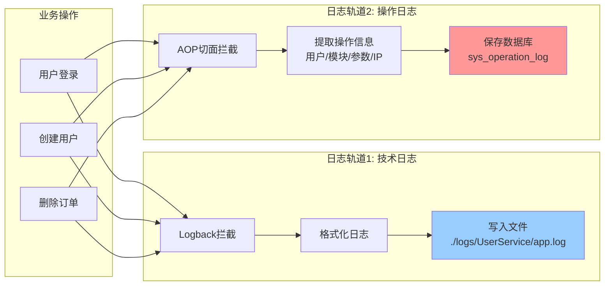
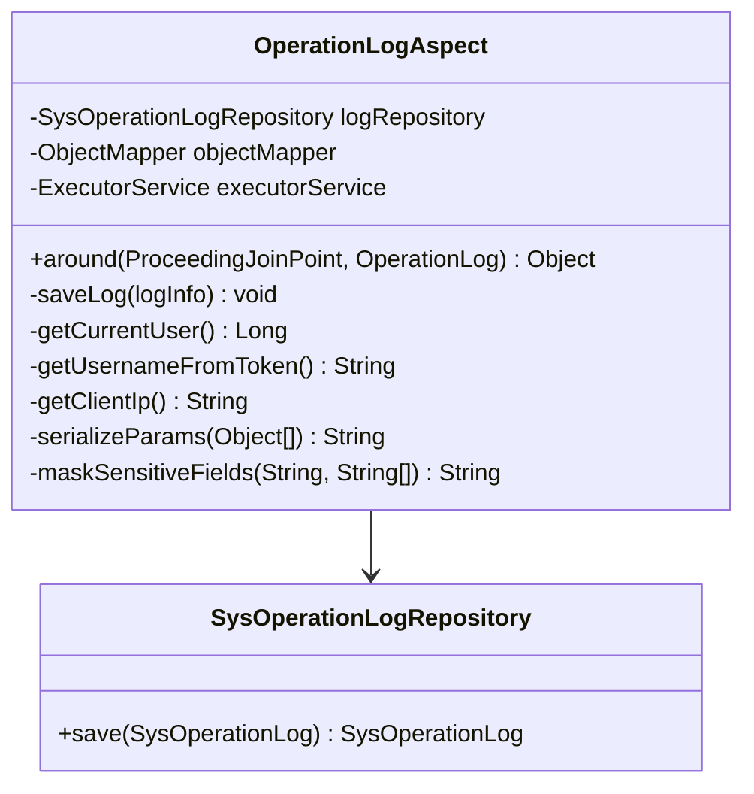
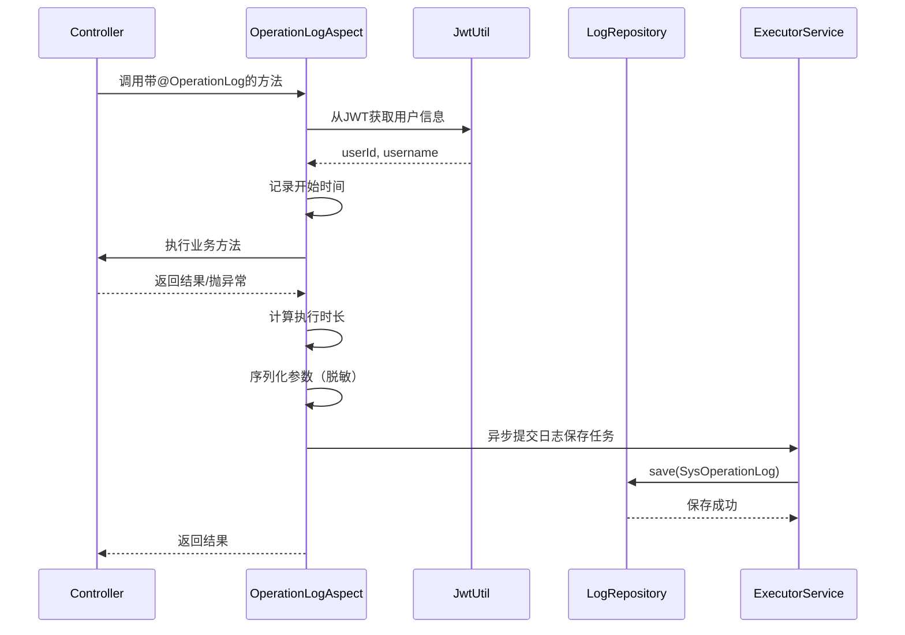
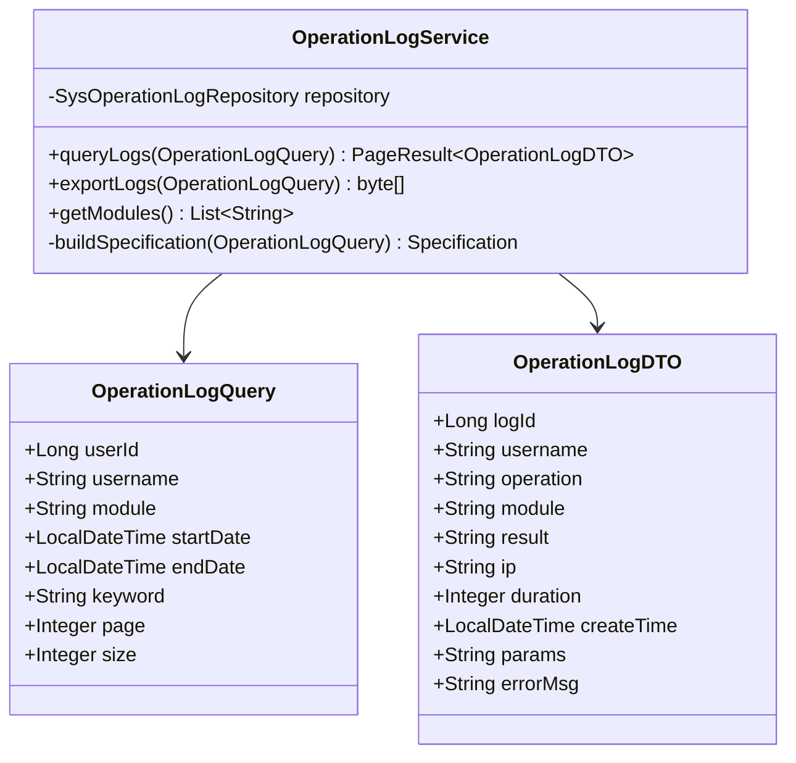
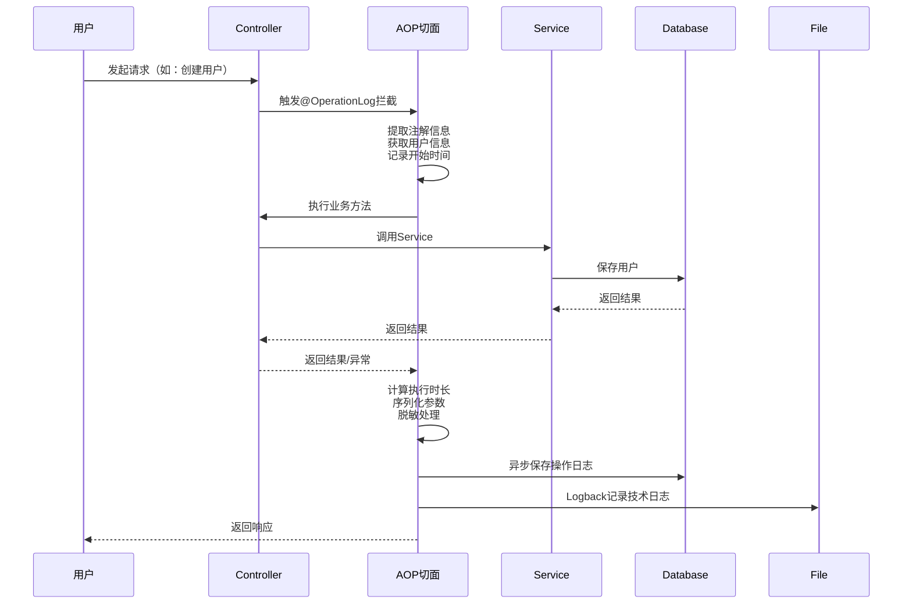
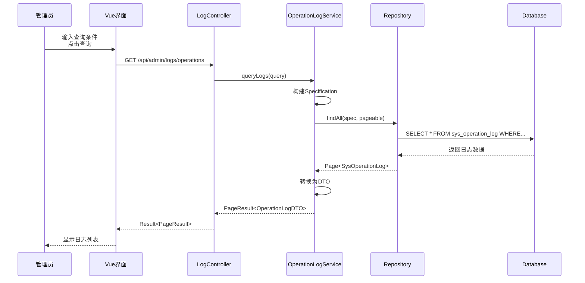
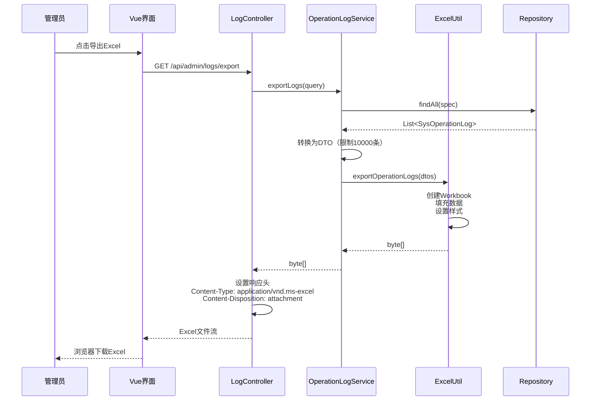

# 社区团购系统 - 日志系统架构设计文档 (DESIGN)

**任务名称**: 双轨制日志系统  
**创建时间**: 2025-10-14  
**版本**: v1.0  
**基于文档**: ALIGNMENT_日志系统.md

---

## 1. 整体架构设计

### 1.1 系统架构图

```mermaid
graph TB
    subgraph "前端层"
        A[管理后台 - 日志管理界面]
    end
    
    subgraph "接口层"
        B[LogController<br/>日志查询/导出API]
    end
    
    subgraph "业务层"
        C[OperationLogService<br/>日志查询/导出服务]
        D[OperationLogAspect<br/>AOP切面]
    end
    
    subgraph "数据层"
        E[SysOperationLogRepository<br/>JPA Repository]
        F[(sys_operation_log表)]
    end
    
    subgraph "基础设施层"
        G[Logback配置<br/>技术日志]
        H[文件系统<br/>./logs/服务名/]
    end
    
    subgraph "业务服务"
        I[UserController<br/>@OperationLog注解]
        J[其他Controller<br/>@OperationLog注解]
    end
    
    A -->|HTTP请求| B
    B --> C
    C --> E
    E --> F
    
    D -.->|拦截| I
    D -.->|拦截| J
    D -->|异步保存| E
    
    I --> G
    J --> G
    G --> H
    
    style D fill:#ff9999
    style G fill:#99ccff
```

### 1.2 双轨制日志架构



---

## 2. 模块设计

### 2.1 Common模块扩展

#### 2.1.1 目录结构
```
common/
├── src/main/
│   ├── java/com/bcu/edu/common/
│   │   ├── annotation/              # 新增
│   │   │   └── OperationLog.java
│   │   ├── aspect/                  # 新增
│   │   │   └── OperationLogAspect.java
│   │   ├── entity/                  # 新增
│   │   │   └── SysOperationLog.java
│   │   ├── repository/              # 新增
│   │   │   └── SysOperationLogRepository.java
│   │   ├── service/                 # 新增
│   │   │   └── OperationLogService.java
│   │   ├── utils/                   # 扩展
│   │   │   ├── ExcelUtil.java       # 新增：Excel导出工具
│   │   │   └── IpUtil.java          # 新增：IP地址获取工具
│   │   └── dto/                     # 新增
│   │       ├── OperationLogDTO.java
│   │       └── OperationLogQuery.java
│   └── resources/
│       └── logback-spring.xml       # 新增
└── pom.xml                          # 添加AOP、POI依赖
```

#### 2.1.2 新增依赖
```xml
<!-- Spring AOP -->
<dependency>
    <groupId>org.springframework.boot</groupId>
    <artifactId>spring-boot-starter-aop</artifactId>
</dependency>

<!-- Apache POI（Excel导出） -->
<dependency>
    <groupId>org.apache.poi</groupId>
    <artifactId>poi-ooxml</artifactId>
    <version>5.2.5</version>
</dependency>

<!-- Servlet API（获取Request对象） -->
<dependency>
    <groupId>jakarta.servlet</groupId>
    <artifactId>jakarta.servlet-api</artifactId>
    <scope>provided</scope>
</dependency>
```

### 2.2 日志查询服务模块

#### 2.2.1 放置位置选择

**选项A: 在Common模块**（推荐 ⭐）
- 优点：所有服务都能访问，统一管理
- 缺点：Common模块职责略多

**选项B: 创建独立AdminService**
- 优点：职责清晰，管理功能集中
- 缺点：需要新建服务，增加复杂度

**选择：选项A**，在Common模块添加LogController

#### 2.2.2 模块结构
```
common/
└── src/main/java/com/bcu/edu/common/
    ├── controller/
    │   └── LogController.java       # 新增：日志查询控制器
    ├── service/
    │   └── OperationLogService.java # 日志业务逻辑
    └── dto/
        ├── OperationLogDTO.java     # 日志返回DTO
        └── OperationLogQuery.java   # 日志查询条件
```

---

## 3. 核心组件设计

### 3.1 Logback配置设计

#### 3.1.1 配置文件：logback-spring.xml
```xml
<?xml version="1.0" encoding="UTF-8"?>
<configuration>
    <!-- 引入Spring Boot默认配置 -->
    <include resource="org/springframework/boot/logging/logback/defaults.xml"/>
    
    <!-- 属性定义 -->
    <springProperty scope="context" name="APP_NAME" source="spring.application.name"/>
    <property name="LOG_HOME" value="./logs/${APP_NAME}"/>
    <property name="LOG_PATTERN" 
              value="[%d{yyyy-MM-dd HH:mm:ss.SSS}] [%-5level] [${APP_NAME}] [%thread] [%logger{50}:%line] - %msg%n"/>
    
    <!-- 控制台输出 -->
    <appender name="CONSOLE" class="ch.qos.logback.core.ConsoleAppender">
        <encoder>
            <pattern>${LOG_PATTERN}</pattern>
            <charset>UTF-8</charset>
        </encoder>
    </appender>
    
    <!-- 文件输出 - INFO级别 -->
    <appender name="FILE_INFO" class="ch.qos.logback.core.rolling.RollingFileAppender">
        <file>${LOG_HOME}/${APP_NAME}.log</file>
        <filter class="ch.qos.logback.classic.filter.LevelFilter">
            <level>INFO</level>
            <onMatch>ACCEPT</onMatch>
            <onMismatch>DENY</onMismatch>
        </filter>
        <rollingPolicy class="ch.qos.logback.core.rolling.SizeAndTimeBasedRollingPolicy">
            <fileNamePattern>${LOG_HOME}/%d{yyyy-MM-dd}.%i.log</fileNamePattern>
            <maxFileSize>100MB</maxFileSize>
            <maxHistory>30</maxHistory>
            <totalSizeCap>10GB</totalSizeCap>
        </rollingPolicy>
        <encoder>
            <pattern>${LOG_PATTERN}</pattern>
            <charset>UTF-8</charset>
        </encoder>
    </appender>
    
    <!-- 文件输出 - ERROR级别 -->
    <appender name="FILE_ERROR" class="ch.qos.logback.core.rolling.RollingFileAppender">
        <file>${LOG_HOME}/${APP_NAME}-error.log</file>
        <filter class="ch.qos.logback.classic.filter.ThresholdFilter">
            <level>ERROR</level>
        </filter>
        <rollingPolicy class="ch.qos.logback.core.rolling.SizeAndTimeBasedRollingPolicy">
            <fileNamePattern>${LOG_HOME}/%d{yyyy-MM-dd}-error.%i.log</fileNamePattern>
            <maxFileSize>100MB</maxFileSize>
            <maxHistory>30</maxHistory>
        </rollingPolicy>
        <encoder>
            <pattern>${LOG_PATTERN}</pattern>
            <charset>UTF-8</charset>
        </encoder>
    </appender>
    
    <!-- 异步输出（提升性能） -->
    <appender name="ASYNC_FILE" class="ch.qos.logback.classic.AsyncAppender">
        <appender-ref ref="FILE_INFO"/>
        <queueSize>512</queueSize>
    </appender>
    
    <!-- 日志级别配置 -->
    <logger name="com.bcu.edu" level="DEBUG"/>
    <logger name="org.hibernate.SQL" level="DEBUG"/>
    <logger name="org.hibernate.type.descriptor.sql.BasicBinder" level="TRACE"/>
    <logger name="org.springframework" level="INFO"/>
    <logger name="org.springframework.web" level="DEBUG"/>
    
    <!-- 根日志 -->
    <root level="INFO">
        <appender-ref ref="CONSOLE"/>
        <appender-ref ref="ASYNC_FILE"/>
        <appender-ref ref="FILE_ERROR"/>
    </root>
</configuration>
```

#### 3.1.2 日志文件结构
```
./logs/
├── UserService/
│   ├── UserService.log              # 当前日志
│   ├── UserService-error.log        # 当前错误日志
│   ├── 2025-10-14.0.log            # 历史日志
│   ├── 2025-10-14.1.log            # 超过100MB拆分
│   └── 2025-10-14-error.0.log      # 历史错误日志
├── ProductService/
│   └── ...
└── OrderService/
    └── ...
```

### 3.2 操作日志注解设计

#### 3.2.1 @OperationLog注解
```java
package com.bcu.edu.common.annotation;

import java.lang.annotation.*;

@Target(ElementType.METHOD)
@Retention(RetentionPolicy.RUNTIME)
@Documented
public @interface OperationLog {
    /**
     * 操作内容描述
     * 示例: "创建用户", "删除订单"
     */
    String value();
    
    /**
     * 操作模块
     * 示例: "用户管理", "订单管理"
     */
    String module() default "";
    
    /**
     * 是否记录请求参数
     * 默认true
     */
    boolean recordParams() default true;
    
    /**
     * 是否记录返回结果
     * 默认false（仅失败时记录）
     */
    boolean recordResult() default false;
    
    /**
     * 敏感参数字段（不记录详情）
     * 示例: {"password", "token"}
     */
    String[] sensitiveFields() default {"password", "token", "secret"};
}
```

### 3.3 AOP切面设计

#### 3.3.1 OperationLogAspect类图


#### 3.3.2 核心逻辑流程


#### 3.3.3 参数脱敏逻辑
```java
private String maskSensitiveFields(String json, String[] sensitiveFields) {
    JSONObject jsonObj = JSON.parseObject(json);
    for (String field : sensitiveFields) {
        if (jsonObj.containsKey(field)) {
            jsonObj.put(field, "***");
        }
    }
    return jsonObj.toJSONString();
}
```

### 3.4 数据库实体设计

#### 3.4.1 SysOperationLog实体
```java
@Entity
@Table(name = "sys_operation_log", indexes = {
    @Index(name = "idx_user_id", columnList = "user_id"),
    @Index(name = "idx_module", columnList = "module"),
    @Index(name = "idx_create_time", columnList = "create_time")
})
@Data
@NoArgsConstructor
public class SysOperationLog {
    @Id
    @GeneratedValue(strategy = GenerationType.IDENTITY)
    private Long logId;
    
    private Long userId;           // 操作人ID
    private String username;       // 操作人用户名
    private String operation;      // 操作内容
    private String module;         // 操作模块
    private String method;         // 方法名
    
    @Column(columnDefinition = "TEXT")
    private String params;         // 请求参数（JSON）
    
    private String result;         // 操作结果：SUCCESS/FAIL
    
    @Column(columnDefinition = "TEXT")
    private String errorMsg;       // 错误信息
    
    private Integer duration;      // 执行时长（毫秒）
    private String ip;             // 操作IP
    
    @Column(name = "create_time", updatable = false)
    private LocalDateTime createTime;
    
    @PrePersist
    protected void onCreate() {
        createTime = LocalDateTime.now();
    }
}
```

### 3.5 日志查询服务设计

#### 3.5.1 OperationLogService类图


#### 3.5.2 查询条件构建（JPA Specification）
```java
private Specification<SysOperationLog> buildSpecification(OperationLogQuery query) {
    return (root, criteriaQuery, criteriaBuilder) -> {
        List<Predicate> predicates = new ArrayList<>();
        
        if (query.getUserId() != null) {
            predicates.add(criteriaBuilder.equal(root.get("userId"), query.getUserId()));
        }
        
        if (StringUtils.hasText(query.getUsername())) {
            predicates.add(criteriaBuilder.like(root.get("username"), "%" + query.getUsername() + "%"));
        }
        
        if (StringUtils.hasText(query.getModule())) {
            predicates.add(criteriaBuilder.equal(root.get("module"), query.getModule()));
        }
        
        if (query.getStartDate() != null) {
            predicates.add(criteriaBuilder.greaterThanOrEqualTo(root.get("createTime"), query.getStartDate()));
        }
        
        if (query.getEndDate() != null) {
            predicates.add(criteriaBuilder.lessThanOrEqualTo(root.get("createTime"), query.getEndDate()));
        }
        
        if (StringUtils.hasText(query.getKeyword())) {
            predicates.add(criteriaBuilder.like(root.get("operation"), "%" + query.getKeyword() + "%"));
        }
        
        return criteriaBuilder.and(predicates.toArray(new Predicate[0]));
    };
}
```

### 3.6 Excel导出设计

#### 3.6.1 ExcelUtil工具类
```java
public class ExcelUtil {
    public static byte[] exportOperationLogs(List<OperationLogDTO> logs) {
        XSSFWorkbook workbook = new XSSFWorkbook();
        XSSFSheet sheet = workbook.createSheet("操作日志");
        
        // 创建表头
        Row headerRow = sheet.createRow(0);
        String[] headers = {"操作时间", "操作人", "操作内容", "操作模块", "操作结果", "IP地址", "执行时长(ms)", "错误信息"};
        for (int i = 0; i < headers.length; i++) {
            Cell cell = headerRow.createCell(i);
            cell.setCellValue(headers[i]);
        }
        
        // 填充数据
        for (int i = 0; i < logs.size(); i++) {
            Row row = sheet.createRow(i + 1);
            OperationLogDTO log = logs.get(i);
            row.createCell(0).setCellValue(log.getCreateTime().format(DateTimeFormatter.ofPattern("yyyy-MM-dd HH:mm:ss")));
            row.createCell(1).setCellValue(log.getUsername());
            row.createCell(2).setCellValue(log.getOperation());
            row.createCell(3).setCellValue(log.getModule());
            row.createCell(4).setCellValue(log.getResult());
            row.createCell(5).setCellValue(log.getIp());
            row.createCell(6).setCellValue(log.getDuration());
            row.createCell(7).setCellValue(log.getErrorMsg());
        }
        
        // 自动调整列宽
        for (int i = 0; i < headers.length; i++) {
            sheet.autoSizeColumn(i);
        }
        
        // 转为byte[]
        ByteArrayOutputStream baos = new ByteArrayOutputStream();
        workbook.write(baos);
        return baos.toByteArray();
    }
}
```

---

## 4. 接口设计

### 4.1 LogController API

#### 4.1.1 查询操作日志（分页）
```java
@GetMapping("/api/admin/logs/operations")
@Operation(summary = "分页查询操作日志")
public Result<PageResult<OperationLogDTO>> queryLogs(
    @RequestParam(required = false) Long userId,
    @RequestParam(required = false) String username,
    @RequestParam(required = false) String module,
    @RequestParam(required = false) @DateTimeFormat(iso = DateTimeFormat.ISO.DATE_TIME) LocalDateTime startDate,
    @RequestParam(required = false) @DateTimeFormat(iso = DateTimeFormat.ISO.DATE_TIME) LocalDateTime endDate,
    @RequestParam(required = false) String keyword,
    @RequestParam(defaultValue = "1") Integer page,
    @RequestParam(defaultValue = "10") Integer size
)
```

**请求示例**:
```
GET /api/admin/logs/operations?module=用户管理&startDate=2025-10-01T00:00:00&endDate=2025-10-14T23:59:59&page=1&size=10
```

**响应示例**:
```json
{
  "code": 200,
  "message": "操作成功",
  "data": {
    "total": 100,
    "pageNum": 1,
    "pageSize": 10,
    "pages": 10,
    "list": [
      {
        "logId": 123,
        "username": "admin",
        "operation": "创建用户",
        "module": "用户管理",
        "result": "SUCCESS",
        "ip": "192.168.1.100",
        "duration": 120,
        "createTime": "2025-10-14T10:30:00",
        "params": "{\"username\":\"test\",\"role\":1}",
        "errorMsg": null
      }
    ]
  }
}
```

#### 4.1.2 导出操作日志（Excel）
```java
@GetMapping("/api/admin/logs/export")
@Operation(summary = "导出操作日志为Excel")
public void exportLogs(
    @RequestParam(required = false) Long userId,
    @RequestParam(required = false) String module,
    @RequestParam(required = false) @DateTimeFormat(iso = DateTimeFormat.ISO.DATE_TIME) LocalDateTime startDate,
    @RequestParam(required = false) @DateTimeFormat(iso = DateTimeFormat.ISO.DATE_TIME) LocalDateTime endDate,
    HttpServletResponse response
) throws IOException
```

**请求示例**:
```
GET /api/admin/logs/export?module=用户管理&startDate=2025-10-01T00:00:00&endDate=2025-10-14T23:59:59
```

**响应**: Excel文件流（application/vnd.ms-excel）

#### 4.1.3 查询操作模块列表
```java
@GetMapping("/api/admin/logs/modules")
@Operation(summary = "获取所有操作模块列表")
public Result<List<String>> getModules()
```

**响应示例**:
```json
{
  "code": 200,
  "message": "操作成功",
  "data": ["用户管理", "反馈管理", "订单管理", "商品管理"]
}
```

---

## 5. 前端界面设计

### 5.1 LogManageView.vue页面结构

```vue
<template>
  <div class="log-manage">
    <!-- 筛选条件 -->
    <el-card class="filter-card">
      <el-form :inline="true" :model="queryForm">
        <el-form-item label="操作人">
          <el-input v-model="queryForm.username" placeholder="请输入用户名" clearable />
        </el-form-item>
        <el-form-item label="操作模块">
          <el-select v-model="queryForm.module" placeholder="请选择" clearable>
            <el-option v-for="m in modules" :key="m" :label="m" :value="m" />
          </el-select>
        </el-form-item>
        <el-form-item label="时间范围">
          <el-date-picker
            v-model="dateRange"
            type="datetimerange"
            range-separator="至"
            start-placeholder="开始时间"
            end-placeholder="结束时间"
          />
        </el-form-item>
        <el-form-item label="关键词">
          <el-input v-model="queryForm.keyword" placeholder="操作内容关键词" clearable />
        </el-form-item>
        <el-form-item>
          <el-button type="primary" @click="handleQuery">查询</el-button>
          <el-button @click="handleReset">重置</el-button>
          <el-button type="success" @click="handleExport">导出Excel</el-button>
        </el-form-item>
      </el-form>
    </el-card>

    <!-- 数据表格 -->
    <el-card class="table-card">
      <el-table :data="logList" stripe>
        <el-table-column prop="createTime" label="操作时间" width="180" />
        <el-table-column prop="username" label="操作人" width="120" />
        <el-table-column prop="operation" label="操作内容" width="150" />
        <el-table-column prop="module" label="操作模块" width="120" />
        <el-table-column prop="result" label="操作结果" width="100">
          <template #default="scope">
            <el-tag :type="scope.row.result === 'SUCCESS' ? 'success' : 'danger'">
              {{ scope.row.result === 'SUCCESS' ? '成功' : '失败' }}
            </el-tag>
          </template>
        </el-table-column>
        <el-table-column prop="ip" label="IP地址" width="140" />
        <el-table-column prop="duration" label="耗时(ms)" width="100" />
        <el-table-column label="操作" width="100" fixed="right">
          <template #default="scope">
            <el-button type="primary" link @click="handleDetail(scope.row)">详情</el-button>
          </template>
        </el-table-column>
      </el-table>

      <!-- 分页 -->
      <el-pagination
        v-model:current-page="queryForm.page"
        v-model:page-size="queryForm.size"
        :total="total"
        @current-change="handleQuery"
        @size-change="handleQuery"
        layout="total, sizes, prev, pager, next, jumper"
      />
    </el-card>

    <!-- 详情对话框 -->
    <el-dialog v-model="detailVisible" title="操作日志详情" width="700px">
      <el-descriptions :column="2" border>
        <el-descriptions-item label="操作时间">{{ currentLog.createTime }}</el-descriptions-item>
        <el-descriptions-item label="操作人">{{ currentLog.username }}</el-descriptions-item>
        <el-descriptions-item label="操作内容">{{ currentLog.operation }}</el-descriptions-item>
        <el-descriptions-item label="操作模块">{{ currentLog.module }}</el-descriptions-item>
        <el-descriptions-item label="IP地址">{{ currentLog.ip }}</el-descriptions-item>
        <el-descriptions-item label="执行时长">{{ currentLog.duration }}ms</el-descriptions-item>
        <el-descriptions-item label="操作结果" :span="2">
          <el-tag :type="currentLog.result === 'SUCCESS' ? 'success' : 'danger'">
            {{ currentLog.result === 'SUCCESS' ? '成功' : '失败' }}
          </el-tag>
        </el-descriptions-item>
        <el-descriptions-item label="请求参数" :span="2">
          <pre>{{ formatJson(currentLog.params) }}</pre>
        </el-descriptions-item>
        <el-descriptions-item v-if="currentLog.errorMsg" label="错误信息" :span="2">
          <el-text type="danger">{{ currentLog.errorMsg }}</el-text>
        </el-descriptions-item>
      </el-descriptions>
    </el-dialog>
  </div>
</template>
```

### 5.2 前端API封装

```javascript
// api/log.js
import request from '@/utils/request'

// 查询操作日志
export function getOperationLogs(params) {
  return request({
    url: '/api/admin/logs/operations',
    method: 'get',
    params
  })
}

// 导出操作日志
export function exportOperationLogs(params) {
  return request({
    url: '/api/admin/logs/export',
    method: 'get',
    params,
    responseType: 'blob'
  })
}

// 获取操作模块列表
export function getLogModules() {
  return request({
    url: '/api/admin/logs/modules',
    method: 'get'
  })
}
```

---

## 6. 数据流设计

### 6.1 日志记录流程


### 6.2 日志查询流程


### 6.3 Excel导出流程


---

## 7. 异常处理设计

### 7.1 AOP切面异常处理
```java
@Around("@annotation(operationLog)")
public Object around(ProceedingJoinPoint joinPoint, OperationLog operationLog) {
    long startTime = System.currentTimeMillis();
    Object result = null;
    String errorMsg = null;
    String resultStatus = "SUCCESS";
    
    try {
        result = joinPoint.proceed();
        return result;
    } catch (Throwable e) {
        resultStatus = "FAIL";
        errorMsg = e.getMessage();
        throw new RuntimeException(e);
    } finally {
        // 无论成功失败都记录日志
        try {
            saveLog(joinPoint, operationLog, startTime, resultStatus, errorMsg);
        } catch (Exception e) {
            log.error("保存操作日志失败", e);
            // 日志记录失败不影响业务
        }
    }
}
```

### 7.2 参数序列化异常处理
```java
private String serializeParams(Object[] args, String[] sensitiveFields) {
    try {
        String json = objectMapper.writeValueAsString(args);
        return maskSensitiveFields(json, sensitiveFields);
    } catch (JsonProcessingException e) {
        log.error("参数序列化失败", e);
        return "[序列化失败]";
    }
}
```

### 7.3 Excel导出异常处理
```java
public void exportLogs(OperationLogQuery query, HttpServletResponse response) {
    try {
        List<OperationLogDTO> logs = operationLogService.queryLogsForExport(query);
        if (logs.size() > 10000) {
            throw new BusinessException("导出数据量过大，请缩小查询范围（最大10000条）");
        }
        
        byte[] data = ExcelUtil.exportOperationLogs(logs);
        response.setContentType("application/vnd.ms-excel");
        response.setHeader("Content-Disposition", "attachment;filename=operation_logs.xlsx");
        response.getOutputStream().write(data);
    } catch (BusinessException e) {
        throw e;
    } catch (Exception e) {
        log.error("导出日志失败", e);
        throw new BusinessException("导出失败：" + e.getMessage());
    }
}
```

---

## 8. 性能优化设计

### 8.1 异步日志记录
```java
@Configuration
public class AsyncConfig {
    @Bean("logExecutor")
    public Executor logExecutor() {
        ThreadPoolTaskExecutor executor = new ThreadPoolTaskExecutor();
        executor.setCorePoolSize(2);
        executor.setMaxPoolSize(5);
        executor.setQueueCapacity(100);
        executor.setThreadNamePrefix("log-async-");
        executor.initialize();
        return executor;
    }
}

@Async("logExecutor")
public void saveLog(SysOperationLog log) {
    logRepository.save(log);
}
```

### 8.2 Logback异步Appender
```xml
<appender name="ASYNC_FILE" class="ch.qos.logback.classic.AsyncAppender">
    <appender-ref ref="FILE_INFO"/>
    <queueSize>512</queueSize>
    <discardingThreshold>0</discardingThreshold>
    <neverBlock>false</neverBlock>
</appender>
```

### 8.3 数据库索引优化
```sql
-- 已有索引
CREATE INDEX idx_user_id ON sys_operation_log(user_id);
CREATE INDEX idx_module ON sys_operation_log(module);
CREATE INDEX idx_create_time ON sys_operation_log(create_time);

-- 组合索引（优化常用查询）
CREATE INDEX idx_module_time ON sys_operation_log(module, create_time);
CREATE INDEX idx_user_time ON sys_operation_log(user_id, create_time);
```

### 8.4 分页查询优化
```java
// 使用Specification + Pageable
public Page<SysOperationLog> queryLogs(OperationLogQuery query, Pageable pageable) {
    Specification<SysOperationLog> spec = buildSpecification(query);
    return logRepository.findAll(spec, pageable);
}

// 限制查询范围
if (query.getStartDate() == null) {
    query.setStartDate(LocalDateTime.now().minusDays(30)); // 默认查最近30天
}
```

---

## 9. 安全设计

### 9.1 权限控制
```java
@PreAuthorize("hasRole('ADMIN')") // 仅管理员可访问
@GetMapping("/api/admin/logs/operations")
public Result<PageResult<OperationLogDTO>> queryLogs(...)
```

### 9.2 敏感字段脱敏
```java
private static final String[] DEFAULT_SENSITIVE_FIELDS = {
    "password", "pwd", "token", "secret", "apiKey", "privateKey"
};

private String maskSensitiveFields(String json, String[] customFields) {
    String[] allFields = ArrayUtils.addAll(DEFAULT_SENSITIVE_FIELDS, customFields);
    JSONObject obj = JSON.parseObject(json);
    for (String field : allFields) {
        if (obj.containsKey(field)) {
            obj.put(field, "***");
        }
    }
    return obj.toJSONString();
}
```

### 9.3 SQL注入防护
```java
// 使用JPA Specification（参数化查询）
predicates.add(criteriaBuilder.like(root.get("username"), "%" + query.getUsername() + "%"));
// JPA会自动处理SQL注入问题
```

---

## 10. 总结

### 10.1 核心设计要点
1. **双轨制架构**: Logback（技术）+ 数据库（业务）分离
2. **AOP无侵入**: 通过注解声明式记录日志
3. **异步处理**: 日志记录不阻塞业务
4. **敏感脱敏**: 自动处理敏感字段
5. **完整查询**: 支持多条件筛选、分页、导出

### 10.2 技术亮点
- 统一Logback配置，所有服务自动继承
- AOP切面自动记录操作日志
- 支持参数序列化和脱敏
- Excel导出功能完善
- 管理员后台可视化查询

### 10.3 扩展性
- 新增服务自动继承日志配置
- 通过注解轻松添加日志记录
- 支持自定义敏感字段
- 支持扩展导出格式（PDF、CSV等）

---

**文档状态**: ✅ 架构设计完成  
**下一步**: 进入Atomize阶段，创建任务拆分文档

