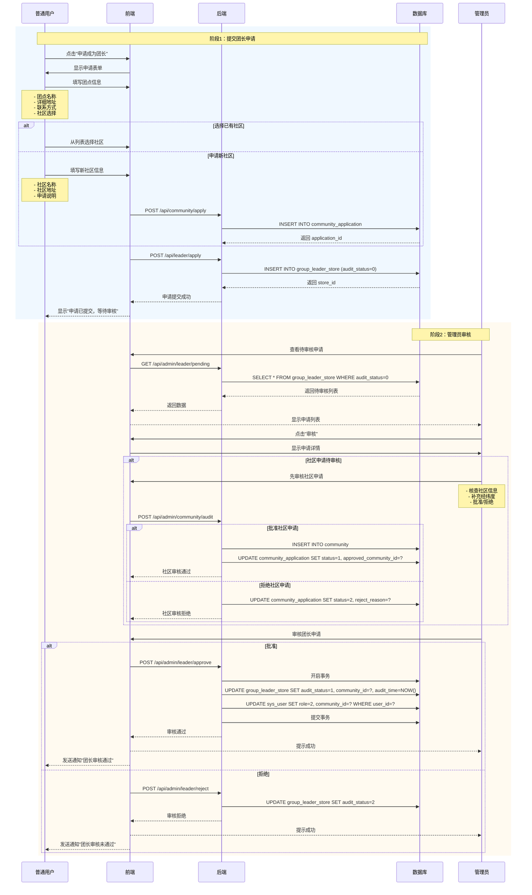

# 社区团购系统 - 团长端业务逻辑文档

**文档版本**: v1.1 ⭐已更新  
**创建日期**: 2025-10-27  
**最后更新**: 2025-10-28  
**适用系统**: 基于Spring Boot的社区团购系统 v3.0  
**关联文档**: 
- 拼团逻辑优化方案.md（v3.0）
- 数据库设计说明文档.md（v3.0）

**更新说明**：
- v1.0：初始版本，完整团长端业务逻辑
- v1.1：新增推荐阅读顺序章节，强调v3.0变更要点

---

## 📋 目录

1. [团长端概述](#1-团长端概述)
2. [团长申请与审核流程](#2-团长申请与审核流程)
3. [团长核心功能模块](#3-团长核心功能模块)
4. [业务流程详解](#4-业务流程详解)
5. [数据库表关联](#5-数据库表关联)
6. [状态机设计](#6-状态机设计)
7. [API接口设计](#7-api接口设计)
8. [前端页面结构](#8-前端页面结构)
9. [与拼团逻辑的关联](#9-与拼团逻辑的关联)

---

## 1. 团长端概述

### 1.1 团长角色定位

**团长** 是社区团购系统的核心角色，定位为 **社区服务点负责人**。

#### 核心职责
```
┌─────────────────────────────────────────────────────────┐
│ 团长职责                                                 │
├─────────────────────────────────────────────────────────┤
│ 1. 社区管理：选择或申请服务社区                          │
│ 2. 团购发起：仅团长可发起拼团活动                        │
│ 3. 团员管理：管理参与自己发起的团的成员                  │
│ 4. 订单处理：查看和管理归属自己的订单                    │
│ 5. 配送协调：查看配送路径参考，协调配送事宜              │
│ 6. 佣金查询：查看佣金明细和余额（线下提现）              │
└─────────────────────────────────────────────────────────┘
```

#### 与普通用户的区别

| 对比项 | 普通用户 | 团长 |
|-------|---------|------|
| **角色值** | `role=1` | `role=2` |
| **发起拼团** | ❌ 不可以 | ✅ 可以发起 |
| **参与拼团** | ✅ 可以参与 | ✅ 也可以参与 |
| **社区绑定** | 非强制，自动匹配 | 必须绑定，审核确定 |
| **查看订单** | 仅自己的订单 | 归属自己的所有订单 |
| **配送职责** | 无 | 负责配送/协调配送 |
| **佣金收益** | 无 | 有佣金收益 |

### 1.2 业务核心逻辑

#### 核心决策总结

| 业务问题 | 决策方案 | 说明 |
|---------|---------|------|
| **团长申请流程** | 管理员审核 | 用户申请团长 → 填写团点信息 → 选择/申请社区 → 管理员审核 |
| **社区归属** | 一个团长归属一个社区 | 团长审核通过后绑定社区，社区用于优先推荐 |
| **发起拼团** | 仅团长可发起 | 普通用户不能发起，只能参团 |
| **团员管理** | 管理团的参与成员 | 团长管理自己发起的团的成员，非固定绑定关系 |
| **用户参团** | 优先本社区，可跨社区 | 用户参团时优先显示本社区的团，也可选择其他社区的团 |
| **订单归属** | 按用户选择的团长 | 用户参团时，订单自动归属该团的团长 |
| **配送方式** | 系统提供路径参考 | 团长前端显示配送路径参考（贪心算法），不做配送应用 |
| **佣金提现** | 查看余额，人工提现 | 系统不提供线上提现，联系客服线下处理 |

---

## 2. 团长申请与审核流程

### 2.1 申请流程（v3.0优化）



### 2.2 申请表结构

#### 团长申请信息（group_leader_store）

| 字段 | 必填 | 说明 |
|-----|------|------|
| leader_id | ✅ | 关联用户ID（自动填充） |
| store_name | ✅ | 团点名称 |
| province | ✅ | 省份 |
| city | ✅ | 城市 |
| district | ✅ | 区/县 |
| detail_address | ✅ | 详细地址 |
| longitude | ❌ | 经度（管理员审核时自动获取） |
| latitude | ❌ | 纬度（管理员审核时自动获取） |
| max_delivery_range | ❌ | 最大配送范围（默认3000米） |
| community_id | ❌ | 社区ID（审核时确定） |
| community_application_id | ❌ | 社区申请ID（如果申请新社区） |
| commission_rate | ❌ | 佣金比例（默认5%） |
| audit_status | 自动 | 审核状态（默认0-待审核） |

#### 社区申请信息（community_application）- 如果申请新社区

| 字段 | 必填 | 说明 |
|-----|------|------|
| applicant_id | ✅ | 申请人ID（自动填充） |
| community_name | ✅ | 社区名称 |
| province | ✅ | 省份 |
| city | ✅ | 城市 |
| district | ✅ | 区/县 |
| address | ✅ | 详细地址 |
| description | ❌ | 申请说明 |
| longitude | ❌ | 经度（管理员审核时填充） |
| latitude | ❌ | 纬度（管理员审核时填充） |
| status | 自动 | 审核状态（默认0-待审核） |

### 2.3 审核状态机


---

## 3. 团长核心功能模块

### 3.1 功能模块概览

```
┌────────────────────────────────────────────────────────────┐
│                       团长端功能                            │
├────────────────────────────────────────────────────────────┤
│                                                            │
│  ┌──────────────┐  ┌──────────────┐  ┌──────────────┐    │
│  │  控制台      │  │  发起拼团    │  │  团员管理    │    │
│  │  Dashboard   │  │  Launch Team │  │  Members     │    │
│  └──────────────┘  └──────────────┘  └──────────────┘    │
│                                                            │
│  ┌──────────────┐  ┌──────────────┐  ┌──────────────┐    │
│  │  订单管理    │  │  配送管理    │  │  佣金中心    │    │
│  │  Orders      │  │  Delivery    │  │  Commission  │    │
│  └──────────────┘  └──────────────┘  └──────────────┘    │
│                                                            │
│  ┌──────────────┐  ┌──────────────┐                      │
│  │  团点设置    │  │  数据统计    │                      │
│  │  Store       │  │  Statistics  │                      │
│  └──────────────┘  └──────────────┘                      │
│                                                            │
└────────────────────────────────────────────────────────────┘
```

### 3.2 功能模块详解

#### 3.2.1 控制台 (Dashboard)

**功能概述**：
- 显示团长的核心业务数据概览
- 提供快捷操作入口

**数据展示**：
```
┌─────────────────────────────────────────────────────────┐
│ 控制台                                                   │
├─────────────────────────────────────────────────────────┤
│                                                         │
│  今日数据                                                │
│  ┌─────────┐ ┌─────────┐ ┌─────────┐ ┌─────────┐      │
│  │ 新订单  │ │ 待发货  │ │ 配送中  │ │ 今日佣金│      │
│  │   15    │ │   23    │ │   8     │ │ ¥125.50 │      │
│  └─────────┘ └─────────┘ └─────────┘ └─────────┘      │
│                                                         │
│  我的拼团活动（进行中）                                  │
│  ┌────────────────────────────────────────────────┐    │
│  │ 苹果3人团  | 团号: T20251027001 | 2/3人 | 23h  │    │
│  │ 香蕉2人团  | 团号: T20251027008 | 1/2人 | 15h  │    │
│  └────────────────────────────────────────────────┘    │
│                                                         │
│  待处理事项                                              │
│  - 5个订单待发货                                        │
│  - 2个拼团即将过期                                      │
│  - 1个社区申请待审核                                    │
│                                                         │
└─────────────────────────────────────────────────────────┘
```

**API接口**：
```javascript
GET /api/leader/dashboard
Response: {
  todayOrders: {
    newOrders: 15,
    toDeliver: 23,
    delivering: 8
  },
  todayCommission: 125.50,
  activeTeams: [...],
  pendingTasks: [...]
}
```

---

#### 3.2.2 发起拼团 (Launch Team)

**功能概述**：
- 仅团长可发起拼团
- 选择拼团活动（管理员已创建）
- 自动关联团长和社区

**业务流程**：
```
1. 团长查看平台拼团活动列表
2. 选择一个活动（例如：苹果3人拼团）
3. 点击"发起拼团"
4. 系统创建团实例（team）：
   - activity_id: 活动ID
   - launcher_id: 团长ID
   - leader_id: 团长ID（自己）
   - community_id: 团长的社区ID
   - required_num: 从活动复制
   - expire_time: 24小时后
5. 系统创建订单（order）：
   - user_id: 团长ID
   - leader_id: 团长ID
   - order_status: 0（待支付）
6. 系统记录参团（member）：
   - team_id: 团ID
   - user_id: 团长ID
   - is_launcher: 1（发起人）
   - status: 0（待支付）
7. 团长支付
8. 更新团人数（current_num=1）
9. 生成分享链接（包含team_id）
```

**注意事项**：
- ✅ 团长可以参与自己发起的团（算作第一人）
- ✅ 团长也可以只发起不参与（让用户参团）
- ✅ 团长发起的团自动归属自己的社区

**API接口**：
```javascript
// 查看可发起的活动列表
GET /api/leader/activities/available
Response: [
  {
    activity_id: 1,
    product_id: 101,
    product_name: "新鲜苹果",
    group_price: 29.90,
    required_num: 3,
    end_time: "2025-10-30 23:59:59"
  },
  ...
]

// 发起拼团
POST /api/leader/team/launch
Request: {
  activity_id: 1,
  participate: true  // 是否参与（true-参与，false-仅发起）
}
Response: {
  team_id: 5001,
  team_no: "T20251027001",
  order_id: 8001,  // 如果participate=true
  share_link: "/groupbuy/team/5001"
}
```

---

#### 3.2.3 团员管理 (Members)

**功能概述**：
- 管理团长发起的团的参与成员
- 查看团的拼团进度
- 管理团的状态（仅成团前可操作）

**重要说明**：
> **"团员管理"的重新定义**：  
> v3.0版本中，"团员"不再是固定绑定关系，而是指"参与团长发起的团的用户"。  
> 一个用户可以参与多个团长的不同的团，团长只能管理自己发起的团的成员。

**业务逻辑**：
```
团长发起的团列表：
  ┌────────────────────────────────────────────────┐
  │ 苹果3人团 | T20251027001 | 2/3人 | 拼团中      │
  │ ├─ 张三（发起人）  已支付  ¥29.90            │
  │ ├─ 李四            已支付  ¥29.90            │
  │ └─ 还差1人                                    │
  ├────────────────────────────────────────────────┤
  │ 香蕉2人团 | T20251027002 | 2/2人 | 已成团      │
  │ ├─ 王五（发起人）  已成团  ¥19.90            │
  │ └─ 赵六            已成团  ¥19.90            │
  └────────────────────────────────────────────────┘
```

**可执行操作**：
- 查看团的详细信息
- 查看团成员列表
- 查看团的订单列表
- 复制分享链接
- ❌ 不可强制移除成员（成员可自行退出）
- ❌ 不可修改成团状态（系统自动判定）

**API接口**：
```javascript
// 查看团长发起的所有团
GET /api/leader/teams
Query: {
  status: 0,  // 0-拼团中, 1-已成团, 2-已失败
  page: 1,
  limit: 10
}
Response: {
  total: 25,
  list: [
    {
      team_id: 5001,
      team_no: "T20251027001",
      activity_name: "苹果3人团",
      required_num: 3,
      current_num: 2,
      team_status: 0,
      expire_time: "2025-10-28 15:30:00",
      members: [
        {
          user_id: 101,
          username: "张三",
          is_launcher: 1,
          status: 1,  // 已支付
          join_time: "2025-10-27 15:30:00"
        },
        ...
      ]
    },
    ...
  ]
}

// 查看单个团的详情
GET /api/leader/team/{team_id}/detail
Response: {
  team_info: {...},
  members: [...],
  orders: [...]
}
```

---

#### 3.2.4 订单管理 (Orders)

**功能概述**：
- 查看所有归属自己的订单
- 按订单状态筛选
- 查看订单详情
- 标记订单为"配送中"、"已送达"

**订单来源**：
```
团长的订单来源：
1. 用户参与团长发起的团 → 订单归属该团长
2. 用户选择团长的社区 → 订单归属该团长
3. 团长自己参与拼团 → 订单归属自己

注意：
- 订单的 leader_id 字段决定订单归属
- 订单状态流转：待支付 → 待发货 → 配送中 → 已送达
```

**订单列表展示**：
```
┌──────────────────────────────────────────────────────────┐
│ 订单管理                                    [筛选: 全部▼] │
├──────────────────────────────────────────────────────────┤
│                                                          │
│  订单号: 20251027153012345678  |  状态: 待发货            │
│  用户: 张三  |  金额: ¥29.90  |  拼团: 苹果3人团         │
│  地址: 北京市朝阳区阳光社区88号楼                         │
│  [查看详情]  [标记发货]                                  │
├──────────────────────────────────────────────────────────┤
│  订单号: 20251027140523456789  |  状态: 配送中            │
│  用户: 李四  |  金额: ¥19.90  |  拼团: 香蕉2人团         │
│  地址: 北京市朝阳区幸福家园15号楼                         │
│  [查看详情]  [标记送达]                                  │
└──────────────────────────────────────────────────────────┘
```

**API接口**：
```javascript
// 查看订单列表
GET /api/leader/orders
Query: {
  status: 1,  // 订单状态筛选
  page: 1,
  limit: 10
}
Response: {
  total: 150,
  list: [
    {
      order_id: 8001,
      order_sn: "20251027153012345678",
      user_id: 101,
      user_name: "张三",
      total_amount: 29.90,
      order_status: 1,  // 待发货
      team_no: "T20251027001",
      activity_name: "苹果3人团",
      address: "北京市朝阳区阳光社区88号楼",
      create_time: "2025-10-27 15:30:12"
    },
    ...
  ]
}

// 更新订单状态
POST /api/leader/order/{order_id}/status
Request: {
  status: 2  // 2-配送中, 3-已送达
}
Response: {
  success: true
}
```

---

#### 3.2.5 配送管理 (Delivery)

**功能概述**：
- 查看待配送订单列表
- 生成配送路径参考（贪心算法）
- 查看地图路径
- 导出配送单

**重要说明**：
> **系统不做配送应用**：  
> 团长端仅提供配送路径参考工具，不记录详细的配送过程。  
> 配送由团长自行协调或使用第三方配送服务。

**配送路径计算（贪心算法）**：
```javascript
// 简化的贪心算法（前端实现）
function calculateDeliveryRoute(storeLocation, addresses) {
  let route = [storeLocation];  // 起点：团点
  let remaining = [...addresses];
  let current = storeLocation;
  
  while (remaining.length > 0) {
    // 找到离当前位置最近的地址
    let nearest = remaining.reduce((min, addr) => {
      let dist = getDistance(current, addr);
      return dist < getDistance(current, min) ? addr : min;
    });
    
    route.push(nearest);
    current = nearest;
    remaining = remaining.filter(a => a !== nearest);
  }
  
  return route;
}
```

**配送管理页面**：
```
┌──────────────────────────────────────────────────────────┐
│ 配送管理                           [日期: 2025-10-27▼]   │
├──────────────────────────────────────────────────────────┤
│                                                          │
│  待配送订单: 15个                                         │
│  预计配送距离: 8.5公里                                    │
│  预计耗时: 45分钟                                         │
│                                                          │
│  [生成配送路线]  [查看地图]  [导出配送单]                 │
│                                                          │
│  配送路径参考（贪心算法）：                                │
│  ┌────────────────────────────────────────────────┐      │
│  │ 起点: 阳光社区团点                              │      │
│  │  ↓ (0.5km)                                    │      │
│  │ 1. 张三 - 阳光社区88号楼 - 订单#8001           │      │
│  │  ↓ (0.3km)                                    │      │
│  │ 2. 李四 - 阳光社区92号楼 - 订单#8002           │      │
│  │  ↓ (0.8km)                                    │      │
│  │ 3. 王五 - 阳光社区15号楼 - 订单#8003           │      │
│  │  ↓ ...                                        │      │
│  └────────────────────────────────────────────────┘      │
│                                                          │
└──────────────────────────────────────────────────────────┘
```

**API接口**：
```javascript
// 获取待配送订单
GET /api/leader/delivery/pending
Query: {
  date: "2025-10-27"
}
Response: {
  orders: [
    {
      order_id: 8001,
      user_name: "张三",
      address: "阳光社区88号楼",
      longitude: 116.497128,
      latitude: 39.926527,
      items: [...]
    },
    ...
  ],
  store_location: {
    longitude: 116.497128,
    latitude: 39.926527
  }
}

// 生成配送路线（前端计算，不调用后端）
// 或者后端提供简单的参考
POST /api/leader/delivery/route
Request: {
  order_ids: [8001, 8002, 8003, ...]
}
Response: {
  route: [
    {
      order_id: 8001,
      user_name: "张三",
      address: "阳光社区88号楼",
      distance: 0.5  // km
    },
    ...
  ],
  total_distance: 8.5,
  estimated_time: 45  // 分钟
}
```

---

#### 3.2.6 佣金中心 (Commission)

**功能概述**：
- 查看佣金余额
- 查看佣金明细
- 查看佣金统计
- 查看提现说明（线下提现）

**佣金计算规则**：
```
佣金金额 = 订单实付金额 × 佣金比例

示例：
- 订单实付: ¥100
- 佣金比例: 5%
- 佣金金额: ¥100 × 0.05 = ¥5

佣金生成时机：
- 订单状态变为"已送达"（order_status=3）时自动生成佣金记录
- 佣金状态初始为"未结算"（status=0）
- 每月1号批量结算，转入团长账户余额
- 提现需联系客服线下处理
```

**佣金中心页面**：
```
┌──────────────────────────────────────────────────────────┐
│ 佣金中心                                                  │
├──────────────────────────────────────────────────────────┤
│                                                          │
│  ┌──────────────┐  ┌──────────────┐  ┌──────────────┐  │
│  │  账户余额    │  │  本月佣金    │  │  累计佣金    │  │
│  │  ¥ 1,250.50  │  │  ¥ 385.20    │  │  ¥ 8,650.00  │  │
│  └──────────────┘  └──────────────┘  └──────────────┘  │
│                                                          │
│  💡 提现说明：请联系客服（微信：xxx）线下提现             │
│                                                          │
│  佣金明细                                [筛选: 全部▼]    │
│  ┌────────────────────────────────────────────────┐      │
│  │ 2025-10-27  订单#8001  已结算  ¥5.00          │      │
│  │ 2025-10-27  订单#8002  未结算  ¥3.50          │      │
│  │ 2025-10-26  订单#8003  已结算  ¥8.20          │      │
│  │ ...                                           │      │
│  └────────────────────────────────────────────────┘      │
│                                                          │
└──────────────────────────────────────────────────────────┘
```

**API接口**：
```javascript
// 查看佣金概览
GET /api/leader/commission/summary
Response: {
  balance: 1250.50,  // 账户余额（已结算）
  monthly: 385.20,   // 本月佣金
  total: 8650.00,    // 累计佣金
  unsettled: 385.20  // 未结算佣金
}

// 查看佣金明细
GET /api/leader/commission/records
Query: {
  status: null,  // null-全部, 0-未结算, 1-已结算
  page: 1,
  limit: 10
}
Response: {
  total: 120,
  list: [
    {
      commission_id: 301,
      order_id: 8001,
      order_sn: "20251027153012345678",
      amount: 5.00,
      status: 1,  // 已结算
      settle_time: "2025-10-01 00:00:00",
      create_time: "2025-10-27 15:30:12"
    },
    ...
  ]
}
```

---

#### 3.2.7 团点设置 (Store)

**功能概述**：
- 查看团点信息
- 编辑团点信息（需管理员重新审核）
- 查看社区信息
- 查看佣金比例

**团点设置页面**：
```
┌──────────────────────────────────────────────────────────┐
│ 团点设置                                                  │
├──────────────────────────────────────────────────────────┤
│                                                          │
│  基本信息                                                 │
│  ┌────────────────────────────────────────────────┐      │
│  │ 团点名称: 阳光社区便利店                       │      │
│  │ 团点地址: 北京市朝阳区朝阳北路88号             │      │
│  │ 联系电话: 138****1234                         │      │
│  │ 归属社区: 阳光社区                             │      │
│  │ 佣金比例: 5%                                   │      │
│  │ 审核状态: 已通过                               │      │
│  │ 审核时间: 2025-10-20 10:30:00                 │      │
│  └────────────────────────────────────────────────┘      │
│                                                          │
│  [编辑信息]  [查看社区详情]                               │
│                                                          │
│  ⚠️ 注意：修改团点信息需重新提交审核                      │
│                                                          │
└──────────────────────────────────────────────────────────┘
```

**API接口**：
```javascript
// 查看团点信息
GET /api/leader/store
Response: {
  store_id: 1001,
  leader_id: 101,
  store_name: "阳光社区便利店",
  province: "北京市",
  city: "北京市",
  district: "朝阳区",
  detail_address: "朝阳北路88号",
  longitude: 116.497128,
  latitude: 39.926527,
  community_id: 1,
  community_name: "阳光社区",
  commission_rate: 5.00,
  audit_status: 1,
  audit_time: "2025-10-20 10:30:00"
}

// 编辑团点信息
PUT /api/leader/store
Request: {
  store_name: "阳光社区便利店",
  detail_address: "朝阳北路88号",
  phone: "13812341234"
}
Response: {
  success: true,
  message: "信息已更新，等待管理员审核"
}
```

---

#### 3.2.8 数据统计 (Statistics)

**功能概述**：
- 订单统计（按日期、按状态）
- 销售额统计
- 佣金统计
- 拼团活动统计

**统计页面**：
```
┌──────────────────────────────────────────────────────────┐
│ 数据统计                         [时间: 最近7天▼]         │
├──────────────────────────────────────────────────────────┤
│                                                          │
│  订单统计                                                 │
│  ┌────────────────────────────────────────────────┐      │
│  │ 总订单数: 150  |  已完成: 120  |  进行中: 30   │      │
│  │ 成交金额: ¥8,650.00  |  佣金收入: ¥432.50     │      │
│  └────────────────────────────────────────────────┘      │
│                                                          │
│  销售额趋势（折线图）                                      │
│  [图表展示]                                               │
│                                                          │
│  热门商品 TOP 5                                           │
│  1. 新鲜苹果  -  50单  -  ¥1,495.00                      │
│  2. 香蕉      -  35单  -  ¥696.50                        │
│  3. ...                                                 │
│                                                          │
└──────────────────────────────────────────────────────────┘
```

**API接口**：
```javascript
// 获取统计数据
GET /api/leader/statistics
Query: {
  start_date: "2025-10-20",
  end_date: "2025-10-27"
}
Response: {
  orders: {
    total: 150,
    completed: 120,
    ongoing: 30
  },
  sales: {
    total_amount: 8650.00,
    commission: 432.50
  },
  trend: [
    { date: "2025-10-20", amount: 1200.00 },
    { date: "2025-10-21", amount: 1350.00 },
    ...
  ],
  top_products: [
    {
      product_id: 101,
      product_name: "新鲜苹果",
      sales: 50,
      amount: 1495.00
    },
    ...
  ]
}
```

---

## 4. 业务流程详解

### 4.1 团长发起拼团完整流程


### 4.2 团长管理订单流程


### 4.3 团长查看佣金流程


---

## 5. 数据库表关联

### 5.1 团长相关表关系


### 5.2 团长数据查询示例

#### 5.2.1 查询团长发起的所有团

```sql
SELECT 
  t.team_id,
  t.team_no,
  a.product_id,
  p.product_name,
  a.group_price,
  t.required_num,
  t.current_num,
  t.team_status,
  t.expire_time,
  c.community_name
FROM group_buy_team t
LEFT JOIN group_buy a ON t.activity_id = a.activity_id
LEFT JOIN product p ON a.product_id = p.product_id
LEFT JOIN community c ON t.community_id = c.community_id
WHERE t.leader_id = ?  -- 团长ID
ORDER BY t.create_time DESC;
```

#### 5.2.2 查询团长的订单列表

```sql
SELECT 
  o.order_id,
  o.order_sn,
  u.user_id,
  u.real_name,
  o.total_amount,
  o.pay_amount,
  o.order_status,
  o.create_time,
  a.province,
  a.city,
  a.district,
  a.detail
FROM order_main o
LEFT JOIN sys_user u ON o.user_id = u.user_id
LEFT JOIN user_address a ON o.receive_address_id = a.address_id
WHERE o.leader_id = ?  -- 团长ID
ORDER BY o.create_time DESC;
```

#### 5.2.3 查询团长的佣金汇总

```sql
SELECT 
  SUM(CASE WHEN status = 0 THEN amount ELSE 0 END) as unsettled,  -- 未结算
  SUM(CASE WHEN status = 1 THEN amount ELSE 0 END) as settled,    -- 已结算
  SUM(amount) as total,  -- 累计
  SUM(CASE WHEN MONTH(create_time) = MONTH(NOW()) THEN amount ELSE 0 END) as monthly  -- 本月
FROM commission_record
WHERE leader_id = ?;
```

#### 5.2.4 查询团的成员列表

```sql
SELECT 
  m.member_id,
  m.user_id,
  u.username,
  u.real_name,
  m.is_launcher,
  m.pay_amount,
  m.join_time,
  m.status,
  m.order_id,
  o.order_status
FROM group_buy_member m
LEFT JOIN sys_user u ON m.user_id = u.user_id
LEFT JOIN order_main o ON m.order_id = o.order_id
WHERE m.team_id = ?  -- 团ID
ORDER BY m.is_launcher DESC, m.join_time ASC;
```

---

## 6. 状态机设计

### 6.1 团长审核状态机


### 6.2 社区申请状态机


---

## 7. API接口设计

### 7.1 团长申请相关

```javascript
// 提交团长申请
POST /api/leader/apply
Request: {
  store_name: "阳光社区便利店",
  province: "北京市",
  city: "北京市",
  district: "朝阳区",
  detail_address: "朝阳北路88号",
  community_id: 1,  // 选择已有社区，或 null
  community_application: {  // 如果申请新社区
    community_name: "阳光社区",
    province: "北京市",
    city: "北京市",
    district: "朝阳区",
    address: "朝阳北路88号",
    description: "申请说明"
  }
}
Response: {
  success: true,
  message: "申请已提交，等待审核",
  store_id: 1001,
  application_id: 201  // 如果申请新社区
}

// 查询申请状态
GET /api/leader/apply/status
Response: {
  audit_status: 0,  // 0-待审核, 1-已通过, 2-已拒绝
  audit_time: null,
  community_application_status: 1  // 如果有社区申请
}
```

### 7.2 团长功能相关

```javascript
// 发起拼团
POST /api/leader/team/launch
Request: {
  activity_id: 1,
  participate: true  // 是否参与
}
Response: {
  team_id: 5001,
  team_no: "T20251027001",
  order_id: 8001,
  share_link: "/groupbuy/team/5001"
}

// 查看团列表
GET /api/leader/teams
Query: {
  status: 0,  // 团状态
  page: 1,
  limit: 10
}
Response: {
  total: 25,
  list: [...]
}

// 查看订单列表
GET /api/leader/orders
Query: {
  status: null,  // 订单状态
  page: 1,
  limit: 10
}
Response: {
  total: 150,
  list: [...]
}

// 更新订单状态
POST /api/leader/order/{order_id}/status
Request: {
  status: 2  // 2-配送中, 3-已送达
}
Response: {
  success: true
}

// 查看佣金概览
GET /api/leader/commission/summary
Response: {
  balance: 1250.50,
  monthly: 385.20,
  total: 8650.00,
  unsettled: 385.20
}

// 查看佣金明细
GET /api/leader/commission/records
Query: {
  status: null,
  page: 1,
  limit: 10
}
Response: {
  total: 120,
  list: [...]
}
```

---

## 8. 前端页面结构

### 8.1 路由设计

```javascript
// router/index.js (团长端)
{
  path: '/leader',
  component: LeaderLayout,
  meta: { requiresAuth: true, role: 2 },
  children: [
    {
      path: 'dashboard',
      name: 'LeaderDashboard',
      component: () => import('@/views/leader/DashboardView.vue')
    },
    {
      path: 'launch',
      name: 'LaunchTeam',
      component: () => import('@/views/leader/LaunchTeamView.vue')
    },
    {
      path: 'teams',
      name: 'TeamManage',
      component: () => import('@/views/leader/TeamManageView.vue')
    },
    {
      path: 'team/:teamId/detail',
      name: 'TeamDetail',
      component: () => import('@/views/leader/TeamDetailView.vue')
    },
    {
      path: 'orders',
      name: 'OrderManage',
      component: () => import('@/views/leader/OrderManageView.vue')
    },
    {
      path: 'delivery',
      name: 'DeliveryManage',
      component: () => import('@/views/leader/DeliveryManageView.vue')
    },
    {
      path: 'commission',
      name: 'CommissionCenter',
      component: () => import('@/views/leader/CommissionCenterView.vue')
    },
    {
      path: 'store',
      name: 'StoreSettings',
      component: () => import('@/views/leader/StoreSettingsView.vue')
    },
    {
      path: 'statistics',
      name: 'Statistics',
      component: () => import('@/views/leader/StatisticsView.vue')
    }
  ]
}
```

### 8.2 页面组件结构

```
views/leader/
  ├── DashboardView.vue           # 控制台
  ├── LaunchTeamView.vue          # 发起拼团
  ├── TeamManageView.vue          # 团员管理（团列表）
  ├── TeamDetailView.vue          # 团详情
  ├── OrderManageView.vue         # 订单管理
  ├── DeliveryManageView.vue      # 配送管理
  ├── CommissionCenterView.vue    # 佣金中心
  ├── StoreSettingsView.vue       # 团点设置
  └── StatisticsView.vue          # 数据统计

components/leader/
  ├── TeamCard.vue                # 团卡片组件
  ├── OrderCard.vue               # 订单卡片组件
  ├── DeliveryRouteMap.vue        # 配送路线地图
  ├── CommissionChart.vue         # 佣金图表
  └── StatisticsChart.vue         # 统计图表
```

---

## 9. 与拼团逻辑的关联

### 9.1 推荐阅读顺序 ⭐

**建议开发人员按以下顺序阅读文档**：

1. **数据库设计说明文档.md**（优先级⭐⭐⭐⭐⭐）
   - 了解整体数据结构
   - 理解19张表的关系
   - 掌握社区机制的表设计

2. **拼团逻辑优化方案.md**（优先级⭐⭐⭐⭐⭐）
   - 理解拼团业务逻辑
   - 了解v3.0的关键变更
   - 掌握三层模型设计（活动→团→成员）
   - **注意**：请以v3.0版本为准

3. **团长端业务逻辑文档.md**（本文档，优先级⭐⭐⭐⭐）
   - 理解团长功能需求
   - 掌握团长申请和审核流程
   - 了解团长端8个核心功能模块

4. **文档一致性检查与优化建议.md**（可选，优先级⭐⭐⭐）
   - 了解文档差异和演进历史
   - 理解v2.0到v3.0的变更原因
   - 确保使用正确的业务逻辑

**特别提醒**：

⚠️ **拼团逻辑文档已更新到v3.0**，关键变更如下：
- ✅ 仅团长可发起拼团（role=2）
- ✅ 引入社区机制（community表）
- ✅ 废弃固定绑定关系（group_member表）
- ✅ 团员管理 = 管理团的参与成员（group_buy_member表）

⚠️ **废弃的表和逻辑**（请勿使用）：
- ❌ `group_member`表（团员绑定关系表）
- ❌ 用户绑定团长流程
- ❌ 用户发起拼团权限

**快速对照表**：

| 业务场景 | 查看文档 | 章节 |
|---------|---------|------|
| 理解拼团三层模型 | 拼团逻辑优化方案.md | 第3.1节 |
| 团长申请流程 | 团长端业务逻辑文档.md | 第2节 |
| 团长发起拼团 | 拼团逻辑优化方案.md | 第6.1节 |
| 用户参与拼团 | 拼团逻辑优化方案.md | 第6.3节 |
| 社区表设计 | 数据库设计说明文档.md | 第2.1-2.2节 |
| 团实例表设计 | 拼团逻辑优化方案.md | 第4.2.2节 |
| 佣金生成时机 | 团长端业务逻辑文档.md | 第3.2.6节 |

---

### 9.2 关键交互点

| 拼团逻辑文档章节 | 团长端对应功能 | 说明 |
|---------------|--------------|------|
| **用户发起拼团流程** | 发起拼团模块 | 团长作为发起人，启动拼团实例 |
| **团实例表设计** | 团员管理模块 | 团长查看和管理团实例 |
| **参团记录表设计** | 团员管理模块 | 团长查看团的参与成员 |
| **成团逻辑** | 团员管理模块 | 团长查看团的成团状态 |
| **订单生成流程** | 订单管理模块 | 团长查看归属自己的订单 |
| **定时任务（过期退款）** | 团员管理模块 | 团长查看失败的团 |
| **佣金生成逻辑** | 佣金中心模块 | 订单完成后自动生成佣金 |

### 9.2 逻辑一致性

#### 9.2.1 团的归属逻辑

**拼团逻辑文档**：
```
用户参团时，系统查询用户绑定的团长（group_member表）
→ 订单的 leader_id 设为该团长
→ 订单归属该团长
```

**团长端逻辑（v3.0优化）**：
```
用户参团时，选择团（team_id）
→ 团的 leader_id 字段标识归属团长
→ 订单的 leader_id 继承团的 leader_id
→ 订单归属该团长
→ 团长在"订单管理"中查看
```

**关键差异**：
- ❌ v2.0: 用户固定绑定团长（group_member表）
- ✅ v3.0: 用户参团时选择团，团归属团长，无固定绑定

#### 9.2.2 社区优先推荐逻辑

**拼团逻辑文档**：
```
用户查看团列表时，优先显示本社区的团
```

**团长端逻辑**：
```
团长发起团时，团的 community_id 自动设为团长的社区
→ 前端查询团列表时，按 community_id 排序
→ 用户所在社区的团排在前面
```

**实现方式**：
```sql
SELECT * FROM group_buy_team 
WHERE activity_id = ?
ORDER BY 
  CASE WHEN community_id = ? THEN 0 ELSE 1 END,  -- 本社区优先
  create_time DESC;
```

#### 9.2.3 "团员管理"的重新定义

**拼团逻辑文档（v2.0）**：
```
group_member 表：管理团长与团员的绑定关系
- 用户加入团长
- 团长管理团员
```

**团长端逻辑（v3.0优化）**：
```
❌ 废弃 group_member 表（固定绑定关系）
✅ 使用 group_buy_member 表（参团记录）

"团员管理"含义变更：
- 原含义：管理绑定的团员（固定关系）
- 新含义：管理团长发起的团的参与成员（动态关系）

团长查询逻辑：
SELECT * FROM group_buy_team WHERE leader_id = ?
→ 查询该团长发起的所有团
→ 每个团的 group_buy_member 记录即为"团员"
```

### 9.3 文档一致性检查清单

| 检查项 | 拼团逻辑文档 | 团长端文档 | 一致性 |
|-------|------------|-----------|--------|
| 团实例表设计 | ✅ group_buy_team | ✅ group_buy_team | ✅ 一致 |
| 参团记录表设计 | ✅ group_buy_member | ✅ group_buy_member | ✅ 一致 |
| 团的归属逻辑 | ✅ team.leader_id | ✅ team.leader_id | ✅ 一致 |
| 社区字段 | ❌ 未提及 | ✅ community_id | ⚠️ 需补充 |
| 固定绑定关系 | ✅ group_member | ❌ 已废弃 | ⚠️ 需更新 |
| 发起团权限 | ❌ 未明确 | ✅ 仅团长 | ⚠️ 需补充 |
| 佣金生成时机 | ✅ 订单完成 | ✅ 订单完成 | ✅ 一致 |
| 配送逻辑 | ✅ Dijkstra算法 | ✅ 贪心算法参考 | ⚠️ 简化版 |

---

## 10. 总结

### 10.1 团长端核心要点

1. **角色定位**：团长是社区服务点负责人，承担发起拼团、订单配送、佣金收益等职责
2. **申请流程**：用户申请 → 选择/申请社区 → 管理员审核 → 成为团长
3. **社区机制**：团长归属一个社区，发起的团自动关联该社区，优先推荐给本社区用户
4. **发起拼团**：仅团长可发起拼团，普通用户只能参团
5. **团员管理**：管理团长发起的团的参与成员，非固定绑定关系
6. **订单管理**：查看和管理归属自己的订单，标记配送状态
7. **配送管理**：系统提供路径参考（贪心算法），不做复杂配送应用
8. **佣金中心**：查看佣金明细和余额，线下提现

### 10.2 与拼团逻辑的差异

| 对比项 | 拼团逻辑文档（v2.0） | 团长端逻辑（v3.0） |
|-------|-------------------|------------------|
| 用户-团长关系 | 固定绑定（group_member表） | 动态关联（参团时选团） |
| 社区机制 | ❌ 未提及 | ✅ 引入社区表 |
| 发起权限 | ❌ 未明确 | ✅ 仅团长可发起 |
| 团员管理 | 管理绑定团员 | 管理团的参与成员 |
| 配送算法 | Dijkstra算法 | 简化的贪心算法参考 |

### 10.3 下一步开发建议

#### 10.3.1 后端开发任务

1. **社区相关Service**：
   - CommunityService（社区管理）
   - CommunityApplicationService（社区申请审核）

2. **团长相关Service**：
   - LeaderApplicationService（团长申请审核）
   - LeaderTeamService（团长发起拼团）
   - LeaderOrderService（团长订单管理）
   - LeaderCommissionService（团长佣金管理）
   - LeaderDeliveryService（配送路径参考）

3. **定时任务**：
   - 佣金结算定时任务（每月1号）
   - 团过期检查定时任务（每小时）

#### 10.3.2 前端开发任务

1. **团长申请页面**（LeaderApplyView.vue）
2. **团长控制台**（DashboardView.vue）
3. **发起拼团页面**（LaunchTeamView.vue）
4. **团员管理页面**（TeamManageView.vue）
5. **订单管理页面**（OrderManageView.vue）
6. **配送管理页面**（DeliveryManageView.vue）
7. **佣金中心页面**（CommissionCenterView.vue）
8. **团点设置页面**（StoreSettingsView.vue）

#### 10.3.3 数据库迁移

1. 执行 `database_migration_v3.0.sql`
2. 验证新表创建成功
3. 验证外键约束正确
4. 插入示例社区数据
5. 备份并删除旧表（group_member, group_buy_join）

---

**文档结束**

**版本**: v1.0  
**日期**: 2025-10-27  
**作者**: AI Assistant  
**审核**: 待审核

---

## 附录

### 附录A：团长端前端Mock数据

```javascript
// mock/leader.js
export default {
  // 控制台数据
  dashboard: {
    todayOrders: {
      newOrders: 15,
      toDeliver: 23,
      delivering: 8
    },
    todayCommission: 125.50,
    activeTeams: [
      {
        team_id: 5001,
        team_no: "T20251027001",
        product_name: "新鲜苹果",
        required_num: 3,
        current_num: 2,
        expire_time: "2025-10-28 15:30:00"
      },
      {
        team_id: 5002,
        team_no: "T20251027008",
        product_name: "香蕉",
        required_num: 2,
        current_num: 1,
        expire_time: "2025-10-28 10:15:00"
      }
    ],
    pendingTasks: [
      "5个订单待发货",
      "2个拼团即将过期",
      "1个社区申请待审核"
    ]
  },
  
  // 团列表
  teams: {
    total: 25,
    list: [
      {
        team_id: 5001,
        team_no: "T20251027001",
        activity_name: "新鲜苹果3人团",
        required_num: 3,
        current_num: 2,
        team_status: 0,
        expire_time: "2025-10-28 15:30:00",
        create_time: "2025-10-27 15:30:00",
        members: [
          {
            user_id: 101,
            username: "张三",
            is_launcher: 1,
            status: 1,
            pay_amount: 29.90,
            join_time: "2025-10-27 15:30:00"
          },
          {
            user_id: 102,
            username: "李四",
            is_launcher: 0,
            status: 1,
            pay_amount: 29.90,
            join_time: "2025-10-27 16:00:00"
          }
        ]
      }
    ]
  }
}
```

### 附录B：团长端API接口清单

| 模块 | 接口路径 | 方法 | 说明 |
|-----|---------|------|------|
| 申请 | `/api/leader/apply` | POST | 提交团长申请 |
| 申请 | `/api/leader/apply/status` | GET | 查询申请状态 |
| 控制台 | `/api/leader/dashboard` | GET | 获取控制台数据 |
| 拼团 | `/api/leader/activities/available` | GET | 查看可发起的活动 |
| 拼团 | `/api/leader/team/launch` | POST | 发起拼团 |
| 团管理 | `/api/leader/teams` | GET | 查看团列表 |
| 团管理 | `/api/leader/team/:teamId/detail` | GET | 查看团详情 |
| 订单 | `/api/leader/orders` | GET | 查看订单列表 |
| 订单 | `/api/leader/order/:orderId/status` | POST | 更新订单状态 |
| 配送 | `/api/leader/delivery/pending` | GET | 获取待配送订单 |
| 配送 | `/api/leader/delivery/route` | POST | 生成配送路线 |
| 佣金 | `/api/leader/commission/summary` | GET | 查看佣金概览 |
| 佣金 | `/api/leader/commission/records` | GET | 查看佣金明细 |
| 团点 | `/api/leader/store` | GET | 查看团点信息 |
| 团点 | `/api/leader/store` | PUT | 编辑团点信息 |
| 统计 | `/api/leader/statistics` | GET | 获取统计数据 |

