# 拼团逻辑优化方案

**文档版本**: v1.0  
**创建日期**: 2025-10-27  
**优化目标**: 解决现有拼团逻辑不清晰、不自洽的问题

---

## 📋 目录

1. [问题分析](#1-问题分析)
2. [业务需求确认](#2-业务需求确认)
3. [优化方案设计](#3-优化方案设计)
4. [数据库表结构优化](#4-数据库表结构优化)
5. [ER图](#5-er图)
6. [业务流程详解](#6-业务流程详解)
7. [状态机设计](#7-状态机设计)
8. [时序图](#8-时序图)
9. [数据库迁移SQL](#9-数据库迁移sql)

---

## 1. 问题分析

### 1.1 现有设计的逻辑缺陷

#### 问题1：活动与团实例混淆

**现有设计**：
```sql
-- group_buy表：既是活动，又像是具体的团
activity_id = 1  (苹果拼团活动，3人成团)

-- group_buy_join表：参团记录
用户A: activity_id=1, is_launcher=1  (A发起)
用户B: activity_id=1, is_launcher=0  (B参与)
用户C: activity_id=1, is_launcher=0  (C参与)
```

**逻辑问题**：
- ❌ 用户D想发起新团，也写入 `activity_id=1`？
- ❌ 如何区分A的团和D的团？
- ❌ 系统如何知道E应该参加哪个团？
- ❌ 无法实现"一个活动可以有多个团"

#### 问题2：订单生成时机不明确

**现有设计**：
> "成团后系统生成订单（order_main + order_item）"

**逻辑问题**：
- ❌ 用户参团时不支付？还是支付了但订单未生成？
- ❌ 成团后才生成订单，如何保证用户支付？
- ❌ 未成团时如何处理？

#### 问题3：团长归属不清晰

**现有设计**：
- `group_buy` 表有 `leader_id`（发起团长）
- `order_main` 表有 `leader_id`（取货团长）

**逻辑问题**：
- ❌ 用户发起拼团时，如何确定配送到哪个团长？
- ❌ 同一个活动的不同团，可以归属不同团长吗？

---

### 1.2 优化目标

✅ **目标1**：清晰区分"活动"与"团实例"  
✅ **目标2**：明确支付与订单生成的时机  
✅ **目标3**：建立用户与团长的绑定关系  
✅ **目标4**：支持"一个活动可以有多个团"  
✅ **目标5**：实现拼团失败自动退款  

---

## 2. 业务需求确认

### 2.1 核心业务模式

**社区团购模式**：
```
【平台】发布商品和拼团活动
   ↓
【团长】（社区服务点负责人）推广活动给团员
   ↓
【团员】（普通用户）参与拼团、下单支付
   ↓
【订单配送】统一配送到团点
   ↓
【用户取货】自提或团长送货上门
```

### 2.2 关键决策

| 业务问题 | 选定方案 | 说明 |
|---------|---------|------|
| 拼团模式 | **场景A + 社区配送特色** | 用户可自由发起拼团（类似拼多多），但订单按团长归属配送 |
| 支付时机 | **参团时立即支付** | 避免成团后用户不支付，符合主流电商逻辑 |
| 多团支持 | **一个活动可以有多个团** | 需要"活动+团实例"两层结构 |
| 团长归属 | **用户绑定团长** | 用户加入团点后，所有订单自动归属该团长 |
| 拼团失败 | **24小时自动退款** | 退款到用户账户余额（`user_account`） |
| 中途退出 | **成团前可退，成团后不可退** | 保护各方利益 |
| 团长角色 | **配送点负责人** | 团长不参与拼团逻辑，只负责配送和团员管理 |

---

## 3. 优化方案设计

### 3.1 核心概念模型

```
┌─────────────────────────────────────────────────────────┐
│ 拼团活动（Activity）- 活动模板                            │
│ - 定义拼团规则（商品、价格、成团人数、有效期）              │
│ - 一个活动可以有多个团实例                                │
└─────────────────────────────────────────────────────────┘
                      │
                      │ 1:N
                      ↓
┌─────────────────────────────────────────────────────────┐
│ 团实例（Team）- 具体的团                                  │
│ - 由用户发起，有唯一团号                                  │
│ - 关联团长（配送归属）                                    │
│ - 有独立的成团状态和过期时间                              │
└─────────────────────────────────────────────────────────┘
                      │
                      │ 1:N
                      ↓
┌─────────────────────────────────────────────────────────┐
│ 参团记录（Member）- 用户参团记录                           │
│ - 记录用户参与哪个团                                      │
│ - 关联订单ID（一对一）                                    │
│ - 记录支付状态和成团状态                                  │
└─────────────────────────────────────────────────────────┘
                      │
                      │ 1:1
                      ↓
┌─────────────────────────────────────────────────────────┐
│ 订单（Order）- 用户订单                                   │
│ - 参团时立即生成，状态为"待支付"                          │
│ - 支付后状态为"待成团"                                    │
│ - 成团后状态为"待发货"                                    │
└─────────────────────────────────────────────────────────┘
```

### 3.2 关键流程

#### 流程1：用户发起拼团

```
1. 用户A选择"苹果3人拼团活动"（activity_id=1）
2. 系统检查用户是否已绑定团长
   → 未绑定：提示先加入团点
   → 已绑定：继续
3. 系统创建团实例（team_id=5001，team_no=T20251027001）
   → 关联活动ID、发起人、团长、成团人数、过期时间
4. 系统创建订单（order_id=8001，状态=待支付）
5. 用户支付
6. 系统记录参团（team_id=5001, user_id=A, order_id=8001）
7. 系统更新团人数（current_num=1）
```

#### 流程2：其他用户参与拼团

```
1. 用户B通过分享链接打开拼团页面（包含team_id=5001）
2. 系统检查团状态
   → 团已成功/失败/过期：提示无法参与
   → 团已满员：提示无法参与
   → 团有效：继续
3. 系统创建订单（order_id=8002，状态=待支付）
4. 用户支付
5. 系统记录参团（team_id=5001, user_id=B, order_id=8002）
6. 系统更新团人数（current_num=2）
7. 系统检查是否成团
   → 如果 current_num = required_num：成团！
   → 触发成团逻辑（见流程3）
```

#### 流程3：成团成功

```
1. 系统更新团状态（team_status=1，success_time=NOW()）
2. 系统更新所有成员状态（status=2，已成团）
3. 系统更新所有订单状态（order_status=1，待发货）
4. 系统发送成团通知（站内信/短信/微信消息）
```

#### 流程4：拼团失败（定时任务）

```
定时任务：每小时执行

1. 查询过期的团（team_status=0 AND expire_time < NOW()）
2. 标记团状态为"失败"（team_status=2）
3. 查询该团的所有订单
4. 执行退款逻辑：
   → 更新订单状态（order_status=6，已退款）
   → 退款到用户账户（user_account.balance += pay_amount）
   → 记录支付记录（payment_record，amount为负数）
5. 发送拼团失败通知
```

#### 流程5：用户中途退出（成团前）

```
1. 用户申请退出拼团
2. 系统检查团状态
   → 已成团：提示无法退出
   → 拼团中：允许退出
3. 删除参团记录
4. 更新团人数（current_num -= 1）
5. 退款到用户账户
6. 更新订单状态（order_status=4，已取消）
```

---

## 4. 数据库表结构优化

### 4.1 表结构变更概览

| 现有表名 | 优化方案 | 变更类型 |
|---------|---------|---------|
| `group_buy` | 保留，字段调整 | **ALTER** |
| `group_buy_join` | 废弃，创建新表 | **DROP + CREATE** |
| - | `group_buy_team` | **新增** |
| - | `group_buy_member` | **新增** |
| `group_member` | 保留，无变更 | - |
| `order_main` | 保留，无变更 | - |
| `order_item` | 保留，无变更 | - |

### 4.2 优化后的表结构

#### 4.2.1 拼团活动表（group_buy）

**优化说明**：
- 删除 `leader_id` 字段（活动与团长无关）
- 新增 `max_num` 字段（最大人数限制）
- 调整字段注释

```sql
-- 表结构（优化后）
CREATE TABLE group_buy (
  activity_id BIGINT PRIMARY KEY AUTO_INCREMENT COMMENT '活动ID',
  product_id BIGINT NOT NULL COMMENT '关联商品ID',
  group_price DECIMAL(10,2) NOT NULL COMMENT '拼团价',
  required_num INT NOT NULL DEFAULT 2 COMMENT '成团人数',
  max_num INT DEFAULT NULL COMMENT '最大人数限制（可空，无限制）',
  start_time DATETIME NOT NULL COMMENT '活动开始时间',
  end_time DATETIME NOT NULL COMMENT '活动结束时间',
  status TINYINT NOT NULL DEFAULT 1 COMMENT '活动状态（0未开始/1进行中/2已结束/3异常）',
  qrcode_url VARCHAR(255) DEFAULT NULL COMMENT '活动二维码URL',
  link VARCHAR(255) DEFAULT NULL COMMENT '活动专属链接',
  create_time DATETIME NOT NULL DEFAULT CURRENT_TIMESTAMP COMMENT '创建时间',
  
  INDEX idx_product_id (product_id),
  INDEX idx_status (status),
  INDEX idx_time (start_time, end_time),
  UNIQUE KEY uk_link (link),
  
  FOREIGN KEY (product_id) REFERENCES product(product_id) ON DELETE CASCADE
) ENGINE=InnoDB DEFAULT CHARSET=utf8mb4 COMMENT='拼团活动表（活动模板）';
```

#### 4.2.2 团实例表（group_buy_team）⭐ 新增核心表

**设计说明**：
- 记录每一个具体的团
- 关联活动、发起人、团长
- 独立的成团状态和过期时间

```sql
CREATE TABLE group_buy_team (
  team_id BIGINT PRIMARY KEY AUTO_INCREMENT COMMENT '团ID',
  team_no VARCHAR(32) NOT NULL UNIQUE COMMENT '团号（用于分享链接，如：T20251027001）',
  activity_id BIGINT NOT NULL COMMENT '关联活动ID',
  launcher_id BIGINT NOT NULL COMMENT '发起人用户ID',
  leader_id BIGINT NOT NULL COMMENT '归属团长ID（配送团点）',
  required_num INT NOT NULL COMMENT '成团人数（从活动复制）',
  current_num INT NOT NULL DEFAULT 0 COMMENT '当前人数',
  team_status TINYINT NOT NULL DEFAULT 0 COMMENT '团状态（0拼团中/1已成团/2已失败）',
  success_time DATETIME DEFAULT NULL COMMENT '成团时间',
  expire_time DATETIME NOT NULL COMMENT '过期时间（24小时后）',
  create_time DATETIME NOT NULL DEFAULT CURRENT_TIMESTAMP COMMENT '创建时间',
  
  INDEX idx_activity_id (activity_id),
  INDEX idx_launcher_id (launcher_id),
  INDEX idx_leader_id (leader_id),
  INDEX idx_team_status (team_status),
  INDEX idx_expire_time (expire_time),
  INDEX idx_create_time (create_time),
  
  FOREIGN KEY (activity_id) REFERENCES group_buy(activity_id) ON DELETE CASCADE,
  FOREIGN KEY (launcher_id) REFERENCES sys_user(user_id) ON DELETE RESTRICT,
  FOREIGN KEY (leader_id) REFERENCES sys_user(user_id) ON DELETE RESTRICT
) ENGINE=InnoDB DEFAULT CHARSET=utf8mb4 COMMENT='团实例表（具体的团）';
```

#### 4.2.3 参团记录表（group_buy_member）⭐ 新增核心表

**设计说明**：
- 记录用户参与哪个团
- 关联订单ID（一对一）
- 记录支付状态和成团状态

```sql
CREATE TABLE group_buy_member (
  member_id BIGINT PRIMARY KEY AUTO_INCREMENT COMMENT '参团记录ID',
  team_id BIGINT NOT NULL COMMENT '团ID',
  user_id BIGINT NOT NULL COMMENT '参团用户ID',
  order_id BIGINT DEFAULT NULL COMMENT '关联订单ID',
  is_launcher TINYINT NOT NULL DEFAULT 0 COMMENT '是否发起人（0否/1是）',
  pay_amount DECIMAL(10,2) NOT NULL COMMENT '支付金额',
  join_time DATETIME NOT NULL DEFAULT CURRENT_TIMESTAMP COMMENT '参团时间',
  status TINYINT NOT NULL DEFAULT 0 COMMENT '状态（0待支付/1已支付/2已成团/3已取消）',
  
  UNIQUE KEY uk_team_user (team_id, user_id) COMMENT '一个用户不能重复参加同一个团',
  INDEX idx_team_id (team_id),
  INDEX idx_user_id (user_id),
  INDEX idx_order_id (order_id),
  INDEX idx_status (status),
  
  FOREIGN KEY (team_id) REFERENCES group_buy_team(team_id) ON DELETE CASCADE,
  FOREIGN KEY (user_id) REFERENCES sys_user(user_id) ON DELETE RESTRICT,
  FOREIGN KEY (order_id) REFERENCES order_main(order_id) ON DELETE SET NULL
) ENGINE=InnoDB DEFAULT CHARSET=utf8mb4 COMMENT='参团记录表';
```

---

## 5. ER图

### 5.1 拼团核心模块ER图

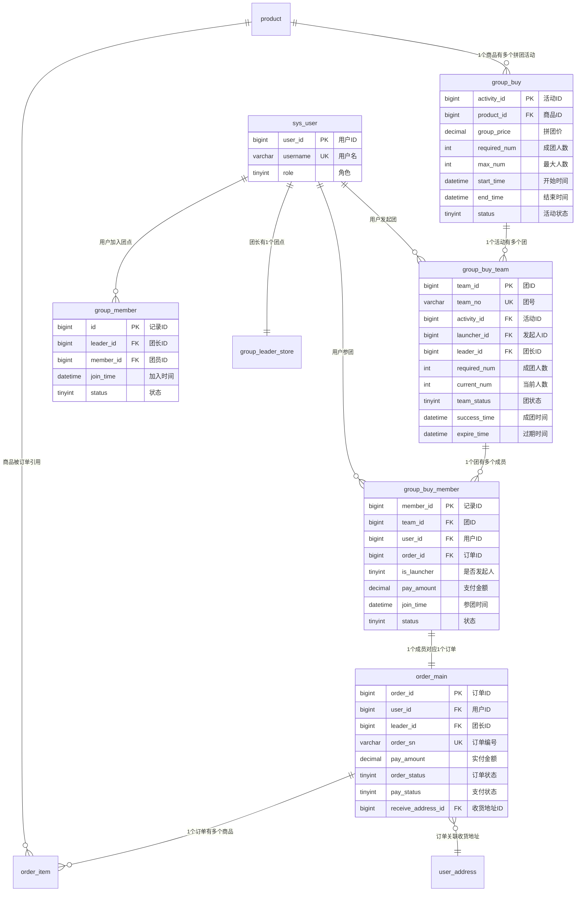

### 5.2 完整系统ER图（包含所有表）

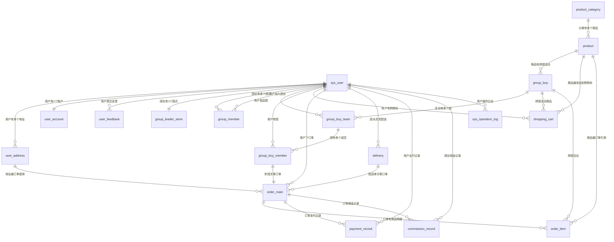

---

## 6. 业务流程详解

### 6.1 用户绑定团长流程

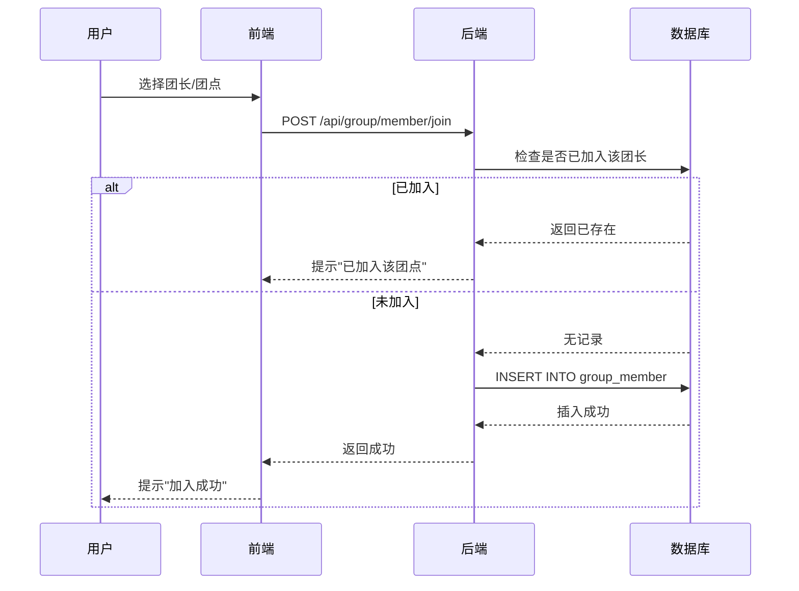

**SQL实现**：
```sql
-- 检查是否已加入
SELECT * FROM group_member 
WHERE leader_id = ? AND member_id = ? AND status = 1;

-- 如果不存在，插入记录
INSERT INTO group_member (leader_id, member_id, join_time, status)
VALUES (?, ?, NOW(), 1);
```

---

### 6.2 用户发起拼团流程

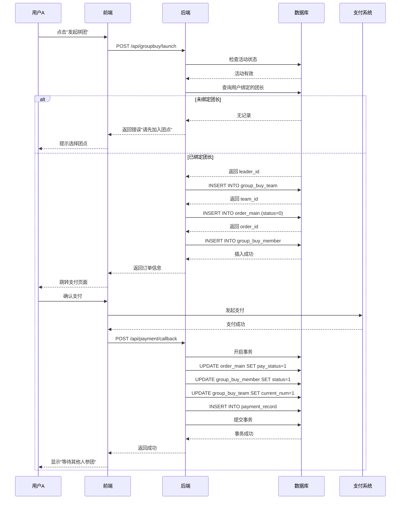

**关键SQL**：
```sql
-- Step 1: 检查活动有效性
SELECT * FROM group_buy 
WHERE activity_id = ? 
  AND status = 1 
  AND NOW() BETWEEN start_time AND end_time;

-- Step 2: 查询用户绑定的团长
SELECT leader_id FROM group_member 
WHERE member_id = ? AND status = 1 
LIMIT 1;

-- Step 3: 创建团实例
INSERT INTO group_buy_team (
  team_no, activity_id, launcher_id, leader_id, 
  required_num, current_num, team_status, expire_time
) VALUES (
  CONCAT('T', DATE_FORMAT(NOW(), '%Y%m%d'), LPAD(FLOOR(RAND()*1000000), 6, '0')),
  ?, ?, ?, 
  ?, 0, 0, DATE_ADD(NOW(), INTERVAL 24 HOUR)
);

-- Step 4: 创建订单
INSERT INTO order_main (
  user_id, leader_id, order_sn, total_amount, pay_amount, 
  order_status, pay_status, receive_address_id
) VALUES (
  ?, ?, CONCAT(DATE_FORMAT(NOW(), '%Y%m%d%H%i%s'), LPAD(FLOOR(RAND()*1000000), 6, '0')),
  ?, ?, 0, 0, ?
);

-- Step 5: 记录参团
INSERT INTO group_buy_member (
  team_id, user_id, order_id, is_launcher, pay_amount, status
) VALUES (
  ?, ?, ?, 1, ?, 0
);

-- Step 6: 支付成功后更新（事务）
BEGIN;
UPDATE order_main SET pay_status = 1, pay_time = NOW() WHERE order_id = ?;
UPDATE group_buy_member SET status = 1 WHERE member_id = ?;
UPDATE group_buy_team SET current_num = current_num + 1 WHERE team_id = ?;
INSERT INTO payment_record (...) VALUES (...);
COMMIT;
```

---

### 6.3 其他用户参与拼团流程

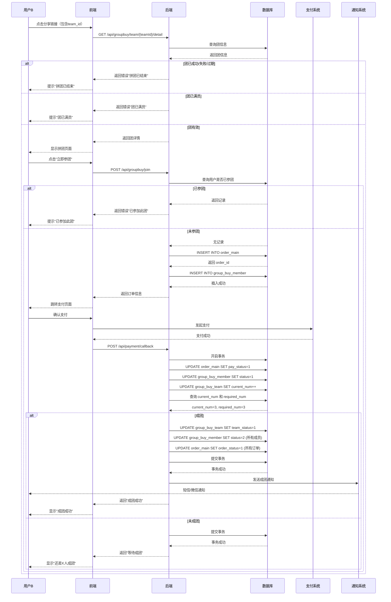

**关键SQL**：
```sql
-- Step 1: 检查团状态
SELECT 
  t.*, 
  a.product_id, a.group_price, 
  p.product_name, p.cover_img
FROM group_buy_team t
LEFT JOIN group_buy a ON t.activity_id = a.activity_id
LEFT JOIN product p ON a.product_id = p.product_id
WHERE t.team_id = ?
  AND t.team_status = 0
  AND t.current_num < t.required_num
  AND t.expire_time > NOW();

-- Step 2: 检查用户是否已参团
SELECT * FROM group_buy_member 
WHERE team_id = ? AND user_id = ?;

-- Step 7: 检查是否成团
SELECT current_num, required_num 
FROM group_buy_team 
WHERE team_id = ?;

-- 如果成团 (current_num = required_num)
BEGIN;

-- 更新团状态
UPDATE group_buy_team 
SET team_status = 1, success_time = NOW() 
WHERE team_id = ?;

-- 更新所有成员状态
UPDATE group_buy_member 
SET status = 2 
WHERE team_id = ?;

-- 激活所有订单
UPDATE order_main 
SET order_status = 1 
WHERE order_id IN (
  SELECT order_id FROM group_buy_member WHERE team_id = ?
);

COMMIT;
```

---

### 6.4 拼团失败自动退款流程（定时任务）

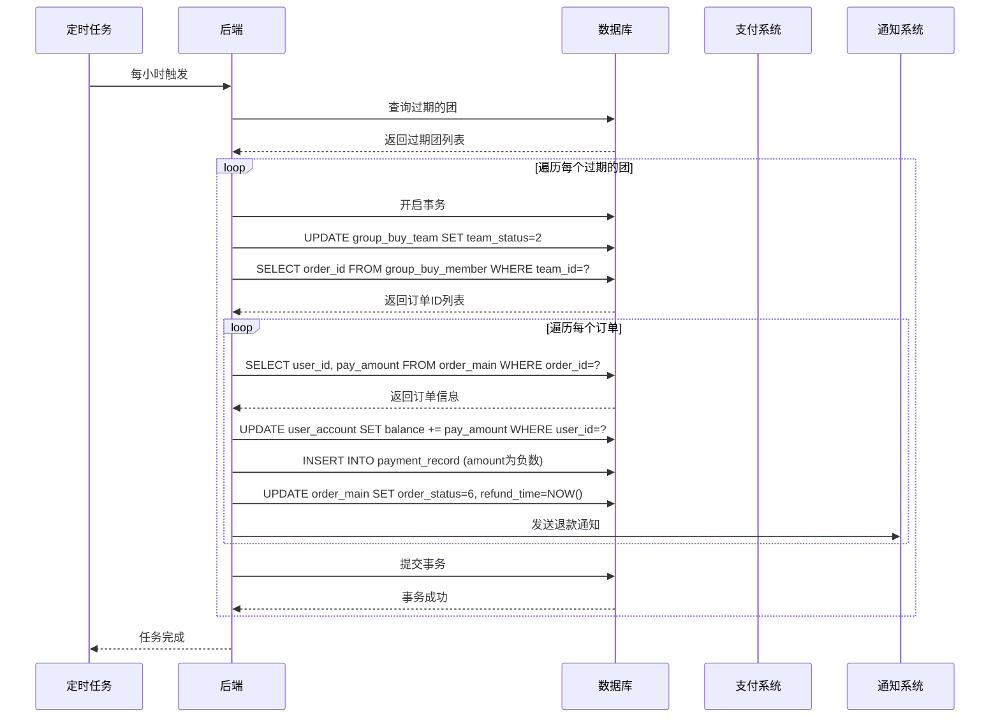

**定时任务SQL**：
```sql
-- Step 1: 查询过期的团
SELECT team_id FROM group_buy_team 
WHERE team_status = 0 
  AND expire_time < NOW();

-- Step 2: 标记团失败
UPDATE group_buy_team 
SET team_status = 2 
WHERE team_id = ?;

-- Step 3: 查询该团的所有订单
SELECT 
  m.order_id, 
  o.user_id, 
  o.pay_amount
FROM group_buy_member m
LEFT JOIN order_main o ON m.order_id = o.order_id
WHERE m.team_id = ? 
  AND m.status = 1;

-- Step 4: 退款到用户账户（事务）
BEGIN;

UPDATE user_account 
SET balance = balance + ?, 
    update_time = NOW() 
WHERE user_id = ?;

INSERT INTO payment_record (
  user_id, order_id, pay_type, amount, 
  pay_status, create_time
) VALUES (
  ?, ?, 3, -?, 1, NOW()
);

UPDATE order_main 
SET order_status = 6, 
    refund_time = NOW() 
WHERE order_id = ?;

UPDATE group_buy_member 
SET status = 3 
WHERE order_id = ?;

COMMIT;
```

**Spring Boot定时任务实现**：
```java
@Scheduled(cron = "0 0 * * * ?")  // 每小时执行
public void checkExpiredTeams() {
    List<Long> expiredTeamIds = teamService.findExpiredTeams();
    
    for (Long teamId : expiredTeamIds) {
        try {
            // 使用事务处理退款
            refundService.refundExpiredTeam(teamId);
            log.info("团{}拼团失败，已自动退款", teamId);
        } catch (Exception e) {
            log.error("团{}退款失败", teamId, e);
        }
    }
}
```

---

### 6.5 用户中途退出流程（成团前）

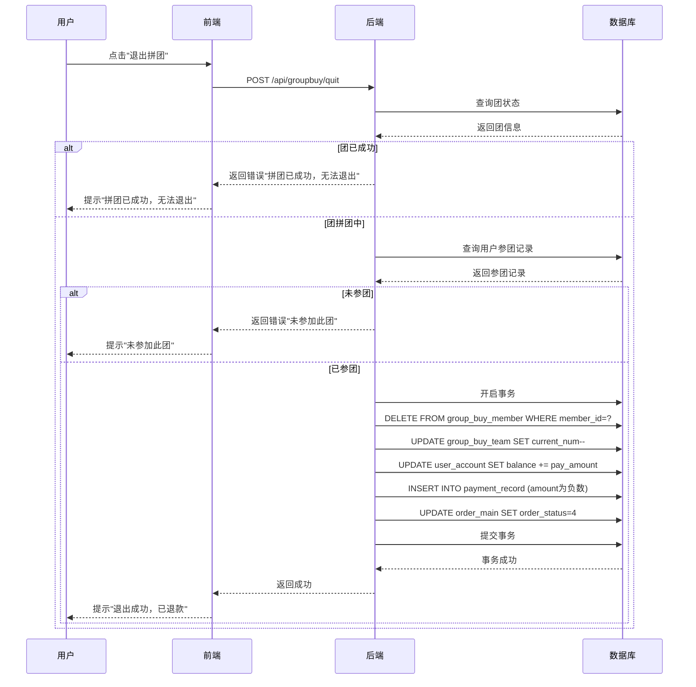

**SQL实现**：
```sql
-- Step 1: 检查团状态
SELECT team_status FROM group_buy_team WHERE team_id = ?;

-- 如果 team_status = 0（拼团中）
-- Step 2: 查询用户参团记录
SELECT 
  m.member_id, 
  m.order_id, 
  m.pay_amount, 
  o.user_id
FROM group_buy_member m
LEFT JOIN order_main o ON m.order_id = o.order_id
WHERE m.team_id = ? AND m.user_id = ?;

-- Step 3: 执行退出（事务）
BEGIN;

DELETE FROM group_buy_member WHERE member_id = ?;

UPDATE group_buy_team SET current_num = current_num - 1 WHERE team_id = ?;

UPDATE user_account 
SET balance = balance + ?, 
    update_time = NOW() 
WHERE user_id = ?;

INSERT INTO payment_record (
  user_id, order_id, pay_type, amount, 
  pay_status, create_time
) VALUES (
  ?, ?, 3, -?, 1, NOW()
);

UPDATE order_main 
SET order_status = 4, 
    update_time = NOW() 
WHERE order_id = ?;

COMMIT;
```

---

## 7. 状态机设计

### 7.1 团状态机

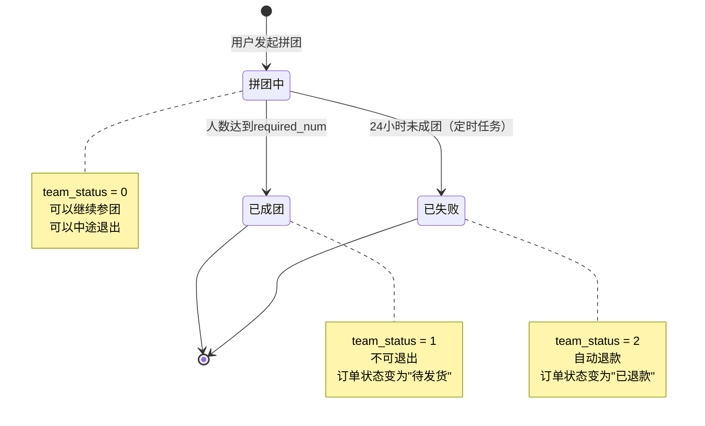

**状态枚举**：
```java
public enum TeamStatus {
    JOINING(0, "拼团中"),
    SUCCESS(1, "已成团"),
    FAILED(2, "已失败");
    
    private final int code;
    private final String desc;
}
```

---

### 7.2 参团状态机

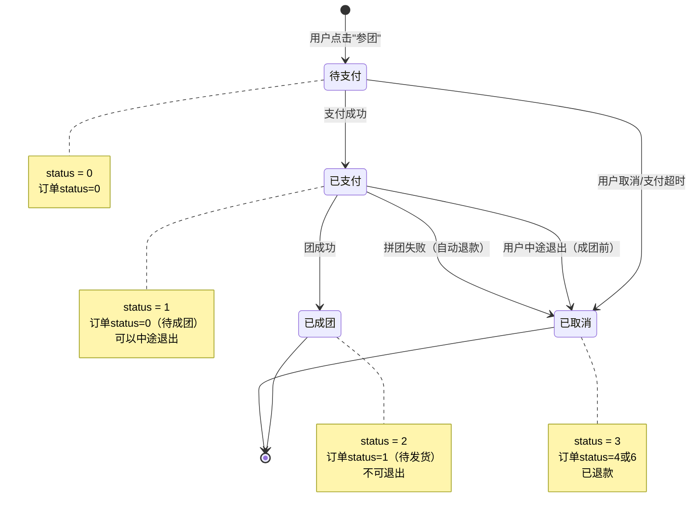

**状态枚举**：
```java
public enum MemberStatus {
    UNPAID(0, "待支付"),
    PAID(1, "已支付"),
    SUCCESS(2, "已成团"),
    CANCELLED(3, "已取消");
    
    private final int code;
    private final String desc;
}
```

---

### 7.3 订单状态机（拼团订单）

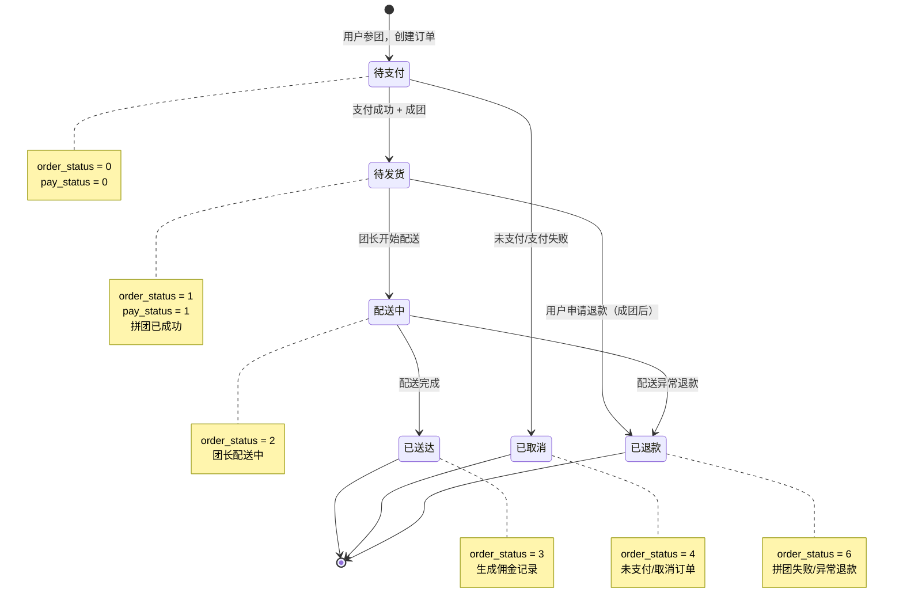

---

## 8. 时序图

### 8.1 完整拼团流程时序图

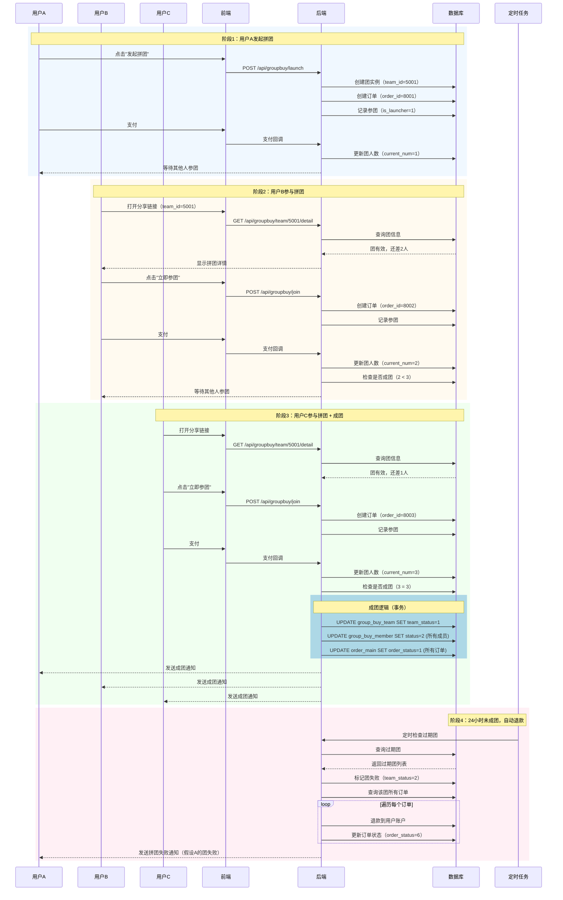

---

## 9. 数据库迁移SQL

### 9.1 迁移说明

**迁移策略**：
1. ✅ 保留现有用户数据（`sys_user` 表）
2. ⚠️ 废弃 `group_buy_join` 表（数据迁移到新表）
3. ✅ 调整 `group_buy` 表字段
4. ✅ 新增 `group_buy_team` 和 `group_buy_member` 表

**执行顺序**：
1. 备份数据库
2. 删除旧外键约束
3. 创建新表
4. 调整现有表
5. 数据迁移（如果需要）
6. 添加新外键约束

---

### 9.2 完整迁移SQL

```sql
-- ==========================================
-- 社区团购系统 - 拼团逻辑优化数据库迁移脚本
-- 版本: v1.0
-- 日期: 2025-10-27
-- 说明: 保留用户数据，优化拼团逻辑
-- ==========================================

USE community_group_buy;

-- ==========================================
-- Step 1: 备份提示
-- ==========================================
-- 请在执行前先备份数据库！
-- mysqldump -u root -p community_group_buy > backup_20251027.sql


-- ==========================================
-- Step 2: 删除旧表的外键约束
-- ==========================================

-- 删除 group_buy_join 表的外键
ALTER TABLE group_buy_join DROP FOREIGN KEY IF EXISTS fk_join_activity;
ALTER TABLE group_buy_join DROP FOREIGN KEY IF EXISTS fk_join_user;

-- 删除 shopping_cart 表关联 group_buy 的外键
ALTER TABLE shopping_cart DROP FOREIGN KEY IF EXISTS fk_cart_activity;

-- 删除 order_item 表关联 group_buy 的外键（暂时删除，后续重建）
ALTER TABLE order_item DROP FOREIGN KEY IF EXISTS fk_item_activity;


-- ==========================================
-- Step 3: 调整 group_buy 表（活动表）
-- ==========================================

-- 删除 leader_id 字段（活动与团长无关）
ALTER TABLE group_buy DROP COLUMN IF EXISTS leader_id;

-- 删除旧的外键约束
ALTER TABLE group_buy DROP FOREIGN KEY IF EXISTS fk_group_leader;

-- 新增 max_num 字段（最大人数限制）
ALTER TABLE group_buy ADD COLUMN max_num INT DEFAULT NULL COMMENT '最大人数限制（可空，无限制）' AFTER required_num;

-- 新增 create_time 字段
ALTER TABLE group_buy ADD COLUMN create_time DATETIME NOT NULL DEFAULT CURRENT_TIMESTAMP COMMENT '创建时间' AFTER link;

-- 调整字段注释
ALTER TABLE group_buy MODIFY COLUMN activity_id BIGINT NOT NULL AUTO_INCREMENT COMMENT '活动ID';
ALTER TABLE group_buy MODIFY COLUMN product_id BIGINT NOT NULL COMMENT '关联商品ID';
ALTER TABLE group_buy MODIFY COLUMN group_price DECIMAL(10,2) NOT NULL COMMENT '拼团价';
ALTER TABLE group_buy MODIFY COLUMN required_num INT NOT NULL DEFAULT 2 COMMENT '成团人数';
ALTER TABLE group_buy MODIFY COLUMN start_time DATETIME NOT NULL COMMENT '活动开始时间';
ALTER TABLE group_buy MODIFY COLUMN end_time DATETIME NOT NULL COMMENT '活动结束时间';
ALTER TABLE group_buy MODIFY COLUMN status TINYINT NOT NULL DEFAULT 1 COMMENT '活动状态（0未开始/1进行中/2已结束/3异常）';
ALTER TABLE group_buy MODIFY COLUMN qrcode_url VARCHAR(255) DEFAULT NULL COMMENT '活动二维码URL';
ALTER TABLE group_buy MODIFY COLUMN link VARCHAR(255) DEFAULT NULL COMMENT '活动专属链接';

-- 调整表注释
ALTER TABLE group_buy COMMENT='拼团活动表（活动模板）';


-- ==========================================
-- Step 4: 创建新表 - 团实例表（group_buy_team）⭐核心
-- ==========================================

DROP TABLE IF EXISTS group_buy_team;

CREATE TABLE group_buy_team (
  team_id BIGINT NOT NULL AUTO_INCREMENT COMMENT '团ID',
  team_no VARCHAR(32) NOT NULL COMMENT '团号（用于分享链接，如：T20251027001）',
  activity_id BIGINT NOT NULL COMMENT '关联活动ID',
  launcher_id BIGINT NOT NULL COMMENT '发起人用户ID',
  leader_id BIGINT NOT NULL COMMENT '归属团长ID（配送团点）',
  required_num INT NOT NULL COMMENT '成团人数（从活动复制）',
  current_num INT NOT NULL DEFAULT 0 COMMENT '当前人数',
  team_status TINYINT NOT NULL DEFAULT 0 COMMENT '团状态（0拼团中/1已成团/2已失败）',
  success_time DATETIME DEFAULT NULL COMMENT '成团时间',
  expire_time DATETIME NOT NULL COMMENT '过期时间（24小时后）',
  create_time DATETIME NOT NULL DEFAULT CURRENT_TIMESTAMP COMMENT '创建时间',
  
  PRIMARY KEY (team_id),
  UNIQUE KEY uk_team_no (team_no),
  INDEX idx_activity_id (activity_id),
  INDEX idx_launcher_id (launcher_id),
  INDEX idx_leader_id (leader_id),
  INDEX idx_team_status (team_status),
  INDEX idx_expire_time (expire_time),
  INDEX idx_create_time (create_time)
) ENGINE=InnoDB DEFAULT CHARSET=utf8mb4 COMMENT='团实例表（具体的团）';


-- ==========================================
-- Step 5: 创建新表 - 参团记录表（group_buy_member）⭐核心
-- ==========================================

DROP TABLE IF EXISTS group_buy_member;

CREATE TABLE group_buy_member (
  member_id BIGINT NOT NULL AUTO_INCREMENT COMMENT '参团记录ID',
  team_id BIGINT NOT NULL COMMENT '团ID',
  user_id BIGINT NOT NULL COMMENT '参团用户ID',
  order_id BIGINT DEFAULT NULL COMMENT '关联订单ID',
  is_launcher TINYINT NOT NULL DEFAULT 0 COMMENT '是否发起人（0否/1是）',
  pay_amount DECIMAL(10,2) NOT NULL COMMENT '支付金额',
  join_time DATETIME NOT NULL DEFAULT CURRENT_TIMESTAMP COMMENT '参团时间',
  status TINYINT NOT NULL DEFAULT 0 COMMENT '状态（0待支付/1已支付/2已成团/3已取消）',
  
  PRIMARY KEY (member_id),
  UNIQUE KEY uk_team_user (team_id, user_id) COMMENT '一个用户不能重复参加同一个团',
  INDEX idx_team_id (team_id),
  INDEX idx_user_id (user_id),
  INDEX idx_order_id (order_id),
  INDEX idx_status (status)
) ENGINE=InnoDB DEFAULT CHARSET=utf8mb4 COMMENT='参团记录表';


-- ==========================================
-- Step 6: 添加外键约束
-- ==========================================

-- group_buy_team 表的外键
ALTER TABLE group_buy_team 
  ADD CONSTRAINT fk_team_activity 
  FOREIGN KEY (activity_id) REFERENCES group_buy(activity_id) ON DELETE CASCADE;

ALTER TABLE group_buy_team 
  ADD CONSTRAINT fk_team_launcher 
  FOREIGN KEY (launcher_id) REFERENCES sys_user(user_id) ON DELETE RESTRICT;

ALTER TABLE group_buy_team 
  ADD CONSTRAINT fk_team_leader 
  FOREIGN KEY (leader_id) REFERENCES sys_user(user_id) ON DELETE RESTRICT;

-- group_buy_member 表的外键
ALTER TABLE group_buy_member 
  ADD CONSTRAINT fk_member_team 
  FOREIGN KEY (team_id) REFERENCES group_buy_team(team_id) ON DELETE CASCADE;

ALTER TABLE group_buy_member 
  ADD CONSTRAINT fk_member_user 
  FOREIGN KEY (user_id) REFERENCES sys_user(user_id) ON DELETE RESTRICT;

ALTER TABLE group_buy_member 
  ADD CONSTRAINT fk_member_order 
  FOREIGN KEY (order_id) REFERENCES order_main(order_id) ON DELETE SET NULL;

-- 恢复 shopping_cart 表的外键
ALTER TABLE shopping_cart 
  ADD CONSTRAINT fk_cart_activity 
  FOREIGN KEY (activity_id) REFERENCES group_buy(activity_id) ON DELETE CASCADE;

-- 恢复 order_item 表的外键
ALTER TABLE order_item 
  ADD CONSTRAINT fk_item_activity 
  FOREIGN KEY (activity_id) REFERENCES group_buy(activity_id) ON DELETE SET NULL;


-- ==========================================
-- Step 7: 备份旧表数据（如果需要）
-- ==========================================

-- 将 group_buy_join 表重命名为备份表（而不是直接删除）
RENAME TABLE group_buy_join TO group_buy_join_backup_20251027;

-- 如果确认不需要旧数据，可以删除备份表：
-- DROP TABLE IF EXISTS group_buy_join_backup_20251027;


-- ==========================================
-- Step 8: 数据迁移（可选）
-- ==========================================

-- 如果有旧的拼团数据需要迁移，请根据实际情况调整以下SQL
-- 示例：将旧的 group_buy_join 数据迁移到新表

/*
-- 假设旧数据中 is_launcher=1 的记录需要创建团实例
INSERT INTO group_buy_team (
  team_no, activity_id, launcher_id, leader_id, 
  required_num, current_num, team_status, expire_time, create_time
)
SELECT 
  CONCAT('T', DATE_FORMAT(j.join_time, '%Y%m%d'), LPAD(j.join_id, 6, '0')) AS team_no,
  j.activity_id,
  j.user_id AS launcher_id,
  1001 AS leader_id,  -- ⚠️ 需要根据实际情况指定团长ID
  a.required_num,
  (SELECT COUNT(*) FROM group_buy_join_backup_20251027 WHERE activity_id = j.activity_id AND status IN (1,2)),
  CASE WHEN j.status = 2 THEN 1 ELSE 0 END AS team_status,
  DATE_ADD(j.join_time, INTERVAL 24 HOUR) AS expire_time,
  j.join_time AS create_time
FROM group_buy_join_backup_20251027 j
LEFT JOIN group_buy a ON j.activity_id = a.activity_id
WHERE j.is_launcher = 1;

-- 迁移参团记录
INSERT INTO group_buy_member (
  team_id, user_id, order_id, is_launcher, 
  pay_amount, join_time, status
)
SELECT 
  t.team_id,
  j.user_id,
  NULL AS order_id,  -- ⚠️ 需要根据实际情况关联订单ID
  j.is_launcher,
  0.00 AS pay_amount,  -- ⚠️ 需要根据实际情况填充
  j.join_time,
  CASE 
    WHEN j.status = 0 THEN 3
    WHEN j.status = 1 THEN 1
    WHEN j.status = 2 THEN 2
    ELSE 3
  END AS status
FROM group_buy_join_backup_20251027 j
LEFT JOIN group_buy_team t ON t.launcher_id = (
  SELECT user_id FROM group_buy_join_backup_20251027 
  WHERE activity_id = j.activity_id AND is_launcher = 1 
  LIMIT 1
);
*/


-- ==========================================
-- Step 9: 验证迁移结果
-- ==========================================

-- 检查新表数据
SELECT '===== group_buy_team 表数据 =====' AS info;
SELECT COUNT(*) AS total_teams FROM group_buy_team;

SELECT '===== group_buy_member 表数据 =====' AS info;
SELECT COUNT(*) AS total_members FROM group_buy_member;

-- 检查外键约束
SELECT '===== 外键约束检查 =====' AS info;
SELECT 
  TABLE_NAME, 
  CONSTRAINT_NAME, 
  REFERENCED_TABLE_NAME
FROM information_schema.KEY_COLUMN_USAGE
WHERE TABLE_SCHEMA = 'community_group_buy'
  AND TABLE_NAME IN ('group_buy', 'group_buy_team', 'group_buy_member')
  AND REFERENCED_TABLE_NAME IS NOT NULL;


-- ==========================================
-- 迁移完成提示
-- ==========================================

SELECT '==========================================';
SELECT '✅ 数据库迁移完成！';
SELECT '==========================================';
SELECT '新表：';
SELECT '  - group_buy_team（团实例表）';
SELECT '  - group_buy_member（参团记录表）';
SELECT '';
SELECT '调整表：';
SELECT '  - group_buy（删除leader_id，新增max_num）';
SELECT '';
SELECT '备份表：';
SELECT '  - group_buy_join_backup_20251027';
SELECT '';
SELECT '⚠️ 请测试新功能后再删除备份表';
SELECT '==========================================';
```

---

### 9.3 回滚SQL（如果需要）

```sql
-- ==========================================
-- 回滚脚本（如果迁移失败）
-- ==========================================

USE community_group_buy;

-- Step 1: 删除新表
DROP TABLE IF EXISTS group_buy_member;
DROP TABLE IF EXISTS group_buy_team;

-- Step 2: 恢复旧表
RENAME TABLE group_buy_join_backup_20251027 TO group_buy_join;

-- Step 3: 恢复 group_buy 表字段
ALTER TABLE group_buy DROP COLUMN IF EXISTS max_num;
ALTER TABLE group_buy DROP COLUMN IF EXISTS create_time;
ALTER TABLE group_buy ADD COLUMN leader_id BIGINT DEFAULT NULL COMMENT '发起团长ID' AFTER product_id;

-- Step 4: 恢复外键约束
ALTER TABLE group_buy 
  ADD CONSTRAINT fk_group_leader 
  FOREIGN KEY (leader_id) REFERENCES sys_user(user_id) ON DELETE SET NULL;

ALTER TABLE group_buy_join 
  ADD CONSTRAINT fk_join_activity 
  FOREIGN KEY (activity_id) REFERENCES group_buy(activity_id) ON DELETE CASCADE;

ALTER TABLE group_buy_join 
  ADD CONSTRAINT fk_join_user 
  FOREIGN KEY (user_id) REFERENCES sys_user(user_id) ON DELETE CASCADE;

SELECT '==========================================';
SELECT '✅ 回滚完成！';
SELECT '==========================================';
```

---

## 10. 总结

### 10.1 优化成果

✅ **逻辑清晰**：
- 清晰区分"活动"与"团实例"
- 支持"一个活动可以有多个团"
- 每个团有独立的团号和状态

✅ **数据一致性**：
- 参团时立即生成订单
- 订单与参团记录一一对应
- 使用数据库事务保证一致性

✅ **用户体验优化**：
- 用户绑定团长，操作简单
- 拼团失败自动退款
- 成团前可以退出

✅ **业务完整性**：
- 完整的状态机设计
- 清晰的业务流程
- 详细的SQL实现

---

### 10.2 技术亮点

1. **三层模型设计**：活动 → 团实例 → 参团记录
2. **事务一致性**：使用数据库事务保证数据一致性
3. **定时任务**：自动检查过期团并退款
4. **状态机设计**：清晰的状态流转逻辑
5. **外键约束**：保证数据完整性

---

### 10.3 后续开发建议

#### 10.3.1 后端开发

**实体类（Entity）**：
```java
// TeamEntity.java
@Entity
@Table(name = "group_buy_team")
public class TeamEntity {
    @Id
    @GeneratedValue(strategy = GenerationType.IDENTITY)
    private Long teamId;
    
    private String teamNo;
    private Long activityId;
    private Long launcherId;
    private Long leaderId;
    private Integer requiredNum;
    private Integer currentNum;
    private Integer teamStatus;
    private LocalDateTime successTime;
    private LocalDateTime expireTime;
    private LocalDateTime createTime;
    
    // getters and setters
}

// MemberEntity.java
@Entity
@Table(name = "group_buy_member")
public class MemberEntity {
    @Id
    @GeneratedValue(strategy = GenerationType.IDENTITY)
    private Long memberId;
    
    private Long teamId;
    private Long userId;
    private Long orderId;
    private Integer isLauncher;
    private BigDecimal payAmount;
    private LocalDateTime joinTime;
    private Integer status;
    
    // getters and setters
}
```

**Service层**：
```java
@Service
public class GroupBuyService {
    
    // 发起拼团
    @Transactional
    public TeamDTO launchTeam(Long userId, Long activityId) {
        // 1. 检查活动有效性
        // 2. 检查用户团长绑定
        // 3. 创建团实例
        // 4. 创建订单
        // 5. 记录参团
        // 6. 返回团信息
    }
    
    // 参与拼团
    @Transactional
    public JoinResult joinTeam(Long userId, Long teamId) {
        // 1. 检查团状态
        // 2. 检查用户是否已参团
        // 3. 创建订单
        // 4. 记录参团
        // 5. 检查是否成团
        // 6. 返回结果
    }
    
    // 支付回调
    @Transactional
    public void paymentCallback(Long orderId) {
        // 1. 更新订单状态
        // 2. 更新参团状态
        // 3. 更新团人数
        // 4. 检查是否成团
        // 5. 如果成团，触发成团逻辑
    }
    
    // 成团逻辑
    @Transactional
    public void teamSuccess(Long teamId) {
        // 1. 更新团状态
        // 2. 更新所有成员状态
        // 3. 更新所有订单状态
        // 4. 发送通知
    }
}

@Service
public class TeamRefundService {
    
    // 拼团失败退款
    @Transactional
    public void refundExpiredTeam(Long teamId) {
        // 1. 标记团失败
        // 2. 查询所有订单
        // 3. 遍历退款
        // 4. 发送通知
    }
}

@Component
public class TeamExpireTask {
    
    @Scheduled(cron = "0 0 * * * ?")  // 每小时执行
    public void checkExpiredTeams() {
        // 1. 查询过期团
        // 2. 遍历执行退款
    }
}
```

#### 10.3.2 前端开发

**路由配置**：
```javascript
// router/index.js
{
  path: '/groupbuy',
  children: [
    {
      path: 'launch/:activityId',
      name: 'GroupBuyLaunch',
      component: () => import('@/views/groupbuy/LaunchView.vue')
    },
    {
      path: 'team/:teamId',
      name: 'GroupBuyTeam',
      component: () => import('@/views/groupbuy/TeamDetailView.vue')
    },
    {
      path: 'my',
      name: 'MyGroupBuy',
      component: () => import('@/views/groupbuy/MyTeamsView.vue')
    }
  ]
}
```

**API封装**：
```javascript
// api/groupbuy.js
import request from '@/utils/request'

export default {
  // 发起拼团
  launchTeam(data) {
    return request({
      url: '/api/groupbuy/launch',
      method: 'post',
      data
    })
  },
  
  // 获取团详情
  getTeamDetail(teamId) {
    return request({
      url: `/api/groupbuy/team/${teamId}/detail`,
      method: 'get'
    })
  },
  
  // 参与拼团
  joinTeam(data) {
    return request({
      url: '/api/groupbuy/join',
      method: 'post',
      data
    })
  },
  
  // 退出拼团
  quitTeam(teamId) {
    return request({
      url: `/api/groupbuy/quit/${teamId}`,
      method: 'post'
    })
  },
  
  // 我的拼团
  getMyTeams(params) {
    return request({
      url: '/api/groupbuy/my',
      method: 'get',
      params
    })
  }
}
```

---

## 附录

### 附录A：快速术语表

| 术语 | 英文 | 说明 |
|-----|------|------|
| 拼团活动 | Activity | 活动模板，定义拼团规则 |
| 团实例 | Team | 具体的团，有唯一团号 |
| 参团记录 | Member | 用户参与团的记录 |
| 成团人数 | Required Number | 达到此人数才能成团 |
| 当前人数 | Current Number | 已参团的人数 |
| 团号 | Team Number | 团的唯一标识，用于分享 |
| 发起人 | Launcher | 创建团的用户 |
| 团长 | Leader | 配送点负责人 |
| 团员 | Member | 加入团点的普通用户 |

### 附录B：状态码枚举

#### 团状态（team_status）
```
0 - 拼团中（JOINING）
1 - 已成团（SUCCESS）
2 - 已失败（FAILED）
```

#### 参团状态（group_buy_member.status）
```
0 - 待支付（UNPAID）
1 - 已支付（PAID）
2 - 已成团（SUCCESS）
3 - 已取消（CANCELLED）
```

#### 订单状态（order_status）
```
0 - 待支付（UNPAID）
1 - 待发货（TO_DELIVER）
2 - 配送中（DELIVERING）
3 - 已送达（DELIVERED）
4 - 已取消（CANCELLED）
5 - 退款中（REFUNDING）
6 - 已退款（REFUNDED）
```

---

**文档结束**


