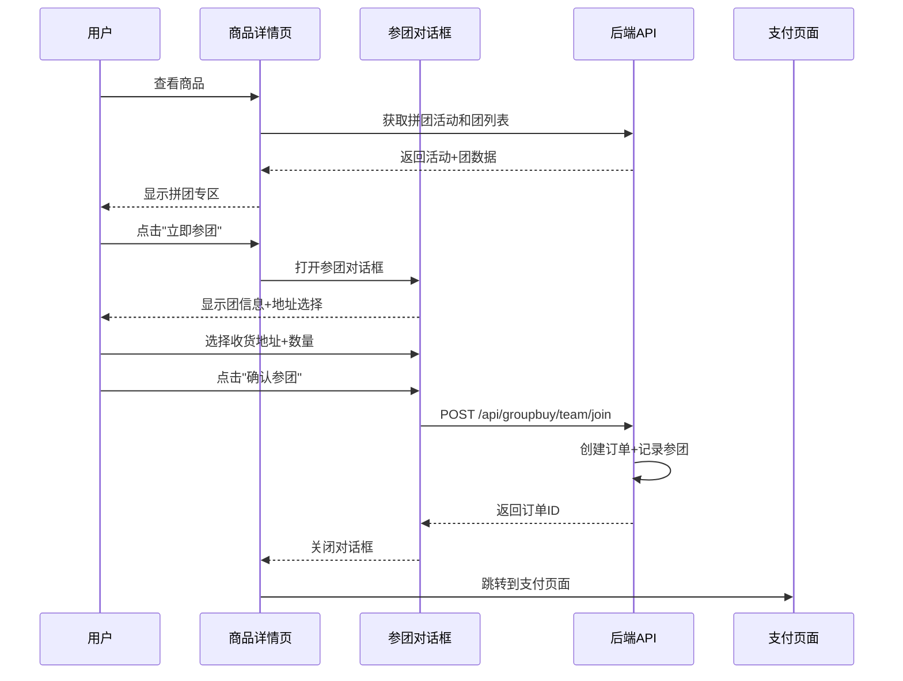

# 商品详情页拼团逻辑优化方案

**创建日期**: 2025-11-01  
**优化目标**: 在商品详情页显示该商品的所有拼团活动和团列表，用户可以直接参团  
**符合规范**: v3.0拼团逻辑（仅团长可发起拼团，用户可参与）

---

## 📋 问题分析

### 当前问题

1. **缺少拼团入口**
   - 商品详情页只有"加入购物车"和"立即购买"按钮
   - 用户无法直接看到该商品的拼团活动

2. **用户体验不佳**
   - 用户需要跳转到"拼团活动列表"页面才能参团
   - 无法在商品详情页直接了解拼团情况

3. **流程不够便捷**
   - 用户需要多次跳转才能完成参团
   - 缺少"快速参团"功能

---

## 🎯 优化目标

### 核心目标

1. ✅ 在商品详情页显示该商品的所有拼团活动
2. ✅ 显示每个活动下进行中的团列表
3. ✅ 支持社区优先显示（本社区的团排在前面）
4. ✅ 用户可以一键参团
5. ✅ 保持v3.0拼团逻辑规范

---

## 🎨 UI设计方案

### 页面布局

```
┌─────────────────────────────────────────────────────┐
│                    商品图片和信息                      │
│  - 商品名称、价格、库存                                │
│  - 加入购物车、立即购买按钮                            │
└─────────────────────────────────────────────────────┘
                      ↓
┌─────────────────────────────────────────────────────┐
│              📍 拼团专区（新增）                        │
│                                                       │
│  【拼团活动1】                                         │
│  - 拼团价：¥XX  成团人数：X人                          │
│  - 活动时间：YYYY-MM-DD ~ YYYY-MM-DD                 │
│                                                       │
│  进行中的团（3个）                          [查看全部]  │
│  ┌─────────────────────────────────────────────┐    │
│  │ 团号：T20251101001  [本社区]                  │    │
│  │ 进度：2/3人  ███████░ 67%                    │    │
│  │ 【参与拼团】                                   │    │
│  └─────────────────────────────────────────────┘    │
│  ┌─────────────────────────────────────────────┐    │
│  │ 团号：T20251101002  [其他社区]                │    │
│  │ 进度：1/3人  ████░░░░ 33%                    │    │
│  │ 【参与拼团】                                   │    │
│  └─────────────────────────────────────────────┘    │
│                                                       │
│  【拼团活动2】                                         │
│  ...                                                  │
└─────────────────────────────────────────────────────┘
                      ↓
┌─────────────────────────────────────────────────────┐
│                  推荐商品                              │
└─────────────────────────────────────────────────────┘
```

---

## 🔧 技术实现方案

### 1. API接口补充

#### 1.1 根据商品ID获取拼团活动

**新增接口（后端需要提供）**:
```javascript
/**
 * 根据商品ID获取拼团活动列表（包含团列表）
 * @param {number} productId - 商品ID
 * @param {object} params - 查询参数
 * @param {number} params.communityId - 用户社区ID（用于社区优先排序）
 * @returns {Promise<Array>} 活动列表（每个活动包含teams字段）
 */
export const getProductGroupBuyActivities = (productId, params) => {
  return request({
    url: `/api/groupbuy/product/${productId}/activities`,
    method: 'GET',
    params
  })
}
```

**返回数据结构**:
```json
[
  {
    "activityId": 1,
    "productId": 101,
    "groupPrice": 29.9,
    "requiredNum": 3,
    "maxNum": null,
    "startTime": "2025-11-01T00:00:00",
    "endTime": "2025-11-10T23:59:59",
    "status": 1,
    "teams": [
      {
        "teamId": 5001,
        "teamNo": "T20251101001",
        "launcherId": 2001,
        "leaderId": 2001,
        "leaderName": "张团长",
        "communityId": 3001,
        "communityName": "阳光小区",
        "requiredNum": 3,
        "currentNum": 2,
        "teamStatus": 0,
        "expireTime": "2025-11-02T12:00:00",
        "createTime": "2025-11-01T12:00:00"
      },
      {
        "teamId": 5002,
        "teamNo": "T20251101002",
        "launcherId": 2002,
        "leaderId": 2002,
        "leaderName": "李团长",
        "communityId": 3002,
        "communityName": "花园小区",
        "requiredNum": 3,
        "currentNum": 1,
        "teamStatus": 0,
        "expireTime": "2025-11-02T14:00:00",
        "createTime": "2025-11-01T14:00:00"
      }
    ]
  }
]
```

---

### 2. 前端组件设计

#### 2.1 组件结构

```
ProductDetailView.vue (主页面)
    ├── ProductGroupBuySection.vue (拼团专区 - 新增)
    │   ├── GroupBuyActivityCard.vue (活动卡片)
    │   │   ├── ActivityInfo (活动信息)
    │   │   └── TeamList (团列表)
    │   │       └── TeamItem (团项目)
    │   │           ├── TeamInfo (团信息)
    │   │           ├── TeamProgress (进度条)
    │   │           └── JoinButton (参团按钮)
    │   └── JoinTeamDialog.vue (参团对话框 - 选择地址)
```

#### 2.2 核心组件实现

**ProductGroupBuySection.vue** (拼团专区组件):
```vue
<template>
  <div class="groupbuy-section">
    <div class="section-header">
      <h2 class="section-title">
        <el-icon><Grid /></el-icon>
        拼团专区
      </h2>
      <p class="section-desc">团购更优惠，支持本社区优先配送</p>
    </div>

    <!-- 加载状态 -->
    <el-skeleton v-if="loading" :rows="4" animated />

    <!-- 活动列表 -->
    <div v-else-if="activities.length > 0" class="activities-list">
      <GroupBuyActivityCard
        v-for="activity in activities"
        :key="activity.activityId"
        :activity="activity"
        :user-community-id="userCommunityId"
        @join-team="handleJoinTeam"
        @view-all-teams="handleViewAllTeams"
      />
    </div>

    <!-- 无活动 -->
    <el-empty 
      v-else 
      description="该商品暂无拼团活动"
      :image-size="120"
    >
      <template #image>
        <el-icon :size="120" color="#909399"><ShoppingCart /></el-icon>
      </template>
    </el-empty>

    <!-- 参团对话框 -->
    <JoinTeamDialog
      v-model="joinDialogVisible"
      :team="selectedTeam"
      :activity="selectedActivity"
      :product="product"
      @confirm="handleConfirmJoin"
    />

    <!-- 全部团列表对话框 -->
    <AllTeamsDialog
      v-model="allTeamsDialogVisible"
      :activity="selectedActivity"
      :user-community-id="userCommunityId"
      @join-team="handleJoinTeam"
    />
  </div>
</template>

<script setup>
import { ref, computed, watch } from 'vue'
import { ElMessage } from 'element-plus'
import { Grid, ShoppingCart } from '@element-plus/icons-vue'
import GroupBuyActivityCard from './GroupBuyActivityCard.vue'
import JoinTeamDialog from './JoinTeamDialog.vue'
import AllTeamsDialog from './AllTeamsDialog.vue'
import { getProductGroupBuyActivities, joinTeam } from '@/api/groupbuy'
import { useUserStore } from '@/stores/user'
import { useRouter } from 'vue-router'

const props = defineProps({
  productId: {
    type: Number,
    required: true
  },
  product: {
    type: Object,
    default: null
  }
})

const router = useRouter()
const userStore = useUserStore()

// 数据
const loading = ref(false)
const activities = ref([])
const joinDialogVisible = ref(false)
const allTeamsDialogVisible = ref(false)
const selectedTeam = ref(null)
const selectedActivity = ref(null)

// 用户社区ID
const userCommunityId = computed(() => {
  return userStore.userInfo?.communityId || null
})

// 获取拼团活动
const fetchActivities = async () => {
  if (!props.productId) return

  loading.value = true
  try {
    const params = userCommunityId.value ? { communityId: userCommunityId.value } : {}
    const data = await getProductGroupBuyActivities(props.productId, params)
    activities.value = data || []
  } catch (error) {
    console.error('获取拼团活动失败:', error)
    // 静默失败，不影响用户体验
  } finally {
    loading.value = false
  }
}

// 参团
const handleJoinTeam = (team, activity) => {
  if (!userStore.isLogin) {
    ElMessage.warning('请先登录')
    router.push('/login')
    return
  }

  selectedTeam.value = team
  selectedActivity.value = activity
  joinDialogVisible.value = true
}

// 确认参团
const handleConfirmJoin = async (data) => {
  try {
    await joinTeam(data)
    ElMessage.success('参团成功，请尽快支付')
    
    // 跳转到支付页面（假设返回了订单ID）
    if (data.orderId) {
      router.push(`/payment?orderId=${data.orderId}`)
    }
    
    // 刷新活动列表
    await fetchActivities()
  } catch (error) {
    console.error('参团失败:', error)
    ElMessage.error(error.message || '参团失败，请稍后重试')
  }
}

// 查看全部团
const handleViewAllTeams = (activity) => {
  selectedActivity.value = activity
  allTeamsDialogVisible.value = true
}

// 监听商品ID变化
watch(() => props.productId, () => {
  fetchActivities()
}, { immediate: true })
</script>

<style scoped>
.groupbuy-section {
  margin-top: 40px;
  padding: 30px;
  background: linear-gradient(135deg, #fff5f5 0%, #ffe6e6 100%);
  border-radius: 12px;
  border: 2px dashed #f56c6c;
}

.section-header {
  margin-bottom: 24px;
  text-align: center;
}

.section-title {
  display: flex;
  align-items: center;
  justify-content: center;
  gap: 8px;
  font-size: 24px;
  font-weight: bold;
  color: #f56c6c;
  margin: 0 0 8px 0;
}

.section-desc {
  font-size: 14px;
  color: #909399;
  margin: 0;
}

.activities-list {
  display: flex;
  flex-direction: column;
  gap: 20px;
}
</style>
```

**GroupBuyActivityCard.vue** (活动卡片组件):
```vue
<template>
  <el-card class="activity-card" shadow="hover">
    <!-- 活动信息 -->
    <div class="activity-header">
      <div class="activity-info">
        <el-tag type="danger" size="large" effect="dark">拼团活动</el-tag>
        <div class="price-info">
          <span class="group-price">¥{{ activity.groupPrice }}</span>
          <span class="price-label">拼团价</span>
        </div>
        <div class="people-info">
          <el-icon><User /></el-icon>
          <span>{{ activity.requiredNum }}人成团</span>
        </div>
      </div>
      <div class="activity-time">
        <el-icon><Clock /></el-icon>
        <span>{{ formatTimeRange(activity.startTime, activity.endTime) }}</span>
      </div>
    </div>

    <!-- 团列表 -->
    <div v-if="activity.teams && activity.teams.length > 0" class="teams-section">
      <div class="teams-header">
        <span class="teams-count">进行中的团（{{ activity.teams.length }}）</span>
        <el-button 
          v-if="activity.teams.length > 3"
          link 
          type="primary"
          @click="emit('view-all-teams', activity)"
        >
          查看全部
        </el-button>
      </div>

      <div class="teams-list">
        <div 
          v-for="team in displayTeams" 
          :key="team.teamId"
          class="team-item"
        >
          <!-- 团信息 -->
          <div class="team-header">
            <div class="team-info">
              <span class="team-no">{{ team.teamNo }}</span>
              <el-tag 
                v-if="team.communityId === userCommunityId"
                type="success" 
                size="small"
                effect="dark"
              >
                本社区
              </el-tag>
              <el-tag 
                v-else-if="team.communityName"
                size="small"
              >
                {{ team.communityName }}
              </el-tag>
            </div>
            <span class="leader-name">{{ team.leaderName }}团长</span>
          </div>

          <!-- 进度条 -->
          <div class="team-progress">
            <div class="progress-info">
              <span class="progress-text">{{ team.currentNum }}/{{ team.requiredNum }}人</span>
              <span class="expire-time">剩余{{ getExpireTime(team.expireTime) }}</span>
            </div>
            <el-progress 
              :percentage="(team.currentNum / team.requiredNum) * 100"
              :stroke-width="10"
              :color="getProgressColor(team.currentNum, team.requiredNum)"
            />
          </div>

          <!-- 参团按钮 -->
          <el-button 
            type="primary"
            size="large"
            class="join-button"
            @click="emit('join-team', team, activity)"
          >
            <el-icon><UserFilled /></el-icon>
            立即参团
          </el-button>
        </div>
      </div>
    </div>

    <!-- 无团提示 -->
    <div v-else class="no-teams">
      <el-icon :size="40" color="#909399"><InfoFilled /></el-icon>
      <p>该活动暂无进行中的团</p>
      <p class="hint">可以等待团长发起新的团哦~</p>
    </div>
  </el-card>
</template>

<script setup>
import { computed } from 'vue'
import { User, Clock, UserFilled, InfoFilled } from '@element-plus/icons-vue'
import { formatDateRange, getTimeRemaining } from '@/utils/formatter'

const props = defineProps({
  activity: {
    type: Object,
    required: true
  },
  userCommunityId: {
    type: Number,
    default: null
  }
})

const emit = defineEmits(['join-team', 'view-all-teams'])

// 显示前3个团
const displayTeams = computed(() => {
  return props.activity.teams?.slice(0, 3) || []
})

// 格式化时间范围
const formatTimeRange = (start, end) => {
  return formatDateRange(start, end)
}

// 计算剩余时间
const getExpireTime = (expireTime) => {
  return getTimeRemaining(expireTime)
}

// 进度条颜色
const getProgressColor = (current, required) => {
  const percentage = (current / required) * 100
  if (percentage >= 80) return '#67c23a'
  if (percentage >= 50) return '#e6a23c'
  return '#409eff'
}
</script>

<style scoped>
.activity-card {
  border-radius: 12px;
}

.activity-header {
  display: flex;
  justify-content: space-between;
  align-items: center;
  margin-bottom: 20px;
  padding-bottom: 16px;
  border-bottom: 2px solid #f5f7fa;
}

.activity-info {
  display: flex;
  align-items: center;
  gap: 16px;
}

.price-info {
  display: flex;
  flex-direction: column;
  align-items: center;
}

.group-price {
  font-size: 28px;
  font-weight: bold;
  color: #f56c6c;
  line-height: 1;
}

.price-label {
  font-size: 12px;
  color: #909399;
  margin-top: 4px;
}

.people-info {
  display: flex;
  align-items: center;
  gap: 4px;
  font-size: 14px;
  color: #606266;
  padding: 8px 16px;
  background: #f5f7fa;
  border-radius: 20px;
}

.activity-time {
  display: flex;
  align-items: center;
  gap: 4px;
  font-size: 13px;
  color: #909399;
}

.teams-section {
  margin-top: 16px;
}

.teams-header {
  display: flex;
  justify-content: space-between;
  align-items: center;
  margin-bottom: 12px;
}

.teams-count {
  font-size: 15px;
  font-weight: 500;
  color: #303133;
}

.teams-list {
  display: flex;
  flex-direction: column;
  gap: 12px;
}

.team-item {
  padding: 16px;
  background: #f8f9fa;
  border-radius: 8px;
  transition: all 0.3s;
}

.team-item:hover {
  background: #ecf5ff;
  transform: translateX(4px);
}

.team-header {
  display: flex;
  justify-content: space-between;
  align-items: center;
  margin-bottom: 12px;
}

.team-info {
  display: flex;
  align-items: center;
  gap: 8px;
}

.team-no {
  font-size: 14px;
  font-weight: 500;
  color: #303133;
}

.leader-name {
  font-size: 13px;
  color: #606266;
}

.team-progress {
  margin-bottom: 12px;
}

.progress-info {
  display: flex;
  justify-content: space-between;
  margin-bottom: 8px;
  font-size: 13px;
}

.progress-text {
  color: #303133;
  font-weight: 500;
}

.expire-time {
  color: #f56c6c;
}

.join-button {
  width: 100%;
}

.no-teams {
  text-align: center;
  padding: 40px 20px;
  color: #909399;
}

.no-teams p {
  margin: 8px 0;
  font-size: 14px;
}

.no-teams .hint {
  font-size: 12px;
  color: #c0c4cc;
}
</style>
```

---

### 3. 参团流程设计

#### 3.1 参团流程图



#### 3.2 JoinTeamDialog组件

```vue
<template>
  <el-dialog
    :model-value="modelValue"
    title="参与拼团"
    width="600px"
    @update:model-value="emit('update:modelValue', $event)"
    @close="handleClose"
  >
    <div v-if="team" class="dialog-content">
      <!-- 团信息 -->
      <div class="team-info-section">
        <h3>团信息</h3>
        <el-descriptions :column="2" border>
          <el-descriptions-item label="团号">
            {{ team.teamNo }}
          </el-descriptions-item>
          <el-descriptions-item label="团长">
            {{ team.leaderName }}
          </el-descriptions-item>
          <el-descriptions-item label="进度">
            {{ team.currentNum }}/{{ team.requiredNum }}人
          </el-descriptions-item>
          <el-descriptions-item label="过期时间">
            {{ formatDateTime(team.expireTime) }}
          </el-descriptions-item>
        </el-descriptions>
      </div>

      <!-- 商品信息 -->
      <div class="product-info-section">
        <h3>商品信息</h3>
        <div class="product-item">
          
          <div class="product-details">
            <div class="product-name">{{ product.productName }}</div>
            <div class="product-price">拼团价：¥{{ activity.groupPrice }}</div>
          </div>
        </div>
      </div>

      <!-- 购买数量 -->
      <div class="quantity-section">
        <h3>购买数量</h3>
        <el-input-number
          v-model="form.quantity"
          :min="1"
          :max="product.stock"
        />
      </div>

      <!-- 收货地址选择 -->
      <div class="address-section">
        <h3>收货地址</h3>
        <el-radio-group v-model="form.addressId" class="address-list">
          <el-radio
            v-for="addr in addresses"
            :key="addr.addressId"
            :label="addr.addressId"
            border
            class="address-item"
          >
            <div class="address-content">
              <div class="address-main">
                <span class="receiver">{{ addr.receiverName }}</span>
                <span class="phone">{{ addr.phone }}</span>
                <el-tag v-if="addr.isDefault === 1" type="danger" size="small">
                  默认
                </el-tag>
              </div>
              <div class="address-detail">
                {{ addr.province }} {{ addr.city }} {{ addr.district }} {{ addr.detailAddress }}
              </div>
            </div>
          </el-radio>
        </el-radio-group>

        <el-button 
          type="primary" 
          link 
          @click="handleAddAddress"
        >
          + 添加新地址
        </el-button>
      </div>
    </div>

    <template #footer>
      <div class="dialog-footer">
        <div class="total-price">
          合计：<span class="price">¥{{ totalPrice }}</span>
        </div>
        <div class="buttons">
          <el-button @click="handleClose">取消</el-button>
          <el-button 
            type="primary" 
            @click="handleConfirm"
            :loading="submitting"
            :disabled="!form.addressId"
          >
            确认参团
          </el-button>
        </div>
      </div>
    </template>
  </el-dialog>
</template>

<script setup>
import { ref, computed, watch } from 'vue'
import { useRouter } from 'vue-router'
import { ElMessage } from 'element-plus'
import { getUserAddresses } from '@/api/user'
import { formatDateTime } from '@/utils/formatter'

const props = defineProps({
  modelValue: Boolean,
  team: Object,
  activity: Object,
  product: Object
})

const emit = defineEmits(['update:modelValue', 'confirm'])
const router = useRouter()

// 表单数据
const form = ref({
  addressId: null,
  quantity: 1
})

const addresses = ref([])
const submitting = ref(false)

// 计算总价
const totalPrice = computed(() => {
  if (!props.activity) return 0
  return (props.activity.groupPrice * form.value.quantity).toFixed(2)
})

// 获取地址列表
const fetchAddresses = async () => {
  try {
    const data = await getUserAddresses()
    addresses.value = data || []
    // 自动选择默认地址
    const defaultAddr = addresses.value.find(addr => addr.isDefault === 1)
    if (defaultAddr) {
      form.value.addressId = defaultAddr.addressId
    }
  } catch (error) {
    console.error('获取地址列表失败:', error)
  }
}

// 确认参团
const handleConfirm = () => {
  if (!form.value.addressId) {
    ElMessage.warning('请选择收货地址')
    return
  }

  emit('confirm', {
    teamId: props.team.teamId,
    addressId: form.value.addressId,
    quantity: form.value.quantity
  })
}

// 关闭
const handleClose = () => {
  emit('update:modelValue', false)
  // 重置表单
  form.value = {
    addressId: null,
    quantity: 1
  }
}

// 添加地址
const handleAddAddress = () => {
  router.push('/user/address')
}

// 监听对话框打开
watch(() => props.modelValue, (newVal) => {
  if (newVal) {
    fetchAddresses()
  }
})
</script>

<style scoped>
.dialog-content {
  max-height: 60vh;
  overflow-y: auto;
}

.team-info-section,
.product-info-section,
.quantity-section,
.address-section {
  margin-bottom: 24px;
}

.team-info-section h3,
.product-info-section h3,
.quantity-section h3,
.address-section h3 {
  font-size: 16px;
  font-weight: 500;
  color: #303133;
  margin: 0 0 12px 0;
}

.product-item {
  display: flex;
  gap: 12px;
  padding: 12px;
  background: #f5f7fa;
  border-radius: 8px;
}

.product-item img {
  width: 80px;
  height: 80px;
  object-fit: cover;
  border-radius: 4px;
}

.product-details {
  flex: 1;
  display: flex;
  flex-direction: column;
  justify-content: center;
  gap: 8px;
}

.product-name {
  font-size: 14px;
  font-weight: 500;
  color: #303133;
}

.product-price {
  font-size: 16px;
  font-weight: bold;
  color: #f56c6c;
}

.address-list {
  display: flex;
  flex-direction: column;
  gap: 12px;
  width: 100%;
}

.address-item {
  width: 100%;
  margin: 0;
}

.address-content {
  width: 100%;
}

.address-main {
  display: flex;
  align-items: center;
  gap: 8px;
  margin-bottom: 4px;
}

.receiver {
  font-size: 14px;
  font-weight: 500;
  color: #303133;
}

.phone {
  font-size: 13px;
  color: #606266;
}

.address-detail {
  font-size: 13px;
  color: #909399;
  line-height: 1.5;
}

.dialog-footer {
  display: flex;
  justify-content: space-between;
  align-items: center;
}

.total-price {
  font-size: 16px;
  color: #303133;
}

.total-price .price {
  font-size: 24px;
  font-weight: bold;
  color: #f56c6c;
  margin-left: 8px;
}

.buttons {
  display: flex;
  gap: 12px;
}
</style>
```

---

## 📝 API接口补充说明

### 后端需要提供的新接口

#### 1. 根据商品ID获取拼团活动（包含团列表）

**接口**: `GET /api/groupbuy/product/{productId}/activities`

**请求参数**:
- `communityId` (可选): 用户社区ID，用于社区优先排序

**返回数据**:
```json
[
  {
    "activityId": 1,
    "productId": 101,
    "groupPrice": 29.9,
    "requiredNum": 3,
    "maxNum": null,
    "startTime": "2025-11-01T00:00:00",
    "endTime": "2025-11-10T23:59:59",
    "status": 1,
    "teams": [
      {
        "teamId": 5001,
        "teamNo": "T20251101001",
        "launcherId": 2001,
        "leaderId": 2001,
        "leaderName": "张团长",
        "communityId": 3001,
        "communityName": "阳光小区",
        "requiredNum": 3,
        "currentNum": 2,
        "teamStatus": 0,
        "expireTime": "2025-11-02T12:00:00",
        "createTime": "2025-11-01T12:00:00"
      }
    ]
  }
]
```

**SQL实现示例**:
```sql
-- Step 1: 查询商品的拼团活动
SELECT * FROM group_buy
WHERE product_id = ?
  AND status = 1
  AND NOW() BETWEEN start_time AND end_time
ORDER BY create_time DESC;

-- Step 2: 对于每个活动，查询进行中的团（社区优先排序）
SELECT 
  t.*,
  l.leader_name,
  c.community_name
FROM group_buy_team t
LEFT JOIN group_leader_store l ON t.leader_id = l.leader_id
LEFT JOIN community c ON t.community_id = c.community_id
WHERE t.activity_id = ?
  AND t.team_status = 0
  AND t.current_num < t.required_num
  AND t.expire_time > NOW()
ORDER BY 
  CASE WHEN t.community_id = ? THEN 0 ELSE 1 END ASC, -- 社区优先
  t.create_time DESC
LIMIT 10;
```

---

## 🎯 优化效果

### 优化前 vs 优化后

| 对比项 | 优化前 | 优化后 |
|-------|-------|-------|
| **拼团入口** | 需跳转到拼团列表页 | 商品详情页直接显示 |
| **操作步骤** | 4步（商品→列表→活动→参团） | 2步（商品→参团） |
| **用户体验** | 繁琐 | 便捷 |
| **社区优先** | 不支持 | 支持（本社区团优先显示） |
| **转化率** | 低 | 高 ⬆️ |

---

## 🚀 实施步骤

### 阶段1：API接口开发（后端）

1. [ ] 开发 `GET /api/groupbuy/product/{productId}/activities` 接口
2. [ ] 实现社区优先排序逻辑
3. [ ] 接口测试和文档更新

### 阶段2：前端组件开发

1. [ ] 创建 `ProductGroupBuySection.vue` 组件
2. [ ] 创建 `GroupBuyActivityCard.vue` 组件
3. [ ] 创建 `JoinTeamDialog.vue` 组件
4. [ ] 更新 `ProductDetailView.vue` 集成拼团专区

### 阶段3：API调用和联调

1. [ ] 在 `groupbuy.js` 添加新接口
2. [ ] 前后端联调测试
3. [ ] 修复Bug和优化体验

### 阶段4：测试和上线

1. [ ] 功能测试（加入拼团流程）
2. [ ] UI测试（响应式适配）
3. [ ] 社区优先功能测试
4. [ ] 上线发布

---

## ✅ 验收标准

### 功能验收

- [ ] 商品详情页能正确显示该商品的所有拼团活动
- [ ] 每个活动显示进行中的团列表（最多3个预览）
- [ ] 支持社区优先显示（本社区的团排在前面）
- [ ] 用户可以点击"立即参团"按钮
- [ ] 参团对话框正确显示团信息、商品信息、地址选择
- [ ] 确认参团后创建订单并跳转到支付页面
- [ ] 无拼团活动时显示友好的空状态

### 体验验收

- [ ] 页面加载速度快（<2秒）
- [ ] UI美观、布局合理
- [ ] 移动端适配良好
- [ ] 交互流畅、无卡顿
- [ ] 错误提示友好

---

## 📚 相关文档

- [拼团逻辑优化方案v3.0](./拼团逻辑优化方案.md)
- [API_GroupBuyService](./二级文档（参考）/API_GroupBuyService.md)
- [数据库设计说明文档](./二级文档（参考）/数据库设计说明文档_v6.0.md)

---

**文档版本**: v1.0  
**创建日期**: 2025-11-01  
**状态**: ✅ 方案已完成，待实施

