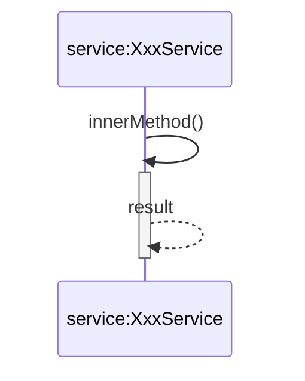
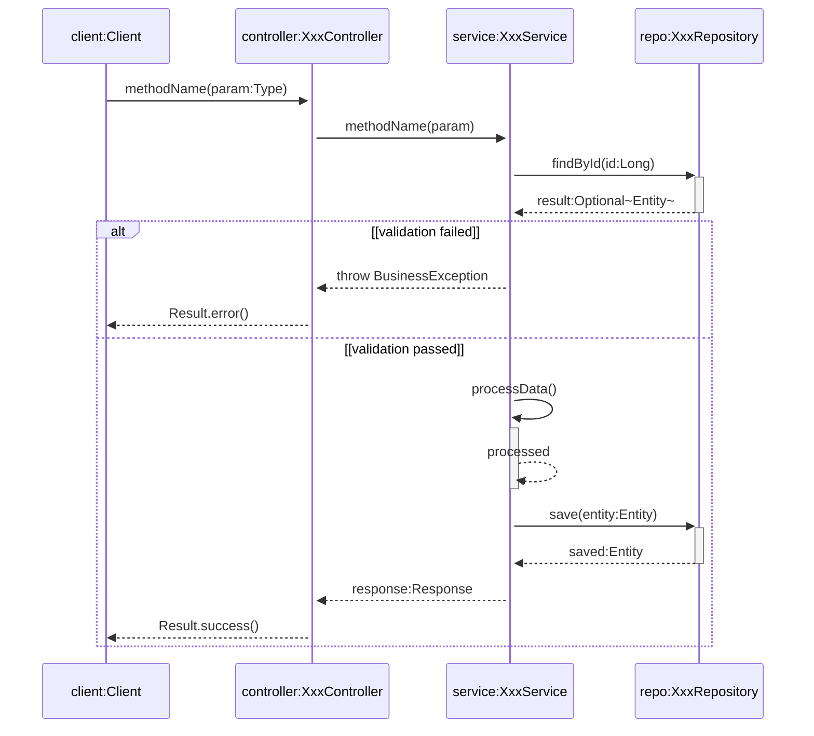

# UML时序图绘制规范总结

## 1. 参与者命名规范

两种合法格式（二选一）：

| 格式 | 示例 | 说明 |
|------|------|------|
| `object:Class`（带下划线） | `_controller:UserController_` | 对象:类 格式必须带下划线 |
| `a participant`（不带下划线） | `a client` | 参与者描述方式，不带下划线 |

**注意**：不能混用，选择一种风格保持一致。

## 2. 必须包含的元素

| 元素 | 说明 | Mermaid语法 |
|------|------|-------------|
| **激活条(Activation)** | 表示对象活跃期 | `->>+` 激活，`-->>-` 停用 |
| **组合片段(Combined Fragment)** | 表示逻辑控制 | `alt/opt/loop/par/break` 等 |
| **返回消息** | 虚线箭头 | `-->>` |

## 3. 组合片段类型

| 类型 | 用途 | 语法/说明 |
|------|------|-----------|
| **alt** | 抉择（互斥分支） | 类似 if/else 或 switch，每个分支有守卫条件，只有一个分支执行 |
| **opt** | 选项（单一可选） | 条件为真时执行，类似无 else 的 if |
| **loop** | 循环 | 重复执行片段，可指定最小/最大次数或条件 |
| **par** | 并行 | 多个片段可并行执行，消息可交错 |
| **break** | 中断 | 条件满足时执行片段并终止后续序列 |
| **critical/region** | 关键区 | 并行环境中保证片段内消息不与其他消息交错 |
| **seq** | 弱顺序 | 控制不同生命线间消息的执行顺序 |
| **strict** | 强顺序 | 比 seq 更严格的顺序控制 |
| **assert** | 断言 | 表示唯一有效序列 |
| **neg** | 否定 | 表示禁止发生的序列 |
| **consider** | 考虑 | 限制特定消息集合 |
| **ignore** | 忽略 | 忽略特定消息集合 |
| **ref** | 引用 | 引用其他顺序图作为子过程 |

### 组合片段绘制要求

- **条件靠左对齐**：每个 frame 的守卫条件统一靠左对齐
- **简洁原则**：相同的返回消息（如多个错误分支）只需画一个，不必每条线都画出来

### Mermaid 常用语法

```
alt [condition]
    ... messages ...
else [condition]
    ... messages ...
end

opt [condition]
    ... messages ...
end

loop [min, max] or [condition]
    ... messages ...
end

par [task description]
    ... messages ...
and [task description]
    ... messages ...
end

break [condition]
    ... messages ...
end
```

## 4. 特殊消息类型

| 类型 | 说明 | 语法 | 要求 |
|------|------|------|------|
| **Found Message** | 外部触发 | `Note over obj: Found Message` | - |
| **Create** | 创建对象 | `create participant obj as obj:Class` | - |
| **Destroy** | 销毁对象 | `destroy obj` + `-xobj: dispose` | - |
| **Self-call** | 自调用 | `service->>service: method()` | **必须嵌入单独的控制焦点小长条** |

### Self-call 绘制要求

自调用必须显示嵌套的激活条（控制焦点），表示方法内部调用：



## 5. 其他要求

- **使用英文**表述
- 参数格式：`参数名:类型`
- 返回值格式：`变量名:类型`
- **不加消息编号**
- **图形简洁**：把意思表达明白即可，不必每条线都画出来

## 6. 标准模板



**注意**：
1. 参与者命名统一使用 `object:Class` 格式，不能混用
2. alt/else 分支内部的返回消息使用普通 `-->>` 而非 `-->>-`，避免在分支内停用外层激活条
3. self-call 需要独立的激活/停用周期（`->>+` 和 `-->>-`）
