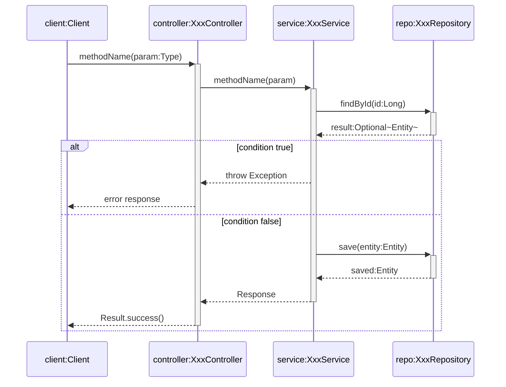

# UML时序图绘制规范总结

## 1. 参与者命名规范

| 格式 | 示例 |
|------|------|
| `对象:类` | `controller:UserController` |
| `对象:类` | `service:UserService` |
| `对象:类` | `userRepo:SysUserRepository` |

## 2. 必须包含的元素

| 元素 | 说明 | Mermaid语法 |
|------|------|-------------|
| **激活条(Activation)** | 表示对象活跃期 | `->>+` 激活，`-->>-` 停用 |
| **组合片段(Combined Fragment)** | 表示逻辑控制 | `alt/opt/loop/par` |
| **返回消息** | 虚线箭头 | `-->>` |

## 3. 组合片段类型

| 类型 | 用途 | 语法 |
|------|------|------|
| **alt** | if-else分支 | `alt ... else ... end` |
| **opt** | 可选执行 | `opt ... end` |
| **loop** | 循环 | `loop ... end` |
| **par** | 并行执行 | `par ... and ... end` |

## 4. 特殊消息类型

| 类型 | 说明 | 语法 |
|------|------|------|
| **Found Message** | 外部触发 | `Note over obj: Found Message` |
| **Create** | 创建对象 | `create participant obj as obj:Class` |
| **Destroy** | 销毁对象 | `destroy obj` + `-xobj: dispose` |
| **Self-call** | 自调用 | `service->>service: method()` |

## 5. 其他要求

- **使用英文**表述
- 参数格式：`参数名:类型`
- 返回值格式：`变量名:类型`
- **不加消息编号**

## 6. 标准模板

