# UML活动图绘制规范

## 1. 概述

活动图（Activity Diagram）是UML中用于对系统动态方面建模的一种图。一张活动图从本质来说是一个流程图，显示从活动到活动的控制流。活动图主要用于对计算过程中顺序的（或并发的）步骤进行建模。

### 1.1 与其他图的区别

| 图类型 | 强调重点 | 适用场景 |
|--------|----------|----------|
| **交互图（时序图）** | 从对象到对象的控制流 | 对象间消息传递 |
| **状态图** | 从状态到状态的流程 | 对象生命周期 |
| **活动图** | 从活动到活动的控制流 | 业务流程、算法步骤 |

### 1.2 适用场景

- 业务流程建模
- 用例的详细描述
- 算法的可视化表示
- 并发处理流程
- 工作流程描述

## 2. 活动图核心要素

### 2.1 基本元素

| 要素 | 符号 | 说明 | Mermaid语法 |
|------|------|------|-------------|
| **初始节点** | 实心圆 | 活动的起点，只能有一个 | `[*]` 或 `Start` |
| **终止节点** | 圆圈内实心圆 | 活动的终点，可以有多个 | `[*]` 或 `Stop` |
| **动作状态** | 圆角矩形 | 表示一个原子动作 | `ActionName` |
| **判定节点** | 菱形 | 条件分支，根据守卫条件选择路径 | `{decision}` |
| **合并节点** | 菱形 | 多条路径汇合为一条 | `{merge}` |
| **分叉节点** | 粗横线 | 一条路径分为多条并发路径 | `fork` |
| **汇合节点** | 粗横线 | 多条并发路径同步汇合 | `join` |
| **泳道** | 垂直/水平分隔区域 | 表示不同参与者的职责 | `subgraph` |

### 2.2 连接元素

| 要素 | 说明 | Mermaid语法 |
|------|------|-------------|
| **控制流** | 动作之间的转移，用箭头表示 | `-->` |
| **守卫条件** | 方括号包围的布尔表达式 | `-->[condition]` |
| **对象流** | 表示数据/对象的传递 | `-->` 配合对象节点 |

## 3. 命名规范

### 3.1 动作状态命名

动作状态应使用**动词或动词短语**，表示正在执行的动作。

| 格式 | 示例 | 说明 |
|------|------|------|
| 动词 + 宾语 | `验证用户信息`、`创建订单` | 推荐格式 |
| 英文动词短语 | `ValidateUser`、`CreateOrder` | 代码相关时使用 |

**正确示例**：`提交订单`、`验证库存`、`扣减余额`、`发送通知`
**错误示例**：`订单`、`库存验证`、`余额`（这些是名词，不是动作）

### 3.2 守卫条件命名

守卫条件应为**布尔表达式**，用方括号包围。

```
[库存充足]
[余额 >= 订单金额]
[审核通过]
[用户已登录]
```

## 4. Mermaid活动图语法

Mermaid使用flowchart语法绘制活动图。

### 4.1 基本语法

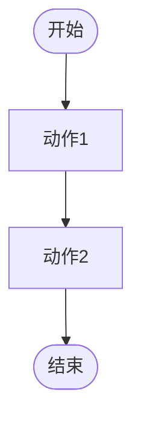

### 4.2 节点形状

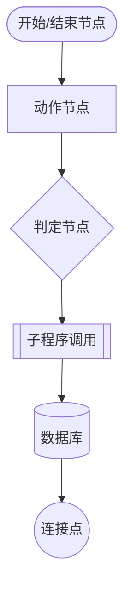

| 语法 | 形状 | 用途 |
|------|------|------|
| `([text])` | 圆角矩形（椭圆） | 开始/结束节点 |
| `[text]` | 矩形 | 动作节点 |
| `{text}` | 菱形 | 判定/合并节点 |
| `[[text]]` | 双边矩形 | 子程序调用 |
| `[(text)]` | 圆柱形 | 数据库 |
| `((text))` | 圆形 | 连接点 |

### 4.3 判定分支

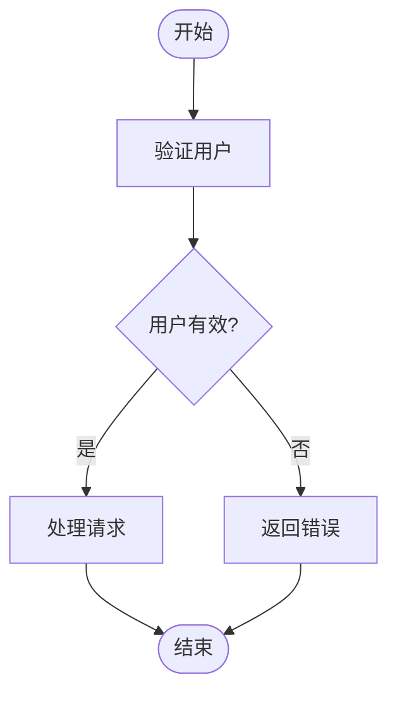

### 4.4 并发处理（Fork/Join）

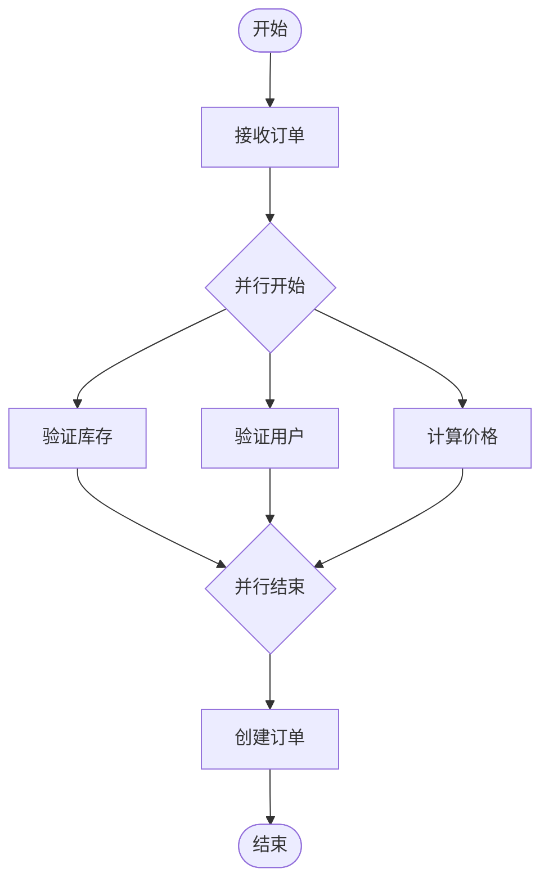

### 4.5 泳道（使用subgraph）

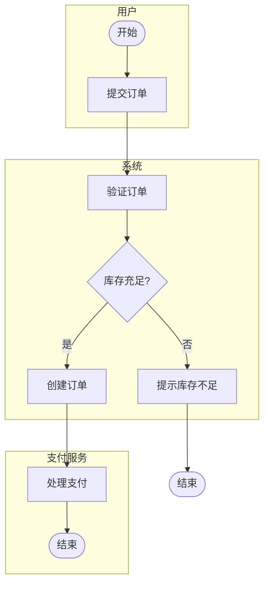

### 4.6 循环结构

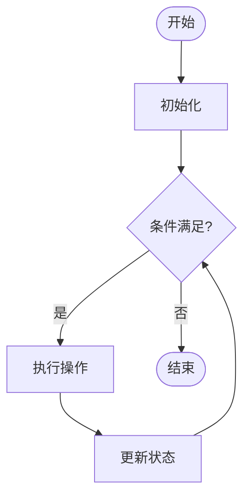

### 4.7 异常处理

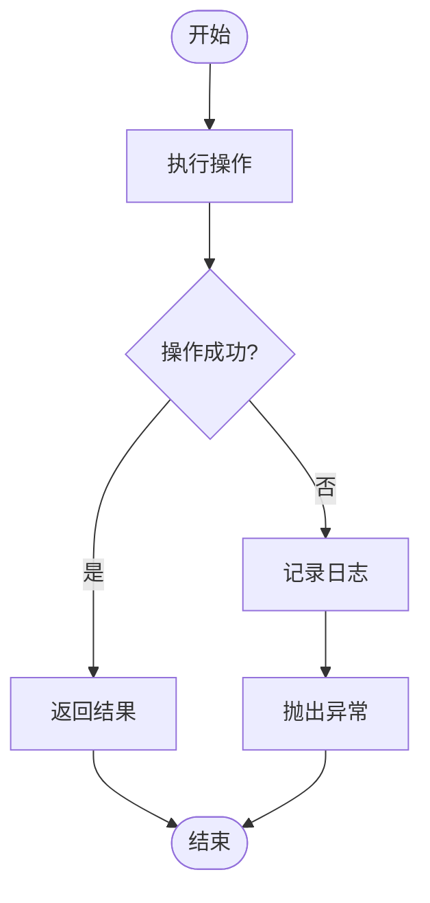

## 5. 绘制要求

### 5.1 必须包含的元素

| 元素 | 要求 |
|------|------|
| **初始节点** | 必须有且仅有一个 |
| **终止节点** | 至少一个（可以有多个） |
| **动作节点** | 至少两个有意义的动作 |
| **控制流** | 所有节点必须连接 |

### 5.2 绘制原则

1. **完整性**：覆盖流程的所有可能路径
2. **可达性**：从初始节点出发，所有节点都应可达
3. **终止性**：所有路径最终都应到达终止节点
4. **清晰性**：避免交叉线，保持流程清晰

### 5.3 布局建议

- 流程方向：从上到下（TD）或从左到右（LR）
- 初始节点放在顶部或左侧
- 终止节点放在底部或右侧
- 主流程保持直线
- 分支向两侧展开
- 并发路径保持对称

## 6. 常见活动图模式

### 6.1 顺序流程

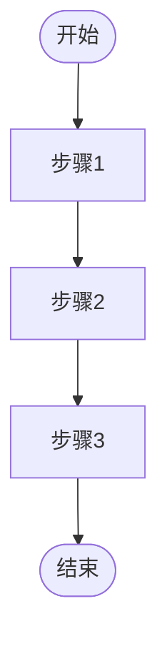

### 6.2 条件分支

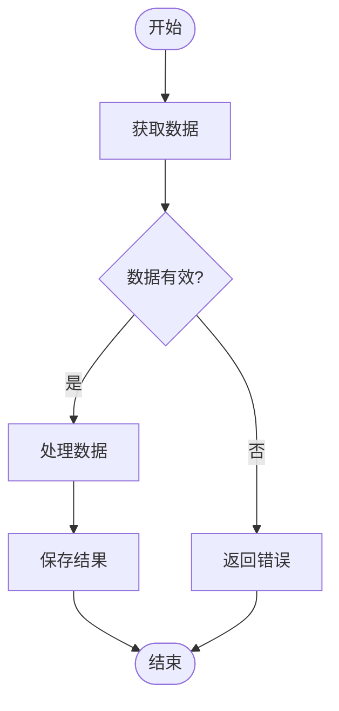

### 6.3 多条件分支

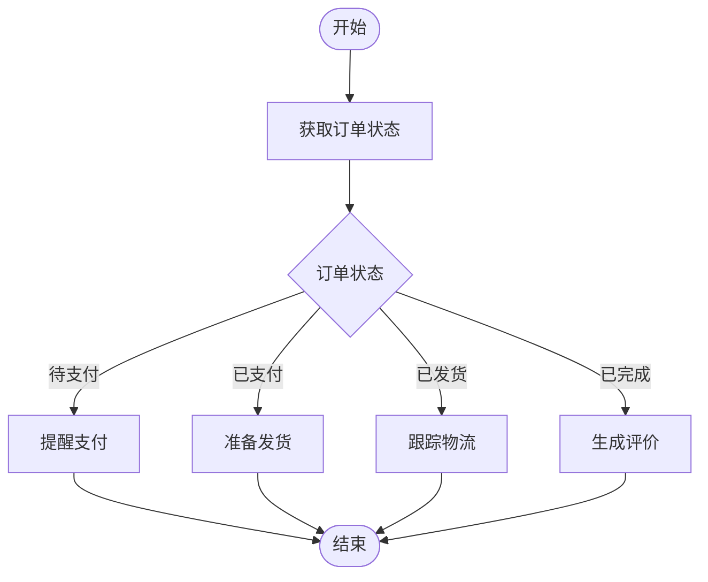

### 6.4 循环处理

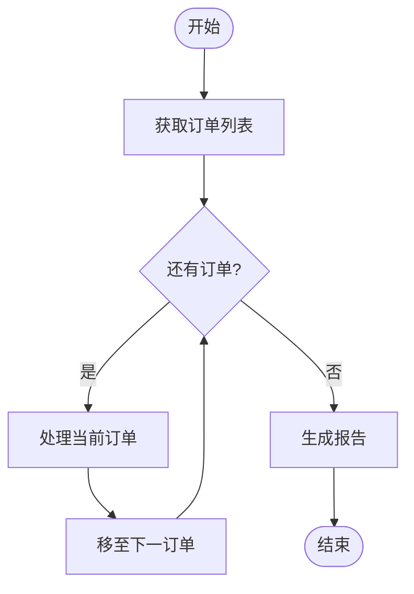

### 6.5 并发处理

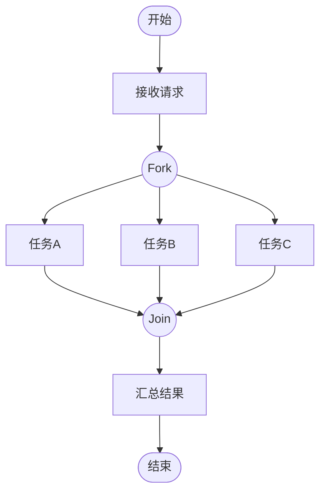

### 6.6 带泳道的业务流程

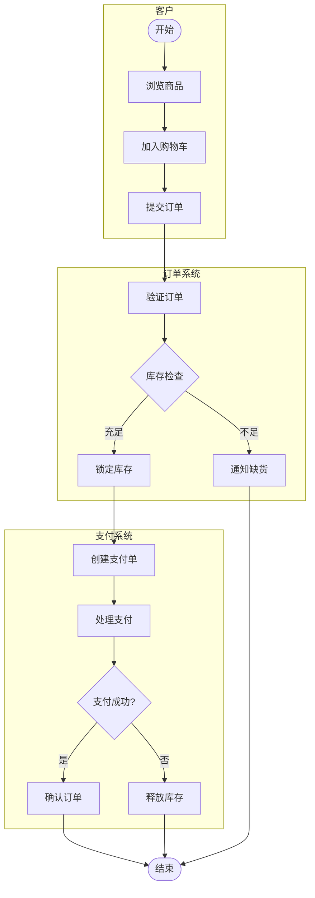

## 7. 标准模板

### 7.1 简单流程模板

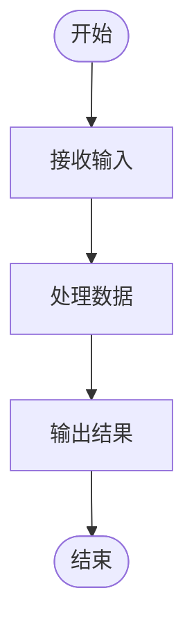

### 7.2 带验证的流程模板

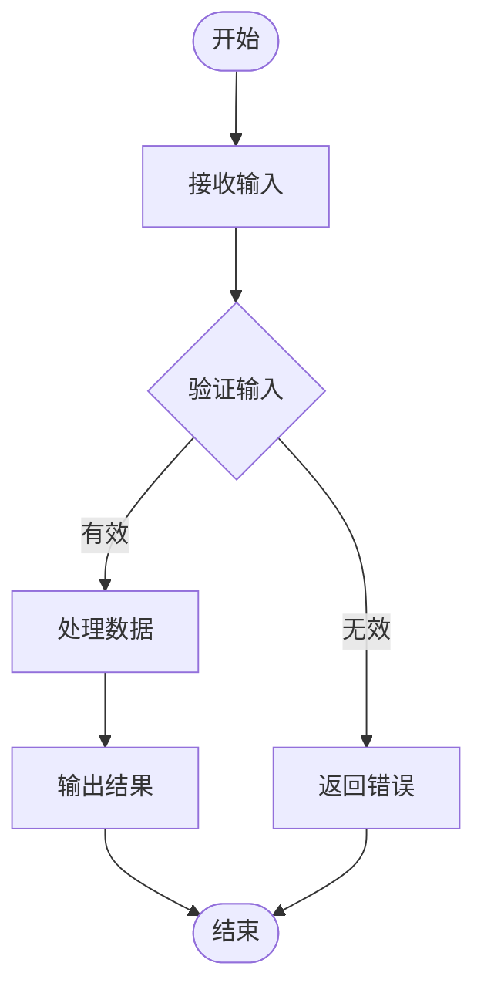

### 7.3 带异常处理的模板

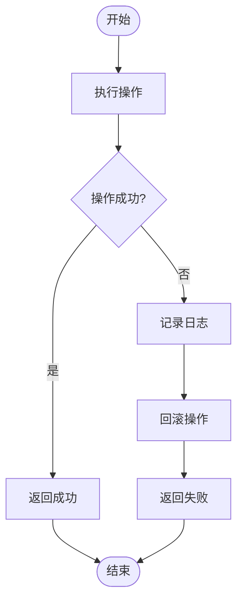

## 8. 注意事项

1. **动作粒度**：动作应为原子操作，不可再分
2. **判定完整**：判定节点的所有分支必须覆盖所有可能情况
3. **并发同步**：Fork和Join必须成对出现
4. **避免死锁**：确保不存在无法到达终止节点的路径
5. **泳道职责**：每个泳道代表一个参与者或系统组件
6. **守卫互斥**：同一判定节点的守卫条件应互斥且完备

## 9. 社区团购系统常用活动图

### 9.1 用户注册流程

描述用户从填写信息到注册成功的完整流程。

### 9.2 下单支付流程

描述用户从选择商品到支付完成的业务流程。

### 9.3 拼团流程

描述发起拼团、参与拼团、成团/失败的完整流程。

### 9.4 配送路径规划流程

描述Dijkstra算法计算最优配送路线的处理流程。

### 9.5 团长审核流程

描述团长申请提交、审核、通过/拒绝的业务流程。
