# UML状态图绘制规范

## 1. 概述

状态图（State Diagram）用于描述对象对外部事件响应的历史状态序列，即描述对象所有可能的状态，以及哪些事件将导致状态的改变。状态图侧重于描述某个对象的动态行为，是对象的生命周期模型。

### 1.1 适用场景

并不是所有的类都需要画状态图，以下情况需要绘制状态图：
- 有明确意义的状态
- 在不同状态下行为有所不同的类
- 对象生命周期中存在多个状态转换

### 1.2 状态图核心要素

| 要素 | 说明 | Mermaid语法 |
|------|------|-------------|
| **初态(Initial State)** | 状态机的入口状态，只能有一个 | `[*]` |
| **终态(Final State)** | 状态机的出口状态，可以有多个或无 | `[*]` |
| **简单状态(Simple State)** | 没有嵌套的状态 | `stateName` |
| **复合状态(Composite State)** | 包含嵌套子状态的状态 | `state "name" as alias { }` |
| **转换(Transition)** | 状态之间的跳转 | `-->` |
| **事件(Event)** | 触发状态转换的外部事件 | `state1 --> state2: event` |

## 2. 状态命名规范

### 2.1 命名格式

| 格式 | 示例 | 说明 |
|------|------|------|
| 英文驼峰命名 | `Pending`, `InProgress` | 推荐使用 |
| 中文状态名 | `待支付`, `已完成` | 可用于说明性图表 |
| 带下划线 | `wait_payment` | 与代码中枚举值对应时使用 |

### 2.2 状态命名要求

- 状态名应为**形容词或过去分词**，表示对象所处的状态
- 避免使用动词（动词应用于转换事件）
- 状态名应简洁明了，能准确描述对象当前状况

**正确示例**：`Pending`、`Approved`、`Cancelled`、`Completed`
**错误示例**：`Pay`、`Cancel`、`Submit`（这些是动作，不是状态）

## 3. 转换标签规范

### 3.1 完整转换标签格式

```
event [guard] / action
```

| 组成部分 | 说明 | 是否必须 |
|----------|------|----------|
| **event** | 触发转换的事件名称 | 是 |
| **[guard]** | 守卫条件，方括号包围 | 否 |
| **/ action** | 转换时执行的动作 | 否 |

### 3.2 示例

```
用户点击支付                    # 仅事件
用户点击支付 [余额充足]          # 事件 + 守卫条件
用户点击支付 / 扣减余额          # 事件 + 动作
用户点击支付 [余额充足] / 扣减余额  # 完整格式
```

## 4. Mermaid状态图语法

### 4.1 基本语法

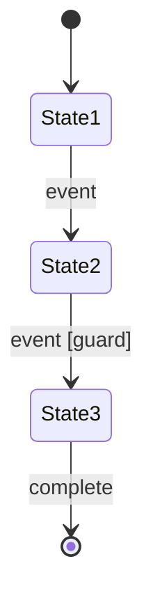

### 4.2 状态描述

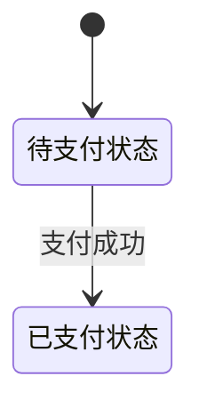

### 4.3 复合状态（嵌套状态）

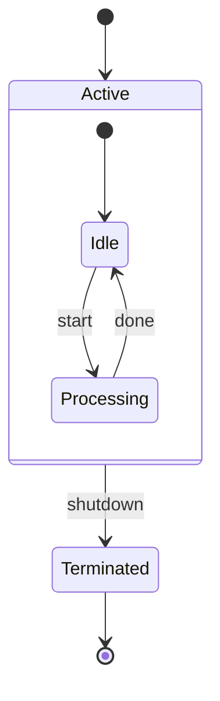

### 4.4 分支与合并（选择伪状态）

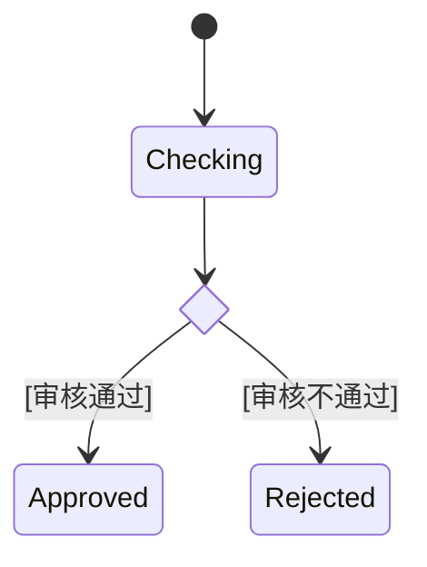

### 4.5 并发状态（Fork/Join）

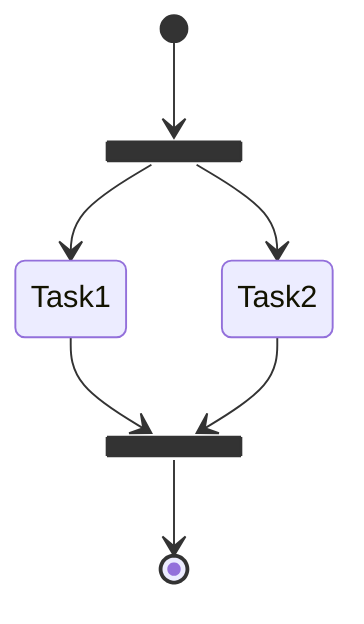

### 4.6 添加注释

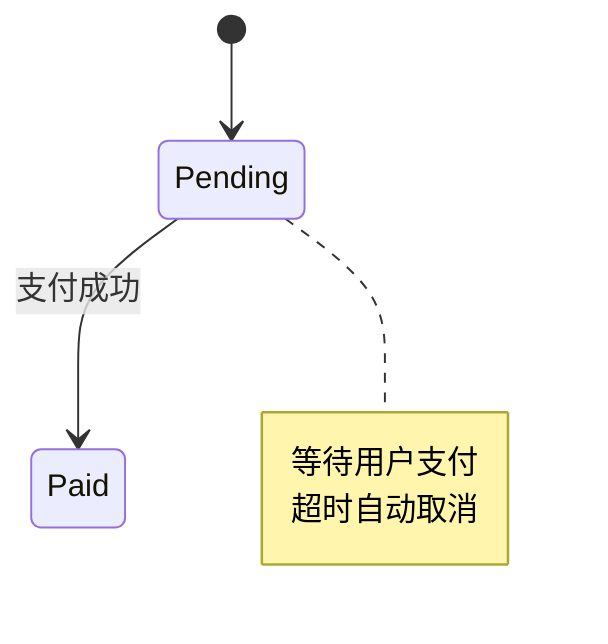

## 5. 状态图绘制要求

### 5.1 必须包含的元素

| 元素 | 说明 | 要求 |
|------|------|------|
| **初态** | 状态机入口 | 必须有且仅有一个 |
| **终态** | 状态机出口 | 可以有0个、1个或多个 |
| **状态** | 对象可能处于的状态 | 至少2个有意义的状态 |
| **转换** | 状态间的跳转 | 每个转换必须标注触发事件 |

### 5.2 绘制原则

1. **完整性**：覆盖对象所有可能的状态
2. **可达性**：从初态出发，所有状态都应可达
3. **确定性**：同一状态下，相同事件只能触发一个转换（除非有不同的守卫条件）
4. **简洁性**：避免过多状态，复杂情况使用复合状态

### 5.3 布局建议

- 初态放在左上角或顶部
- 终态放在右下角或底部
- 状态按时间顺序从左到右或从上到下排列
- 主流程保持直线，异常分支向侧面延伸

## 6. 常见状态图模式

### 6.1 线性生命周期

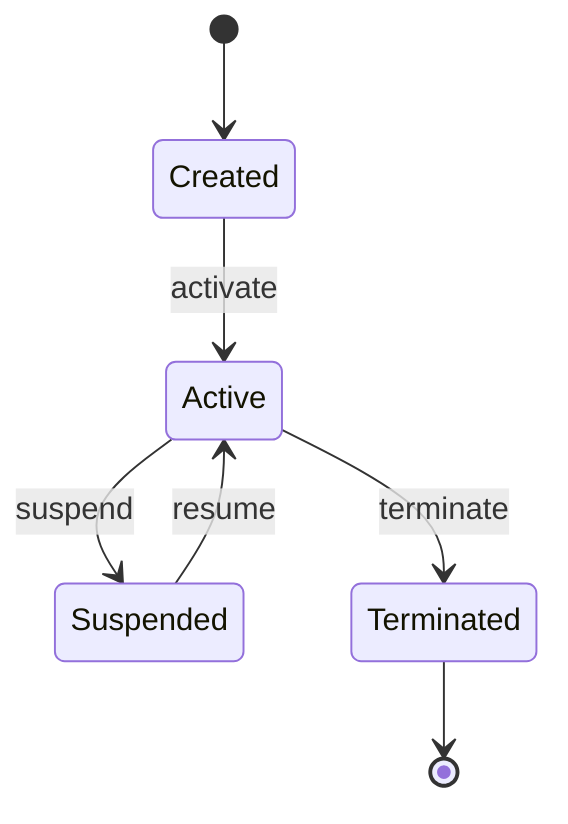

### 6.2 审批流程

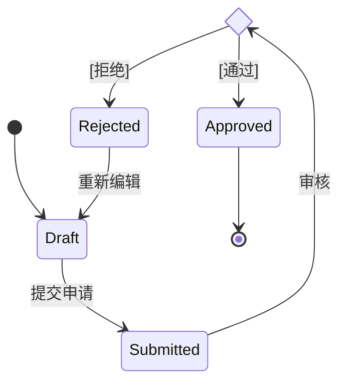

### 6.3 订单状态

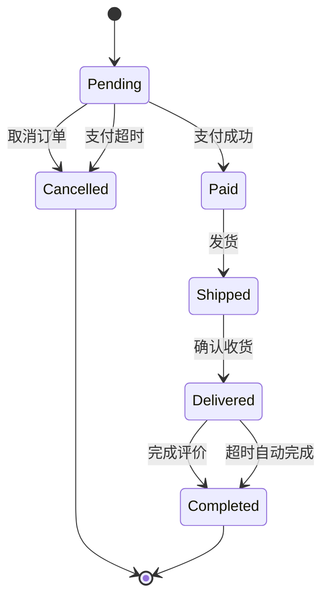

## 7. 标准模板

### 7.1 简单状态图模板

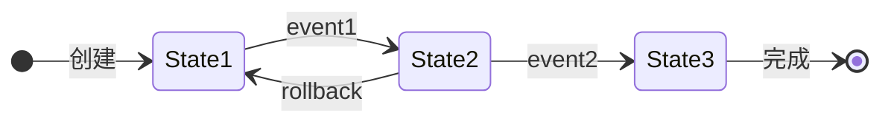

### 7.2 带选择分支的模板

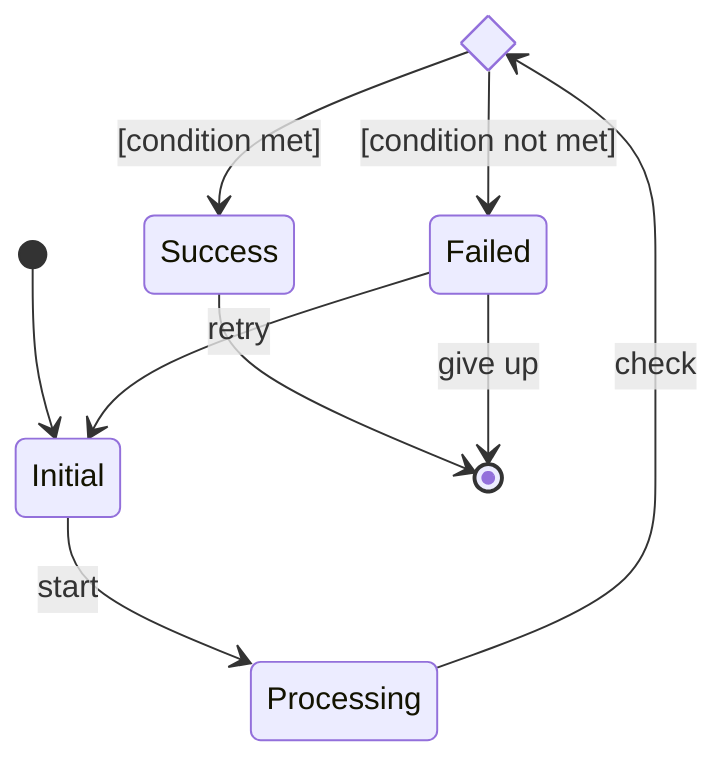

### 7.3 复合状态模板

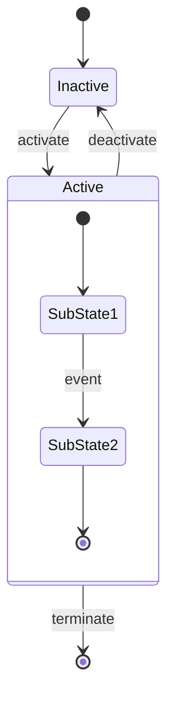

## 8. 注意事项

1. **状态与事件区分**：状态是静态的（形容词），事件是动态的（动词）
2. **守卫条件互斥**：同一事件的多个转换，守卫条件应互斥
3. **避免死锁**：确保不存在无法退出的状态循环
4. **终态可选**：持续运行的系统可以没有终态
5. **自转换**：状态可以转换到自身，表示状态内的事件处理

## 9. 社区团购系统常用状态图

### 9.1 订单状态图

适用于Order对象，描述订单从创建到完成的生命周期。

### 9.2 拼团状态图

适用于GroupBuy对象，描述拼团活动从发起到成团/失败的过程。

### 9.3 团长申请状态图

适用于LeaderApplication对象，描述团长申请的审核流程。

### 9.4 配送单状态图

适用于Delivery对象，描述配送单从创建到送达的过程。
