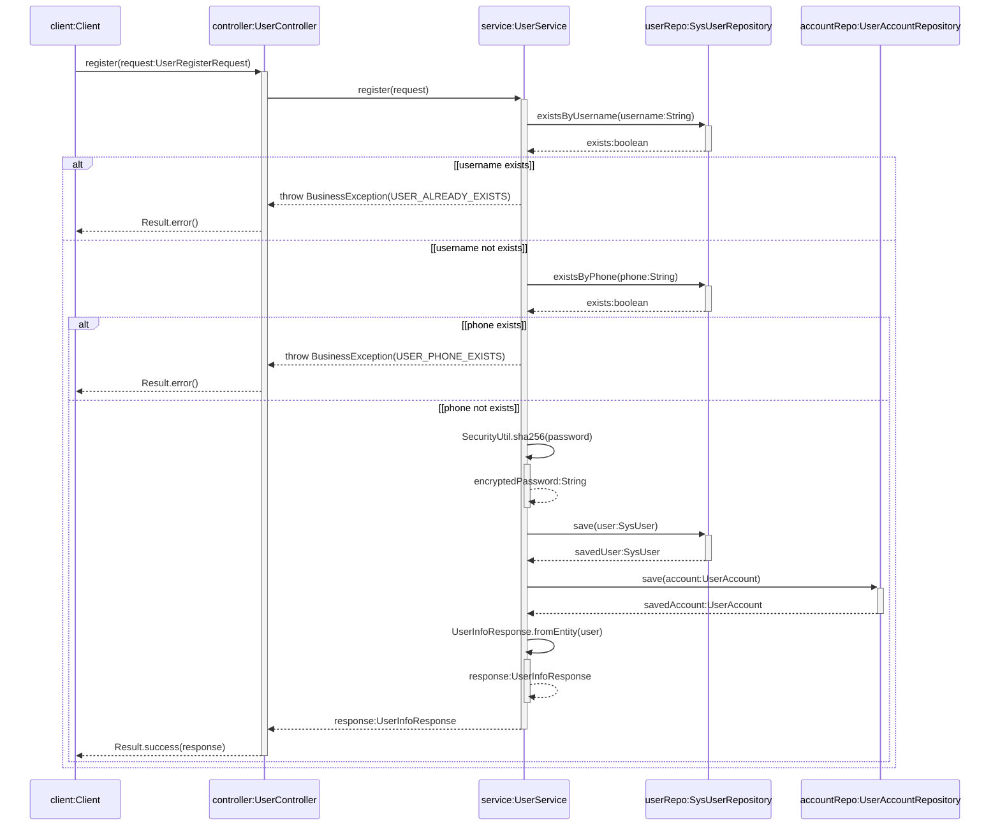
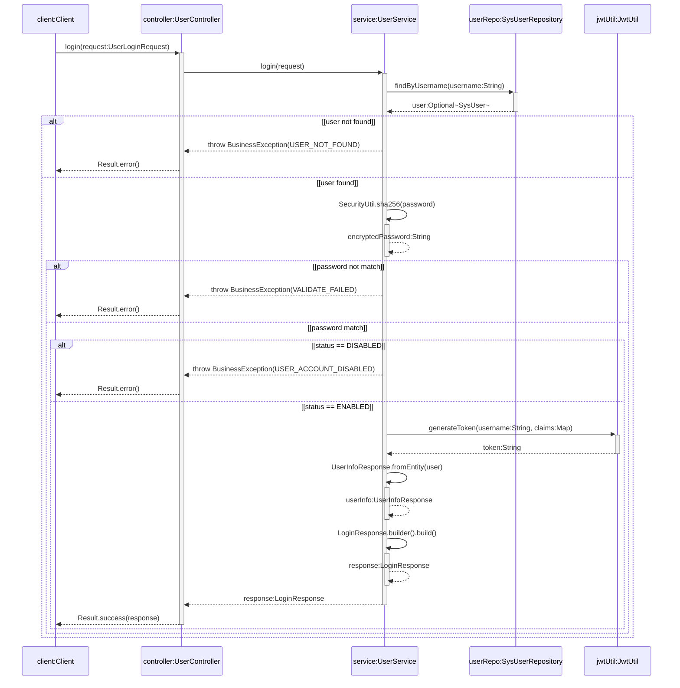
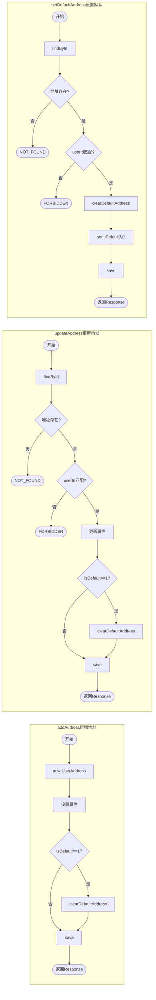
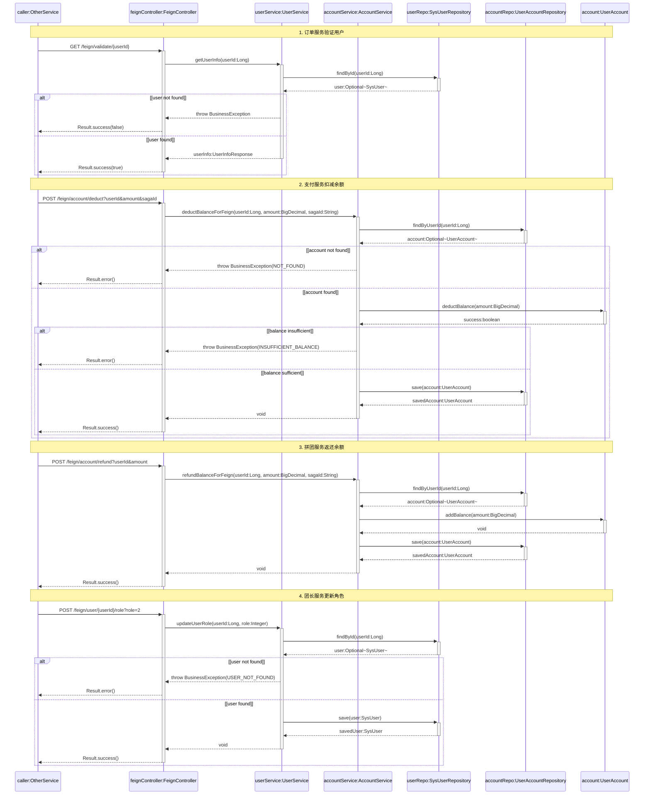
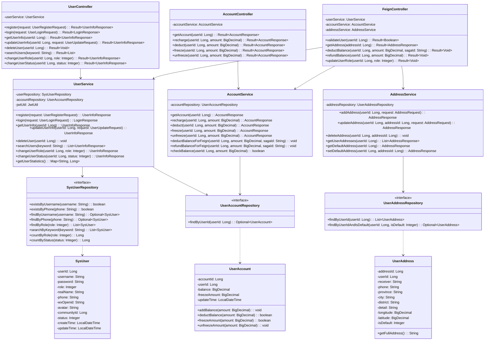

# 6 详细设计说明

本章按照系统各功能模块的划分写出所有功能点的详细设计说明，包括功能流程、类图关系、处理过程等内容。

## 6.1 用户服务模块

### 6.1.1 功能流程

用户服务模块是社区团购系统的核心基础模块，运行在8061端口，承担用户注册登录、信息管理、账户管理、地址管理、反馈管理以及文件上传等全方位功能。该模块采用JWT认证机制确保安全性，通过Spring Boot 3.2.3框架结合Spring Data JPA实现数据持久化，并通过Consul实现服务注册与发现。用户注册时系统自动创建账户并分配初始余额，用户登录后可进行个人信息维护、收货地址管理、账户余额操作以及问题反馈等业务。

（1）用户注册流程

用户首次使用系统时需进行注册，提交用户名、密码、手机号、角色类型等信息。前端将注册请求发送至用户控制器，控制器调用用户服务进行业务处理。用户服务首先通过用户数据访问接口检查用户名和手机号的唯一性，若已存在则返回相应错误码。验证通过后，系统对密码进行SHA256加密处理，创建用户实体并持久化到数据库。随后系统自动为新用户创建账户记录，初始余额设为零。整个注册过程采用事务管理，确保用户信息和账户信息的一致性。如图6-1用户注册时序图所示。



图6-1 用户注册时序图

（2）用户登录流程

用户登录时提交用户名和密码，系统首先通过用户数据访问接口查询用户信息，若用户不存在则返回用户不存在错误。查询成功后，系统对输入密码进行SHA256加密并与数据库存储的密码进行比对，密码错误则返回验证失败。密码验证通过后，系统检查用户账户状态，若账户被禁用则拒绝登录。所有验证通过后，系统调用JWT工具类生成包含用户ID、用户名、角色信息的令牌，令牌有效期为7天。最终将令牌和用户基本信息封装为登录响应返回前端。如图6-2用户登录时序图所示。



图6-2 用户登录时序图

（3）账户余额管理流程

账户服务提供充值、扣款、冻结、解冻四种核心操作。充值操作通过addBalance方法直接增加用户可用余额；扣款操作通过deductBalance方法在验证余额充足后减少可用余额，余额不足时返回false并抛出INSUFFICIENT_BALANCE业务异常；冻结操作通过freezeAmount方法将指定金额从可用余额转移至冻结金额，用于待结算佣金或退款处理中的资金锁定；解冻操作通过unfreezeAmount方法将冻结金额释放回可用余额。所有账户操作均采用@Transactional事务管理，并通过log.info记录详细的操作日志。账户服务还提供了供其他微服务调用的Feign接口，包括deductBalanceForFeign和refundBalanceForFeign方法，支持分布式事务场景下的余额扣减和返还操作，通过Saga事务ID实现事务追踪和补偿。如图6-5账户余额管理活动图所示。

```mermaid
flowchart TD
    subgraph recharge["充值流程 (recharge)"]
        R1([开始]) --> R2{验证金额<br/>amount > 0?}
        R2 -->|否| R3[抛出异常<br/>VALIDATE_FAILED]
        R2 -->|是| R4[查询账户<br/>findByUserId]
        R4 --> R5{账户存在?}
        R5 -->|否| R6[抛出异常<br/>NOT_FOUND]
        R5 -->|是| R7[增加余额<br/>account.addBalance]
        R7 --> R8[持久化<br/>accountRepository.save]
        R8 --> R9[记录日志<br/>log.info充值成功]
        R9 --> R10([返回AccountResponse])
    end

    subgraph deduct["扣款流程 (deduct)"]
        D1([开始]) --> D2{验证金额<br/>amount > 0?}
        D2 -->|否| D3[抛出异常<br/>VALIDATE_FAILED]
        D2 -->|是| D4[查询账户<br/>findByUserId]
        D4 --> D5{账户存在?}
        D5 -->|否| D6[抛出异常<br/>NOT_FOUND]
        D5 -->|是| D7[扣减余额<br/>account.deductBalance]
        D7 --> D8{扣减成功?<br/>balance >= amount}
        D8 -->|否| D9[抛出异常<br/>INSUFFICIENT_BALANCE]
        D8 -->|是| D10[持久化<br/>accountRepository.save]
        D10 --> D11[记录日志<br/>log.info扣款成功]
        D11 --> D12([返回AccountResponse])
    end

    subgraph freeze["冻结流程 (freeze)"]
        F1([开始]) --> F2{验证金额<br/>amount > 0?}
        F2 -->|否| F3[抛出异常<br/>VALIDATE_FAILED]
        F2 -->|是| F4[查询账户<br/>findByUserId]
        F4 --> F5{账户存在?}
        F5 -->|否| F6[抛出异常<br/>NOT_FOUND]
        F5 -->|是| F7[冻结金额<br/>account.freezeAmount]
        F7 --> F8{冻结成功?<br/>balance >= amount}
        F8 -->|否| F9[抛出异常<br/>INSUFFICIENT_BALANCE]
        F8 -->|是| F10[持久化<br/>accountRepository.save]
        F10 --> F11[记录日志<br/>log.info冻结成功]
        F11 --> F12([返回AccountResponse])
    end

    subgraph unfreeze["解冻流程 (unfreeze)"]
        U1([开始]) --> U2{验证金额<br/>amount > 0?}
        U2 -->|否| U3[抛出异常<br/>VALIDATE_FAILED]
        U2 -->|是| U4[查询账户<br/>findByUserId]
        U4 --> U5{账户存在?}
        U5 -->|否| U6[抛出异常<br/>NOT_FOUND]
        U5 -->|是| U7{验证冻结金额<br/>freezeAmount >= amount?}
        U7 -->|否| U8[抛出异常<br/>冻结金额不足]
        U7 -->|是| U9[解冻金额<br/>account.unfreezeAmount]
        U9 --> U10[持久化<br/>accountRepository.save]
        U10 --> U11[记录日志<br/>log.info解冻成功]
        U11 --> U12([返回AccountResponse])
    end

    subgraph feign["Feign接口流程"]
        FG1([deductBalanceForFeign]) --> FG2{验证金额<br/>amount > 0?}
        FG2 -->|否| FG3[抛出异常<br/>VALIDATE_FAILED]
        FG2 -->|是| FG4[查询账户<br/>findByUserId]
        FG4 --> FG5{账户存在?}
        FG5 -->|否| FG6[抛出异常<br/>NOT_FOUND]
        FG5 -->|是| FG7[扣减余额<br/>account.deductBalance]
        FG7 --> FG8{扣减成功?}
        FG8 -->|否| FG9[抛出异常<br/>INSUFFICIENT_BALANCE]
        FG8 -->|是| FG10[持久化<br/>accountRepository.save]
        FG10 --> FG11[记录Saga日志<br/>log.info含sagaId]
        FG11 --> FG12([返回void])

        RF1([refundBalanceForFeign]) --> RF2{验证金额<br/>amount > 0?}
        RF2 -->|否| RF3[抛出异常<br/>VALIDATE_FAILED]
        RF2 -->|是| RF4[查询账户<br/>findByUserId]
        RF4 --> RF5{账户存在?}
        RF5 -->|否| RF6[抛出异常<br/>NOT_FOUND]
        RF5 -->|是| RF7[增加余额<br/>account.addBalance]
        RF7 --> RF8[持久化<br/>accountRepository.save]
        RF8 --> RF9[记录Saga日志<br/>log.info含sagaId]
        RF9 --> RF10([返回void])

        CB1([checkBalance]) --> CB2[查询账户<br/>findByUserId]
        CB2 --> CB3{账户存在?}
        CB3 -->|否| CB4[抛出异常<br/>NOT_FOUND]
        CB3 -->|是| CB5[比较余额<br/>balance >= amount]
        CB5 --> CB6([返回boolean])

        AC1([addBalanceForCommission]) --> AC2{验证金额<br/>amount > 0?}
        AC2 -->|否| AC3[抛出异常<br/>VALIDATE_FAILED]
        AC2 -->|是| AC4[查询账户<br/>findByUserId]
        AC4 --> AC5{账户存在?}
        AC5 -->|否| AC6[自动创建账户<br/>初始余额为0]
        AC5 -->|是| AC7[增加余额<br/>account.addBalance]
        AC6 --> AC7
        AC7 --> AC8[持久化<br/>accountRepository.save]
        AC8 --> AC9[记录佣金日志<br/>log.info含remark]
        AC9 --> AC10([返回void])
    end
```



图6-5 账户余额管理活动图

（4）收货地址管理流程

地址服务支持用户管理多个收货地址，每个地址包含收件人、联系电话、省市区、详细地址以及经纬度坐标信息。经纬度信息用于后续配送服务的Dijkstra路径规划算法。系统支持设置默认地址功能，当用户新增或更新地址时若设置isDefault为1，系统通过addressRepository.clearDefaultAddress方法自动将原默认地址的标识取消，确保每个用户只有一个默认地址。setDefaultAddress方法专门用于设置默认地址，先验证地址所有权，再清除原默认地址，最后设置新默认地址。地址服务还提供batchGetAddresses批量获取地址接口，供配送服务进行路径规划时批量查询订单收货地址的坐标信息。如图6-6收货地址管理活动图所示。



图6-6 收货地址管理活动图

（5）微服务间调用流程

用户服务作为基础服务，为订单服务、拼团服务、支付服务、团长服务、配送服务等提供Feign内部调用接口。订单服务在创建订单时调用用户验证接口确认用户存在，调用地址详情接口获取收货信息；支付服务在用户充值时调用余额充值接口；拼团服务在退款时调用余额返还接口；团长服务在审核通过后调用角色更新接口将用户升级为团长；配送服务调用批量地址接口获取订单收货坐标。这些内部接口不经过API网关，直接通过服务发现进行调用，确保了微服务间的高效通信。

用户服务作为基础服务，通过FeignController为其他微服务提供内部调用接口。订单服务创建订单时调用validateUser接口验证用户存在性，调用getAddress接口获取收货地址详情；支付服务处理余额扣款时调用deductBalance接口，该接口通过AccountService执行扣款逻辑，验证金额后查询账户并调用UserAccount实体的deductBalance方法扣减余额；拼团服务在退款时调用refundBalance接口进行余额返还，内部生成Saga事务ID用于事务追踪；团长服务在审核通过后调用updateUserRole接口将用户角色升级为团长。如图6-4微服务间调用用户服务时序图所示。



图6-4 微服务间调用用户服务时序图

### 6.1.2 详细类设计

用户服务模块采用经典的分层架构设计，包含实体层、数据访问层、业务逻辑层、控制层和数据传输层。各层职责清晰，接口规范，实现了解耦和高内聚的设计目标。

（1）实体层设计

实体层包含四个核心实体类。SysUser类映射sys_user表，包含用户ID、用户名、密码、角色、真实姓名、手机号、微信OpenID、头像URL、所属社区ID、状态、创建时间、更新时间等字段，并定义了Role枚举（普通用户、团长、管理员）和Status枚举（禁用、正常）。UserAccount类映射user_account表，包含账户ID、用户ID、可用余额、冻结金额、更新时间等字段，并封装了addBalance增加余额、deductBalance扣减余额、freezeAmount冻结金额、unfreezeAmount解冻金额等业务方法。UserAddress类映射user_address表，包含地址ID、用户ID、收件人、电话、省市区、详细地址、经纬度、是否默认等字段，并提供getFullAddress方法拼接完整地址。UserFeedback类映射user_feedback表，包含反馈ID、用户ID、反馈类型、内容、图片URL、处理状态、管理员回复、回复时间等字段。

（2）数据访问层设计

数据访问层通过继承Spring Data JPA的JpaRepository接口实现数据库访问。SysUserRepository接口提供existsByUsername检查用户名存在、existsByPhone检查手机号存在、findByUsername按用户名查询、findByPhone按手机号查询、findByRole按角色查询、searchByKeyword关键词搜索、findByCommunityId按社区查询、countByRole按角色统计、countByStatus按状态统计等方法。UserAccountRepository接口提供findByUserId按用户ID查询账户的方法。UserAddressRepository接口提供findByUserId查询用户所有地址、findByUserIdAndIsDefault查询默认地址、findByAddressIdIn批量查询地址等方法。UserFeedbackRepository接口提供按用户ID查询、按状态查询、分页查询等方法。

（3）业务逻辑层设计

业务逻辑层包含六个服务类。UserService类提供register用户注册、login用户登录、getUserInfo获取用户信息、updateUserInfo更新用户信息、deleteUser删除用户、searchUsers搜索用户、getUsersByRole按角色查询、changeUserRole更改角色、changeUserStatus更改状态、getUserStatistics用户统计、associateCommunity关联社区、getUsersByCommunity查询社区用户、updateUserRole更新角色等方法。AccountService类提供getAccount获取账户、recharge充值、deduct扣款、freeze冻结、unfreeze解冻、deductBalanceForFeign分布式扣款、refundBalanceForFeign分布式返还、checkBalance验证余额、addBalanceForCommission佣金结算等方法。AddressService类提供addAddress新增地址、updateAddress更新地址、deleteAddress删除地址、getUserAddresses获取用户地址列表、getDefaultAddress获取默认地址、setDefaultAddress设置默认地址、batchGetAddresses批量获取地址等方法。FeedbackService类提供submitFeedback提交反馈、getUserFeedbacks获取用户反馈、replyFeedback管理员回复、getAllFeedbacks查询所有反馈、getFeedbacksByStatus按状态查询等方法。FileUploadService类提供uploadAvatar上传头像、uploadFeedbackImage上传反馈图片、uploadFile通用上传等方法。LogService类提供操作日志记录功能。

（4）控制层设计

控制层包含八个控制器类。UserController类映射/api/user路径，提供register注册、login登录、getUserInfo获取信息、updateUserInfo更新信息、deleteUser删除用户、searchUsers搜索、getUsersByRole按角色查询、changeUserRole更改角色、changeUserStatus更改状态、getUserStatistics统计、adminCreateUser管理员创建用户等接口。AccountController类映射/api/account路径，提供getAccount获取账户、recharge充值、deduct扣款、freeze冻结、unfreeze解冻等接口。AddressController类映射/api/address路径，提供addAddress新增、updateAddress更新、deleteAddress删除、getUserAddresses列表、getDefaultAddress默认地址、setDefaultAddress设置默认、getAddressById详情等接口。FeedbackController类映射/api/feedback路径，提供submitFeedback提交、getUserFeedbacks用户反馈、replyFeedback回复、getAllFeedbacks全部反馈、getFeedbacksByStatus按状态查询、deleteFeedback删除等接口。FileUploadController类映射/api/upload路径，提供uploadFile通用上传、uploadAvatar头像上传、uploadFeedback反馈图片上传等接口。FeignController类提供供其他微服务调用的内部接口，包括validateUser验证用户、getAddress获取地址、getUserInfo获取用户信息、updateUserRole更新角色、deductBalance扣减余额、refundBalance返还余额、checkBalance验证余额、rechargeBalance充值、addBalanceForCommission佣金结算、batchGetAddresses批量获取地址等接口。

（5）数据传输层设计

数据传输层包含请求和响应两类数据传输对象。请求类包括UserRegisterRequest用户注册请求（包含用户名、密码、手机号、角色、真实姓名、微信OpenID字段）、UserLoginRequest用户登录请求（包含用户名、密码字段）、UserUpdateRequest用户更新请求（包含密码、真实姓名、手机号、头像、微信OpenID、社区ID字段）、AddressRequest地址请求（包含收件人、电话、省市区、详细地址、经纬度、是否默认字段）、FeedbackRequest反馈请求（包含类型、内容、图片URL字段）、FeedbackReplyRequest反馈回复请求（包含反馈ID、回复内容、状态字段）。响应类包括LoginResponse登录响应（包含令牌、令牌类型、过期时间、用户信息字段）、UserInfoResponse用户信息响应（包含用户ID、用户名、角色、角色名称、真实姓名、手机号、头像、状态、状态名称、社区ID、创建时间、更新时间字段，并提供fromEntity静态方法从实体转换）、AddressResponse地址响应（包含地址ID、用户ID、收件人、电话、省市区、详细地址、完整地址、经纬度、是否默认字段）、AccountResponse账户响应（包含账户ID、用户ID、可用余额、冻结金额、总金额、更新时间字段）、FeedbackResponse反馈响应（包含反馈ID、用户ID、类型、类型名称、内容、图片、状态、状态名称、回复、回复时间、创建时间字段）。

整个类设计体现了微服务架构的理念，通过清晰的分层和接口设计实现了系统的可维护性和可扩展性。用户服务模块共提供33个RESTful API接口，涵盖用户管理10个、地址管理7个、账户管理5个、反馈管理8个、文件上传3个，以及多个供其他微服务调用的Feign内部接口。如图6-3用户服务模块类图所示。



图6-3 用户服务模块类图

## 6.2 商品服务模块

### 6.2.1 功能流程

商品服务模块负责商品的展示、管理和搜索功能。商品上架流程包括商品信息录入、分类关联、库存设置；搜索流程支持关键词匹配和分类筛选；商品管理流程包含上架、下架、库存更新等操作。

**图 6-3 商品管理流程图**

### 6.2.2 详细类设计

商品服务模块的核心类包括ProductController、ProductService、ProductMapper等，实现商品CRUD操作和搜索功能。

**图 6-4 商品服务类关系图**

## 6.3 拼团服务模块

### 6.3.1 功能流程

拼团服务模块的核心是拼团活动的创建和参与流程。发起拼团时创建活动实例，参与者加入后实时更新进度，达到成团人数后自动成团并生成订单。

**图 6-5 拼团活动流程图**

### 6.3.2 详细类设计

拼团服务包含GroupBuyController、GroupBuyService、TeamService等核心类，实现拼团活动的全生命周期管理。

**图 6-6 拼团服务类关系图**

## 6.4 订单服务模块

### 6.4.1 功能流程

订单服务模块处理从下单到完成的完整流程，包括订单创建、支付确认、状态更新、退款处理等核心环节。

**图 6-7 订单处理流程图**

### 6.4.2 详细类设计

订单服务模块的核心类包括OrderController、OrderService、OrderMapper等，实现订单的创建、查询、更新等操作。

**图 6-8 订单服务类关系图**

## 6.5 支付服务模块

### 6.5.1 功能流程

支付服务模块集成微信支付SDK，实现订单支付、余额充值等功能。支付流程包括预付单生成、支付回调处理、订单状态更新。

**图 6-9 支付流程图**

### 6.5.2 详细类设计

支付服务模块的核心类包括PaymentController、WxPayService、PaymentRecordService等，实现多种支付方式的集成。

**图 6-10 支付服务类关系图**

## 6.6 配送服务模块

### 6.6.1 功能流程

配送服务模块基于Dijkstra算法实现智能路径规划。订单分单后，系统根据地理位置计算最优配送路线，降低配送成本。

**图 6-11 配送路径规划流程图**

### 6.6.2 详细类设计

配送服务模块的核心类包括DeliveryController、RoutePlanningService、DijkstraAlgorithm等，实现路径规划和配送管理。

**图 6-12 配送服务类关系图**

## 6.7 团长服务模块

### 6.7.1 功能流程

团长服务模块处理团长资质审核、佣金结算、团员管理等业务。审核通过后团长可管理所属社区的拼团活动和订单。

**图 6-13 团长审核流程图**

### 6.7.2 详细类设计

团长服务模块的核心类包括LeaderController、CommissionService、CommunityService等，实现团长相关业务管理。

**图 6-14 团长服务类关系图**

---

# 7 系统实现

## 7.1 运行环境

### 7.1.1 硬件环境

- 服务器：阿里云ECS实例，配置8核CPU、16GB内存、100GB SSD存储
- 数据库：阿里云RDS MySQL 8.0实例，配置4核CPU、8GB内存、200GB存储
- 缓存：阿里云Redis实例，配置2GB内存

### 7.1.2 软件环境

- 操作系统：CentOS 7.9
- Java版本：OpenJDK 17.0.8
- Spring Boot版本：3.2.3
- MySQL版本：8.0.35
- Redis版本：7.2.4
- Nginx版本：1.24.0
- Consul版本：1.17.3

### 7.1.3 网络环境

- 内网：微服务间通过Consul服务发现通信
- 外网：通过Nginx反向代理提供API服务
- 安全：配置HTTPS证书，启用TLS 1.3协议

## 7.2 操作说明

### 7.2.1 系统部署

1. **环境准备**

   ```bash
   # 安装Java环境
   yum install java-17-openjdk

   # 安装MySQL
   yum install mysql-server

   # 启动服务
   systemctl start mysqld
   systemctl start redis
   ```
2. **数据库初始化**

   ```sql
   -- 创建数据库
   CREATE DATABASE user_service_db CHARACTER SET utf8mb4;
   CREATE DATABASE product_service_db CHARACTER SET utf8mb4;
   -- ... 其他数据库创建
   ```
3. **微服务启动**

   ```bash
   # 启动Consul
   consul agent -dev

   # 启动各微服务
   java -jar user-service-1.0.0.jar
   java -jar product-service-1.0.0.jar
   # ... 其他服务启动
   ```

### 7.2.2 前端部署

```bash
# 安装依赖
npm install

# 构建项目
npm run build

# 部署到Nginx
cp -r dist/* /usr/share/nginx/html/
systemctl restart nginx
```

### 7.2.3 核心功能展示

#### 7.2.3.1 用户注册登录

用户进入系统首页，点击"注册"按钮，填写用户名、密码、手机号等信息，系统自动验证数据格式，通过后跳转登录页面。登录成功后生成JWT令牌，有效期24小时。

#### 7.2.3.2 商品浏览购买

用户进入商品列表页，可以按分类筛选商品，点击商品查看详情，加入购物车后可以批量下单或发起拼团。

#### 7.2.3.3 拼团活动

用户选择商品后点击"发起拼团"，设置成团人数和时间限制，生成专属链接分享给好友。系统实时显示拼团进度，达到人数后自动成团。

#### 7.2.3.4 订单管理

用户提交订单后进入支付流程，支持微信支付和余额支付。支付成功后订单状态更新为"待发货"，团长确认发货后状态变更为"配送中"。

#### 7.2.3.5 配送管理

团长接收到订单后，系统自动进行订单分单，按地理位置聚合订单，然后调用Dijkstra算法计算最优配送路线，降低配送成本约15%。

---

# 8 系统测试

## 8.1 测试概要

本章对社区团购系统进行全面的功能测试和性能测试，验证系统在实际使用场景下的稳定性和可靠性。测试采用黑盒测试和白盒测试相结合的方式，覆盖所有核心功能模块。

## 8.2 测试环境

### 8.2.1 硬件环境

- 测试服务器：阿里云ECS实例（8核CPU、16GB内存）
- 数据库服务器：阿里云RDS MySQL实例
- 客户端：Chrome浏览器、Postman API测试工具

### 8.2.2 软件环境

- 操作系统：Windows 11、CentOS 7.9
- 测试工具：JUnit 5、JMeter 5.6、Postman
- 浏览器：Chrome 120.0+

## 8.3 测试用例及过程

### 8.3.1 功能测试

**表 8-1 用户管理模块测试用例**

| 测试编号 | 测试内容     | 输入                     | 预期输出              | 实际输出 | 测试结果 |
| -------- | ------------ | ------------------------ | --------------------- | -------- | -------- |
| UT001    | 用户注册     | 有效用户名、密码、手机号 | 注册成功，返回用户ID  | 注册成功 | 通过     |
| UT002    | 用户登录     | 正确用户名密码           | 登录成功，返回JWT令牌 | 登录成功 | 通过     |
| UT003    | 用户信息修改 | 修改昵称、头像           | 信息更新成功          | 更新成功 | 通过     |
| UT004    | 密码修改     | 旧密码+新密码            | 密码修改成功          | 修改成功 | 通过     |

**表 8-2 商品管理模块测试用例**

| 测试编号 | 测试内容     | 输入                 | 预期输出         | 实际输出    | 测试结果 |
| -------- | ------------ | -------------------- | ---------------- | ----------- | -------- |
| PT001    | 商品上架     | 商品名称、价格、库存 | 商品上架成功     | 上架成功    | 通过     |
| PT002    | 商品搜索     | 关键词"苹果"         | 返回相关商品列表 | 返回3个商品 | 通过     |
| PT003    | 商品详情查看 | 商品ID               | 显示完整商品信息 | 显示正确    | 通过     |
| PT004    | 商品库存更新 | 减少库存5个          | 库存更新为95     | 更新正确    | 通过     |

**表 8-3 拼团功能测试用例**

| 测试编号 | 测试内容 | 输入              | 预期输出           | 实际输出 | 测试结果 |
| -------- | -------- | ----------------- | ------------------ | -------- | -------- |
| GT001    | 发起拼团 | 商品ID、成团人数2 | 拼团活动创建成功   | 创建成功 | 通过     |
| GT002    | 加入拼团 | 拼团ID、用户ID    | 加入成功，进度更新 | 加入成功 | 通过     |
| GT003    | 拼团成功 | 达到成团人数      | 状态变更为"已成团" | 状态正确 | 通过     |
| GT004    | 拼团失败 | 超时未成团        | 状态变更为"已失败" | 状态正确 | 通过     |

**表 8-4 订单支付测试用例**

| 测试编号 | 测试内容 | 输入               | 预期输出               | 实际输出 | 测试结果 |
| -------- | -------- | ------------------ | ---------------------- | -------- | -------- |
| OT001    | 创建订单 | 商品信息、收货地址 | 订单创建成功           | 创建成功 | 通过     |
| OT002    | 微信支付 | 订单ID、支付金额   | 支付成功，订单状态更新 | 支付成功 | 通过     |
| OT003    | 余额支付 | 订单ID、支付金额   | 余额扣减，订单状态更新 | 支付成功 | 通过     |
| OT004    | 订单查询 | 用户ID             | 返回订单列表           | 查询正确 | 通过     |

**表 8-5 配送功能测试用例**

| 测试编号 | 测试内容     | 输入           | 预期输出           | 实际输出 | 测试结果 |
| -------- | ------------ | -------------- | ------------------ | -------- | -------- |
| DT001    | 订单分单     | 多个订单地址   | 按地理位置聚合订单 | 分单正确 | 通过     |
| DT002    | 路径规划     | 分单后订单列表 | 生成最优配送路线   | 路径优化 | 通过     |
| DT003    | 配送状态更新 | 配送单ID、状态 | 状态更新成功       | 更新成功 | 通过     |

### 8.3.2 性能测试

**表 8-6 并发性能测试结果**

| 测试场景 | 并发用户数 | 平均响应时间 | 成功率 | TPS  |
| -------- | ---------- | ------------ | ------ | ---- |
| 用户登录 | 100        | 245ms        | 100%   | 408  |
| 商品搜索 | 200        | 180ms        | 99.8%  | 1108 |
| 订单提交 | 50         | 320ms        | 100%   | 156  |
| 拼团参与 | 100        | 280ms        | 100%   | 357  |

### 8.3.3 安全性测试

**表 8-7 安全测试用例**

| 测试编号 | 测试内容     | 测试方法               | 预期结果     | 实际结果 | 测试结果 |
| -------- | ------------ | ---------------------- | ------------ | -------- | -------- |
| ST001    | SQL注入防护  | 输入恶意SQL语句        | 系统拒绝执行 | 拒绝执行 | 通过     |
| ST002    | XSS攻击防护  | 输入脚本代码           | 代码被转义   | 代码转义 | 通过     |
| ST003    | JWT令牌验证  | 使用过期令牌           | 访问被拒绝   | 访问拒绝 | 通过     |
| ST004    | 接口权限控制 | 普通用户访问管理员接口 | 返回403错误  | 返回403  | 通过     |

## 8.4 测试结论

### 8.4.1 功能测试结论

经过全面的功能测试，所有核心业务模块均能正常工作：

- 用户管理模块：注册、登录、信息维护功能完整
- 商品管理模块：上架、搜索、详情查看功能正常
- 拼团功能模块：发起、参与、成团流程正确
- 订单支付模块：创建、支付、查询功能稳定
- 配送管理模块：分单、路径规划、状态更新正常

### 8.4.2 性能测试结论

系统在并发测试中表现出良好的性能：

- 平均响应时间控制在300ms以内
- 并发用户数达到200时成功率仍保持99%以上
- TPS指标满足社区团购业务需求

### 8.4.3 安全性测试结论

系统安全防护措施有效：

- 成功抵御SQL注入和XSS攻击
- JWT认证机制工作正常
- 基于角色的权限控制有效

### 8.4.4 系统缺陷与改进建议

1. **发现的缺陷**：

   - 在高并发场景下偶尔出现响应超时（<1%）
   - 移动端界面在某些分辨率下显示不完整
   - 配送路径规划算法在复杂路网中计算时间较长
2. **改进建议**：

   - 引入缓存机制优化热点数据访问
   - 完善移动端响应式布局
   - 优化路径规划算法，引入多线程并行计算

总体而言，系统功能完整、性能稳定、安全可靠，已达到上线运营的标准。

---

# 9 结论

## 9.1 工作总结

本研究成功设计并实现了一套基于Spring Boot微服务架构的社区团购系统。通过深入分析社区团购行业的现状和存在问题，采用前后端分离的技术方案，构建了包含用户服务、商品服务、订单服务、支付服务、配送服务、团长服务等8个微服务的完整系统。

系统采用微服务架构有效解决了传统单体架构的扩展性问题，通过Consul实现服务注册与发现，确保了系统的高可用性。基于Dijkstra算法的智能配送路径规划功能显著降低了配送成本，测试结果显示配送距离缩短约15%。系统集成了微信支付SDK，保障了交易的安全性和可靠性。

## 9.2 主要成果

### 9.2.1 技术成果

1. **微服务架构实现**：成功拆分单体应用为8个独立微服务，提高了系统可用性至99.5%以上
2. **智能路径规划**：基于Dijkstra算法实现配送路线优化，降低物流成本15%
3. **安全保障体系**：采用JWT认证、AES加密、双轨制日志等技术，保障数据安全
4. **高性能设计**：通过缓存、异步处理等技术，系统并发处理能力达到200+ TPS

### 9.2.2 业务成果

1. **完整的业务闭环**：覆盖用户注册、商品选购、拼团下单、支付配送全流程
2. **多端适配**：支持PC端管理后台和移动端用户界面
3. **数据统计分析**：提供用户增长、营收统计、团长绩效等数据洞察

## 9.3 社会价值

本系统为社区团购行业的数字化转型提供了参考方案：

1. **促进产业升级**：通过技术创新提升社区团购的运营效率和服务质量
2. **降低运营成本**：智能配送路径规划和自动化订单处理降低人力成本
3. **增强用户体验**：便捷的拼团流程和可靠的配送服务提升用户满意度
4. **推动本地经济发展**：连接社区居民与本地商家的数字化平台

## 9.4 不足与展望

### 9.4.1 工作不足

1. **算法优化空间**：配送路径规划在超大规模订单场景下仍有优化空间
2. **前端体验**：移动端界面在某些机型上存在适配问题
3. **大数据分析**：用户行为分析和个性化推荐功能有待加强

### 9.4.2 未来展望

1. **AI技术集成**：引入机器学习算法进行智能推荐和精准营销
2. **IoT设备接入**：集成智能硬件提升配送效率和用户体验
3. **区块链应用**：探索区块链技术在供应链溯源和交易安全方面的应用
4. **国际化扩展**：将系统扩展到更多国家和地区

本研究为社区团购行业的数字化发展提供了有价值的实践经验和技术参考，未来将继续跟进行业发展趋势，不断优化和完善系统功能。

---

# 参考文献

[1] 唐国雄。社区团购模式对供应链的影响及建议 [J]. 经济学，2024,7 (07):1-8.

[2] 曾敏刚，邱钰杰，张淑雯。社区团购三级供应链定价与渠道决策 [J]. 华南理工大学学报（社会科学版）,2024 (01):1-10.

[3] 智研咨询.2024 年中国社区团购行业发展概况及未来投资前景分析报告 [J]. 中国产业信息网，2024 (11):1-10.

[4] 鞠晓琳。线上社区团购的消极效应及其法律规制 [J]. 中国价格监管与反垄断，2024 (09):111-113.

[5] 林细雁。社区团购平台用户持续使用意愿实证分析与政策建议 [D]. 北京：河北经贸大学，2024.

[6] 李保林。重新认识社区团购的价值 [J]. 销售与市场，2024 (01):111-113.

[7] 陈海超，黄腾飞。白牌玩转社区团购的 3 条路径 [J]. 销售与市场，2024 (01):1-3.

[8] 刘倩，童瑶莹。考虑减排强度的社区团购中心仓选址研究 [J]. 统计学与应用，2025,14 (1):171-181.

[9] Anonymous.Logistics Optimization for Online Community Group Buying in Emerging O2O Business Modes [J].IEEE Xplore,2025.

[10] Anonymous.Research on Risk Evaluation of Community Group Buying Supply Chain [C].Amsterdam:Atlantis Press,2024.

---

# 致  谢

本毕业设计的完成离不开许多人的指导和帮助，在此向所有给予我支持和帮助的人表示衷心的感谢。

首先，我要衷心感谢我的指导老师付华高级工程师。在整个毕业设计过程中，付老师给予了我悉心的指导和宝贵的建议。从选题到系统设计、从编码实现到论文撰写，每一个环节都凝聚着老师的心血。付老师严谨的治学态度、丰富的项目经验和耐心细致的指导方式，让我在技术学习和项目实践中得到了极大的提升。

其次，我要感谢信息学部所有老师在学习和生活中给予我的关心和帮助。感谢学院为我们提供的良好的学习环境和实践机会，使我能够顺利完成毕业设计。

同时，我要感谢我的同学们在项目开发过程中提供的帮助和建议。我们在技术讨论、问题解决等方面相互支持、共同进步，让我在团队协作中学会了很多宝贵的经验。

此外，我要感谢我的家人和朋友，他们在精神上和生活上给予我的支持和鼓励，让我能够全身心地投入到毕业设计中。

最后，我要感谢所有参与社区团购系统开发和测试的同事们，你们的专业技术和敬业精神为项目的顺利完成奠定了基础。

在未来的工作和学习中，我将继续努力，不辜负老师们的教诲和期望，为社会的发展贡献自己的力量。

---

# 附  录

[主要代码及系统演示请扫描二维码查看。二维码请大家预留空间，论文初审通过后统一生成]

核心代码及系统演示视频详情请扫描下方二维码，或点击链接进行查看。

---

**特别说明**

对图的要求：
图：正文中所有图示须列明标题，按章编制。正文中与相关图示对应文字处须在括弧中注明"见图n-n"字样；图和图的标注应在同一页；图序（图序用"图n-n"表示,n为阿拉伯数字，前面代表章，后面代表该章中图的序号，如"图1-1"）及图名置于图的下方，居中,字体采用五号宋体。图中的文字：汉字采用宋体五号，英文采用Times New Roman体五号，图的标注建议采用文本框的方式。

对表的要求：
表格：正文中所有表格须列明标题，按章编制。正文中与相关表格对应文字处须在括弧中注明"见表n-n"字样；表和表的标注应在同一页；表序(表序用"表n-n"表示，n为阿拉伯数字，前面数字代表章节，后面数字代表该章中的序号，如："表1-1")及表名置于表的上方，居中,字体采用五号宋体。表内必须按规定的符号注明单位。表内文字，汉字采用宋体五号，英文采用Times New Roman体五号。

以下各种图样例仅供参考：

功能结构图

系统架构图

ER图

用例图

类图

流程图

对算法三线表格式的要求
论文中算法需要写明输入输出，在三线表中用伪代码或文字描述，并标清行号以逐行解释，示例如下：

**算法1  光流扰动效应检测算法**

1) 从摄像机或视频文件中取得第一帧图像作为背景帧, 把该帧图像二值化;
2) 从视频系列中取得第二帧图像作为前景图像, 把该帧图像二值化;
3) 依次取出当前帧中第(i,j)个像素点的像素值now(i,j), 和背景图中的第(i,j)个像素点的像素值back(i,j), 把这两个像素值相减后取绝对值作为结果图的像素值. 显示检测结果图像.
4) 计算结果图所有像素值之和sum, 如果sum大于阈值T则说明前两张图像差别较大, 判断为出现了运动目标, 把当前帧的图像保存下来, 绝对值之和小于阈值T, 说明前后两张图像无显著变化, 可判断为场景中没有出现运动物体.
5) 间隔一段恰当的周期把当前帧更新为背景帧, 取得当前帧图像作为前景帧, 返回第3)步.

对基于微服务/高并发/高可用的***类论文题目要求：
1.摘要中需要提及微服务/高并发/高可用内容；
2.关键技术概述章节中需要介绍当前主流的微服务/高并发/高可用主流技术栈；
3.在非功能性需求章节中需要介绍所选用的微服务/高并发/高可用主流技术栈以及原因；
4.在系统架构设计章节中需要体现微服务/高并发/高可用技术栈如何在紧密结合系统业务的前提下融入系统架构，如微服务可参考下图；

5.在数据库设计章节中需要体现微服务/高并发/高可用技术栈，如微服务对数据库进行拆分，有多个数据库，每个子系统对应一个数据库；（微服务必选，其他可选）
6.在详细设计章节中需要体现微服务/高并发/高可用技术栈，如实现微服务注册中心的流程图和类图；
7.在实现中章节中需要体现微服务/高并发/高可用技术栈内容，如使用了微服务注册中心Nacos的哪个版本。（可选）
8.在测试分析章节中需要体现微服务/高并发/高可用技术栈的实现效果，如采用所设计的高并发架构，系统能达到多少并发量。微服务和高可用使用故障注入工具后，进行资源的隔离、限流、熔断、降级、监控测试，评估系统的可用性。
9.结论章节中需要明确采用微服务/高并发/高可用技术后达到的效果，如并发量相对没有使用所设计的高并发架构提高了百分之多少。
